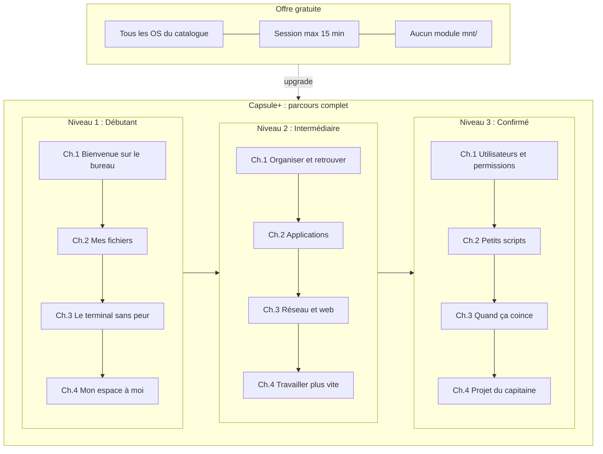

# Parcours pédagogique CapsuleOS : proposition v1

> **Statut** : document de conception (juin 2026)  
> **Alignement** : `mnt/`, `etc/capsuleos/contracts/pedagogical-modules.json`, portail (`portal-entitlements.json`)  
> **Public** : tout âge, tout public, sans prérequis informatique

---

## 1. Intention

CapsuleOS n’est pas un cours magistral sur Linux : c’est un **terrain de jeu guidé** dans des bureaux simulés. L’apprenant apprend en **faisant** : ouvrir une fenêtre, ranger des fichiers, taper une commande : avec des indices progressifs et une progression visible (checklist, barre de progression portail).

**Trois niveaux de difficulté** forment la colonne vertébrale du parcours **Capsule+** (payant). Chaque niveau contient **4 chapitres**. Chaque chapitre regroupe **3 à 4 quêtes**. Chaque quête se décompose en **3 à 6 étapes** (missions concrètes dans le bureau simulé).

> **Statut implémentation** : chapitres et quêtes décrits ci-dessous sont une **cible éditoriale** : aucun module n’est encore produit ni branché en production, hors brouillon pilote `linux-bases`.


| Offre                            | Bureaux simulés (OS)               | Modules pédagogiques (`mnt/`)                                    |
| -------------------------------- | ---------------------------------- | ---------------------------------------------------------------- |
| **Gratuit** (visiteur ou compte) | **Tous** les systèmes du catalogue | **Aucun** : pas de quêtes, chapitres ni checklist montée         |
| **Capsule+**                     | Accès illimité                     | **Intégralité** du parcours (3 niveaux, 12 chapitres, 48 quêtes) |


### Limite gratuite : session OS 15 minutes par jour

En offre gratuite, l’utilisateur peut **essayer n’importe quel OS** du catalogue, mais chaque session de bureau simulé est plafonnée à **15 minutes maximum par jour**. À l’expiration : message d’invitation à passer à Capsule+ (sans perte de données côté simulateur local tant que non connecté).

- Compteur côté **portail / hôte** (PHP ou JS portail) : pas de logique auth dans `OS/` ni `usr/lib/shells/`.
- Contrat : `portal-entitlements.json` → `osSession`.
- **Implémentation technique** : phase à venir (garde-fou session + overlay fin d’essai).

Les dossiers `mnt/expert/` et `mnt/cybertech/` restent réservés à une **voie avancée ultérieure** (projets longs, sécurité) : hors périmètre de cette trame à 3 niveaux.

---

## 2. Principes pédagogiques

### 2.1 Ton et accessibilité

- Langage **clair, concret, bienveillant** : pas de jargon sans explication immédiate.
- Une **métaphore** par concept nouveau (dossier = tiroir, terminal = ligne de dialogue avec l’ordinateur, chemin = adresse).
- **Vouvoiement** cohérent avec le portail.
- Durée cible par quête : **8 à 15 minutes** ; par chapitre complet : **45 min à 1 h**.
- Chaque quête commence par un **objectif en une phrase** (« À la fin, vous saurez… »).

### 2.2 Progression cognitive

```text
Voir → Manipuler → Nommer → Combiner → Dépanner
```


| Niveau        | Dominante                           | Terminal                               |
| ------------- | ----------------------------------- | -------------------------------------- |
| Débutant      | Interface graphique, découverte     | Introduit doucement (chapitre 3)       |
| Intermédiaire | Fichiers, apps, réseau              | Usage régulier, commandes du quotidien |
| Confirmé      | Système, automatisation, diagnostic | Scripts courts, lecture de logs        |


### 2.3 Règles de conception des quêtes

1. **Une seule nouveauté principale** par quête (éviter la surcharge).
2. **Trois niveaux d’aide** : indice léger → indice précis → solution commentée (pas de blocage).
3. **Réutilisation** : chaque chapitre rappelle une compétence du chapitre précédent.
4. **Cross-OS** : formulations et slots génériques (`nemo`, `terminal`, `checklist`) : pas de dépendance à une seule distro dans le texte affiché.
5. **Validation** : priorité aux événements `capsule:task` ; terminal en `manual` ou `fs-sync` quand nécessaire (cf. scénarios existants).
6. **Fin de quête** : message de réussite + pont vers la quête suivante (narration légère, pas de lore lourd).

### 2.4 Gratuit vs Capsule+


|                          | Gratuit                                 | Capsule+                      |
| ------------------------ | --------------------------------------- | ----------------------------- |
| **Proposition**          | Découverte libre des bureaux            | Apprentissage guidé structuré |
| **OS**                   | Catalogue complet, **15 min / session** | Illimité                      |
| **Parcours `mnt/`**      | Non montés : **zéro** quête             | 3 niveaux complets            |
| **Progression serveur**  | Non (compte optionnel pour futur)       | Sauvegarde et reprise         |
| **Checklist / missions** | Absentes                                | Actives par quête             |


- Le gratuit doit rester **honnête et utile** : assez de temps pour « sentir » un bureau (ouvrir apps, naviguer) sans donner le cursus pédagogique.
- **Tout le contenu structuré** (chapitres, quêtes, étapes) est **exclusivement Capsule+** : y compris le niveau Débutant.
- Les trois niveaux pédagogiques **s’enchaînent** par prérequis ; pas de répétition inutile entre Débutant et Intermédiaire.

---

## 3. Modèle de données (alignement technique)

```text
Niveau     →  mnt/<niveau>/           (catalog.json)
Chapitre   →  mnt/<niveau>/<id>/      (module.json)
Quête      →  scenarios/sNN-*.json    (un fichier = une quête)
Étape      →  steps[] dans le scénario (mission checklist / terminal)
```


| Champ `module.json` | Usage proposé                                                  |
| ------------------- | -------------------------------------------------------------- |
| `level`             | `debutant` | `intermediaire` | `confirme`                      |
| `access`            | `**subscriber**` (tous les modules : parcours = offre payante) |
| `prerequisites`     | IDs des chapitres requis (ex. `["bureau-accueil"]`)            |
| `chapterOrder`      | *(nouveau, optionnel v2)* ordre d’affichage dans le niveau     |
| `scenarios`         | Liste ordonnée des quêtes du chapitre                          |


**Montage gratuit** : `CAPSULE_MNT_MODULES` reste `**[]*`* : aucun module sur les façades accessibles sans abonnement.

**Module pilote existant** : `mnt/debutant/linux-bases/` : brouillon à **scinder ou renommer** ; `access: subscriber` (voir §5.1).

---

## 4. Vue d’ensemble des 3 niveaux




---

## 5. Détail par niveau

### Niveau 1 : Débutant · « Je découvre l’ordinateur » · `access: subscriber`

*Objectif du niveau* : se repérer sur un bureau simulé, manipuler fichiers et fenêtres, comprendre à quoi sert le terminal, personnaliser son environnement.

#### Chapitre 1 : Bienvenue sur le bureau

`mnt/debutant/bureau-accueil/`


| #   | Quête              | Objectif                 | Étapes clés (résumé)                                                                        |
| --- | ------------------ | ------------------------ | ------------------------------------------------------------------------------------------- |
| 1.1 | Premiers pas       | Comprendre l’écran       | Identifier barre supérieure / menu / bureau ; déplacer une fenêtre ; réduire / agrandir     |
| 1.2 | Le lanceur         | Trouver une application  | Ouvrir le menu des applications ; lancer Calculatrice ou équivalent ; quitter proprement    |
| 1.3 | Plusieurs fenêtres | Jongler entre les tâches | Ouvrir 2 apps ; basculer (Alt+Tab ou clic) ; ranger côte à côte                             |
| 1.4 | La checklist       | Suivre sa progression    | Ouvrir le panneau missions ; cocher une tâche ; comprendre la sauvegarde (compte optionnel) |


**Slots** : `checklist`, `shell` (fenêtres)  
**Prérequis** : aucun

---

#### Chapitre 2 : Mes fichiers

`mnt/debutant/mes-fichiers/`


| #   | Quête            | Objectif             | Étapes clés                                                        |
| --- | ---------------- | -------------------- | ------------------------------------------------------------------ |
| 2.1 | L’explorateur    | Ouvrir Fichiers      | Lanceur → dossier Documents ; lire le chemin affiché               |
| 2.2 | Créer et ranger  | Dossiers et fichiers | Nouveau dossier `Projets` ; y créer un fichier texte ; renommer    |
| 2.3 | Copier, déplacer | Manipulation de base | Glisser-déposer ; copier-coller ; corbeille et restauration        |
| 2.4 | Retrouver        | Recherche simple     | Chercher un fichier par nom ; filtrer par type (images, documents) |


**Slots** : `nemo`, `checklist`  
**Prérequis** : `bureau-accueil`

---

#### Chapitre 3 : Le terminal sans peur

`mnt/debutant/terminal-decouverte/` *(évolution de `linux-bases`)*


| #   | Quête                    | Objectif                     | Étapes clés                                                                               |
| --- | ------------------------ | ---------------------------- | ----------------------------------------------------------------------------------------- |
| 3.1 | Ouvrir le terminal       | Démystifier la fenêtre noire | Lancer Ptyxis/terminal ; lire l’invite ; taper `echo Bonjour`                             |
| 3.2 | Où suis-je ?             | Chemins et navigation        | `pwd`, `ls`, `cd Documents` : repères avec l’explorateur ouvert en parallèle              |
| 3.3 | Créer depuis le terminal | Lien GUI ↔ shell             | `touch`, `mkdir` ; vérifier dans Fichiers (validation `fs-sync`)                          |
| 3.4 | Aide !                   | S’orienter seul              | `man --help` ou `ls --help` ; comprendre qu’on peut se tromper sans « casser » la machine |


**Slots** : `terminal`, `nemo`, `checklist`  
**Prérequis** : `mes-fichiers`  
**Note** : réutiliser / migrer `s01-decouverte-bureau.json` et `s02-premieres-commandes.json` existants.

---

#### Chapitre 4 : Mon espace à moi

`mnt/debutant/mon-espace/`


| #   | Quête             | Objectif             | Étapes clés                                                                             |
| --- | ----------------- | -------------------- | --------------------------------------------------------------------------------------- |
| 4.1 | Paramètres        | Trouver les réglages | Ouvrir Paramètres ; changer le fond d’écran ou le thème clair/sombre                    |
| 4.2 | Accessibilité     | Adapter l’interface  | Taille du texte ou contraste ; comprendre que l’OS s’adapte à chacun                    |
| 4.3 | Raccourcis utiles | Gagner du temps      | 3 raccourcis clavier (copier, coller, capture) : liste adaptée au toolkit               |
| 4.4 | Bilan débutant    | Synthèse             | Mini-parcours libre guidé : ouvrir app, créer fichier, une commande, changer un réglage |


**Slots** : `settings`, `checklist`, `terminal` (léger)  
**Prérequis** : `terminal-decouverte`  
**Clôture niveau** : badge / message portail « Niveau Débutant terminé : en route vers l’Intermédiaire »

---

### Niveau 2 : Intermédiaire · « Je me débrouille au quotidien » · `access: subscriber`

*Objectif du niveau* : organisation durable, installation d’apps, réseau, productivité.

#### Chapitre 1 : Organiser et retrouver

`mnt/intermediaire/organisation/`


| Quêtes | Thème                                                                  |
| ------ | ---------------------------------------------------------------------- |
| 2.1.1  | Arborescence logique : `home`, sous-dossiers métier (Photos, Travail…) |
| 2.1.2  | Chemins absolus vs relatifs (visuel + terminal)                        |
| 2.1.3  | Archiver : compression simple (archive GUI ou `zip` intro)             |
| 2.1.4  | Sauvegarde : copier vers clé USB simulée / dossier `Sauvegardes`       |


#### Chapitre 2 : Applications

`mnt/intermediaire/applications/`


| Quêtes | Thème                                                                  |
| ------ | ---------------------------------------------------------------------- |
| 2.2.1  | Logiciels : ouvrir le magasin / gestionnaire de paquets (selon distro) |
| 2.2.2  | Installer une app utile (notes, dessin…)                               |
| 2.2.3  | Mettre à jour : comprendre les mises à jour système                    |
| 2.2.4  | Désinstaller proprement                                                |


#### Chapitre 3 : Réseau et web

`mnt/intermediaire/reseau-web/`


| Quêtes | Thème                                                             |
| ------ | ----------------------------------------------------------------- |
| 2.3.1  | Connexion : Wi‑Fi / Ethernet (UI paramètres réseau)               |
| 2.3.2  | Navigateur : onglets, favoris, téléchargements                    |
| 2.3.3  | Fichiers distants : notion de « cloud » / dossier Téléchargements |
| 2.3.4  | Sécurité de base : HTTPS, mots de passe, ne pas tout installer    |


#### Chapitre 4 : Travailler plus vite

`mnt/intermediaire/productivite/`


| Quêtes | Thème                                                                              |
| ------ | ---------------------------------------------------------------------------------- |
| 2.4.1  | Bureaux virtuels / espaces de travail                                              |
| 2.4.2  | Raccourcis avancés et lanceur (recherche d’app)                                    |
| 2.4.3  | Presse-papiers et captures d’écran                                                 |
| 2.4.4  | Chaîne complète : scénario « préparer une présentation » (fichiers + app + export) |


---

### Niveau 3 : Confirmé · « Je comprends ce qui se passe » · `access: subscriber`

*Objectif du niveau* : modèle utilisateurs/fichiers, automatisation légère, diagnostic, projet intégrateur.

#### Chapitre 1 : Utilisateurs et permissions

`mnt/confirme/permissions/`


| Quêtes | Thème                                                                      |
| ------ | -------------------------------------------------------------------------- |
| 3.1.1  | Qui fait quoi : utilisateur courant, `whoami`                              |
| 3.1.2  | Lire les permissions : `ls -l`, symboles `rwx` (pédagogie visuelle)        |
| 3.1.3  | Modifier sans danger : `chmod` sur un fichier de test                      |
| 3.1.4  | `sudo` : quand et pourquoi (simulation, pas de vraie escalade destructive) |


#### Chapitre 2 : Petits scripts

`mnt/confirme/scripts/`


| Quêtes | Thème                                                                |
| ------ | -------------------------------------------------------------------- |
| 3.2.1  | Premier script : `#!/bin/bash`, `echo`, exécution                    |
| 3.2.2  | Variables et arguments                                               |
| 3.2.3  | Boucle simple : renommer plusieurs fichiers                          |
| 3.2.4  | Planifier : notion de tâche répétée (cron introduit sans complexité) |


#### Chapitre 3 : Quand ça coince

`mnt/confirme/depannage/`


| Quêtes | Thème                                                                                           |
| ------ | ----------------------------------------------------------------------------------------------- |
| 3.3.1  | Moniteur système : CPU, mémoire, processus                                                      |
| 3.3.2  | Logs : lire un message d’erreur compréhensible                                                  |
| 3.3.3  | Espace disque : `df`, nettoyer Téléchargements                                                  |
| 3.3.4  | Checklist de dépannage : méthode en 5 étapes (reproduire, isoler, chercher, tester, documenter) |


#### Chapitre 4 : Projet du capitaine

`mnt/confirme/projet-final/`


| Quêtes | Thème                                                                  |
| ------ | ---------------------------------------------------------------------- |
| 3.4.1  | Brief : installer une « station de travail légère » pour un cas fictif |
| 3.4.2  | Mise en place : apps, dossiers, raccourcis                             |
| 3.4.3  | Automatisation : petit script de sauvegarde                            |
| 3.4.4  | Livrable : vérification par critères (checklist multi-slots)           |


**Clôture parcours** : certificat narratif CapsuleOS + suggestion voie `expert/` / `cybertech/` (futur).

---

## 6. Progression de difficulté (grille)


| Critère                   | Débutant       | Intermédiaire | Confirmé                        |
| ------------------------- | -------------- | ------------- | ------------------------------- |
| Nouveaux concepts / quête | 1              | 1–2           | 2                               |
| Dépendance au terminal    | Faible         | Moyenne       | Forte                           |
| Longueur des étapes       | 3–4            | 4–5           | 5–6                             |
| Texte d’aide              | Très guidé     | Guidé         | Autonome avec indices           |
| Échec possible            | Rare (sandbox) | Modéré        | Réaliste (commandes à corriger) |
| Durée niveau complet      | ~3–4 h         | ~4–5 h        | ~5–6 h                          |


---

## 7. Narration légère (fil conducteur)

Pas de fiction lourde : un **fil à relier** suffit pour l’engagement intergénérationnel.

> Vous êtes **explorateur·rice de CapsuleOS** : chaque chapitre est une **station** ; chaque quête, une **mission** ; la checklist est votre **journal de bord**.  
> Au niveau Débutant, vous apprenez à **habiter** le bureau.  
> À l’Intermédiaire, vous **voyagez** avec vos outils.  
> Au Confirmé, vous **comprenez le vaisseau** : et savez réagir quand une alarme clignote.

Ton adaptable : plus ludique pour les plus jeunes (missions, stations), plus neutre pour adultes : le texte des quêtes reste factuel ; seuls les intitulés portent la métaphore.

---

## 8. Plan de mise en œuvre (ordre recommandé)

### Phase A : Fondations (priorité immédiate)

1. Mettre à jour `mnt/catalog.json` : 3 niveaux actifs (`debutant`, `intermediaire`, `confirme`) avec la liste des chapitres prévus (même vides).
2. Contrats portail : `osSession` (15 min gratuit) + `moduleAccess` réservé à `subscriber`.
3. Refactoriser `linux-bases` → chapitre 3 `terminal-decouverte` (quêtes 3.1–3.4), `access: subscriber`.
4. Créer squelettes chapitres Débutant (1, 2, 4) : **sans montage** sur skins gratuits.
5. Gate : `validate-pedagogical-modules.mjs` + section portail `#parcours` (cartes verrouillées si ¬abonné).

### Phase A-bis : Garde-fou session gratuite (à implémenter)

1. Compteur 15 min à l’entrée façade OS (portail → `?pick=` ou équivalent).
2. Overlay fin d’essai + CTA Capsule+ ; pas de `CAPSULE_MNT_MODULES` injecté côté gratuit.

### Phase B : Contenu Capsule+ (niveau Débutant d’abord)

1. Rédiger les 16 quêtes du niveau Débutant (4 chapitres × 4 quêtes).
2. Brancher validations `capsule:task` ; sinon `manual` documenté.
3. Tester sur 2 familles OS minimum (ex. GNOME Rocky + Mint Cinnamon).

### Phase C : Niveaux 2 et 3

1. Intermédiaire chapitre par chapitre (magasin, réseau = dépendances toolkit).
2. Confirmé : scripts et permissions avec garde-fous pédagogiques.

### Phase D : Polish

1. Messages de transition entre quêtes / chapitres / niveaux.
2. Sync progression portail ↔ checklist (`?mnt=` déjà en place).
3. Schema.org `Course` / `LearningResource` (plan maître § SEO).

---

## 9. Critères de qualité (« crédible »)

Une quête est **validée éditorialement** si :

- Un adolescent de 12 ans et un adulte non-technicien comprennent l’objectif sans aide externe.
- Aucune étape ne suppose un matériel absent du simulateur.
- Le vocabulaire introduit réapparaît dans les 2 quêtes suivantes.
- La quête est finissable en une session courte sans frustration majeure.
- Le gratuit (15 min OS sans module) donne envie de s’abonner sans frustration abusive.

---

## 10. Synthèse chiffrée


|                       | Débutant | Intermédiaire | Confirmé | **Total**         |
| --------------------- | -------- | ------------- | -------- | ----------------- |
| Chapitres             | 4        | 4             | 4        | **12**            |
| Quêtes / chapitre     | 4        | 4             | 4        |                   |
| Quêtes totales        | 16       | 16            | 16       | **48**            |
| Étapes (~4,5 / quête) | ~72      | ~72           | ~72      | **~216 missions** |


Livrable initial réaliste pour une **v1 produit** : garde-fou 15 min gratuit + niveau Débutant Capsule+ complet (16 quêtes) ; Intermédiaire chapitres 1–2 ; Confirmé chapitre 1.

---

## 11. Références projet

- [root/docs/convention-modules-mnt.md](root/docs/convention-modules-mnt.md)
- [etc/capsuleos/contracts/pedagogical-modules.json](etc/capsuleos/contracts/pedagogical-modules.json)
- [etc/capsuleos/contracts/portal-entitlements.json](etc/capsuleos/contracts/portal-entitlements.json)
- Module pilote : [mnt/debutant/linux-bases/](mnt/debutant/linux-bases/)

---

*Document rédigé pour cadrer la production de contenu `mnt/` et l’affichage portail. À intégrer au plan maître (backlog §16) lors de la prochaine passe documentation.*