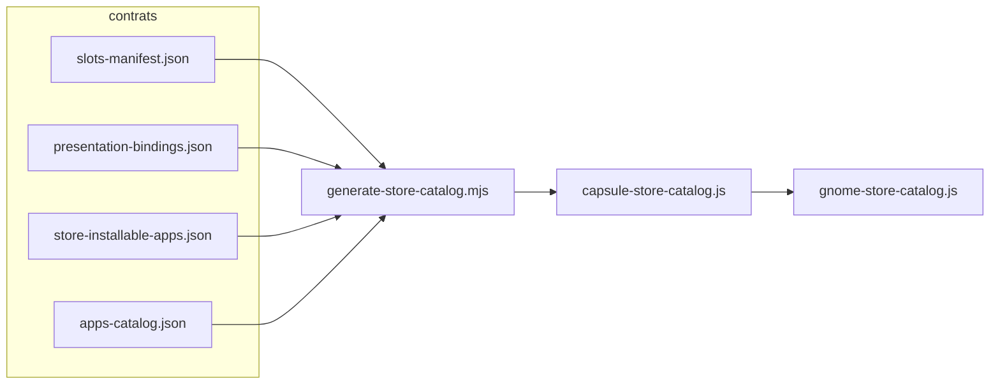

# Architecture catalogue apps — vérité unique

**Statut** : juin 2026 — cycle architecture centralisée (contrats + générateur + gates).

## Triple couche

| Couche | Contrat | Rôle |
|--------|---------|------|
| **Fonction** | `slots-manifest.json` | Slot canonique, profondeur, kernel, variants toolkit |
| **Présentation** | `presentation-bindings.json` | bodyId, toolkit, StoreFront, locale par `registryId` |
| **Magasin** | `store-installable-apps.json` | Apps installables (`storeInstallable`) au-delà du ground truth VM |

Couche dérivée runtime : `var/lib/capsuleos/generated/capsule-store-catalog.js` (généré, **pas** source de vérité).

## StoreFront et resolveAppContext

Chaque OS expose un **StoreFront** (slot UI du magasin natif) :

| registryId | StoreFront slot | Label | Apps magasin |
|------------|-----------------|-------|--------------|
| linux-alma | `update_manager` | Logiciels | 11 |
| linux-rocky | `update_manager` | Logiciels | 11 |
| linux-fedora | `update_manager` | Logiciels | 11 |
| linux-ubuntu | `update_manager` | Centre d'applications | 11 |
| linux-popos | `update_manager` | Pop Shop | 11 |
| linux-anduinos | `update_manager` | Logiciels | 11 |
| linux-mint | `mintinstall` | Logithèque | 0 (VM pré-installé) |
| linux-kde-neon | `update_manager` | Discover | 0 (deferred) |
| linux-opensuse | `update_manager` | Discover | 0 (deferred) |

`resolveAppContext(registryId, slotId)` (via `capsule-app-resolver.mjs`) fusionne :

1. `registryOverrides` VM (`apps-catalog.json`)
2. entrées `storeInstallable` du registry
3. variant toolkit depuis `slots-manifest` + `slotVariantOverrides` (`storeToolkit` pour cosmic → gnome)

## Règle « nouvel OS = 4 fichiers seulement »

Pour brancher un OS sans recopier `gnome-store-catalog.js` :

1. `etc/capsuleos/profiles/<registryId>.json` — profil skin
2. `apps-catalog.json` → `registryOverrides.<id>`
3. `presentation-bindings.json` → entrée `bindings.<id>`
4. `store-installable-apps.json` → `sources.<id>` par slot (si extension magasin)

Puis : `node usr/lib/capsuleos/tools/generate-store-catalog.mjs`

## Prédicats

### SlotF

**SlotF(slot)** : le slot existe dans `slots-manifest.json` avec `functionalDepth` explicite et (`kernelModule` fichier présent **ou** `decorative` / `capsuleOnly`).

Gate : `validate-slots-manifest.mjs`

### StoreΣ

**StoreΣ(registry)** : extension magasin structurellement cohérente pour un registry pilote.

```
StoreΣ(r) ≡ SlotF ∧ PresB(r) ∧ GenStore(r) ∧ StoreIntegrity
```

| Sous-prédicat | Signification | Gate |
|---------------|---------------|------|
| **PresB** | `presentation-bindings` actif dans os-registry | `validate-presentation-bindings.mjs` |
| **GenStore** | `capsule-store-catalog.js` à jour | `validate-store-catalog-generated.mjs` |
| **StoreIntegrity** | store ↔ slots ↔ toolkit variants | `validate-app-catalog-integrity.mjs` |

Pilotes GNOME actifs : **11 apps** chacun (S1–S12 partagés Alma/Rocky/Fedora/Ubuntu/PopOS/AnduinOS).

KDE (`linux-kde-neon`, `linux-opensuse`) : `storeCatalogStatus: deferred` — catalogue généré vide, UI Discover sans grille store P1.

Mint : `storeCatalogStatus: vm-preinstalled` — catalogue généré branché (`mint-store-catalog.js`), Logithèque conserve son catalogue hardcodé.

## Flux génération



## Outils

| Outil | Usage |
|-------|-------|
| `capsule-app-resolver.mjs` | `resolveSlotManifest`, `resolveStoreEntries`, `resolvePresentation`, `resolveStoreToolkit` |
| `generate-store-catalog.mjs` | Régénère le catalogue runtime |
| `generate-mint-registry-overrides.mjs` | Bootstrap `registryOverrides.linux-mint` depuis inventaire |
| `validate-app-catalog-integrity.mjs` | Gate agrégateur StoreΣ |

## Références

- [analyse-magasins-apps-cross-os.md](analyse-magasins-apps-cross-os.md)
- [procedure-apps-catalog.md](procedure-apps-catalog.md)
- [logique-formelle.md](logique-formelle.md) §2.9b StoreΣ
