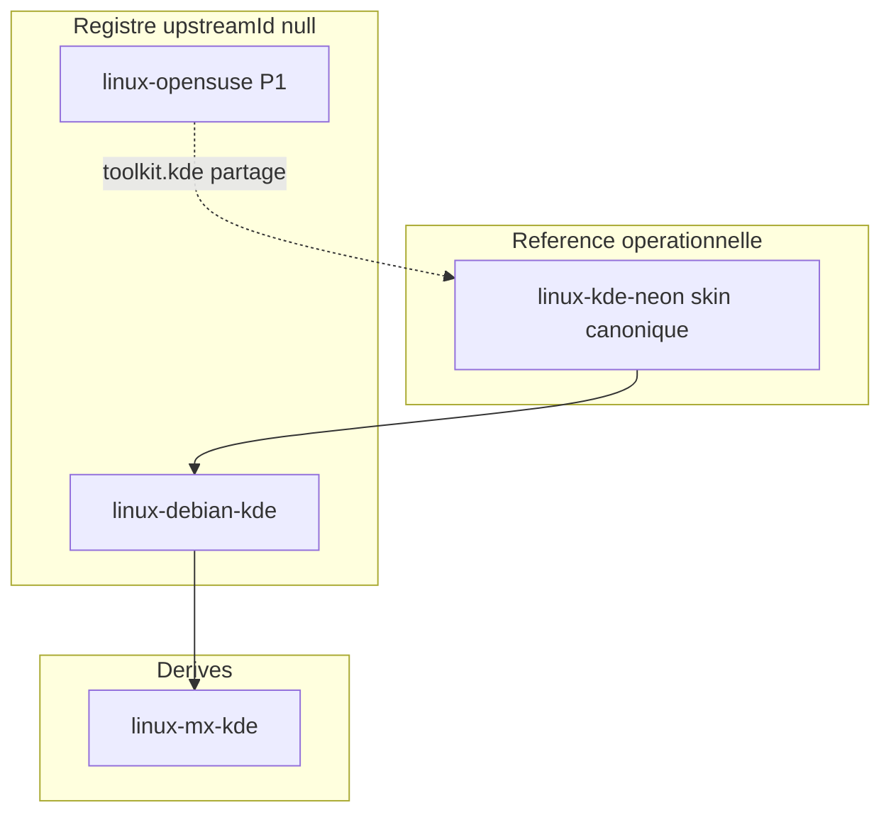

# Branche Plasma · toolkit KDE — référence CapsuleOS

> **Modèle ground truth** : VM KDE neon User Edition (Plasma Wayland) · **Skin canonique** : `home/Debian/KDE-Neon/` · **Registre** : `linux-kde-neon`.

Ce document fixe la **cartographie conceptuelle**, la **confrontation avec le KDE HIG**, le **découpage design** et les **règles de dérivation** pour toute entrée toolkit `kde` / cluster `toolkit.kde`.

**Documents opérationnels liés** :

| Document | Rôle |
|----------|------|
| [reference-kde-expert.md](reference-kde-expert.md) | Synthèse pile Plasma, Breeze, slots |
| [kde-hig-ressources.md](kde-hig-ressources.md) | Catalogue HIG officiel (22 pages) |
| [inventaire-parite-neon.md](inventaire-parite-neon.md) | Écarts classés P0/P1/P2 |
| [inventaires/linux-kde-neon-vm.json](inventaires/linux-kde-neon-vm.json) | Inventaire machine-readable |
| [inventaires/linux-kde-neon-roadmap.md](inventaires/linux-kde-neon-roadmap.md) | **Roadmap complète v3** (palliers, maturité, outils) |
| [inventaires/linux-kde-neon-repair-checklist.md](inventaires/linux-kde-neon-repair-checklist.md) | Historique réparation v1 + campagne v2 |
| [inventaires/linux-kde-neon-discover-closure.md](inventaires/linux-kde-neon-discover-closure.md) | Clôture Discover |
| [inventaires/linux-kde-neon-kickoff-closure.md](inventaires/linux-kde-neon-kickoff-closure.md) | Clôture Kickoff |
| [inventaires/linux-kde-neon-panel-tray-closure.md](inventaires/linux-kde-neon-panel-tray-closure.md) | Clôture panel + tray |
| [inventaires/linux-opensuse-repair-checklist.md](inventaires/linux-opensuse-repair-checklist.md) | Modèle Plasma partagé openSUSE |

---

## 1. Positionnement dans CapsuleOS

### 1.1 Hiérarchie branche Plasma



| Entrée | Rôle | Skin | Notes |
|--------|------|------|-------|
| `linux-kde-neon` | **Référence opérationnelle** (ground truth VM lab) | `home/Debian/KDE-Neon/` | Discover, Kickoff, panel clôturés juin 2026 |
| `linux-debian-kde` | Référence registre (`upstreamId: null`) | `home/Debian/Debian-KDE/` | Base théorique debian + Plasma |
| `linux-opensuse` | P1 active, Plasma mature | `home/SUSE/openSUSE/` | `upstreamId: null` — coque Plasma partagée |
| `linux-mx-kde` | Dérivé | `home/Debian/MX-KDE/` | `upstreamId: linux-debian-kde` |

**Règle** : toute évolution structurelle Plasma (panel, Kickoff, tray, tokens Breeze) se fait d’abord sur **KDE Neon**, puis propagation vers openSUSE / MX / Debian-KDE.

**Note registre** : `linux-kde-neon` déclare `upstreamId: linux-debian-kde` dans `os-registry.json`, mais le **skin le plus avancé** et la **VM lab** pointent vers Neon — c’est la vérité opérationnelle pour les agents.

### 1.2 Analogie Rocky GNOME / Neon Plasma

| Dimension | Rocky (GNOME) | KDE neon (Plasma) |
|-----------|---------------|-------------------|
| Référence skin | `home/RedHat/Rocky/` | `home/Debian/KDE-Neon/` |
| Explorateur VM | Nautilus | **Dolphin** |
| Slot CapsuleOS | `nemo` (template `nemo-gnome`) | `nemo` (template **`dolphin`**) |
| Shell | Top bar + Aperçu (pas de dock RHEL) | **Panel bas** permanent + Kickoff |
| MAJ / store | GNOME Software | **Discover** (Kirigami) |
| HIG skill | `gnome-hig-replication` | **`kde-hig-replication`** |
| Doc branche | [branche-redhat-gnome.md](branche-redhat-gnome.md) | Ce document |

---

## 2. Ground truth VM KDE neon

### 2.1 Stack observée (juin 2026)

| Couche | VM | CapsuleOS |
|--------|-----|-----------|
| Distribution | KDE neon User Edition **24.04** noble | `linux-kde-neon` |
| Session | **Plasma Wayland** | `body#kde-neon`, profil `etc/capsuleos/profiles/linux-kde-neon.json` |
| Icônes / style | **Breeze** | Assets `toolkits/kde/` + `vendors/neon/` |
| Accent Discover | `#3daee9` | `update_manager.skin.css` |
| Fond | Wallpaper « Next » | `vendors/neon/wallpaper/neon-default.png` |
| Fichiers | **Dolphin** | Slot `nemo`, template `dolphin` — **P0** |
| Logiciels | **Discover 6.6.5** | `update_manager_kde_neon.html` — clôturé |
| Terminal | **Konsole** | Slot `terminal` |

Viewport lab cible : **1211×756** (captures `screen_KDE-Neon/`).

### 2.2 Panel Plasma (ordre tray VM)

Ordre observé (juin 2026) : notifications → MAJ → clipboard → luminosité → réseau → volume → expand → horloge → show-desktop.

Implémentation : [`tray-popover-kde.js`](../../home/Debian/KDE-Neon/js/tray-popover-kde.js), icônes `toolkits/kde/panel/tray/`.

---

## 3. Confrontation documentation officielle

### 3.1 KDE HIG

Source : [develop.kde.org/hig](https://develop.kde.org/hig/) · catalogue : [kde-hig-ressources.md](kde-hig-ressources.md)

| Domaine HIG | Application CapsuleOS |
|-------------|----------------------|
| Icons symbolic vs color | Tray 22 px, Kickoff actions/22, apps 32 px+ |
| Layout and navigation | Sidebar Discover, navigation Dolphin |
| Displaying content | Grilles Discover, vues Dolphin |
| Simple by default | Kickoff épuré, pas de surcharge panel |
| Accessibility | Contraste thème clair/sombre Breeze |

**Limite** : le HIG ne couvre pas tout le **Plasma Shell** — panel, Kickoff et widgets s’appuient sur captures VM + patterns openSUSE partagés.

### 3.2 Kirigami (Discover)

Discover 6 utilise **Kirigami** (sidebar + pages empilées). Référence technique : https://develop.kde.org/docs/plasma/kirigami/

CapsuleOS reproduit le chrome visuel via HTML/CSS (`update_manager_kde_neon.html`, `discover-neon.js`) sans moteur QML.

---

## 4. Dérivation vers autres distros KDE

| Cible | Propagation depuis Neon | Spécificités vendor |
|-------|-------------------------|---------------------|
| `linux-opensuse` | Panel Plasma, Kickoff, `plasma-panel-mode.js` | Geeko launcher, profil `suse.js` |
| `linux-mx-kde` | Coque Plasma | Pack MX, `mainMenu-kde-chrome.js` |
| `linux-debian-kde` | Tokens Breeze de base | Branding Debian |

Pas de script `sync-kde-*-skin.mjs` généralisé en v1 — propagation manuelle documentée jusqu’à outillage dédié.

---

| **P0** | Fondations | Inventaire VM, indice Π, interactions JSON complètes | 4–8 h |
| **P1** | Shell + assets | Panel compare, kickoff Vp, audit `./assets/`, Firefox VM | 8–16 h |
| **P2** | Apps profondes | Dolphin §9, Discover filtres, tray dynamique, Konsole | 12–25 h |
| **P3** | Catalogue | 30 apps kickoff avec slots | 15–30 h |
| **P4** | Propagation | openSUSE, MX-KDE, Debian-KDE | 8–15 h |
| **P5** | Clôture P1 | tier P1, H₆ v3, maturité ≥ 90 % | 4–10 h |

Source détaillée : [linux-kde-neon-roadmap.md](linux-kde-neon-roadmap.md).

---

## 6. Évolutions futures (hors scope v1)

- Skill `design-shell-plasma` dédié (équivalent `design-shell-layout` GNOME).
- Smoke Playwright KDE Neon généralisé (`smoke-kde-neon-shell-polish.mjs`).
- Crawl automatique du dépôt Markdown HIG sur invent.kde.org.
- Script propagation Neon → openSUSE / MX / Debian-KDE.

---

## 7. Gates et captures

```bash
# VM
bash root/tools/lab/vm-kde-neon-capture-host.sh

# CapsuleOS
python3 -m http.server 5500 --bind 127.0.0.1
node root/tools/lab/capture-capsule-kde-neon.mjs

# Validation
node usr/lib/capsuleos/tools/linux/sync-linux-skin-closure.mjs
node usr/lib/capsuleos/tools/validate-all.mjs
```

Skill agent HIG : [`kde-hig-replication`](../skills/kde-hig-replication/SKILL.md).
