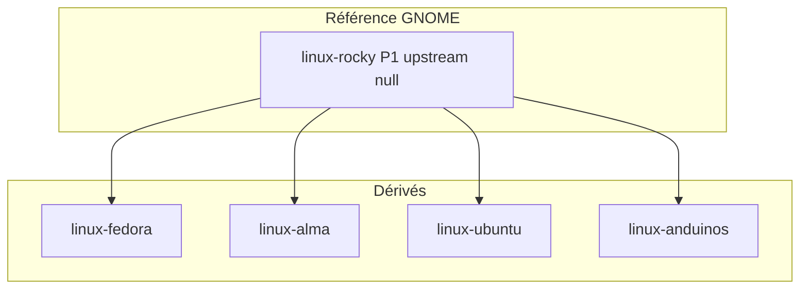

# Branche Red Hat · toolkit GNOME — référence CapsuleOS

> **Modèle ground truth** : VM Rocky Linux 10 GNOME (Wayland) · **Skin canonique** : `home/RedHat/Rocky/` · **Registre** : `linux-rocky` (`upstreamId: null`).

Ce document fixe la **cartographie conceptuelle**, la **confrontation avec la documentation officielle**, le **découpage design précis** et les **règles de dérivation** pour toute entrée de la branche RHEL sous GNOME.

**Documents opérationnels liés** :

| Document | Rôle |
|----------|------|
| [reference-gnome-expert.md](reference-gnome-expert.md) | Synthèse expertise GNOME (SUSE, Rocky, Mutter, HIG, libadwaita, apps) |
| [procedure-audit-vm-profonde.md](procedure-audit-vm-profonde.md) | Audit interactif complet VM (agents) |
| [procedure-lab-linux-rocky-gnome.md](procedure-lab-linux-rocky-gnome.md) | Procédure bout-en-bout VM → Capsule (anti-échecs) |
| [inventaire-parite-rocky.md](inventaire-parite-rocky.md) | Écarts classés P0/P1/P2 |
| [inventaires/linux-rocky-vm.json](inventaires/linux-rocky-vm.json) | Inventaire machine-readable |
| [inventaires/linux-gnome-capsule-slots.md](inventaires/linux-gnome-capsule-slots.md) | Nautilus ↔ slot `nemo` |
| [lab-vm-rhel-wayland.md](lab-vm-rhel-wayland.md) | Infra SSH / Wayland |

---

## 1. Positionnement dans CapsuleOS

### 1.1 Hiérarchie branche RHEL



| Entrée | Rôle | Skin | Héritage coque GNOME |
|--------|------|------|----------------------|
| `linux-rocky` | **Référence** (comme Mint pour Cinnamon) | `home/RedHat/Rocky/` | Source tokens + Nautilus + overview |
| `linux-fedora` | Dérivé vendor | `home/RedHat/Fedora/` | `sync-gnome-*-skin.mjs` depuis Rocky |
| `linux-alma` | Dérivé vendor | `home/RedHat/Alma/` | idem + pack `vendors/alma/` |
| `linux-ubuntu` | Dérivé + dock Unity visible | `home/Debian/Ubuntu/` | coque + override dock `display:flex` |
| `linux-anduinos` | Dérivé taskbar | `home/Debian/AnduinOS/` | coque + chrome Anduin |

**Règle** : toute évolution structurelle GNOME (overview, Nautilus, tokens shell) se fait d’abord sur **Rocky**, puis propagation scriptée vers les dérivés.

### 1.2 Analogie Mint / Rocky

| Dimension | Mint (Cinnamon) | Rocky (GNOME) |
|-----------|-----------------|---------------|
| Référence registre | `linux-mint` P0 | `linux-rocky` P1 |
| Explorateur VM | **Nemo** | **Nautilus** |
| Slot CapsuleOS | `nemo` (nom aligné) | `nemo` (gabarit partagé) |
| Template embed | `nemo` | `nemo-gnome` → `nautilus-app` |
| Skin CSS explorateur | `nemo.skin.css` | `nautilus.skin.css` |
| Panel / dock | Footer Cinnamon permanent | **Pas de dock permanent** (RHEL) — dash dans Aperçu |
| Sonde lab | `os-probe.sh` | `os-probe-gnome.sh` |

---

## 2. Ground truth VM Rocky Linux 10

### 2.1 Stack observée (juin 2026)

| Couche | VM | CapsuleOS |
|--------|-----|-----------|
| Distribution | Rocky Linux **10.2** Workstation (lab juin 2026) | `linux-rocky` |
| Session | **Wayland** (défaut RL10) + Xwayland `:0` | N/A (navigateur) |
| Shell | **GNOME Shell 49.4** (VM à jour ; coque Capsule reste `fedora-*`) | Classes `fedora-*` sous `html:has(#rocky)` |
| GTK / icônes | **Adwaita** | Tokens `--nemo-*`, `--fedora-*` |
| Accent | `gsettings` → `blue` → **#3584e4** | `--menu-accent` |
| Schéma couleurs | `default` (sombre) / `prefer-light` | `data-theme` + `gnome-theme` |
| Fond | `rocky-default-10-gemstone-skies-time.xml` | PNG jour/nuit dans `vendors/rocky/wallpaper/` |
| Terminal | **Ptyxis** (remplace GNOME Terminal en RL10) | Slot `terminal`, profil `linux:redhat` |
| Fichiers | **Nautilus 47** | Slot `nemo`, titre UI **« Fichiers »** |
| Éditeur texte | **GNOME Text Editor** (`gnome-text-editor`) | Slot `text_editor` |
| Logiciels | **GNOME Software** | Slot `update_manager` |

Snapshots : [`linux-rocky-vm-state.json`](inventaires/linux-rocky-vm-state.json), [`linux-rocky-vm-theme.json`](inventaires/linux-rocky-vm-theme.json).

### 2.2 Favoris dash GNOME (VM)

Ordre typique observé sur la VM (8 icônes + grille apps) :

1. Firefox  
2. Calendrier  
3. Musique  
4. **Nautilus** (Fichiers)  
5. **GNOME Software**  
6. **Ptyxis**  
7. **Text Editor**  
8. **Calculator**

**Écart P1 documenté** : le dock HTML CapsuleOS (`#tableau.fedora-dock`) est **masqué** sur RHEL GNOME ; les favoris passent par le **dash de l’Aperçu** (`fedora-overview__dash`). Le dock latéral Capsule hérite du modèle Fedora early-work (6 apps + accueil) — ne pas le confondre avec le dash natif GNOME.

---

## 3. Confrontation documentation officielle

### 3.1 Rocky Linux 10 — notes de version

Source : [Rocky Linux 10 Release Notes — Desktop Component changes](https://docs.rockylinux.org/release_notes/10_0/) (aligné miroir communautaire).

| Retiré en RL10 | Remplacement | Impact CapsuleOS |
|----------------|--------------|------------------|
| **GNOME Terminal** | **Ptyxis** | Profil terminal `linux:redhat` ; chrome Ptyxis dans `terminal.skin.css` |
| **gedit** | **GNOME Text Editor** | Gabarit `text_editor.html` (xed legacy) + skin GNOME |
| Eye of GNOME | GNOME Image Viewer (Loupe) | Slot `visionneur_images` (P2) |
| Cheese | Snapshot | Non émulé (P2) |
| Totem (vidéos) | Aucun lecteur par défaut | Slot `lecteur_multimedia` optionnel |
| PulseAudio daemon | PipeWire | Cosmétique tray (P2) |
| Tweaks standalone | Options dans Paramètres GNOME | Slot `themes` |
| LibreOffice RPM | Flatpak / upstream | Slot `librewriter` (gabarit générique) |

**Wayland** : RL10 fait de Wayland le défaut ; Xwayland reste pour clients X11. CapsuleOS n’émule pas le compositeur — mais le **lab SSH** doit respecter Mutter/Xwayland ([lab-vm-rhel-wayland.md](lab-vm-rhel-wayland.md)).

### 3.2 GNOME Shell — design officiel

Sources :

- [GNOME Human Interface Guidelines](https://developer.gnome.org/hig) — principes, patterns, Libadwaita  
- [GNOME Shell Design (wiki archive)](https://wiki.gnome.org/Projects/GnomeShell/Design) — Activities Overview  
- [Ubuntu Help — Visual overview of GNOME](https://help.ubuntu.com/stable/ubuntu-help/shell-introduction.html.en) — dash, grille apps, top bar  

| Composant GNOME | Spécification officielle | Implémentation CapsuleOS Rocky |
|-----------------|--------------------------|------------------------------|
| **Top bar** | Ancre visuelle permanente ; visible aussi dans l’Aperçu | `header.fedora-top-bar` — horloge, tray, déclencheur Aperçu |
| **Activities Overview** | Vue séparée ; focus-switching ; pas une destination | `section.fedora-overview` + `overview.js` |
| **Dash** | Favoris + apps en cours ; point sous l’icône active | `nav.fedora-overview__dash` — `data-overview-link` |
| **Grille apps** | Toutes les apps ; glisser vers favoris | `fedora-overview__apps-grid` |
| **Recherche** | Lance apps, fichiers, web | `CapsuleAppSearch` + catalogue `overview.js` |
| **Quick Settings** | Volume, réseau, thème, alimentation | `volume-popover` + `quick-settings` |
| **Calendrier popover** | Depuis l’horloge | `calendar-popover.js` (partagé noyau) |

**Différence Ubuntu vs RHEL** : Ubuntu affiche un dock Unity permanent ; **Fedora / Rocky / Alma masquent `#tableau`** — seul l’Aperçu expose le dash. Voir [`linux-gnome-capsule-slots.md`](inventaires/linux-gnome-capsule-slots.md) § « Coque GNOME ».

### 3.3 Nautilus 47 / Adwaita

| Aspect | Doc / comportement GNOME | CapsuleOS |
|--------|--------------------------|-----------|
| Chrome fenêtre | Headerbar GTK (CSD), pas de menu bar classique | `explorers/nautilus/shell-gnome.html` |
| Sidebar | Places (Bureau, Documents, …) | `fileExplorerCore.js` + tokens `--nautilus-sidebar-w` |
| Thème clair sur bureau sombre | Adwaita `default` : chrome **clair** sur fond sombre | Tokens `--nemo-header-bg: #f6f6f6` sur `nautilus.skin.css` |
| « Open in Terminal » | Extension Nautilus → Ptyxis (Fedora patch) | P2 — menu contextuel Capsule |

### 3.4 Ptyxis

Sources : notes RL10, [Fedora adoption](https://leo3418.github.io/2025/08/14/trying-ptyxis.html).

- Terminal **conteneur-oriented**, successeur de GNOME Terminal sur RHEL/Fedora/Rocky 10.  
- CapsuleOS : slot `terminal`, invite `capsule@rocky`, palette sombre Breeze-like dans `terminal.skin.css`.  
- **Ne pas** étiqueter « gnome-terminal » dans l’UI utilisateur Rocky.

---

## 4. Découpage design — couches à reproduire

Chaque couche possède des **fichiers propriétaires**, des **tokens CSS** et des **critères de validation**.

### 4.1 Couche A — Shell GNOME (bureau)

| Élément | Fichiers Rocky | Tokens clés | Validation |
|---------|----------------|-------------|------------|
| Variables globales | `style/gnome-shell/tokens.css` | `--fedora-top-bar-*`, `--fedora-dock-*` | Capture `rocky-*-desktop.png` |
| Coque workstation | `style/gnome-workstation.css` | `--fedora-bg`, `--linux-skin-label` | Fond gemstone-skies |
| Top bar | `gnome-workstation.css`, `tray.css` | hauteur, blur, couleur | Parité barre VM |
| Overview | `gnome-shell/overview.css`, `js/overview.js` | grille, dash, recherche | Smoke `smoke-rocky-gnome-ref.mjs` |
| Quick settings | `volume-popover.css` | tiles, slider | Capture manuelle |
| Surcharges vendor | `rocky-overrides.css` | `--menu-accent`, wallpaper URL | `linux-rocky-vm-theme.json` |

**Propagation** : `node usr/lib/capsuleos/tools/linux/sync-gnome-workstation-skin.mjs`

### 4.2 Couche B — Chrome fenêtre (noyau)

| Élément | Fichiers noyau | Contrat |
|---------|----------------|---------|
| Contexte GNOME | `etc/capsuleos/overrides/linux-rocky.json` | `CAPSULE_WINDOW_CONTEXT`, bounds `fedora-desktop-area` |
| Comportements | `gnome-window-behaviors.js` | Pas de header obligatoire, CSD simulé |
| Lanceurs | `taskbar-launcher-state.js` | Dock `#tableau` + état fenêtres |
| Boot profil | `index.html` | `CAPSULE_SKIN_PROFILE_ID` **avant** `capsule-skin-boot.js` |

Doc : [window-chrome-contexts.md](window-chrome-contexts.md).

### 4.3 Couche C — Applications

| App VM | Slot | Gabarit | Skin Rocky |
|--------|------|---------|------------|
| Nautilus | `nemo` | `nemo-gnome` | `nautilus.skin.css` |
| Firefox | `firefox` | embed | `firefox.skin.css` |
| Ptyxis | `terminal` | `terminal.html` | `terminal.skin.css` |
| GNOME Text Editor | `text_editor` | `text_editor.html` | `text_editor.skin.css` |
| GNOME Software | `update_manager` | `update_manager*.html` | (générique) |
| Calculator | `calculator` | `calculator.html` | `calculator.skin.css` |
| Clocks | `clocks` | `clocks.html` | `clocks.skin.css` |
| Calendar | `calendar` | `calendar.html` | `calendar.skin.css` |
| Paramètres | `themes` | `themes.html` | `themes` via embed |
| LibreOffice Writer | `librewriter` | embed | `librewriter.skin.css` |

**Clôture obligatoire** après modif gabarit/skin :

```bash
./root/tools/lab/update-rocky-nautilus.sh
node usr/lib/capsuleos/tools/linux/sync-linux-skin-closure.mjs
node usr/lib/capsuleos/tools/validate-all.mjs
```

### 4.4 Couche D — Assets vendor

| Zone | Chemin | Source |
|------|--------|--------|
| Logo | `vendors/rocky/rocky-logo.svg` | VM + polish |
| Panel | `vendors/rocky/panel/` | **`pull-vm-assets.sh`** |
| Wallpaper | `vendors/rocky/wallpaper/` | VM gemstone-skies PNG |
| Adwaita symboles | `icons/gnome/adwaita/` | VM pull |
| Inventaire visuel | `vendors/rocky/inventory/` | Captures VM + Capsule |

Règle absolue : [convention-assets-depuis-vm.md](convention-assets-depuis-vm.md).

### 4.5 Couche E — Thèmes clair / sombre

| gsettings VM (`org.gnome.desktop.interface color-scheme`) | CapsuleOS |
|-----------------------------------------------------------|-----------|
| `default` / `prefer-dark` | Sombre — `html:has(#rocky)` |
| `prefer-light` | Clair — `html[data-theme="light"]:has(#rocky)` |

Mapping confirmé dans `linux-rocky-vm-theme.json`. Basculer via bouton Quick Settings (`capsule-theme.js`).

---

## 5. Pièges documentés (anti-échecs)

| # | Erreur fréquente | Symptôme | Prévention |
|---|------------------|----------|------------|
| 1 | Éditer la **façade** `OS/linux/families/redhat/rocky/` | pick-os ≠ skin ; validate-capsule KO | Éditer `home/RedHat/Rocky/` puis `sync-linux-skin-closure.mjs` |
| 2 | `CAPSULE_SKIN_PROFILE_ID` après `capsule-skin-boot` | Nautilus charge gabarit Nemo Cinnamon | Profil dans `<head>` **avant** boot |
| 3 | Confondre **Nemo** et **Nautilus** | Mauvais template, 404 embed | Lire [`linux-gnome-capsule-slots.md`](inventaires/linux-gnome-capsule-slots.md) |
| 4 | Afficher dock permanent sur Rocky | Ne correspond pas à GNOME RHEL | `#tableau { display: none }` — favoris via Aperçu |
| 5 | SSH Wayland sans `XAUTHORITY` | `wmctrl` / sonde échoue | [lab-vm-rhel-wayland.md](lab-vm-rhel-wayland.md) §1 |
| 6 | Oublier rebuild **embed** | `file://` ou fetch → ancien gabarit | `update-rocky-nautilus.sh` ou `build-linux-embed.mjs` |
| 7 | Assets empruntés Fedora/Mint | Fidélité visuelle fausse | `pull-vm-assets.sh --id linux-rocky` |
| 8 | Parité panel VM `active:false` | Faux échecs checklist | P1 Wayland — pgrep dans `os-probe-gnome.sh` ; Capsule 6/6 = référence |
| 9 | Modifier dérivé sans sync Rocky | Dérive Fedora/Alma/Ubuntu | Scripts `sync-gnome-nautilus-skin.mjs`, `sync-gnome-workstation-skin.mjs`, etc. |
| 10 | Valider sans HTTP + Ctrl+F5 | Cache Live Server / ancien JS | Serveur `python3 -m http.server` + rechargement forcé |

---

## 6. Scripts de propagation (dérivés)

| Script | Cible |
|--------|-------|
| `sync-gnome-nautilus-skin.mjs` | Fedora, Ubuntu, Alma, AnduinOS |
| `sync-gnome-workstation-skin.mjs` | Fedora, Ubuntu, Alma |
| `sync-gnome-utility-app-skins.mjs` | text_editor, calculator, clocks, calendar |
| `bootstrap-alma-from-rocky.mjs` | Alma (skin + façade) |
| `sync-linux-skin-closure.mjs` | Toutes façades pick-os |

---

## 7. Références externes (liens stables)

| Sujet | URL |
|-------|-----|
| Rocky Linux 10 Release Notes | https://docs.rockylinux.org/release_notes/10_0/ |
| GNOME HIG | https://developer.gnome.org/hig |
| GNOME Shell Design | https://wiki.gnome.org/Projects/GnomeShell/Design |
| Libadwaita | https://gnome.pages.gitlab.gnome.org/libadwaita/doc/main/ |
| Nautilus | https://gitlab.gnome.org/GNOME/nautilus |
| Ptyxis | https://gitlab.gnome.org/World/ptyxis |

---

## 8. Mise à jour de ce document

Mettre à jour ce fichier quand :

1. La VM Rocky change de version mineure (GNOME Shell x.y).  
2. Un nouveau dérivé RHEL GNOME est ajouté au registre.  
3. La checklist panel atteint parité VM 6/6 (actuellement P1 Wayland).  
4. Les notes RL11+ modifient la liste des apps par défaut.

**Collecte** : `bash root/tools/lab/vm-rocky-theme-snapshot.sh` → JSON thème · captures → `compare-rocky-visual-pass.mjs`.
