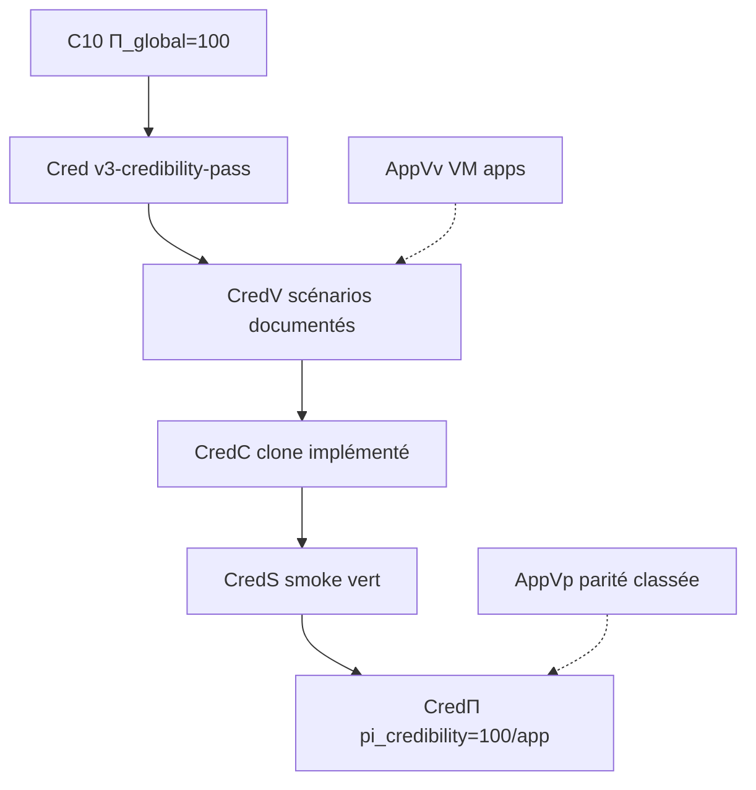

# Campagne crédibilité pédagogique — clone fidèle à la VM

> **Statut** : **P-F clôturé** — 43 apps π=100 · 130 scénarios CredV/C/S — campagne `v3-credibility-pass` (juin 2026)  
> **Contrat machine** : [`etc/capsuleos/contracts/app-fidelity-scenarios.json`](../../etc/capsuleos/contracts/app-fidelity-scenarios.json)  
> **Orchestrateur** : `node usr/lib/capsuleos/tools/lab/run-app-fidelity-campaign.mjs`  
> **Skill agent** : [`root/skills/vm-app-fidelity-pass/SKILL.md`](../skills/vm-app-fidelity-pass/SKILL.md)

Complète sans remplacer : [moteur-clonage-experience.md](moteur-clonage-experience.md) (cycles C0–C10, **Π structurel**) · [procedure-apps-replication-formelle.md](procedure-apps-replication-formelle.md) (chaîne AppVv/AppVp).

---

## 1. Vision : crédibilité pédagogique vs Π structurel

| Dimension | Π structurel (C0–C10) | Crédibilité pédagogique (v3) |
|-----------|----------------------|------------------------------|
| **Question** | Le clone **ressemble** et **s'ouvre** comme la VM ? | L'utilisateur **se sent** sur la VM en **parcourant** menus et sous-écrans ? |
| **Mesure** | `pi_global`, `AppVp`, surfaces shell | `pi_credibility` par app et par scénario |
| **Périmètre** | 8 apps P0 + shell 8/8 | **Gaps cartographiés** (slots sans π=100), pas 101 apps linéaires |
| **Preuve** | Captures classées, matrices UI | Scénarios utilisateur documentés + smoke Playwright |

**Π=100** clôt la campagne structurelle Mint (pallier 10). La campagne **v3** élève la **crédibilité pédagogique** : parcours utilisateur réaliste (persona, étapes, états hover/focus/erreur/vide) validés contre la VM `<lab-inventory:linux-lab>`.

---

## 2. Phases P-A à P-Z

| Phase | Id | Objectif | Prédicat |
|-------|-----|----------|----------|
| **P-A** | inventaire | Documenter scénarios VM (steps texte, persona) | **CredV** |
| **P-B** | vm-capture | Captures ground truth VM par scénario | **CredV** (enrichi) |
| **P-C** | impl | Implémenter interactions clone (gabarits, JS slot) | **CredC** |
| **P-D** | smoke | Smoke scénario Playwright (`smoke-app-fidelity-scenario.mjs`) | **CredS** |
| **P-E** | parité | Classer écarts, mesurer `pi_credibility` | **CredΠ** |
| **P-F** | extension ciblée | Voir **§2 bis** (P-F1→P-F5) | gaps `*-app-fidelity-gaps.json` |

### 2 bis. Extension P-F v2 (post-P0)

> **Révision juin 2026** : ne pas viser 101 apps × 3 scénarios. La cartographie P-F1 montre que **64/101** entrées menu sont déjà couvertes par 11 slots π=100 et **52/101** par Paramètres (`themes`). Il reste **~32 slots** catalogue sans crédibilité.

| Sous-phase | Id | Objectif | Livrable |
|------------|-----|----------|----------|
| **P-F1** | cartographie | Menu 101 → slots 44 → scénarios existants | `linux-mint-app-fidelity-gaps.json` |
| **P-F2** | taxonomie | Variants Cinnamon (slot→variant toolkit) avant nouveaux gabarits | alignement [convention-taxonomie-semantique.md](convention-taxonomie-semantique.md) |
| **P-F3** | crédibilité par tiers | **Tier B** : ≥3 scénarios / slot gap (vague 1 P0+P1, puis P2) | inventaire scénarios enrichi |
| **P-F4** | ManΣ Mint | Clôturer ManSt/ManI sur `proc/linux-mint/` | alignement avancement-formel |
| **P-F5** | VM burst | Captures P-B pour scénarios sans π=100 | `vmCapture` renseigné |

**Tiers de travail** :

| Tier | Critère | Action |
|------|---------|--------|
| **A** | Slot π=100 ou structure seule suffisante | Aucun — déjà couvert |
| **B** | Slot catalogue sans π=100 | 3 scénarios CredV→CredS par slot |
| **C** | Entrée menu → `themes` (cs-*) | Couvert par campagne Paramètres ; pas de slot dédié |

**Vagues P-F3** (générées par `map-app-fidelity-gaps.mjs`) :

1. **Vague 1** — slots P0+P1 : `calendar`, `screenshot`, `drawing`, `lecteur_multimedia`, `libreoffice_startcenter`, `mintdrivers`, `librecalc`, `system_monitor`, `visionneur_images`, `visionneur_pdf`
2. **Vague 2** — slots P2 restants (~22)

Boucle **récursive par application** :

```text
shell (ouverture slot)
  → menus contextuels (clic droit, barre menu)
    → sous-écrans (onglets, panneaux cs-*, listes)
      → états (hover, focus, erreur, vide, chargement)
```

Chaque niveau produit au moins un scénario dans l'inventaire `{id}-app-fidelity-scenarios.json`.

---

## 3. Matrice scénario

Chaque entrée suit le schéma :

```json
{
  "id": "nemo-menu-context",
  "app": "nemo",
  "persona": "utilisateur bureau — clic droit",
  "steps": [
    "Ouvrir Nemo depuis le panel",
    "Naviguer vers ~/Bureau",
    "Clic droit sur zone vide → menu contextuel Cinnamon"
  ],
  "vmCapture": null,
  "capsuleCapture": null,
  "predicates": { "CredV": true, "CredC": false, "CredS": false },
  "pi_credibility": null,
  "phase": "P-A",
  "selectors": { "capsule": ["#menu-app-context-menu", ".nemo-sidebar"] }
}
```

| Champ | Rôle |
|-------|------|
| `id` | Clé stable (`<app>-<action>`) |
| `app` | Slot catalogue / `data-link` |
| `persona` | Contexte utilisateur pédagogique |
| `steps[]` | Parcours humain documenté (ground truth VM) |
| `vmCapture` | Chemin capture VM (post P-B) |
| `capsuleCapture` | Chemin capture Capsule (post P-D) |
| `predicates[]` | Sous-ensemble CredV/CredC/CredS |
| `pi_credibility` | 0–100 par scénario ; `null` tant que non mesuré |
| `selectors.capsule` | Hooks DOM pour smoke Playwright futur |

---

## 4. Intégration C0–C10 et AppVv/AppVp



- **Prérequis** : campagne C0–C10 clôturée (**Π_global=100**) pour Mint P0.
- **AppVv/AppVp** alimentent les références visuelles ; la crédibilité ajoute la **dimension parcours** (menus, sous-menus, séquences).
- **Orchestrateurs** : `run-clone-cycle.mjs` (structurel) puis `run-app-fidelity-campaign.mjs` (pédagogique).

---

## 5. File prioritaire Mint

### P0 — clôturé (juin 2026)

11 apps π=100 · 34 scénarios CredC/CredS · commit `a4e1918`.

### P-F — clôturé (juin 2026)

Inventaire gaps : [`linux-mint-app-fidelity-gaps.json`](inventaires/linux-mint-app-fidelity-gaps.json) — **0 slot tier B restant**.

| Métrique | Final |
|----------|-------|
| Apps catalogue π=100 | **43/43** |
| Scénarios CredV/CredS | **130/130** |
| Vague 1 P0+P1 | 10 slots · commit `224c728` |
| Vague 2 P2 | 22 slots · commit `a5efaf9` |

---

## 6. Commandes opérationnelles

```bash
# Cartographie P-F1 (menu → slots → gaps)
node usr/lib/capsuleos/tools/lab/run-app-fidelity-campaign.mjs --id linux-mint --phase map-gaps

# État campagne
node usr/lib/capsuleos/tools/lab/run-app-fidelity-campaign.mjs --id linux-mint --phase status

# Prochain scénario / app (file vague 1 après P0)
node usr/lib/capsuleos/tools/lab/run-app-fidelity-campaign.mjs --id linux-mint --phase next

# Dry-run chaîne (collect VM, smoke, validate)
node usr/lib/capsuleos/tools/lab/run-app-fidelity-campaign.mjs --id linux-mint --phase run --dry-run

# Smoke scénario (squelette Playwright)
node usr/lib/capsuleos/tools/lab/smoke-app-fidelity-scenario.mjs --id linux-mint --scenario nemo-menu-context --dry-run

# Clôture session
node usr/lib/capsuleos/tools/validate-all.mjs
```

**Reprise** : `map-gaps` puis `next --app calendar` (vague 1 P0)

---

## 6 bis. Clôture formelle CredΣ

Après P-F3 (inventaire 130/130, 43/43 apps π=100, `gapSlotsTotal=0`), la chaîne **Cred*** formalise la clôture machine :

| Prédicat | Condition |
|----------|-----------|
| **CredV** | `documented === totalScenarios` (> 0) |
| **CredC** | `implemented === total` |
| **CredS** | `smokeOk === total` + gate live (`CredS.liveVerified`) |
| **CredΠ** | `appsAtPi100 === appsTotal` ∧ `gapSlotsTotal === 0` |
| **CredΣ** | conjonction des quatre |

```bash
# Baseline H₂
node usr/lib/capsuleos/tools/validate-all.mjs

# Évaluation Cred* (JSON ou humain)
node usr/lib/capsuleos/tools/lab/run-app-fidelity-campaign.mjs --id linux-mint --phase formal
node usr/lib/capsuleos/tools/lab/run-app-fidelity-campaign.mjs --id linux-mint --phase formal --json

# Résolution R-CRED* (validate-all → smoke-all → formal-write)
node usr/lib/capsuleos/tools/lab/run-app-fidelity-campaign.mjs --id linux-mint --phase resolve --max-steps 8
node usr/lib/capsuleos/tools/lab/run-app-fidelity-formal-chain.mjs --id linux-mint --max-steps 8

# Agent JSON
node usr/lib/capsuleos/tools/lab/resolve-agent-action.mjs --id linux-mint --scope app-fidelity

# Écriture état formel + replication-state.credibilityCampaign.credSigma
node usr/lib/capsuleos/tools/lab/run-app-fidelity-campaign.mjs --id linux-mint --phase formal-write

# Smoke live batch (130 scénarios — long ; échantillon ou skip si inventaire déjà 100 %)
CAPSULE_HTTP_BASE=http://127.0.0.1:5500 node usr/lib/capsuleos/tools/lab/smoke-app-fidelity-all.mjs --id linux-mint --sample 10
CAPSULE_HTTP_BASE=http://127.0.0.1:5500 node usr/lib/capsuleos/tools/lab/smoke-app-fidelity-all.mjs --id linux-mint --skip-live

# Clôture release
node usr/lib/capsuleos/tools/validate-all.mjs
```

Artefacts : `linux-mint-credibility-formal-state.json` · `linux-mint-credibility-formal-resolve.json` · patch `linux-mint-replication-state.json` (`credSigma`, `evaluatedAt`, `predicates`).

Référence logique : [logique-formelle.md](logique-formelle.md) §2.9.

---

## 7. Anti-patterns

| Interdit | Raison |
|--------|--------|
| Scénario sans steps VM documentés | **R-INV1** — VM prime |
| Smoke avant implémentation slot | **CredC** requis |
| Parcours inventé (pas observé Mint) | Crédibilité ≠ fiction |
| `home/` direct en Playwright | Façade OS canonique uniquement |
| Sauter **validate-all** en clôture | **H₆** |

*Campagne vivante — enrichir l'inventaire après chaque passe VM SSH ou noVNC.*
