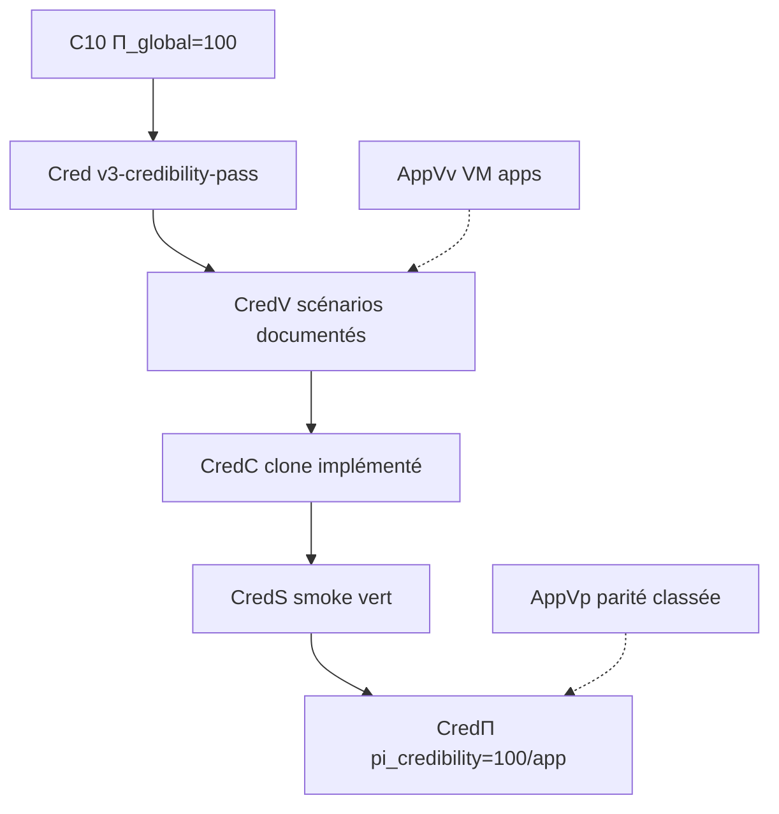

# Campagne crédibilité pédagogique — clone fidèle à la VM

> **Statut** : Phase 0 scaffolding — campagne `v3-credibility-pass` (juin 2026)  
> **Contrat machine** : [`etc/capsuleos/contracts/app-fidelity-scenarios.json`](../../etc/capsuleos/contracts/app-fidelity-scenarios.json)  
> **Orchestrateur** : `node usr/lib/capsuleos/tools/lab/run-app-fidelity-campaign.mjs`  
> **Skill agent** : [`root/skills/vm-app-fidelity-pass/SKILL.md`](../skills/vm-app-fidelity-pass/SKILL.md)

Complète sans remplacer : [moteur-clonage-experience.md](moteur-clonage-experience.md) (cycles C0–C10, **Π structurel**) · [procedure-apps-replication-formelle.md](procedure-apps-replication-formelle.md) (chaîne AppVv/AppVp).

---

## 1. Vision : crédibilité pédagogique vs Π structurel

| Dimension | Π structurel (C0–C10) | Crédibilité pédagogique (v3) |
|-----------|----------------------|------------------------------|
| **Question** | Le clone **ressemble** et **s'ouvre** comme la VM ? | L'utilisateur **se sent** sur la VM en **parcourant** menus et sous-écrans ? |
| **Mesure** | `pi_global`, `AppVp`, surfaces shell | `pi_credibility` par app et par scénario |
| **Périmètre** | 8 apps P0 + shell 8/8 | File prioritaire → catalogue 44 slots → menu 101 entrées |
| **Preuve** | Captures classées, matrices UI | Scénarios utilisateur documentés + smoke Playwright |

**Π=100** clôt la campagne structurelle Mint (pallier 10). La campagne **v3** élève la **crédibilité pédagogique** : parcours utilisateur réaliste (persona, étapes, états hover/focus/erreur/vide) validés contre la VM `capsule@192.168.1.146`.

---

## 2. Phases P-A à P-Z

| Phase | Id | Objectif | Prédicat |
|-------|-----|----------|----------|
| **P-A** | inventaire | Documenter scénarios VM (steps texte, persona) | **CredV** |
| **P-B** | vm-capture | Captures ground truth VM par scénario | **CredV** (enrichi) |
| **P-C** | impl | Implémenter interactions clone (gabarits, JS slot) | **CredC** |
| **P-D** | smoke | Smoke scénario Playwright (`smoke-app-fidelity-scenario.mjs`) | **CredS** |
| **P-E** | parité | Classer écarts, mesurer `pi_credibility` | **CredΠ** |
| **P-F** | extension | Étendre au-delà des 8 P0 (catalogue + menu) | file élargie |

Boucle **récursive par application** :

```text
shell (ouverture slot)
  → menus contextuels (clic droit, barre menu)
    → sous-écrans (onglets, panneaux cs-*, listes)
      → états (hover, focus, erreur, vide, chargement)
```

Chaque niveau produit au moins un scénario dans l'inventaire `{id}-app-fidelity-scenarios.json`.

---

## 3. Matrice scénario

Chaque entrée suit le schéma :

```json
{
  "id": "nemo-menu-context",
  "app": "nemo",
  "persona": "utilisateur bureau — clic droit",
  "steps": [
    "Ouvrir Nemo depuis le panel",
    "Naviguer vers ~/Bureau",
    "Clic droit sur zone vide → menu contextuel Cinnamon"
  ],
  "vmCapture": null,
  "capsuleCapture": null,
  "predicates": { "CredV": true, "CredC": false, "CredS": false },
  "pi_credibility": null,
  "phase": "P-A",
  "selectors": { "capsule": ["#menu-app-context-menu", ".nemo-sidebar"] }
}
```

| Champ | Rôle |
|-------|------|
| `id` | Clé stable (`<app>-<action>`) |
| `app` | Slot catalogue / `data-link` |
| `persona` | Contexte utilisateur pédagogique |
| `steps[]` | Parcours humain documenté (ground truth VM) |
| `vmCapture` | Chemin capture VM (post P-B) |
| `capsuleCapture` | Chemin capture Capsule (post P-D) |
| `predicates[]` | Sous-ensemble CredV/CredC/CredS |
| `pi_credibility` | 0–100 par scénario ; `null` tant que non mesuré |
| `selectors.capsule` | Hooks DOM pour smoke Playwright futur |

---

## 4. Intégration C0–C10 et AppVv/AppVp



- **Prérequis** : campagne C0–C10 clôturée (**Π_global=100**) pour Mint P0.
- **AppVv/AppVp** alimentent les références visuelles ; la crédibilité ajoute la **dimension parcours** (menus, sous-menus, séquences).
- **Orchestrateurs** : `run-clone-cycle.mjs` (structurel) puis `run-app-fidelity-campaign.mjs` (pédagogique).

---

## 5. File prioritaire Mint

État initial : `priorityQueue` (8 apps P0) dans [`linux-mint-replication-state.json`](inventaires/linux-mint-replication-state.json).

| Étape | Périmètre | Cible |
|-------|-----------|-------|
| 1 | `priorityQueue` | 8 apps × ≥3 scénarios documentés |
| 2 | `catalog.capsuleSlots` (44) | Slots restants du toolkit Cinnamon |
| 3 | `catalog.vmMenuEntries` (101) | Entrées menu principal non encore couvertes |

Apps pilotes supplémentaires (phase 0) : `terminal`, `pix`, `sticky` — interactions bureau typiques Mint.

---

## 6. Commandes opérationnelles

```bash
# État campagne
node usr/lib/capsuleos/tools/lab/run-app-fidelity-campaign.mjs --id linux-mint --phase status

# Prochain scénario / app
node usr/lib/capsuleos/tools/lab/run-app-fidelity-campaign.mjs --id linux-mint --phase next

# Dry-run chaîne (collect VM, smoke, validate)
node usr/lib/capsuleos/tools/lab/run-app-fidelity-campaign.mjs --id linux-mint --phase run --dry-run

# Smoke scénario (squelette Playwright)
node usr/lib/capsuleos/tools/lab/smoke-app-fidelity-scenario.mjs --id linux-mint --scenario nemo-menu-context --dry-run

# Clôture session
node usr/lib/capsuleos/tools/validate-all.mjs
```

**Reprise demain** : `run-app-fidelity-campaign.mjs --id linux-mint --phase next`

---

## 7. Anti-patterns

| Interdit | Raison |
|--------|--------|
| Scénario sans steps VM documentés | **R-INV1** — VM prime |
| Smoke avant implémentation slot | **CredC** requis |
| Parcours inventé (pas observé Mint) | Crédibilité ≠ fiction |
| `home/` direct en Playwright | Façade OS canonique uniquement |
| Sauter **validate-all** en clôture | **H₆** |

*Campagne vivante — enrichir l'inventaire après chaque passe VM SSH ou noVNC.*
