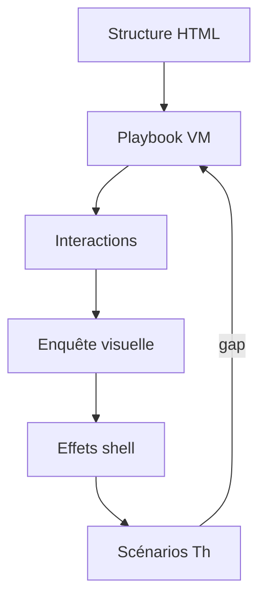

# Campagne reproduction GNOME toolkit — Paramètres puis extension multi-distro

> **Statut** : active (juin 2026)  
> **Pilote** : `linux-rocky` — propagation après **PbΣ réel** V0  
> **Références** : [logique-formelle.md](logique-formelle.md) · [procedure-creation-playbook-gnome-settings.md](procedure-creation-playbook-gnome-settings.md) · [procedure-apps-replication-formelle.md](procedure-apps-replication-formelle.md) · [branche-redhat-gnome.md](branche-redhat-gnome.md) · [plan-maitre-reproduction-os.md](plan-maitre-reproduction-os.md)

---

## 1. Vision

Reproduire **fidèlement** l'expérience GNOME (Paramètres puis applications) sur toutes les distributions toolkit `gnome`, avec une boucle **récursive** panneau → contrôles → effets shell → scénarios pédagogiques. La **crédibilité pédagogique** prime : tout écart VM↔Capsule est explicite (`contentGaps`, prédicats Cred*).

**Cible registre** : **OsΣ-registry** = ManΣ ∧ AppΣ ∧ PbΣ ∧ StoreVp ∧ Tf ∧ H₆ ([logique-formelle.md](logique-formelle.md) §2.10).

---

## 2. Périmètre distro

| Vague | Registries | Condition d'entrée |
|-------|------------|-------------------|
| **V0** | `linux-rocky` seul | Pilote — PbΣ réel 18 panneaux |
| **V1** | `linux-fedora`, `linux-ubuntu`, `linux-alma`, `linux-anduinos` | Rocky V0 clôturé |
| **V2** | Apps P0 (6 slots) | V0 PbΣ |
| **V3** | Apps P1 (magasin + utilitaires) | V2 AppΣ pilote |
| **V4** | Apps P2 | V3 |

Hors périmètre : `linux-popos` (toolkit `cosmic`), `linux-mint` (Cinnamon), KDE.

---

## 3. Phases campagne (GC-0…GC-4)

Contrat : `etc/capsuleos/contracts/os-reproduction-coherence.json` → `gnomeToolkitCampaign`.

| Phase | Id | Objectif | Prédicats produits |
|-------|-----|----------|-------------------|
| Socle | **GC-0** | H₂ + matrices vendor + doc campagne | H₂ |
| Inventaire VM | **GC-1** | Playbook + interaction + assets VM | A, S, L |
| Enquête | **GC-2** | Enquête visuelle par contrôle | V |
| Implémentation | **GC-3** | parity.js, effets, HTML, baseline | G, Vc |
| Clôture | **GC-4** | Parité classée + scénarios Th + PbΣ | Vp, PbΣ |

Orchestrateur :

```bash
node usr/lib/capsuleos/tools/lab/run-gnome-toolkit-campaign.mjs --id linux-rocky --phase v0
node usr/lib/capsuleos/tools/lab/generate-gnome-campaign-state.mjs --id linux-rocky --write
node usr/lib/capsuleos/tools/lab/smoke-gnome-campaign-state.mjs --id linux-rocky
```

---

## 4. Modèle récursif (6 niveaux par panneau)

Chaque panneau Paramètres (puis chaque slot app) traverse :

| Niveau | Symbole | Livrable |
|--------|---------|----------|
| 1. Structure | **Str** | `themes_gnome.html` — sidebar + contenu |
| 2. Playbook VM | **Pb** | `*-gnome-settings-playbook.json` — gsettings mappés |
| 3. Interactions | **Int** | `*-gnome-settings-interaction.json` — toggle + restore |
| 4. Enquête visuelle | **Vis** | `*-gnome-settings-visual-investigation.json` |
| 5. Effets shell | **Eff** | `settings-effects-chain.json` + CSS vendor |
| 6. Scénarios | **Sc** | `themes-user-scenarios.json` (Th1–Th4+) |

**RealΣ panneau** : Str ∧ Pb ∧ (Vis documenté ∨ stub accepté) ∧ (Eff si P0 shell) ∧ ¬gap P0 ouvert.

Suivi machine : `root/docs/inventaires/<id>-gnome-campaign-state.json` (généré).



---

## 5. Les 18 panneaux Paramètres

| Panneau | `capsulePanel` | Priorité pédagogique | Notes |
|---------|----------------|---------------------|-------|
| Wi-Fi | `wifi` | P1 | Liste réseaux simulée |
| Réseau | `network` | P2 | Identifiant DHCP simulé |
| Bluetooth | `bluetooth` | P2 | Appareils simulés |
| Apparence | `appearance` | **P0** | Thème, accent — Th1, Th3 |
| Arrière-plan | `background` | **P0** | Grille fonds VM — Th2 |
| Notifications | `notifications` | P0 | DND shell |
| Recherche | `search` | P1 | Providers gsettings |
| Multitâche | `multitasking` | P0 | Bureaux dynamiques |
| Son | `sound` | P2 | Volume, alertes |
| Alimentation | `power` | P2 | Profils simulés |
| Écrans | `displays` | P0 | Échelle, night-light — Th4 |
| Souris/touchpad | `mouse` | P2 | 5 contrôles |
| Clavier | `keyboard` | P2 | Disposition, répétition |
| Imprimantes | `printers` | P3 stub | `contentGaps` décoratif |
| Accessibilité | `accessibility` | P1 | Contraste, taille texte |
| Confidentialité | `privacy` | P1 | Caméra, micro, verrou |
| Partage | `sharing` | P3 stub | Simulé — gaps acceptés |
| À propos | `about` | P3 info | Informatif vendor |

Matrice pilote : `root/tools/lab/gnome-settings-parity-matrix-rocky.json`.

---

## 6. V0 Rocky — commandes gates

```bash
# Session
node usr/lib/capsuleos/tools/validate-all.mjs
node usr/lib/capsuleos/tools/lab/resolve-agent-action.mjs --id linux-rocky --scope pipeline

# Collecte VM (SSH lab requis)
node usr/lib/capsuleos/tools/lab/collect-vm-gnome-settings-playbook.mjs --id linux-rocky --write
node usr/lib/capsuleos/tools/lab/collect-vm-gnome-settings-assets.mjs --id linux-rocky
bash root/tools/lab/vm-gnome-settings-interaction-playbook.sh
node usr/lib/capsuleos/tools/lab/collect-vm-gnome-settings-visual-investigation.mjs --id linux-rocky

# Implémentation + sync
node usr/lib/capsuleos/tools/linux/sync-linux-skin-closure.mjs --id linux-rocky

# Clôture V0
node usr/lib/capsuleos/tools/lab/verify-gnome-settings-parity-chain.mjs --id linux-rocky --strict
node usr/lib/capsuleos/tools/lab/run-gnome-settings-lab.mjs --id linux-rocky
node usr/lib/capsuleos/tools/lab/smoke-h6-gnome-settings-ready.mjs --id linux-rocky
node usr/lib/capsuleos/tools/validate-gnome-settings-pbsigma.mjs
node usr/lib/capsuleos/tools/lab/smoke-gnome-themes-scenarios.mjs
node usr/lib/capsuleos/tools/lab/generate-gnome-campaign-state.mjs --id linux-rocky --write
node usr/lib/capsuleos/tools/lab/smoke-gnome-campaign-state.mjs --id linux-rocky
```

**Critère done V0** : `smoke-gnome-campaign-state` vert · `summary.v0Closed === true` · PbΣ validateur vert.

---

## 7. V1 — Propagation dérivés

Ordre : Fedora → Ubuntu → Alma → AnduinOS.

```bash
node usr/lib/capsuleos/tools/lab/run-gnome-toolkit-campaign.mjs --phase v1 --id linux-fedora
node usr/lib/capsuleos/tools/lab/run-gnome-toolkit-campaign.mjs --phase v1 --id linux-ubuntu
node usr/lib/capsuleos/tools/lab/run-gnome-toolkit-campaign.mjs --phase v1 --id linux-alma
node usr/lib/capsuleos/tools/lab/run-gnome-toolkit-campaign.mjs --phase v1 --id linux-anduinos
```

Par registry (R-LOC1) :
1. Matrices `gnome-settings-*-matrix-{vendor}.json` locales
2. Collecte VM dédiée — pas de copie valeurs Rocky
3. Delta assets `usr/share/capsuleos/assets/images/vendors/<vendor>/`
4. `run-capsule-pipeline.mjs --id <registryId>`
5. `smoke-h6-gnome-settings-ready.mjs --id <registryId>`

Scripts propagation : voir [branche-redhat-gnome.md](branche-redhat-gnome.md) §6.

---

## 8. V2–V4 — Applications GNOME

Patron : [procedure-apps-replication-formelle.md](procedure-apps-replication-formelle.md) + [procedure-playbook-gnome-apps-overview.md](procedure-playbook-gnome-apps-overview.md).

```bash
node usr/lib/capsuleos/tools/lab/run-gnome-toolkit-campaign.mjs --phase v2 --id linux-rocky
node usr/lib/capsuleos/tools/lab/run-apps-replication-chain.mjs --id linux-rocky --auto
```

| Vague | Slots |
|-------|-------|
| V2 P0 | `nemo`, `firefox`, `terminal`, `update_manager`, `text_editor`, `calculator` |
| V3 P1 | `clocks`, `visionneur_images`, `visionneur_pdf`, `snapshot`, `calendar`, `file_roller` |
| V4 P2 | `baobab`, `system_monitor`, `characters`, `tour` |

Après chaque slot pilote Rocky : `sync-gnome-nautilus-skin.mjs`, `sync-gnome-workstation-skin.mjs`, `sync-gnome-utility-app-skins.mjs`.

---

## 9. Skills agent

| Besoin | Skill |
|--------|-------|
| Pilote Rocky | `distributions/linux-rocky` |
| Paramètres GNOME | `procedure-creation-playbook-gnome-settings.md` |
| HIG / chrome | `gnome-hig-replication` |
| Apps overview | `procedure-playbook-gnome-apps-overview.md` |

---

## 10. Anti-patterns

1. Fallback matrice Rocky sur Ubuntu (P11).
2. Clôture H₆ sans `smoke-gnome-campaign-state` (RealΣ).
3. Stub imprimantes/partage sans `contentGaps` documenté.
4. Playwright sur `home/` au lieu de façade `/OS/`.
5. Fork contrat scénarios par vendor au lieu du toolkit partagé.
