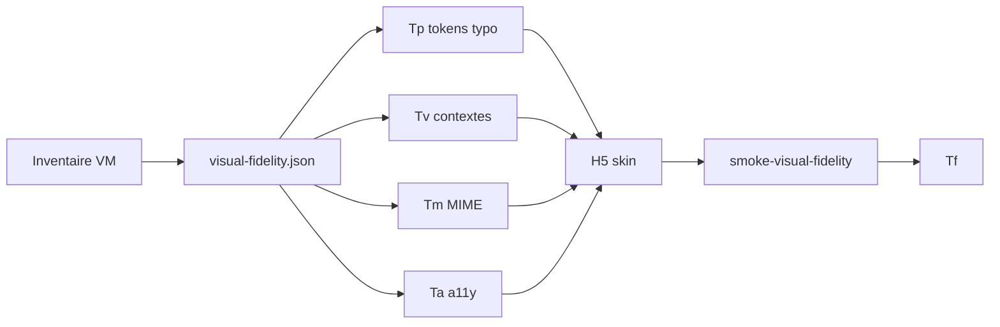

# Convention — fidélité visuelle (typographie, vues, MIME, accessibilité)

> **Statut** : contrat de reproduction **transversal** — s’applique à **toute** distribution (`registryId`) avant et pendant l’implémentation skin.  
> Complète [convention-reproduction-os.md](convention-reproduction-os.md) · [logique-formelle.md](logique-formelle.md) · Contrat machine : `etc/capsuleos/contracts/visual-fidelity.json`

**Principe** : la reproduction doit être **identique en tout point** sur l’ensemble de la distribution simulée. Aucun détail (police, breakpoint, type MIME, focus clavier) n’est optionnel s’il est observable sur la VM ground truth.

---

## 1. Prédicats formels

| Symbole | Signification | Gate |
|---------|---------------|------|
| **Tp** | Typographie inventoriée + tokens alignés | `*-visual-fidelity.json` + `smoke-visual-fidelity.mjs` |
| **Tv** | Contextes de vue inventoriés | résolutions, échelles, viewports lab/Playwright |
| **Tm** | MIME & associations documentés | handlers, icônes, globs |
| **Ta** | Accessibilité fidèle si activée | hooks `data-*` + CSS a11y + captures |
| **Tf** | Fidélité visuelle prête | **Tp ∧ Tv ∧ Tm ∧ Ta** |

```bash
node usr/lib/capsuleos/tools/lab/collect-visual-fidelity-inventory.mjs --id <registryId> --write --ssh
node usr/lib/capsuleos/tools/lab/smoke-visual-fidelity.mjs --id <registryId>
bash root/tools/lab/pull-vm-assets.sh --id <registryId>   # polices + icônes MIME
```

---

## 2. Typographie (Tp)

### 2.1 Ground truth VM

Collecter **avant** tout patch CSS applicatif :

| Champ | Source VM |
|-------|-----------|
| `fontName` / `documentFontName` | `gsettings org.gnome.desktop.interface` |
| `monospaceFontName` | idem |
| Familles installées | `fc-list` ou phase `fonts` de `*-deep-audit.json` |
| Taille effective (pt/px) | GTK / gsettings `text-scaling-factor` |

**Rocky RL10** : Red Hat Text **11** pt, Red Hat Mono **10** pt (Adwaita GTK).

### 2.2 Tokens CapsuleOS (obligatoires)

Définir **une seule fois** par skin :

```css
html:has(#rocky) {
    --font-ui: "Red Hat Text", "Cantarell", ui-sans-serif, system-ui, sans-serif;
    --font-mono: "Red Hat Mono", "DejaVu Sans Mono", ui-monospace, monospace;
}
```

Fichier canonique : `rocky-overrides.css` (ou équivalent `bodyId`).

### 2.3 Règles strictes

1. **Interdit** : `font-family: "Cantarell"` ou `"Inter"` en dur dans `home/<Vendor>/<Distro>/style/` — utiliser `var(--font-ui)` ou `var(--font-mono)`.
2. **Tailles** : `calc(var(--head) / n)` ou `calc(1rem * var(--a11y-font-scale-factor))` — pas de `px` magiques pour le texte shell/apps.
3. **Chaîne d’échelle** : `--head` provient de `variables-linux-computed.css` ; toute app CSD hérite du bureau.
4. **Embarquement polices** : si la VM utilise une police non web-safe, pull vers `usr/share/capsuleos/assets/fonts/vendors/<vendor>/` + `@font-face` documenté dans l’inventaire (**A**, **T**).
5. **Gate** : `smoke-visual-fidelity.mjs` scanne le skin et échoue sur les violations.

### 2.4 Uniformité distribution

La **même** pile `--font-ui` / `--font-mono` s’applique à : shell, Aperçu, Quick Settings, calendrier, **toutes** les apps (`style/apps/*.skin.css`), Paramètres GNOME, terminal.

---

## 3. Contextes de vue (Tv)

### 3.1 À inventorier avant reproduction

| Dimension | Exemples | Effet Capsule |
|-----------|----------|---------------|
| Résolution bureau | 1920×1080, 1680×1050, 1280×720 | `data-display-resolution` → ratios CSS |
| Échelle affichage | 100 %, 125 %, 150 %, 200 % | `data-display-scale` → `--gnome-display-scale` |
| Orientation | paysage, portrait | `data-display-orientation` |
| Viewport lab | VM native | captures VM |
| Viewport Playwright | 1280×800 (défaut smokes) | captures Capsule comparables |
| Fenêtre app | min/max par slot | `*.skin.css` `windowElement` |

Documenter dans `*-visual-fidelity.json` → section `viewContexts`.

### 3.2 CSS central

`usr/share/capsuleos/themes/linux/gnome-shell-preferences.base.css` — **ne pas dupliquer** la logique d’échelle dans chaque skin.

### 3.3 Règle

**Aucune capture comparative** sans entrée `viewContexts` validée (résolution + échelle + viewport).

---

## 4. MIME et normes de types (Tm)

### 4.1 Périmètre

Tout ce qui affecte l’**icône**, le **libellé** ou l’**application par défaut** d’un fichier :

- [shared-mime-info](https://www.freedesktop.org/wiki/Specifications/shared-mime-info-spec/)
- Entrées `/usr/share/mime/packages/`
- `MimeType=` dans les `.desktop`
- Associations Nautilus / `gio mime`

### 4.2 Inventaire minimal

```json
"mime": {
  "iconTheme": "Adwaita",
  "defaultHandlers": [
    { "mime": "inode/directory", "app": "org.gnome.Nautilus", "capsuleSlot": "nemo" },
    { "mime": "text/plain", "app": "org.gnome.TextEditor", "capsuleSlot": "text_editor" }
  ],
  "globsSample": ["*.pdf → application/pdf"]
}
```

### 4.3 Règles

1. **VM prime** — ne pas inventer un type ou une icône absente de la VM sans tag `CapsuleOnly` / `P2`.
2. Explorateur : cartographie icônes MIME dans `usr/share/capsuleos/linux/icons/` (voir KDE : `dolphin-icon-map.js`).
3. Changement de norme (ex. `org.gnome.Papers` vs `application/pdf`) → noter `delta` dans l’inventaire.

---

## 5. Accessibilité (Ta)

### 5.1 Réglages à reproduire fidèlement

| Réglage VM | Hook Capsule | Fichier CSS |
|------------|--------------|-------------|
| Taille texte 100/110/125 % | `html[data-font-scale]` | `gnome-shell-preferences.base.css`, `a11y-*.css` |
| Contraste élevé | `html[data-contrast-mode="high"]` | `a11y-fedora.css` (GNOME Rocky) |
| Échelle affichage | `html[data-display-scale]` | `gnome-shell-preferences.base.css` |
| Éclairage nocturn | `html[data-night-light]` | idem |
| Focus clavier | `:focus-visible` | `--a11y-focus-ring`, `--a11y-focus-shadow` |

### 5.2 Règles

1. **Activation utilisateur** (Paramètres → Accessibilité) doit produire un **changement visible** sur shell + apps concernées — pas de toggle décoratif.
2. Captures VM + Capsule pour P0/P1 (voir playbook `font-scale`, `contrast`).
3. Import obligatoire `a11y-<toolkit>.css` dans `style/imports.css` du skin.
4. Zoom / contraste ne doivent **pas** casser la mise en page CSD (overflow testé en smoke).

---

## 6. Workflow agent (ordre)



| Étape | Quand | Bloquant |
|-------|-------|----------|
| Collecte `*-visual-fidelity.json` | Après `*-vm.json` / deep-audit static | **Oui** avant H5 typo/MIME/a11y |
| Alignement tokens | Avant apps/shell polish | **Oui** |
| Smokes a11y Paramètres | Avec playbook GNOME | P1 |
| `smoke-visual-fidelity.mjs` | Avant merge / H6 | **Oui** |

---

## 7. Rocky — référence

Inventaire : [linux-rocky-visual-fidelity.json](inventaires/linux-rocky-visual-fidelity.json)

| Élément | VM | Capsule |
|---------|-----|---------|
| UI | Red Hat Text 11 | `--font-ui` rocky-overrides |
| Mono | Red Hat Mono 10 | `--font-mono` |
| a11y shell | gsettings | `a11y-fedora.css` + datasets |
| Viewport smokes | — | 1280×800 |
| MIME | Adwaita + apps GNOME | Nautilus slot `nemo` |

---

## 8. Anti-patterns

1. Police générique (`sans-serif` seul) alors que la VM documente une police vendor.
2. `Cantarell` en dur dans 15 fichiers skin au lieu d’un token unique.
3. Captures sans viewport documenté.
4. Toggle accessibilité sans effet CSS mesurable.
5. Icône MIME inventée non présente dans `hicolor` VM.

---

## 9. Références

- [procedure-audit-vm-profonde.md](procedure-audit-vm-profonde.md) — phase `fonts`
- [procedure-apps-catalog.md](procedure-apps-catalog.md)
- [contrats-ui-bureau.md](contrats-ui-bureau.md) — focus `:focus-visible`
- [reference-gnome-expert.md](reference-gnome-expert.md) § accessibilité
- [procedure-creation-playbook-gnome-settings.md](procedure-creation-playbook-gnome-settings.md) — hooks `data-*`
