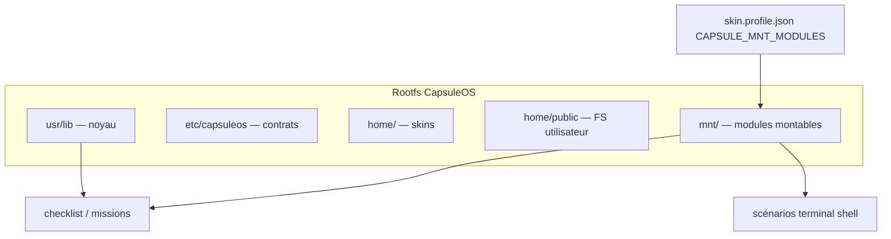

# Convention — modules pédagogiques (`/mnt`)

> **Contrat** : `etc/capsuleos/contracts/pedagogical-modules.json`  
> **Métaphore** : points de montage Linux — supports pédagogiques **branchés** ou **retirés** sans modifier le noyau.

---

## 1. Positionnement formel

CapsuleOS simule un **rootfs**. Le dossier `mnt/` est le **répertoire d’injection de scénarios pédagogiques** : parcours, missions et contenus didactiques pouvant être **déployés sur n’importe quel OS** du catalogue (GNOME, Windows, macOS…). La métaphore Linux `mount` reste utile en documentation ; l’essentiel est la **portabilité cross-OS** des scénarios, sans fork du noyau.

Voir [fondements-philosophiques.md](fondements-philosophiques.md) §4.3.



| Chemin | Rôle | À ne pas confondre avec |
|--------|------|-------------------------|
| **`mnt/`** | Parcours, scénarios, missions **modulaires** | `home/public/` (fichiers de l’utilisateur simulé) |
| **`usr/lib/`** | Comportements (terminal, explorateur) | Contenu des exercices |
| **`etc/capsuleos/`** | Registre, contrats, profils | Données pédagogiques |

### Prédicats

| Symbole | Signification |
|---------|---------------|
| **Pm** | Module présent `mnt/<niveau>/<id>/` |
| **Pm_Σ** | `module.json` + scénarios valides |
| **Pm_mount** | Module listé dans `CAPSULE_MNT_MODULES` |
| **PΣ** | Parcours actif = skin + modules montés |

```text
R-PM1   besoin scénario ∧ ¬Pm       →  créer module mnt/ avant patch skin ciblé
R-PM2   Pm ∧ ¬Pm_Σ                  →  validate-pedagogical-modules.mjs
R-PM3   Pm_mount ∧ conflit slot     →  un propriétaire explicite par slot (ou fusion documentée)
```

---

## 2. Niveaux

| Répertoire | Public | Accès |
|------------|--------|-------|
| `debutant/` | Première découverte du bureau et du terminal | Capsule+ (`access: subscriber`) |
| `intermediaire/` | Commandes, FS, paquets | Capsule+ |
| `confirme/` | Scripts, permissions, réseau simulé | Capsule+ |
| `expert/` | Chaînes complètes, audit | Capsule+ (futur) |
| `cybertech/` | Sécurité, forensics pédagogiques | Capsule+ (futur) |

**Offre gratuite** : aucun module monté (`CAPSULE_MNT_MODULES: []`) — essai des OS du catalogue, session plafonnée (voir `portal-entitlements.json` → `osSession`). Catalogue éditorial : [`parcours-pedagogique.md`](../../parcours-pedagogique.md).

Catalogue machine : [`mnt/catalog.json`](../../mnt/catalog.json).

---

## 3. Anatomie d’un module

```text
mnt/debutant/linux-bases/
├── module.json           # manifeste Pm_Σ
└── scenarios/
    └── s01-decouverte-terminal.json
```

### `module.json` (champs clés)

| Champ | Rôle |
|-------|------|
| `id` | Identifiant stable |
| `level` | `debutant` \| `intermediaire` \| … |
| `locale` | `fr-FR` par défaut (**Lj_fr**) |
| `slots` | Slots UI concernés (`terminal`, `nemo`, `checklist`…) |
| `prerequisites` | IDs modules à monter avant |
| `scenarios` | Fichiers JSON relatifs au module |

### Scénario

Décrit missions, étapes, critères de réussite, liens vers prédicats shell (**TΣ**, **Ts**, **To**) quand le terminal est impliqué.

---

## 4. Montage (projection statique)

Dans `skin.profile.json` ou profil registre :

```json
{
  "capsuleGlobals": {
    "CAPSULE_MNT_BASE": "../../../mnt",
    "CAPSULE_MNT_MODULES": ["debutant/linux-bases"]
  }
}
```

| Global | Défaut | Rôle |
|--------|--------|------|
| `CAPSULE_MNT_BASE` | `../../../mnt` | Racine des modules (depuis skin) |
| `CAPSULE_MNT_MODULES` | `[]` | Liste `niveau/id` montés |

**Chargement** : `usr/lib/capsuleos/shells/common/capsule-mnt-modules.js` — expose `window.CapsuleMntModules` (manifestes résolus).

**Démontage** : retirer l’entrée de `CAPSULE_MNT_MODULES` — le noyau et le skin restent ; seul le parcours disparaît.

---

## 5. Intégration progressive

| Phase | Livrable | Statut |
|-------|----------|--------|
| P1 | Contrat + `mnt/` + module pilote | **fait** |
| P2 | `validate-pedagogical-modules.mjs` | **fait** |
| P3 | Checklist alimentée depuis scénarios montés | planned |
| P4 | Terminal : validation auto des étapes (`capsule:task`) | planned — reprise shell |

---

## 6. Gate

```bash
node usr/lib/capsuleos/tools/validate-pedagogical-modules.mjs
```

---

## 7. Références

- [manifeste-noyau.md](manifeste-noyau.md) — rootfs simulé  
- [convention-shell-global.md](convention-shell-global.md) — scénarios terminal  
- [scalabilite-noyau.md](scalabilite-noyau.md) — modularité horizontale  
- [locale-scalability.json](../../etc/capsuleos/contracts/locale-scalability.json) — **Lj_fr**
