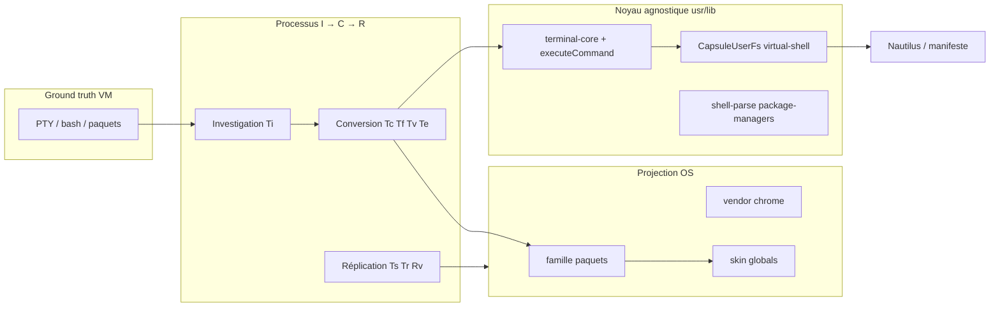

# Convention — socle shell global (investigation → conversion → réplication)

> **Statut** : contrat validé (`etc/capsuleos/contracts/terminal-replication-chain.json`).  
> **Rôle** : définir le processus critique qui alimente le **shell virtuel** de CapsuleOS — socle partagé du noyau, projections par OS, intégration scalable des futurs environnements.

**Références** : [logique-formelle.md](logique-formelle.md) (prédicats **Ti–TΣ′**) · [procedure-terminal-commandes.md](procedure-terminal-commandes.md) (opératoire commandes) · [convention-terminal-rendu-sortie.md](convention-terminal-rendu-sortie.md) (**To**, **Tb**) · [convention-rafraichissement-vues.md](convention-rafraichissement-vues.md) (**Rv**) · [convention-reproduction-os.md](convention-reproduction-os.md)

---

## 1. Positionnement — oui, c’est un socle du shell global

Le terminal CapsuleOS n’est pas une app isolée : c’est la **projection CLI** du bureau simulé. Il partage avec Nautilus, le manifeste utilisateur et les slots `data-link` la même vérité machine.



| Terme usuel | Terme CapsuleOS | Emplacement |
|-------------|-----------------|-------------|
| Shell réel (bash) | Ground truth VM | VM lab |
| Moteur de commandes | **Noyau executor** | `executeCommand.js` (unique) |
| Session sans DOM | **Noyau session** | `terminal-core.js` |
| Liste blanche distro | **Famille + vendor** | profils + `terminal-profile.js` |
| Chrome Ptyxis/Konsole | **Projection UI** | `terminal.js`, CSS skin |
| Pont FS | **Bridge** | `CapsuleUserFs`, `virtual-shell.js` |

**Robustesse** : une seule implémentation par commande ; les gates empêchent la dérive registre ↔ exécuteur.  
**Résilience** : modules optionnels (package-managers, shell-parse) dégradent proprement ; état terminal en **SESSION** (purge à fermeture).  
**Scalabilité** : nouvel OS = inventaire **Ti** + profil famille (souvent existant) + globals skin — pas de fork `executeCommand.js`.

**International (prévision)** : **Lj_fr** défaut · **Lj_en** / **Lk_qwerty** en projection additive ([scalabilite-noyau.md §7](scalabilite-noyau.md)) — la parité VM garde la locale de l'inventaire (**R-LJ2**).

---

## 2. Processus I → C → R (investigation · conversion · réplication)

### 2.1 Investigation (**Ti**)

**But** : établir le **réel** VM avant toute implémentation (règle **R-INV1** — VM prime).

| # | Action | Livrable |
|---|--------|----------|
| 1 | VM accessible (**M**) | SSH + session graphique |
| 2 | Recenser commandes : `compgen -c`, paquets par défaut, gestionnaire dominant | |
| 3 | Capturer : prompt, `ls` (colonnes/long), sorties `apt`/`dnf`/`zypper`, éditeur par défaut | |
| 4 | Noter redirections/pipes usuels (école / doc distro) | |
| 5 | Rédiger inventaire | `root/docs/inventaires/<registryId>-terminal-vm.json` |

Modèle : [`_template-terminal-vm.json`](inventaires/_template-terminal-vm.json).

**Ti** = inventaire présent ∧ `commandAudit[]` renseigné ∧ `packageManager` documenté.

---

### 2.2 Conversion (**Tc**, **Tf**, **Tv**, **Te**)

**But** : traduire le réel en **couches noyau** sans duplication.

```text
Pour chaque commande VM :
  1. Classifier → core | family | vendor | CapsuleOnly | defer
  2. Si core     → command-core.js + case unique executeCommand.js
  3. Si family   → profil linux/{debian,redhat,suse,arch}.js
  4. Si vendor   → terminal-vendor-extensions.js
  5. Registre    → command-registry.js (help, examples)
  6. Contrat     → terminal-commands.json
  7. Gate        → validate-terminal-commands.mjs
```

| Couche | Critère d’admission |
|--------|---------------------|
| **core** | Pertinent sur ≥ 2 familles Linux actives ; comportement POSIX ou universel pédagogique |
| **family** | Gestionnaire de paquets ou outil lié à la famille (APT, DNF, Zypper, pacman) |
| **vendor** | Singularité d’une distro (ex. `cinnamon` sur Mint) |
| **CapsuleOnly** | Sandbox (pas sur VM) — tag explicite dans l’inventaire |
| **defer** | P1/P2 — documenté, non implémenté |

**Interdit** : copier `executeCommand.js` dans `home/` ; fork par `body.id` dans le moteur.

Détail opératoire : [procedure-terminal-commandes.md](procedure-terminal-commandes.md).

---

### 2.3 Réplication (**Ts**, **Tr**, **Rv**)

**But** : prouver que CapsuleOS **reproduit** le comportement documenté (pas seulement compile).

| # | Vérification | Prédicat | Gate |
|---|--------------|----------|------|
| 1 | Sync FS terminal ↔ Nautilus | **Ts** | `smoke-fs-terminal-explorer-sync.mjs` (T1–T8) |
| 2 | Rafraîchissement vues post-action | **Rv₁** | [view-refresh-vigilance-playbook.json](inventaires/view-refresh-vigilance-playbook.json) |
| 3 | Scénarios commandes vs inventaire VM | **Tr** | Matrice dans `<id>-terminal-vm.json` → `replicationScenarios[]` |
| 4 | Sorties gestionnaires de paquets | **Tr** | Tests manuels / smokes documentés |
| 5 | Régression référentiel | **Te** | `validate-terminal-commands.mjs` |

**Tr** = tous les scénarios P0 de l’inventaire terminal sont `pass` ou écart classé P1 assumé.

**Ts** = smoke fs-sync vert sur le `registryId` cible.

---

### 2.4 Clôture shell (**TΣ** / **TΣ′**)

```text
TΣ  = Ti ∧ Tc ∧ Tf ∧ Te ∧ Ts ∧ Tr
To  = To₁ ∧ To₂ ∧ To₃   (indentation · sauts de ligne · coloration)
TΣ′ = TΣ ∧ To            (clôture P0 stricte — voir convention-terminal-rendu-sortie)
Tb  = profil ~/.bashrc virtuel (optionnel TΣ ; requis personnalisation shell)
```

(Tv requis si l’inventaire VM liste des singularités vendor.)

Pour un **nouveau registryId** avec slot terminal P0 :

```text
H₂ ∧ I ∧ Ti ∧ TΣ ∧ Rv        →  admissible merge (comportement + sync)
H₂ ∧ I ∧ Ti ∧ TΣ′ ∧ Rv       →  admissible merge fidélité sortie stricte
```

---

## 3. Agnosticité du noyau

L’**agnosticité** signifie : le même moteur sert toutes les distros ; seules les **projections** et les **données** changent.

### 3.1 Séparation des responsabilités

| Couche | Agnostique ? | Modules | Règle |
|--------|--------------|---------|-------|
| **L0 — Session** | Oui | `terminal-core.js` | Zéro DOM ; API `CapsuleTerminal.createSession` |
| **L1 — Parse / exec** | Oui* | `terminal-shell-parse.js`, `executeCommand.js`, `terminal-package-managers.js` | *FS Linux simulé ; futur : adapters `osFamily` |
| **L1 — Référentiel** | Oui | `command-registry.js`, `command-core.js`, `terminal-profile-builder.js` | Contrat JSON = vérité déclarative |
| **L2 — Pont données** | Partiel | `virtual-shell.js`, `CapsuleUserFs` | Contrat manifeste explorateur |
| **L3 — UI chrome** | Non | `terminal.js`, `terminal-tabs.js`, `terminal-konsole-chrome.js` | Par toolkit / `body.id` |
| **L4 — Identité** | Non | `CAPSULE_TERMINAL_*`, `terminal-profile.js` | Prompt user@host ; hint → famille |

```text
Règle d’or agnosticité :
  Si le comportement est identique sur ≥ 2 OS → L0–L2 (noyau).
  Si le comportement dépend du gestionnaire de paquets → famille (L4 data).
  Si le comportement est visuel ou DE-spécifique → L3–L4 (skin).
```

### 3.2 Résolution à l’exécution

```text
CAPSULE_TERMINAL_OS_FAMILY (linux|windows|macos)
  + CAPSULE_TERMINAL_PROFILE (hint vendor : rocky, ubuntu, mint…)
    → normalizeCommandDistro() → linux:{debian|redhat|suse|arch}
      → CAPSULE_TERMINAL_CORE_COMMANDS ∪ familyCommands ∪ vendorCommands
        → filtre CAPSULE_TERMINAL_COMMAND_REGISTRY
          → CAPSULE_TERMINAL_ACTIVE_COMMANDS
```

Aucune branche `if (rocky)` dans `executeCommand.js` pour la **disponibilité** des commandes — uniquement pour des **formats de sortie** documentés (ex. `ls` colonnes GNOME), à migrer vers providers si la dette grossit.

### 3.3 Intégration d’un nouvel OS (checklist)

| # | Tâche | Zone |
|---|-------|------|
| 1 | Entrée `os-registry.json` + skin | catalogue |
| 2 | `CAPSULE_TERMINAL_PROFILE` dans profil skin | `skin.profile.json` |
| 3 | Famille commandes : existante ou nouveau `profiles/linux/<famille>.js` | noyau |
| 4 | Script profil dans `index.html` (chaîne §8 procedure-terminal-commandes) | skin |
| 5 | Inventaire **Ti** `<id>-terminal-vm.json` | inventaire |
| 6 | Scénarios **Tr** + smoke **Ts** | lab |
| 7 | Chrome terminal (Ptyxis/Konsole/classique) | `terminal.js` + CSS skin |
| 8 | **TΣ** + **Rv** avant clôture | gates |

Héritage typique : Fedora/Alma → famille `redhat` ; Ubuntu/Mint → `debian` ; openSUSE → `suse`.

---

## 4. Résilience et robustesse

| Risque | Mitigation |
|--------|------------|
| Dérive registre / exécuteur | `validate-terminal-commands.mjs` dans `validate-quality-all` |
| État terminal fantôme | **Rv₂** + SESSION purge (`CapsuleWindowMemory`) |
| Grille Nautilus stale | **Ts** + `capsule:fs-changed` |
| Module non chargé | Message d’erreur explicite (pas de throw silencieux) |
| Copie legacy `OS/linux/kernel/js/terminal/` | **Interdit** — canon = `usr/lib/capsuleos/shells/linux/terminal/` |
| Inventaire sans VM | Pas de baseline arbitraire (**R-PRI4**) |

---

## 5. Chaîne formelle et contrats

| Artefact | Rôle |
|----------|------|
| `etc/capsuleos/contracts/terminal-commands.json` | Couches core / family / vendor |
| `etc/capsuleos/contracts/terminal-replication-chain.json` | Ordre **Ti → TΣ**, gates |
| `inventaires/<id>-terminal-vm.json` | Ground truth + scénarios **Tr** |
| `inventaires/fs-sync-playbook.json` | Pont FS (**Ts**) |
| `inventaires/view-refresh-vigilance-playbook.json` | **Rv** transversal |

```bash
# Référentiel commandes
node usr/lib/capsuleos/tools/validate-terminal-commands.mjs

# Sync FS terminal ↔ explorateur
CAPSULE_HTTP_BASE=http://127.0.0.1:8765 node usr/lib/capsuleos/tools/lab/smoke-fs-terminal-explorer-sync.mjs
```

---

## 6. Règles d’inférence (extrait)

```
R-TI1   H5 slot terminal ∧ ¬Ti  →  collecter inventaire VM terminal d’abord
R-TC1   Ti ∧ ¬Te               →  validate-terminal-commands.mjs
R-TS1   Te ∧ mutation FS ∧ ¬Ts  →  smoke-fs-terminal-explorer-sync
R-TR1   Ts ∧ ¬Tr               →  exécuter replicationScenarios P0
R-TΣ1   Tr ∧ Ts ∧ Te ∧ Tc ∧ Ti →  TΣ — shell admissible pour clôture skin
R-AGN1  comportement commun     →  noyau usr/lib (jamais home/ pour executor)
```

---

## 7. Modules pédagogiques (`mnt/`)

Les scénarios terminal (**Tr**, **Ts**, **To**) peuvent être embarqués dans des modules montables — ex. `mnt/debutant/linux-bases/scenarios/s02-premieres-commandes.json`. Voir [convention-modules-mnt.md](convention-modules-mnt.md) (**Pm**, **PΣ**).

---

## 8. Références croisées

- [manifeste-noyau.md](manifeste-noyau.md) — distribution noyau / skins
- [procedure-clonage-os-depuis-vm.md](procedure-clonage-os-depuis-vm.md) — clone bureau global
- [procedure-playbook-general.md](procedure-playbook-general.md) — couche τ
- `usr/lib/capsuleos/shells/shared/terminal/README.md` — ordre scripts
