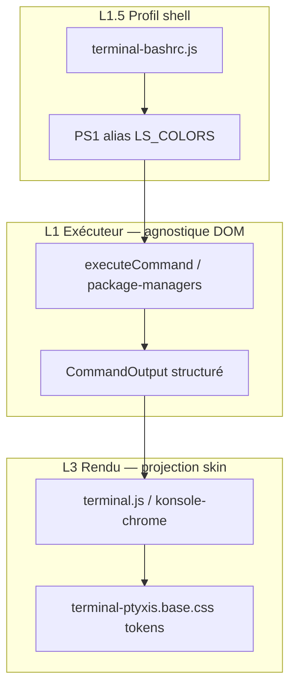

# Convention — rendu des sorties terminal (indentation · sauts de ligne · coloration)

> **Statut** : contrat `etc/capsuleos/contracts/terminal-output-fidelity.json`  
> **Parent** : [convention-shell-global.md](convention-shell-global.md) · prédicats **To**, **Tb** dans [logique-formelle.md](logique-formelle.md)

La reproduction fidèle du shell ne se limite pas au **texte brut** des commandes : l’élève reconnaît un terminal Linux à l’**indentation**, aux **retours à la ligne** et à la **coloration** (invite, `ls`, erreurs, DNF). Ces dimensions font partie de **Tr** (réplication comportementale visuelle).

---

## 1. Problème — réel vs Capsule aujourd’hui

| Dimension | Ground truth VM | CapsuleOS actuel | Écart |
|-----------|-----------------|------------------|-------|
| **Invite (PS1)** | Segments colorés bash/Ptyxis | CSS `terminal-ptyxis.base.css` + spans si chrome Fedora | P1 — teintes à caler sur capture VM |
| **`ls` colonnes** | Souvent multi-colonnes + `LS_COLORS` | Rocky : une ligne `join('  ')` ; Ubuntu/Pop : 5 colonnes | P0 Rocky — `usesGnomeStyleLsListing()` exclut `rocky` |
| **Erreurs** | stderr souvent rouge | Classe `.capsule-terminal__line--error` | P1 — comparer `#ff7b72` vs VM |
| **DNF / apt** | Sorties structurées, parfois ANSI | Lignes texte dans `terminal-package-managers.js` | P1 — pas de couleur transaction |
| **Sauts de ligne** | `\n` final parfois significatif | `split('\n')` + une `<div>` par ligne | P2 — lignes vides finales |
| **Espaces** | Tabs / alignement `ls -l` | `formatLsLongLine` simplifié | P1 — colonnes non calées VM |
| **Personnalisation** | `~/.bashrc`, `~/.bash_profile` | Module `terminal-bashrc.js` (v1 : alias, PS1, LS_COLORS) | **Tb** — voir §4 |

**Règle** : pendant l’**investigation Ti**, capturer des **échantillons de sortie** (texte + capture couleur) pour chaque commande P0 — pas seulement « la commande existe ».

---

## 2. Architecture cible — séparer texte, structure et rendu



### 2.1 Modèle `CommandOutput` (évolution)

```text
{
  lines: Line[],
  listing?: boolean,      // ls multi-colonnes
  error?: boolean,
  clear?: boolean
}

Line = string
     | { text: string, spans?: { start, end, role }[] }
     | { ansi: string }   // séquence ANSI complète (futur)

role ∈ { dir, file, executable, symlink, error, bold, dim, package, success }
```

| Couche | Responsabilité |
|--------|----------------|
| **Exécuteur** | Verbatim logique + structure sémantique (`listing`, `role` spans) |
| **Profil bashrc** | PS1, alias, `LS_COLORS` → état session `state.shellEnv` |
| **Rendu** | `textContent` **ou** spans/CSS — **jamais** de couleur en dur dans l’exécuteur |

### 2.2 Indentation et sauts de ligne (**To₁**, **To₂**)

| Règle | Spécification |
|-------|---------------|
| **To₁** | Espaces significatifs préservés (`white-space: pre` / `pre-wrap` sur lignes monospaces) |
| **To₂** | Une ligne executor = une ligne affichée ; pas de fusion ni split arbitraire |
| **To₂b** | `echo -e` / littéraux `\n` : hors scope v1 (documenter defer) |
| **Listing `ls`** | Largeur colonne = `max(len(nom))+marge` VM ou variable CSS `--terminal-ls-col-width` |

Investigation : enregistrer dans l’inventaire `outputSamples[].raw` la sortie **exacte** (`od -c` ou copie Ptyxis).

### 2.3 Coloration (**To₃**)

| Zone | Mécanisme Capsule | Token / classe |
|------|-------------------|----------------|
| Invite user@host | Spans prompt | `--terminal-prompt-user-color` |
| Chemin invite | Span path | `--terminal-prompt-path-seg-color` |
| Répertoires `ls` | `.capsule-terminal__dir` | `--terminal-ls-dir-color` |
| Erreurs | `.capsule-terminal__line--error` | `--fedora-terminal-error` |
| DNF « Complete! » | (futur) span `success` | à définir par skin |

**Interdit** : couleurs hex en dur dans `executeCommand.js` — uniquement `role` ou classes contractuelles.

---

## 3. Processus I → C → R (rendu)

| Phase | Action | Livrable |
|-------|--------|----------|
| **I** | `ssh` : `echo $PS1`, `alias`, `declare -p LS_COLORS`, captures `ls`, `dnf check-update`, `ls -l` | `outputSamples[]` dans `*-terminal-vm.json` |
| **C** | Provider sortie par commande ; tokens CSS skin ; étendre `listing` si multi-colonnes | patch noyau + `terminal.skin.css` |
| **R** | Diff texte normalisé + capture couleur côte à côte | scénarios **Tr** `S-out-*` |

### Prédicat **To**

```text
To = To₁ ∧ To₂ ∧ To₃
TΣ′ = TΣ ∧ To   (clôture terminal P0 stricte)
```

---

## 4. Couche **bashrc** (**Tb**)

### 4.1 Pourquoi

Sur Linux réel, le comportement perçu du terminal est largement défini par **`~/.bashrc`** (et `/etc/bashrc`) : invite, alias (`ll`, `la`), couleurs `ls`, variables d’environnement. Ignorer cette couche casse la crédibilité pédagogique et empêche les scénarios « l’élève édite son bashrc ».

### 4.2 Périmètre v1 (module `terminal-bashrc.js`)

| Directive | Support v1 | Effet |
|-----------|------------|-------|
| `alias nom='cmd'` | ✓ | Expansion avant parse (une passe) |
| `export PS1='…'` | ✓ | `\u \h \w \W \$` → invite |
| `export LS_COLORS='…'` | ✓ stocké | Rendu `ls` (v2 : application couleurs) |
| `export VAR=value` | ✓ stocké | Lecture future |
| `source`, fonctions, `if` | ✗ defer | Documenter dans inventaire |

### 4.3 Emplacement données

| Source | Chemin virtuel |
|--------|----------------|
| Manifeste explorateur / `fileContents` | `$HOME/.bashrc` |
| Défaut pédagogique (optionnel) | `home/public/.bashrc` seed |

**Investigation VM** :

```bash
ssh capsule@<vm> 'cat ~/.bashrc; echo ---; echo PS1=$PS1; alias'
```

Champ inventaire : `bashrcSnapshot.path`, `bashrcSnapshot.sha256`, `bashrcSnapshot.excerpt`.

### 4.4 Prédicat **Tb**

```text
Tb = profil shell chargeable depuis ~/.bashrc virtuel
     ∧ alias|PS1 documentés dans inventaire
     ∧ pas de régression TΣ sur scénarios sans bashrc custom
```

**Tb** est **requis** pour les scénarios pédagogiques « personnalisation shell » ; **optionnel** pour TΣ minimal.

---

## 5. Checklist Rocky (première passe **To**)

| # | Commande | Capturer VM | Capsule |
|---|----------|-------------|---------|
| 1 | `(invite)` | Couleurs Ptyxis | `terminal-ptyxis.base.css` |
| 2 | `ls` | Colonnes + couleurs | Étendre listing Rocky |
| 3 | `ls -l` | Alignement colonnes | `formatLsLongLine` |
| 4 | `dnf check-update` | Texte + emphase | package-managers |
| 5 | `cd /nope` | Rouge stderr | `--error` |
| 6 | `echo -n` / `printf` | defer P2 | — |

---

## 6. Gates et références

```bash
node usr/lib/capsuleos/tools/validate-terminal-commands.mjs
# Futur : smoke-terminal-output-fidelity.mjs (diff texte + screenshot)
```

| Artefact | Rôle |
|----------|------|
| `terminal-output-fidelity.json` | Rôles, tokens, prédicats To/Tb |
| `terminal-bashrc.js` | Charge profil depuis FS virtuel |
| `terminal-ptyxis.base.css` | Tokens couleur invite / erreur |
| `*-terminal-vm.json` | `outputSamples`, `bashrcSnapshot` |

---

## 7. Locale — FR défaut, EN en prévision

| Priorité | Règle |
|----------|-------|
| 1 | **Lj_fr** — UI et docs CapsuleOS restent français par défaut |
| 2 | **Parité VM** — sorties terminal alignées sur la locale de l'inventaire (Rocky FR → `dnf` FR) |
| 3 | **Lj_en** — providers `terminal-package-managers` par `family × locale` ; pas de fork `executeCommand` |

```text
providers.redhat['fr-FR'] → messages DNF français (cible To₃ Rocky)
providers.redhat['en-US'] → messages DNF anglais (portage international)
```

Contrat : `etc/capsuleos/contracts/locale-scalability.json` · jalon **S8** dans [scalabilite-noyau.md](scalabilite-noyau.md).

L'écart **G-dnf-locale-fr** se corrige via provider **Lj_fr**, sans inverser la priorité FR du projet.

---

## 8. Règles d’inférence

```
R-TO1   Tr ∧ sortie P0 ∧ ¬To₁  →  corriger whitespace / colonnes avant chrome
R-TO2   To₁ ∧ ¬To₃             →  tokens CSS + spans (pas hex dans executor)
R-TB1   scénario bashrc ∧ ¬Tb  →  terminal-bashrc.js + ~/.bashrc manifeste
R-TΣ2   clôture P0 stricte     →  TΣ ∧ To (pas seulement TΣ comportemental)
```
