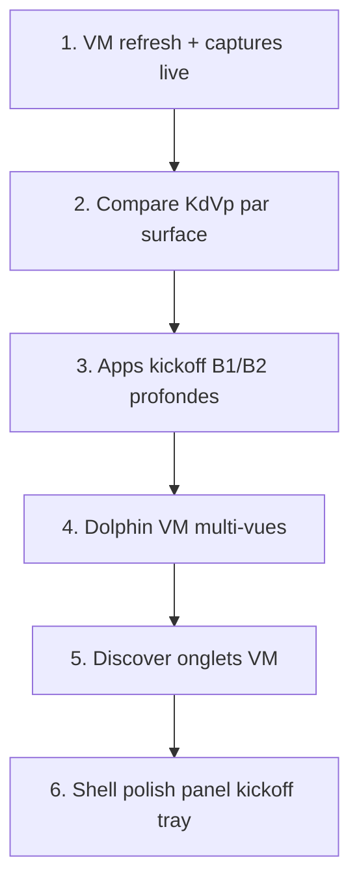

# Roadmap ground KDE — `linux-kde-neon` seul

> **Politique** (juin 2026) : le **ground truth Plasma** doit être excellent sur Neon avant toute propagation openSUSE / MX / Debian-KDE.  
> **Π formel** = 100 · **excellence produit** = backlog ci-dessous.  
> **Orchestrateur** : `run-kde-neon-pass.mjs` · **Écarts** : [`linux-kde-neon-vp-residual.md`](linux-kde-neon-vp-residual.md)

## Principe

1. VM lab `KDE-Neon` prime sur la doc · inventaire à jour avant patch.
2. Ne pas toucher les dérivés (`home/SUSE/`, `home/Debian/MX-KDE/`, `home/Debian/Debian-KDE/`).
3. Ne pas réécrire les zones ✅ sans échec smoke.
4. CredΣ 33 scénarios = plancher ; la fidélité **par app kickoff** reste le vrai travail.

## Ordre logique



| # | Phase | Livrable | Gate |
|---|-------|----------|------|
| G1 | Inventaire VM | `linux-kde-neon-vm.json` à jour | `vm-kde-neon-inventory.sh` |
| G2 | Compare VM ↔ Capsule | paires par surface (pas seulement baseline HTTP) | `capture-capsule-kde-neon.mjs` + captures VM |
| G3 | Kickoff **B1** | Okular, Gwenview, Kate (+ Konversation si VM) | slot dédié + smoke kickoff |
| G4 | Kickoff **B2/B3** polish | Spectacle, Info-centre, Moniteur, KDEConnect — fidélité VM | `smoke-kde-neon-v4-p2.mjs` étendu |
| G5 | Dolphin profond | §7–8 VM compare · espacement grille · menu ctx VM | `linux-kde-neon-dolphin-diff.md` |
| G6 | Discover complet | captures VM 5 onglets · filtres · About/Config | `linux-kde-neon-discover-closure.md` |
| G7 | Firefox | toolbar matrix VM · capture paire | `linux-kde-neon-firefox-toolbar-matrix.md` |
| G8 | Tray / panel | dimensions kickoff Vp · popovers dynamiques réaudit | smokes shell + panel |

## Backlog ouvert (ground)

| Priorité | Sujet | Référence |
|----------|-------|-----------|
| **P0** | Compare VM live panel · kickoff · dolphin | `clone-status.md` P1 réaudit |
| **P0** | Apps kickoff ouvrant `profile` générique | [`linux-kde-neon-v4-p2-kickoff-audit.md`](linux-kde-neon-v4-p2-kickoff-audit.md) |
| **P1** | Dolphin captures VM search · hamburger · split | `vm-kde-neon-dolphin-*-playbook.sh` |
| **P1** | Discover captures VM par onglet | `discover-closure.md` |
| **P1** | Firefox inventaire toolbar VM | `firefox-toolbar-matrix.md` |
| **P2** | Kickoff filtres / épingler · tokens `--kde-neon-*` | `kickoff-closure.md` écarts |
| **P2** | TeXInfo · Help · Vim · Partition Manager | audit B2/B3 |
| **P2** | Konversation | hors VM juin 2026 — ne pas inventer |

## Gelé (hors scope)

- Propagation dérivés P4 / campagne v10
- `smoke-kde-v10-derived-pass.mjs` — référence seulement
- Parity-index / captures des skins dérivés

## État session (2026-06-10)

| Phase | Statut | Note |
|-------|--------|------|
| G1 inventaire | ✅ | `collectedAt` 2026-06-10T13:28:41Z |
| G1 captures VM | ✅ | shell · dolphin · discover (kstart · `--discover-home`) |
| G2 captures Capsule | ✅ | 24 scènes · `ensureDolphinSplit` |
| G2 paires VM↔Capsule | ✅ | `screen_KDE-Neon/vm-*` ↔ `capsule-*` |
| G3 kickoff regen | ✅ | `mainMenu-data.js` 30 apps |
| **G3 apps B1** | ✅ | Okular · Gwenview · Kate · `smoke-kde-neon-b1-kickoff` · H₂ vert |
| **G4 kickoff B2/B3** | ✅ | Spectacle · Info-centre · Moniteur — facts VM · paires capture · `smoke-kde-neon-v4-p2` |
| **G5 Dolphin profond** | ✅ | §7–8 VM `--dolphin-g5` · grille · smoke filtre · baseline à régénérer post-G5 |
| **G6 Discover VM** | ✅ | 5 onglets sans popup · `systemd-run` + `--discover-g6` |
| **G7 Firefox** | ✅ | `--firefox-g7` · smoke · paire toolbar Vp |
| **G8 Tray/panel** | ✅ | `--panel-g8` · captures tray Capsule · smokes shell/calendar/tray |
| **Ground** | ✅ | G1–G8 clos · `run-kde-neon-pass` vert · propagation dérivés à planifier |

## Recette passe ground

```bash
python3 -m http.server 5500 --bind 127.0.0.1
bash root/tools/lab/vm-kde-neon-inventory.sh
CAPSULE_HTTP_BASE=http://127.0.0.1:5500 node usr/lib/capsuleos/tools/lab/run-kde-neon-pass.mjs
```

## Références

- Ground truth : [`root/docs/ground-truth-kde.md`](../ground-truth-kde.md)
- Passes pivot : [`linux-kde-neon-roadmap-pass.md`](linux-kde-neon-roadmap-pass.md)
- Matrice Dolphin : [`linux-kde-neon-dolphin-diff.md`](linux-kde-neon-dolphin-diff.md)
