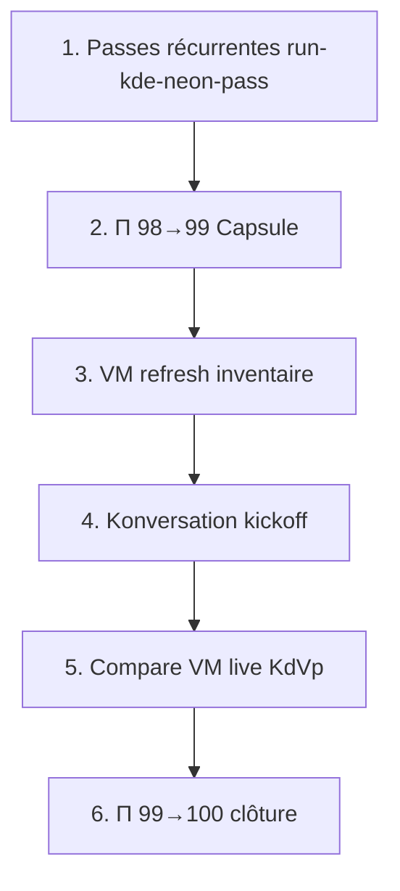

# Passes KDE Neon — recette pivot seul

> **Scope** : `linux-kde-neon` uniquement · pas de propagation dérivés pendant les passes.

## Principe

1. **Ne pas écraser** les zones marquées ✅ dans [`linux-kde-neon-vp-residual.md`](linux-kde-neon-vp-residual.md) ni les inventaires CredΣ / baselines captures validés.
2. **Vérifier d'abord** (gates + smokes) avant tout patch.
3. **Patcher incrémental** seulement sur le backlog ouvert — pas de refactor des modules partagés (`discover-kde.js`, `dolphin-kde-chrome.js`) si les smokes passent.

## Ordre logique (pivot Neon)



| # | Phase | Prérequis | Bloquant VM |
|---|-------|-----------|-------------|
| 1 | Passes `run-kde-neon-pass` | HTTP 5500 | non |
| 2 | Π 98→**99** (`refresh-kde-neon-parity-v8`) | CredΣ + ctx Dolphin | non |
| 3 | `vm-kde-neon-inventory.sh` | LAN lab | **oui** |
| 4 | Konversation kickoff | inventaire VM à jour | **oui** |
| 5 | `capture-clone-surfaces --compare` VM | captures VM | **oui** |
| 6 | Π **100** | étapes 3–5 | **oui** |

> **Règle** : ne pas sauter 3→4 pour atteindre Π 100 — Konversation et raccourcis kb résiduels sont ground truth VM.

## Recette (ordre)

| Étape | Gate | Commande |
|-------|------|----------|
| 1 | H₂ | `node usr/lib/capsuleos/tools/validate-all.mjs` |
| 2 | Smokes statiques | shell · kickoff · dolphin · discover · firefox · terminal · calendar · v4-p2 · v4-p4 |
| 3 | CredΣ | `CAPSULE_HTTP_BASE=… smoke-kde-fidelity-all.mjs --id linux-kde-neon` |
| 4 | KdVp | `capture-clone-surfaces.mjs --id linux-kde-neon --compare` |
| 5 | Σ | `run-kde-neon-pass.mjs` (orchestrateur) |

```bash
python3 -m http.server 5500 --bind 127.0.0.1
CAPSULE_HTTP_BASE=http://127.0.0.1:5500 node usr/lib/capsuleos/tools/lab/run-kde-neon-pass.mjs --write
```

## Zones gelées (ne pas réécrire sans échec smoke)

- Dolphin P0 : split, périphériques, chrome partagé `dolphin-kde-chrome.js`
- Discover Kirigami + fiche VLC
- Firefox Proton clair
- Kickoff B2/B3 (Spectacle, Info-centre, Moniteur)
- KDEConnect stub
- Calendrier tray (v7)
- Contrat Cred* 33 scénarios + inventaire `linux-kde-neon-app-fidelity-scenarios.json`
- Baseline `root/docs/inventaires/captures/linux-kde-neon/baseline/`

## Backlog passes suivantes (patch autorisé)

| Priorité | Sujet | Référence |
|----------|-------|-----------|
| ~~P1~~ | ~~Menu contextuel Dolphin~~ | ✅ |
| ~~P2~~ | ~~Π 98→99~~ | ✅ `refresh-kde-neon-parity-v8.mjs` |
| ~~P3~~ | ~~VM refresh inventaire~~ | ✅ 2026-06-09 `linux-kde-neon-vm.json` |
| ~~P4~~ | ~~Konversation~~ | **hors scope** — desktop absent sur VM |
| P5 | Compare VM live KdVp | `vm-kde-neon-capture-host.sh` + compare |
| P6 | Π 99→100 | après P5 · espace disque captures |

## Références

- Ground truth : [`root/docs/ground-truth-kde.md`](../ground-truth-kde.md)
- Chaîne Kd* : `etc/capsuleos/contracts/kde-ground-truth-chain.json`
