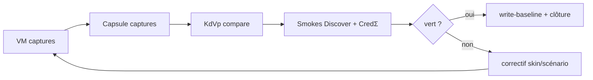

# Roadmap cycle scénarios/captures — `linux-kde-neon`

> **Campagne** : `scenarios-capture-kde-neon` · **Statut** : **CLOSED** (2026-06-11) · **Orchestrateur** : `run-kde-neon-scenarios-capture-cycle.mjs`

Cycle complet VM + Capsule validé : `passOk: true`, `pi_global: 100`, compare KdVp sans drift (carrousel Discover masqué sur `07-discover-detail-vlc`).

## Boucle (jusqu'à Π = 100)



| Étape | Outil | Gate |
|-------|-------|------|
| 1 VM | `vm-kde-neon-capture-host.sh --discover-vm-100` | `smoke-discover-vm-parity` |
| 2 Capsule | `capture-capsule-kde-neon.mjs` | paires `screen_KDE-Neon/` |
| 3 Compare | `capture-clone-surfaces.mjs --compare` | aucun drift |
| 4 Scénarios | `smoke-kde-fidelity-all.mjs` | CredΣ + refs VM/Capsule |
| 5 Qualité | `validate-all.mjs` | H₂ |

## Hygiène disque

Les runs horodatés `root/docs/inventaires/captures/linux-kde-neon/2026*` sont **éphémères** — seule `baseline/` est canonique. Purger après un cycle réussi pour éviter ENOSPC.

## Recette

```bash
python3 -m http.server 5500 --bind 127.0.0.1
KDE_NEON_SSH=<lab-inventory:linux-kde-neon-roadmap-scenarios> \
  CAPSULE_HTTP_BASE=http://127.0.0.1:5500 \
  node usr/lib/capsuleos/tools/lab/run-kde-neon-scenarios-capture-cycle.mjs --write-baseline --write
```

## Références

- [`linux-kde-neon-roadmap-discover-vm.md`](linux-kde-neon-roadmap-discover-vm.md)
- [`linux-kde-neon-roadmap-discover-store.md`](linux-kde-neon-roadmap-discover-store.md)
- `linux-kde-neon-app-fidelity-scenarios.json` — scénarios Cred* avec paires capture
