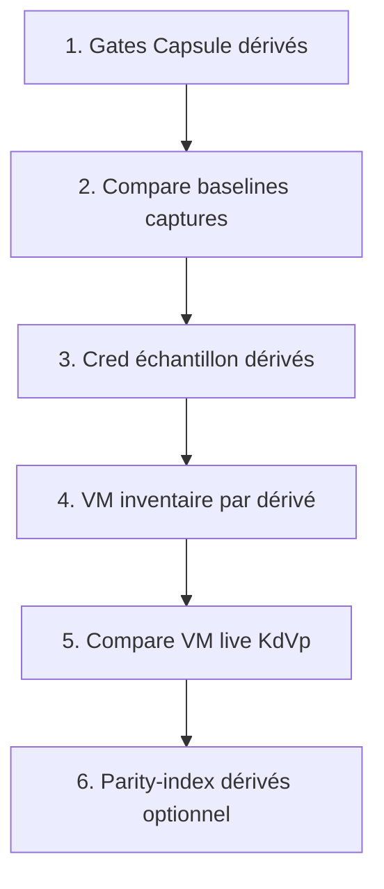

# Roadmap v10 — propagation dérivés post-pivot

> **STATUT : GELÉ** (juin 2026) — priorité **ground KDE-Neon** uniquement.  
> Ne pas exécuter tant que [`linux-kde-neon-roadmap-ground.md`](linux-kde-neon-roadmap-ground.md) n'est pas clôturé.

> **Prérequis** : pivot Neon clôturé · Π=100 · campagne v9 `closed`  
> **Scope** (quand dégelé) : `linux-opensuse`, `linux-mx-kde`, `linux-debian-kde`

## Ordre logique



| # | Phase | Outil | Bloquant VM |
|---|-------|-------|-------------|
| 1 | P4 + V6 + Cred sample | `smoke-kde-v10-derived-pass.mjs` | non |
| 2 | Compare captures | `capture-clone-surfaces.mjs --id <derived> --compare` | non |
| 3 | VM inventaire dérivés | scripts lab par distrib (à brancher) | **oui** |
| 4 | Captures VM compare | `capture-clone-surfaces` + assets VM | **oui** |
| 5 | Π dérivés / kickoff gaps | inventaire VM + `mainMenu-data.js` | **oui** |

> **Lab actuel** : seule `KDE-Neon` (`etc/capsuleos/lab-inventory.json`) — étapes 3–5 en attente VM openSUSE / MX / Debian-KDE.

## Recette P1 (Capsule, sans VM)

```bash
python3 -m http.server 5500 --bind 127.0.0.1
CAPSULE_HTTP_BASE=http://127.0.0.1:5500 node usr/lib/capsuleos/tools/lab/smoke-kde-v10-derived-pass.mjs
```

## Zones héritées du pivot (ne pas réécrire)

- `dolphin-kde-chrome.js`, `discover-kde.js`, `tray-popover-kde.js`
- Kickoff vendor : `mainMenu-data.js` par skin (gap vs Neon 30 apps)
- Baselines `captures/<derived>/baseline/`

## Références

- Pivot : [linux-kde-neon-roadmap-pass.md](linux-kde-neon-roadmap-pass.md)
- Écarts P4 : [linux-kde-p4-propagation-ecarts.md](linux-kde-p4-propagation-ecarts.md)
- v7 dérivés : [linux-kde-neon-roadmap-v7.md](linux-kde-neon-roadmap-v7.md)
