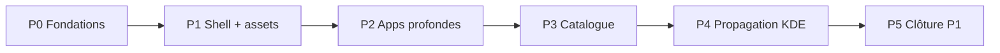

# Roadmap complète — linux-kde-neon (KDE neon User Edition)

> **Document canon** pour la suite post-campagne v2 (H₆ clôturé 2026-06-08).  
> Référence opérationnelle Plasma : [branche-plasma-kde.md](../branche-plasma-kde.md) · modèle campagne : Mint v2 ([linux-mint-replication-cost-estimate.md](linux-mint-replication-cost-estimate.md))

| Métadonnée | Valeur |
|------------|--------|
| **registryId** | `linux-kde-neon` |
| **Tier registre** | **P1** (clôturé v3 P5) |
| **Maturité estimée** | **~91 %** (juin 2026, post-v3) · cible v4 **≥ 95 %** |
| **VM lab** | `goupil@192.168.123.52` · virsh `KDE-Neon` |
| **Skin** | `home/Debian/KDE-Neon/` |
| **Viewport lab** | 1211×756 (Capsule) · 1280×800 (VM virsh) |

**Documents liés**

| Rôle | Fichier |
|------|---------|
| Parité globale | [inventaire-parite-neon.md](../inventaire-parite-neon.md) |
| État machine | [linux-kde-neon-replication-state.json](linux-kde-neon-replication-state.json) |
| Checklist clone | [linux-kde-neon-clone-status.md](linux-kde-neon-clone-status.md) |
| Dolphin (matrice) | [linux-kde-neon-dolphin-diff.md](linux-kde-neon-dolphin-diff.md) |
| Brief agent | [linux-kde-neon.md](../briefs/linux-kde-neon.md) |
| Interactions | `interactions/linux-kde-neon/*.json` |
| Baseline CI | `captures/linux-kde-neon/baseline/` |

---

## 1. Synthèse exécutive

### 1.1 Acquis (campagne v2 — clôturée)

| Domaine | Livrable | Gate |
|---------|----------|------|
| Socle | Merge upstream, `validate-all` vert, tokens `--kde-neon-*` | H₂ ✅ |
| Dolphin interactionnel | Recherche, filtre, hamburger + captures VM ↔ Capsule | Vc partiel ✅ |
| Firefox | `firefox.skin.css`, `smoke-kde-neon-firefox.mjs` | smoke ✅ |
| CI visuel | `capture-clone-surfaces --compare` stable (horloge figée) | H₆ v2 ✅ |
| Doc / état | replication-state, interactions JSON (3 slots), brief | M ✅ |

### 1.2 Objectif campagne v3

Atteindre le statut **référence Plasma** (équivalent Mint P0 sur Cinnamon) :

1. **Parité visuelle classée** (Vp) sur shell + 5 apps épinglées sans écart P0 documenté.
2. **Interactions JSON** pour chaque slot autonome du panel.
3. **Convention assets** uniforme (`./assets/` + `resolveCapsuleResourceUrl` en JS ; CSS via chemins relatifs documentés).
4. **Tier P1** + `fidelityLevel` ≥ 3 dans le registre.
5. Propagation documentée vers `linux-opensuse`, `linux-mx-kde`, `linux-debian-kde`.

### 1.3 Estimation effort (ordre de grandeur)

| Scope | Durée agent/humain | Notes |
|-------|-------------------|-------|
| **MVP v3** (shell polish + Dolphin §9 + assets audit) | **20–35 h** | VM SSH requise |
| **Complet v3** (+ Discover P2 + Konsole + catalogue 30 apps kickoff) | **50–90 h** | modèle Mint P4 allégé |
| **Référence P1** (+ smokes généralisés + propagation 3 skins) | **+25–40 h** | hors Neon strict |

---

## 2. Carte de maturité par surface

Légende : ✅ clôturé v1/v2 · 🔄 réaudit · 🟡 partiel · ⏳ backlog · ❌ absent

| Surface | Slot / fichier | v1 (06-06) | Post-v2 (06-08) | Cible v3 | Pallier |
|---------|----------------|------------|-----------------|----------|---------|
| **Panel + pins** | `index.html`, `footer.css` | ✅ | 🔄 baseline | Vp VM compare 6/6 | P1 |
| **Kickoff** | `mainMenu.html`, `mainMenu-data.js` | ✅ | ✅ tokens | Vp dimensions + apps manquantes | P1 |
| **Tray + popovers** | `tray-popover-kde.js` | ✅ statique | ⏳ dynamique | Klipper, réseau KCM, MAJ badge live | P2 |
| **Calendrier** | `calendar-popover-kde.js` | ✅ | 🔄 | smoke dédié + capture compare | P2 |
| **Bureau / wallpaper** | `debian-desktop.css` | ✅ | ✅ | — | — |
| **Dolphin structurel** | `dolphin-neon.js` §1–6 | ✅ | 🔄 | Matrice 1–6 revalidée HTTP | P0 |
| **Dolphin recherche** | §7 | — | 🟡 captures | Clôture visuelle + VM filtre | P1 |
| **Dolphin hamburger** | §8 | — | 🟡 captures | Flyouts actions + audit icônes | P1 |
| **Dolphin contextuel** | §9 | partiel | ⏳ | Flyouts dupliquer / étiquettes / activités | P2 |
| **Dolphin sidebar** | Périphériques | ⏸ | ⏸ | Inventaire VM + section UI | P2 |
| **Dolphin split** | volet droit | ⚠️ | ⚠️ | Sélection indépendante | P2 |
| **Discover** | `discover-neon.js` | ✅ 5 onglets | 🔄 | Filtres, fiches app, catégories P2 | P2 |
| **Firefox** | `firefox.skin.css` | ⏳ | 🟡 smoke OK | Inventaire VM toolbar + capture compare | P1 |
| **Konsole** | `terminal.skin.css` | partiel | partiel | Polish chrome Breeze + smoke | P2 |
| **Assets convention** | CSS/JS skin | dette | partiel Dolphin | Audit complet Discover/tray/index | P1 |
| **Catalogue kickoff** | 30 apps JSON | ✅ | ✅ | Apps VM absentes du menu simulé | P3 |
| **Indice Π** | `parity-index.json` | — | — | Génération + suivi drift | P1 |

---

## 3. Palliers campagne v3 (P0 → P5)



### P0 — Fondations & métriques (4–8 h) ✅ (2026-06-08)

**Objectif** : repartir d’un état mesurable après v2.

- [x] Mettre à jour `linux-kde-neon-replication-state.json` → campagne `v3-full-parity`
- [x] Générer `linux-kde-neon-parity-index.json` (Π_global=74, `seed-kde-neon-parity-index.mjs`)
- [x] Compléter interactions JSON : `mainMenu.json`, `terminal.json`, `panel.json`
- [x] Rafraîchir inventaire VM : `vm-kde-neon-inventory.sh` → `linux-kde-neon-vm.json` (2026-06-08)
- [x] Synchroniser clôtures doc (replication-state, clone-status)

**Note** : versions `plasmashell`/`dolphin`/etc. vides en collecte SSH batch — compléter en session Plasma (P1).

**Gates**

```bash
node usr/lib/capsuleos/tools/validate-all.mjs
node usr/lib/capsuleos/tools/print-validation-plan.mjs home/Debian/KDE-Neon/
```

**Critère sortie P0** : inventaire VM < 7 jours · Π initialisé · H₂ vert.

---

### P1 — Shell polish + convention assets (8–16 h) 🔄

**Objectif** : panel, kickoff et assets sans dette naming.

| Tâche | Détail | Statut |
|-------|--------|--------|
| Panel VM compare | 6 scènes baseline vs captures VM | ⏳ |
| Kickoff | Regénérer `mainMenu-data.js` · valider 677×513 | ⏳ |
| Assets audit JS | `discover-neon.js`, `tray-popover-kde.js` → `./assets/` | ✅ |
| CSS audit | Documenter exceptions CSS `usr/share` | ⏳ |
| Firefox VM | Inventaire toolbar · capture `04-firefox` paire | ⏳ |
| Smoke shell | `smoke-kde-neon-shell-polish.mjs` | ✅ exit 0 |

**Gates**

```bash
node usr/lib/capsuleos/tools/lab/capture-clone-surfaces.mjs --id linux-kde-neon --compare
node usr/lib/capsuleos/tools/lab/smoke-kde-neon-firefox.mjs
node usr/lib/capsuleos/tools/lab/smoke-kde-neon-shell-polish.mjs
```

**Critère sortie P1** : panel checklist 6/6 · kickoff Vp · Firefox inventaire VM · assets JS conformes.

---

### P2 — Apps profondes (12–25 h)

**Objectif** : Dolphin interactionnel complet + Discover P2 + tray dynamique.

#### Dolphin ([linux-kde-neon-dolphin-diff.md](linux-kde-neon-dolphin-diff.md))

| Point | Tâche | Priorité |
|-------|-------|----------|
| §7 | Clôture visuelle recherche + capture VM filtre | P1 |
| §8 | Audit icônes hamburger (`naturalWidth > 0` Playwright) | P1 |
| §9 | Menu contextuel flyouts (dupliquer, étiquettes, activités) | P0 interaction |
| §3 | Section Périphériques sidebar | P2 |
| §6 | Sélection volet droit split indépendante | P2 |

```bash
# Captures
bash root/tools/lab/vm-kde-neon-capture-host.sh --dolphin-search --dolphin-hamburger
node root/tools/lab/capture-capsule-kde-neon.mjs
```

#### Discover

- [x] Filtres catalogue (sidebar catégories actifs)
- [x] Fiches application (détail + bouton installer simulé)
- [x] Captures VM ↔ Capsule onglets Installed / Updates / About / Config (`plasma-discover --mode`)

#### Tray

- [x] Klipper : historique simulé (3 entrées)
- [x] Réseau : états déconnecté / Wi-Fi (toggle)
- [x] Badge MAJ Discover dynamique

#### Konsole

- [x] Polish `terminal.skin.css` (titlebar, toolbar onglets)
- [x] Smoke `smoke-kde-neon-terminal.mjs`

**Critère sortie P2** : Dolphin §7–9 clôturés ou ⚠️ P1 documentés · Discover filtres · 2 tray popovers dynamiques.

---

### P3 — Catalogue kickoff (15–30 h)

**Objectif** : couvrir les **30 apps** inventoriées + favoris avec slots autonomes ou stub reconnaissable.

| Batch | Apps (exemples VM) | Stratégie |
|-------|-------------------|-----------|
| B1 — KDE core | Okular, Gwenview, Kate, Konversation | gabarit noyau + skin CSS |
| B2 — Utilitaires | KCalc, KFind, Spectacle | slot partagé ou mini-app |
| B3 — Système | Info-centre, Paramètres (lien themes) | redirect slot existant |

**Règle empirique** : ~1–1,5 h / app si noyau prêt · ~2,5 h si gabarit neuf.

```bash
node root/tools/lab/generate-kde-neon-kickoff-data.mjs
# Par app : smoke minimal HTTP
```

**Critère sortie P3** : 30/30 apps kickoff ouvrent un slot · icônes `./assets/` · pas de 404 console.

---

### P4 — Propagation toolkit KDE (8–15 h) ✅

**Objectif** : Neon reste source ; dérivés alignés.

| Cible | Propagation | Statut |
|-------|-------------|--------|
| `linux-opensuse` | tokens panel, tray JS, kickoff chrome | ✅ Geeko conservé |
| `linux-mx-kde` | coque Plasma Neon, panel dock | ✅ logo MX conservé |
| `linux-debian-kde` | tokens Breeze, footer, panel dock | ✅ branding Debian |

Doc écarts : [linux-kde-p4-propagation-ecarts.md](linux-kde-p4-propagation-ecarts.md)

**Critère sortie P4** : 3 skins KDE `validate-all` vert · doc écarts par dérivé. ✅

---

### P5 — Clôture référence P1 (4–10 h) ✅

**Objectif** : équivalent Mint v2 clôture.

- [x] `reactivate-os.mjs` ou mise à jour registre : `tier: P1`, `fidelityLevel: 3`
- [x] `linux-kde-neon-replication-state.json` : **H₆ v3 true**, Vp classé
- [x] `capture-clone-surfaces --compare` + smokes (shell, firefox, dolphin, terminal, kickoff)
- [x] Brief + parité + roadmap marqués **clôturés v3**
- [x] Entrée [roadmap.md](../roadmap.md) : maturité **≥ 90 %**

**Clôturé** : 2026-06-08 · baseline v3 régénérée · suite → [linux-kde-neon-roadmap-v4.md](linux-kde-neon-roadmap-v4.md)

```bash
node usr/lib/capsuleos/tools/linux/sync-linux-skin-closure.mjs
node usr/lib/capsuleos/tools/linux/sync-all-views.mjs
node usr/lib/capsuleos/tools/validate-all.mjs
node usr/lib/capsuleos/tools/lab/capture-clone-surfaces.mjs --id linux-kde-neon --compare
node usr/lib/capsuleos/tools/print-agent-brief.mjs linux-kde-neon
```

---

## 4. Outils & commandes (référence unique)

### Gates transverses (chaque pallier)

```bash
node usr/lib/capsuleos/tools/linux/sync-linux-skin-closure.mjs
node usr/lib/capsuleos/tools/validate-all.mjs
```

### Captures

```bash
python3 -m http.server 5500 --bind 127.0.0.1

# Baseline CI (6 scènes, horloge figée)
node usr/lib/capsuleos/tools/lab/capture-clone-surfaces.mjs --id linux-kde-neon --compare

# Parité lab complète (18 scènes Capsule)
node root/tools/lab/capture-capsule-kde-neon.mjs

# VM
KDE_NEON_SSH=goupil@192.168.123.52 bash root/tools/lab/vm-kde-neon-capture-host.sh
KDE_NEON_SSH=goupil@192.168.123.52 bash root/tools/lab/vm-kde-neon-capture-host.sh --dolphin-search --dolphin-hamburger
```

### Smokes (existants + à créer)

| Script | Statut |
|--------|--------|
| `smoke-kde-neon-firefox.mjs` | ✅ |
| `smoke-kde-neon-shell-polish.mjs` | ⏳ à créer |
| `smoke-kde-neon-dolphin-interaction.mjs` | ⏳ à créer (§7–9) |
| `smoke-kde-neon-terminal.mjs` | ⏳ à créer |

### Inventaire & data

```bash
KDE_NEON_SSH=goupil@192.168.123.52 bash root/tools/lab/vm-kde-neon-inventory.sh
node root/tools/lab/generate-kde-neon-kickoff-data.mjs
bash root/tools/lab/pull-vm-assets.sh   # si ¬A
```

---

## 5. Prédicats logique formelle (cible v3)

Référence : [logique-formelle.md](../logique-formelle.md)

| Prédicat | v2 (06-08) | Cible v3 |
|----------|------------|----------|
| **H₂** | ✅ | ✅ maintenu |
| **I** | partial | ✅ inventaire complet + dates |
| **A** | ✅ | ✅ + SHA256 alignés |
| **S** | partial | ✅ assets kickoff/discover/dolphin |
| **V** | ✅ baseline | ✅ + paires VM 18 scènes |
| **G** | ✅ | ✅ smokes shell + apps |
| **Vc** | ✅ partiel | ✅ Dolphin §7–8 clôturés |
| **Vp** | partial | ✅ écarts classés P0/P1/P2 |
| **H₆** | ✅ v2 | ✅ v3 (P1 tier) |

---

## 6. Risques & mitigations

| Risque | Impact | Mitigation |
|--------|--------|------------|
| VM lab indisponible | bloc P1/P2 | snapshot Proxmox · doc IP dans `lab-inventory.json` |
| Compare baseline flaky | CI rouge | horloge `CAPTURE_CLOCK_ISO` · waits scènes (déjà en place) |
| Viewport VM ≠ Capsule | faux écarts pixel | diff structurel documenté · pas pixel-diff strict |
| Dette `--opensuse-*` résiduelle | confusion dérivés | grep gate dans validation plan |
| Fork noyau tenté | dette | Dolphin/Discover restent skin + override template |
| Scope catalogue 30 apps | dérive temps | batches B1→B3 · stub OK si icône + titre VM |

---

## 7. Historique campagnes

| Campagne | Période | Résultat |
|----------|---------|----------|
| **v1** | 2026-06-06 → 06-07 | Clôtures Discover, Kickoff, panel, Dolphin P0 |
| **v2** | 2026-06-08 | Réaudit post-merge · tokens · Dolphin §7–8 captures · Firefox smoke · H₆ v2 |
| **v3** | 2026-06-08 | P0→P5 clôturés · tier P1 · H₆ v3 · propagation 3 skins KDE |
| **v4** | clôturé | [linux-kde-neon-roadmap-v4.md](linux-kde-neon-roadmap-v4.md) · V4-P0–P4 ✅ |
| **ground** | clôturé | [linux-kde-neon-roadmap-ground.md](linux-kde-neon-roadmap-ground.md) · G1–G8 ✅ |
| **G-coherence** | clôturé | [linux-kde-neon-roadmap-g-coherence.md](linux-kde-neon-roadmap-g-coherence.md) · cohérence système Mint-level |

---

## 8. Prochaine action immédiate (agent)

**Campagne v3 clôturée P5** (2026-06-08).

**Campagne active** — propagation dérivés post-G-coherence · voir [linux-kde-neon-roadmap-g-coherence.md](linux-kde-neon-roadmap-g-coherence.md).
