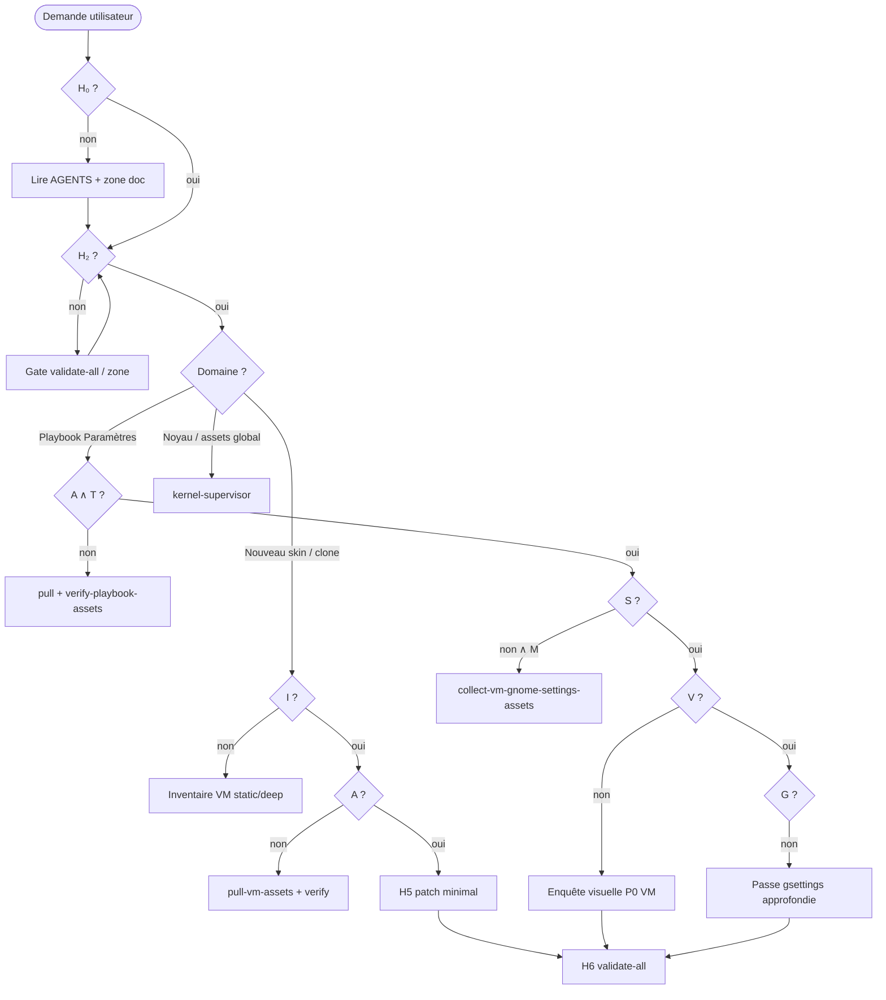

# Logique formelle — paradigme agent CapsuleOS

> **Statut** : document **fondateur** du paradigme agentique. Toute procédure spécialisée (clone VM, playbook Paramètres, audit profond) en est une **spécialisation** ; les skills et règles Cursor en sont des **projections opérationnelles**.

**Objectif** : permettre aux agents de **décider seuls** de la prochaine action utile (sans solliciter l’utilisateur) lorsque les prédicats et règles déterminent une suite unique ; de **charger les bons skills** ; et de **ne jamais implémenter** sans gate préalable satisfait.

**Documents liés** : [manifeste-noyau.md](manifeste-noyau.md) · [parcours-agent.md](parcours-agent.md) · [convention-reproduction-os.md](convention-reproduction-os.md) · [equipe-agentique.md](equipe-agentique.md) · [AGENTS.md](../AGENTS.md)

---

## 1. Philosophie

CapsuleOS traite le dépôt comme un **système formel** :

| Couche | Rôle |
|--------|------|
| **Vérité machine** | `os-registry.json`, `kernels.json`, matrices lab, inventaires VM JSON |
| **Gates** | Scripts `validate-*`, smokes lab — prédicats booléens vérifiables |
| **Ground truth** | VM lab quand disponible ; sinon pas d’invention de baseline |
| **Projection** | Skins `home/`, façades générées, embeds — jamais source de vérité seule |

**Principe d’autonomie** : si plusieurs actions sont admissibles, choisir celle de **priorité la plus haute** (§4) ; si une seule action débloque la chaîne, **l’exécuter** sans demander confirmation (sauf commit/push explicitement réservés aux instructions utilisateur).

---

## 2. Prédicats universels

Notation : prédicat en **gras**, négation **¬**, conjonction **∧**, disjonction **∨**.

### 2.1 Hydratation & release (H)

| Symbole | Signification | Vérification |
|---------|---------------|--------------|
| **H₀** | Contrat et arborescence compris | Lecture `AGENTS.md`, `writing.md`, zone touchée |
| **H₂** | Baseline dépôt saine | `node usr/lib/capsuleos/tools/validate-all.mjs` → exit 0 (ou gate zone ciblée) |
| **H₆** | Clôture release | `validate-all.mjs` après patch + embeds regen si besoin |

### 2.2 Assets & traçabilité (A, S, T)

| Symbole | Signification | Vérification |
|---------|---------------|--------------|
| **A** | Assets référencés **présents** dans le dépôt | `validate-asset-zones.mjs` ; playbook : `verify-playbook-assets.mjs --strict` |
| **S** | Sources VM inventoriées et alignées | Inventaire `*-assets.json` ; `compare-vm-settings-assets-capsule.mjs` (domaine settings) ; `pull-vm-assets.sh` |
| **T** | Traçabilité copie VM | `vendors/<vendor>/SOURCE-VM.txt` non vide |

### 2.3 VM & inventaire (M, I)

| Symbole | Signification | Vérification |
|---------|---------------|--------------|
| **M** | VM lab accessible | SSH `lab-ssh.mjs` ; session graphique si interaction |
| **I** | Inventaire VM documenté | `inventaires/<id>-vm.json` ou phase audit / playbook JSON renseigné |
| **I⁺** | Audit interactif suffisant | `*-deep-audit.json` phases P0 ou procédure domaine complète |

### 2.4 Parité & lab domaine (L, D, V, G)

| Symbole | Signification | Vérification |
|---------|---------------|--------------|
| **L** | Lab domaine vert | ex. `run-gnome-settings-lab.mjs` ; `compare-os-parity.mjs` |
| **D** | Dérive nulle sur le périmètre | `driftCount: 0` dans rapports compare |
| **V** | Enquête visuelle documentée | ex. `*-visual-investigation.json` ; `documented > 0` pour P0 |
| **G** | Passe approfondie actionnable | Champs `gsettingsDeferred` / matrices secondaires exploitables |

### 2.5 Classification écarts (P)

| Symbole | Signification |
|---------|---------------|
| **P0** | Bloquant fidélité pédagogique — corriger avant merge skin |
| **P1** | Écart documenté, non bloquant immédiat |
| **P2** | Extension souhaitée |
| **CapsuleOnly** | Présent uniquement dans CapsuleOS — hors parité VM |

### 2.6 Catalogue (R)

| Symbole | Signification |
|---------|---------------|
| **R** | Entrée `os-registry` cohérente (façade, profil, tier) |
| **¬playbook_VM(d)** | Pas de playbook / baseline VM pour la distro *d* |

---

## 3. Règles d’inférence (ordre de priorité)

Les règles sont évaluées **du haut vers le bas** ; la première dont la conclusion est une **action** et dont les antécédents sont **vrais** prime.

```
R-H1    ¬H₂  →  corriger gate échouée (assets → kernel-supervisor ; quality → code-quality)
R-H2    H₂ ∧ ¬H₀  →  lire contrat / parcours avant H5

R-INV1  ¬I  →  inventaire VM / static AVANT patch skin (bloquant)
R-INV2  I ∧ ¬A  →  pull-vm-assets.sh puis verify-playbook-assets / validate-asset-zones

R-A1    ¬A  →  BLOQUANT — copier depuis VM (jamais inventer asset)
R-A2    A ∧ ¬T  →  relancer pull-vm-assets.sh (écrit SOURCE-VM.txt)
R-S1    M ∧ A  →  collecter sources VM (gate S)
R-S2    S ∧ dérive SHA256  →  pull puis R-A1

R-L1    ¬A ∨ ¬L_domaine  →  interdit clôture playbook / embed / CI domaine
R-D1    D=0 sur périmètre  →  peut avancer ; D>0  →  corriger dérive avant extension

R-PRI1  L ∧ S ∧ ¬V  →  priorité enquête visuelle / capture VM (lot P0)
R-PRI2  V ∧ ¬G  →  passe approfondie gsettings / schémas secondaires
R-PRI3  H₂ ∧ I ∧ A ∧ P0 ouvert  →  corriger P0 avant P1
R-PRI4  ¬playbook_VM(d)  →  REPORTÉ — pas de baseline arbitraire pour d

R-IMP1  ¬H₂  →  interdit H5 (implémentation) sauf tâche « fix CI » explicite
R-IMP2  P0 documenté absent  →  ne pas reclasser en P1 pour masquer

R-AUTO  ∃! action admissible  →  agent exécute sans demander à l’utilisateur
```

**Règle absolue** : la **VM prime** sur la doc officielle en cas de contradiction ; noter l’écart dans l’inventaire (`delta`, version GNOME).

---

## 4. Procédure de décision agent



### 4.1 Matrice intention → prédicats → skills

| Intention dominante | Prédicats à satisfaire d’abord | Skills |
|---------------------|--------------------------------|--------|
| Fix CI / gate | **H₂** ciblé | `code-quality`, `kernel-supervisor`, `link-routing` |
| Migration assets | **A**, **T**, **H₂** | `kernel-supervisor`, `asset-pipeline` |
| Clone VM → skin | **H₂**, **M**, **I**, **A**, **S** | `onboarding`, `os-clone-from-vm`, `os-linux`, `role-integrator` |
| Parité Paramètres GNOME | **A**, **T**, **L**, **S**, puis **V**, **G** | `capsuleos-distro-*`, `role-integrator`, `role-developer` |
| UI / tokens CSS | **H₂**, contrats UI | `role-web-designer`, `css-variables-contract` |
| Release multi-OS | **H₆**, **R** | `coordinator`, `role-manager` |

Charger **un skill OS + un skill rôle** minimum ; ajouter `coordinator` si multi-familles ; `kernel-supervisor` dès que **¬A** ou migration noyau.

---

## 5. Spécialisations par domaine

Les procédures détaillent prédicats et commandes **locales**. Elles **doivent** référencer ce document et n’y ajouter que des symboles explicites.

| Domaine | Document | Prédicats additionnels |
|---------|----------|----------------------|
| Reproduction OS | [convention-reproduction-os.md](convention-reproduction-os.md) | **I⁺** audit profond pour P0 interactif |
| Playbook Paramètres GNOME | [procedure-creation-playbook-gnome-settings.md](procedure-creation-playbook-gnome-settings.md) § annexe | **V**, **G**, matrice visuelle |
| Assets vendor | [convention-assets-depuis-vm.md](convention-assets-depuis-vm.md) | **A**, **S**, **T** |
| Lab Rocky GNOME | [procedure-lab-linux-rocky-gnome.md](procedure-lab-linux-rocky-gnome.md) | **M**, phases 1–5 |
| Audit VM profond | [procedure-audit-vm-profonde.md](procedure-audit-vm-profonde.md) | **I⁺**, phases JSON |
| Parcours hydratation | [parcours-agent.md](parcours-agent.md) | **H₀–H₆** |

**Extension** : ajouter une ligne à §2 ou §5, une règle à §3, une commande gate dans la procédure — **pas** de logique parallèle contradictoire.

---

## 6. Gates exécutables (référence rapide)

```bash
# Socle (toujours)
node usr/lib/capsuleos/tools/validate-all.mjs

# Assets globaux
node usr/lib/capsuleos/tools/validate-asset-zones.mjs

# Playbook Paramètres — gate A + S
node usr/lib/capsuleos/tools/lab/verify-playbook-assets.mjs --registry linux-rocky --strict
node usr/lib/capsuleos/tools/lab/collect-vm-gnome-settings-assets.mjs --id linux-rocky

# Lab Paramètres complet
node usr/lib/capsuleos/tools/lab/run-gnome-settings-lab.mjs

# Brief registre
node usr/lib/capsuleos/tools/print-agent-brief.mjs <registryId>
```

---

## 7. Anti-patterns (¬ admissible)

1. **H5 sans H₂** (sauf fix CI dédié).
2. **Patch skin sans I** (inventaire avant code).
3. **Asset référencé sans fichier** ou sans source VM (**¬A** / **¬T**).
4. **Baseline / playbook** pour une distro sans **M** et sans collecte.
5. **Masquer P0** en P1 ou P2.
6. **Demander à l’utilisateur** quand **R-AUTO** s’applique (une seule action admissible).
7. Fork noyau (`contentLoader`, `CapsuleWindow`) par distro.
8. Images hors `usr/share/capsuleos/assets/` et `home/public/Images/`.

---

## 8. Inscription dans le projet

| Support | Fichier | Rôle |
|---------|---------|------|
| **Référence canonique** | Ce document | Définitions + règles + décision |
| **Manifeste noyau** | [manifeste-noyau.md](manifeste-noyau.md) | Vision + lien § logique formelle |
| **Manifeste kernels** | [manifeste-kernels.md](manifeste-kernels.md) | Isolation + gel catalogue |
| **Guide agents** | [AGENTS.md](../AGENTS.md) | Routage skills + renvoi ici |
| **Parcours** | [parcours-agent.md](parcours-agent.md) | H₀–H₆ comme gates |
| **Équipe** | [equipe-agentique.md](equipe-agentique.md) | Staffing = conséquence des prédicats |
| **Skills** | `root/skills/onboarding`, `_index`, `os-clone-from-vm`, `kernel-supervisor` | Séquences opérationnelles |
| **Règle Cursor** | `.cursor/rules/logique-formelle-capsuleos.mdc` | `alwaysApply: true` |

---

*Dernière extension : gates assets playbook (A, S, T) — intégrés au socle §2.2 et R-A1–R-S2.*
