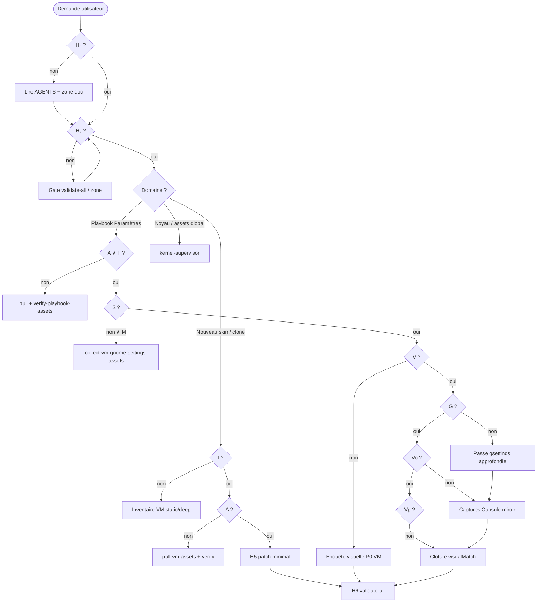

# Logique formelle — paradigme agent CapsuleOS

> **Statut** : document **fondateur** du paradigme agentique. Toute procédure spécialisée (clone VM, playbook Paramètres, audit profond) en est une **spécialisation** ; les skills et règles Cursor en sont des **projections opérationnelles**.

**Objectif** : permettre aux agents de **décider seuls** de la prochaine action utile (sans solliciter l’utilisateur) lorsque les prédicats et règles déterminent une suite unique ; de **charger les bons skills** ; et de **ne jamais implémenter** sans gate préalable satisfait.

**Documents liés** : [manifeste-noyau.md](manifeste-noyau.md) · [parcours-agent.md](parcours-agent.md) · [convention-reproduction-os.md](convention-reproduction-os.md) · [equipe-agentique.md](equipe-agentique.md) · [AGENTS.md](../AGENTS.md)

---

## 1. Philosophie

CapsuleOS traite le dépôt comme un **système formel** :

| Couche | Rôle |
|--------|------|
| **Vérité machine** | `os-registry.json`, `kernels.json`, matrices lab, inventaires VM JSON |
| **Gates** | Scripts `validate-*`, smokes lab — prédicats booléens vérifiables |
| **Ground truth** | VM lab quand disponible ; sinon pas d’invention de baseline |
| **Projection** | Skins `home/`, façades générées, embeds — jamais source de vérité seule |

**Principe d’autonomie** : si plusieurs actions sont admissibles, choisir celle de **priorité la plus haute** (§4) ; si une seule action débloque la chaîne, **l’exécuter** sans demander confirmation (sauf commit/push explicitement réservés aux instructions utilisateur).

---

## 2. Prédicats universels

Notation : prédicat en **gras**, négation **¬**, conjonction **∧**, disjonction **∨**.

### 2.1 Hydratation & release (H)

| Symbole | Signification | Vérification |
|---------|---------------|--------------|
| **H₀** | Contrat et arborescence compris | Lecture `AGENTS.md`, `writing.md`, zone touchée |
| **H₂** | Baseline dépôt saine | `node usr/lib/capsuleos/tools/validate-all.mjs` → exit 0 (ou gate zone ciblée) |
| **H₆** | Clôture release | `validate-all.mjs` après patch + embeds regen si besoin |

### 2.2 Assets & traçabilité (A, S, T)

| Symbole | Signification | Vérification |
|---------|---------------|--------------|
| **A** | Assets référencés **présents** dans le dépôt | `validate-asset-zones.mjs` ; playbook : `verify-playbook-assets.mjs --strict` |
| **S** | Sources VM inventoriées et alignées | Inventaire `*-assets.json` ; `compare-vm-settings-assets-capsule.mjs` (domaine settings) ; `pull-vm-assets.sh` |
| **T** | Traçabilité copie VM | `vendors/<vendor>/SOURCE-VM.txt` non vide |

### 2.3 VM & inventaire (M, I)

| Symbole | Signification | Vérification |
|---------|---------------|--------------|
| **M** | VM lab accessible | SSH `lab-ssh.mjs` ; session graphique si interaction |
| **I** | Inventaire VM documenté | `inventaires/<id>-vm.json` ou phase audit / playbook JSON renseigné |
| **I⁺** | Audit interactif suffisant | `*-deep-audit.json` phases P0 ou procédure domaine complète |

### 2.4 Parité & lab domaine (L, D, V, G)

| Symbole | Signification | Vérification |
|---------|---------------|--------------|
| **L** | Lab domaine vert | ex. `run-gnome-settings-lab.mjs` ; `compare-os-parity.mjs` |
| **D** | Dérive nulle sur le périmètre | `driftCount: 0` dans rapports compare |
| **V** | Enquête visuelle documentée | ex. `*-visual-investigation.json` ; `documented > 0` pour P0 |
| **G** | Passe approfondie actionnable | Champs `gsettingsDeferred` / matrices secondaires exploitables |
| **Vc** | Captures Capsule miroir (lot documenté) | `capsuleCaptures[]` P0 ; `summary.capsuleCapturesP0 > 0` |
| **Vp** | Parité visuelle classée | `capsuleParity.visualMatch` ≠ `unknown` pour P0 documentés |

### 2.5 Classification écarts (P)

| Symbole | Signification |
|---------|---------------|
| **P0** | Bloquant fidélité pédagogique — corriger avant merge skin |
| **P1** | Écart documenté, non bloquant immédiat |
| **P2** | Extension souhaitée |
| **CapsuleOnly** | Présent uniquement dans CapsuleOS — hors parité VM |

### 2.6 Playbook général (Pb)

| Symbole | Signification | Vérification |
|---------|---------------|--------------|
| **Pb** | Playbook général défini | `playbook-general.json` + `smoke-playbook-general.mjs` |
| **PbU** | Couche universelle OK | **I** ∧ **T** ∧ (**S** si toolkit gnome) |
| **PbT** | Playbook toolkit terminé | ex. **Vp** ∧ **V** ∧ **G** ∧ **Vc** (gnome-settings) |
| **Pbτ** | Bout de chaîne documenté | `*-playbook-tail.json` `status: documented` |
| **PbΣ** | Chaîne playbook complète | **PbU** ∧ **PbT** ∧ **Pbτ** → **H5** ciblé |

### 2.9 Catalogue applications (App)

| Symbole | Signification | Vérification |
|---------|---------------|--------------|
| **AppV** | Inventaire VM apps | `*-vm-apps-installed.json` |
| **AppC** | Catalogue strict généré | `*-apps-catalog.json` + `smoke-apps-catalog.mjs` |
| **AppP0** | Apps P0 onVm avec slot `ok` | `summary.p0Gaps === 0` |
| **AppL** | Lab apps vert (smokes structure + façade OS) | `run-apps-lab.mjs` · `*-apps-lab-state.json` |
| **AppVv** | Enquête visuelle VM apps P0 | `*-apps-visual-investigation.json` |
| **AppVc** | Captures Capsule par slot P0 | `capsuleCapturesP0` |
| **AppVp** | Parité visuelle apps classée | `visualMatchClassifiedP0` |
| **AppΣ** | Catalogue apps clôturé (structure) | **AppV ∧ AppC ∧ AppP0 ∧ AppL** |

Contrat : `etc/capsuleos/contracts/apps-catalog.json` · Chaîne fidélité : `apps-replication-chain.json` · Procédures : [procedure-apps-catalog.md](procedure-apps-catalog.md) · [procedure-apps-replication-formelle.md](procedure-apps-replication-formelle.md)

### 2.10 Fidélité visuelle (Tf)

| Symbole | Signification | Vérification |
|---------|---------------|--------------|
| **Tp** | Typographie VM inventoriée + tokens skin alignés | `*-visual-fidelity.json` + scan `smoke-visual-fidelity.mjs` |
| **Tv** | Contextes de vue inventoriés (résolution, échelle, viewport) | section `viewContexts` |
| **Tm** | MIME & associations documentés | section `mime` |
| **Ta** | Accessibilité fidèle si activée | hooks `data-*` + CSS a11y |
| **Tf** | Fidélité visuelle prête | **Tp ∧ Tv ∧ Tm ∧ Ta** + smoke sans violation typo |

Contrat : `etc/capsuleos/contracts/visual-fidelity.json` · Convention : [convention-fidelite-visuelle.md](convention-fidelite-visuelle.md)

### 2.12 Shell global — terminal (T)

Chaîne **investigation → conversion → réplication** — socle CLI du bureau simulé. Convention : [convention-shell-global.md](convention-shell-global.md).

| Symbole | Signification | Vérification |
|---------|---------------|--------------|
| **Ti** | Inventaire VM terminal | `inventaires/<id>-terminal-vm.json` (`commandAudit`, `packageManager`) |
| **Tc** | Noyau terminal défini | `command-core.js` ≡ contrat `layers.core` |
| **Tf** | Extensions famille déclarées | profils `linux:{debian,redhat,suse,arch}` |
| **Tv** | Singularités vendor résolues | `terminal-vendor-extensions.js` (si inventaire le requiert) |
| **Te** | Registre ↔ exécuteur | `validate-terminal-commands.mjs` |
| **Ts** | Sync FS terminal ↔ explorateur | `smoke-fs-terminal-explorer-sync.mjs` (T1–T8) |
| **Tr** | Scénarios réplication P0 | `replicationScenarios[]` dans inventaire terminal |
| **TΣ** | **Ti ∧ Tc ∧ Tf ∧ Te ∧ Ts ∧ Tr** | clôture shell slot terminal P0 |
| **To** | Rendu sortie (indentation, sauts, couleurs) | [convention-terminal-rendu-sortie.md](convention-terminal-rendu-sortie.md) · `outputSamples` |
| **Tb** | Profil `~/.bashrc` virtuel | `terminal-bashrc.js` · `bashrcSnapshot` inventaire |
| **TΣ′** | **TΣ ∧ To** | clôture terminal P0 stricte |

**Agnosticité noyau** : moteur unique `usr/lib/capsuleos/shells/linux/terminal/` ; projections par famille/vendor/skin — **R-AGN1**. **Tb** requis pour scénarios personnalisation shell.

Contrats : `terminal-commands.json`, `terminal-replication-chain.json`, `terminal-output-fidelity.json` · Opératoire : [procedure-terminal-commandes.md](procedure-terminal-commandes.md)

### 2.13 Locale et clavier (Lj, Lk)

**FR par défaut** ; portage **en-US / QWERTY** en couche additive — voir [scalabilite-noyau.md §7](scalabilite-noyau.md).

| Symbole | Signification | Vérification |
|---------|---------------|--------------|
| **Lj_fr** | Locale projet fr-FR (défaut) | docs FR, `strings-default.js`, registre sans `locale: en-US` |
| **Lj_en** | Projection en-US disponible | `strings.en.json` ou provider terminal `en-US` |
| **Lj** | **Lj_fr** tant qu'aucune variante internationale n'est déclarée active | `locale-scalability.json` |
| **Lk_azerty** | Clavier AZERTY (défaut FR) | planned — `CAPSULE_KEYBOARD_LAYOUT` |
| **Lk_qwerty** | Clavier QWERTY US (international) | planned |

**Règle** : parité VM (**R-INV1**) utilise la **locale de l'inventaire** pour reproduction (ex. sortie `dnf` FR) ; le défaut projet **Lj_fr** ne s'applique pas pour masquer un écart VM documenté.

Contrat : `etc/capsuleos/contracts/locale-scalability.json`

### 2.14 Modules pédagogiques (`/mnt`)

Métaphore **points de montage** — parcours modulaires branchés sans fork noyau. Convention : [convention-modules-mnt.md](convention-modules-mnt.md).

| Symbole | Signification | Vérification |
|---------|---------------|--------------|
| **Pm** | Module sous `mnt/<niveau>/<id>/` | arborescence + `module.json` |
| **Pm_Σ** | Manifeste et scénarios valides | `validate-pedagogical-modules.mjs` |
| **Pm_mount** | Module monté au boot skin | `CAPSULE_MNT_MODULES` |
| **PΣ** | Parcours actif | skin ∧ modules montés |

Contrat : `etc/capsuleos/contracts/pedagogical-modules.json`

### 2.11 Rafraîchissement des vues (Rv)

Condition **sine qua non** de la reproduction fidèle : distinguer **réel** (`V = projection(M)` après action) et **irréel** (`V ≠ projection(M)` ou refresh sans `ΔM`).

| Symbole | Signification | Vérification |
|---------|---------------|--------------|
| **Rv₁** | Vue cohérente **après** action utilisateur | Scénarios playbook + smokes slot (`smoke-fs-terminal-explorer-sync`, tests manuels documentés) |
| **Rv₂** | Pas de refresh **parasite** (focus, race, timer) | Audit listeners ; ex. `fileExplorerWindowState` — refresh si changement d’instance seulement |
| **Rv** | **Rv₁ ∧ Rv₂** | Admissible pour clôture slot interactif P0 |

Contrat : `etc/capsuleos/contracts/view-refresh-vigilance.json` · Convention : [convention-rafraichissement-vues.md](convention-rafraichissement-vues.md) · Playbook : `inventaires/view-refresh-vigilance-playbook.json`

**Règle reproduction** : pendant **H5**, toute action `A_user` documentée doit être vérifiée contre **Rv** — la VM (ou le playbook slot) définit `projection(M)` ; l’agent ne valide pas au feeling.

### 2.8 Post-H6 shell Rocky (extensions)

| Symbole | Signification | Vérification |
|---------|---------------|--------------|
| **H₆** | Clôture domaine Paramètres GNOME | `*-gnome-settings-h6-closure.json` `status: closed` |
| **Shell₁** | Polish shell phase 1 (top bar, dash, Firefox, Nautilus) | `*-shell-polish.json` `status: done` |
| **Shell₂** | Polish shell phase 2 (Quick Settings, calendrier) | `*-shell-polish-phase2.json` `status: done` |
| **LabShell** | Smokes GNOME de référence post-polish | gate `LabShell` dans `*-formal-state.json` |

Gates persistés **H₂**, **A**, **L** (socle) : `*-formal-state.json` — enregistrés par `run-formal-chain.mjs` après succès des règles correspondantes.

### 2.7 Catalogue (R)

| Symbole | Signification |
|---------|---------------|
| **R** | Entrée `os-registry` cohérente (façade, profil, tier) |
| **¬playbook_VM(d)** | Pas de playbook / baseline VM pour la distro *d* |

---

## 3. Règles d’inférence (ordre de priorité)

Les règles sont évaluées **du haut vers le bas** ; la première dont la conclusion est une **action** et dont les antécédents sont **vrais** prime.

```
R-H1    ¬H₂  →  corriger gate échouée (assets → kernel-supervisor ; quality → code-quality)
R-H2    H₂ ∧ ¬H₀  →  lire contrat / parcours avant H5

R-INV1  ¬I  →  inventaire VM / static AVANT patch skin (bloquant)
R-INV2  I ∧ ¬A  →  pull-vm-assets.sh puis verify-playbook-assets / validate-asset-zones

R-A1    ¬A  →  BLOQUANT — copier depuis VM (jamais inventer asset)
R-A2    A ∧ ¬T  →  relancer pull-vm-assets.sh (écrit SOURCE-VM.txt)
R-S1    M ∧ A  →  collecter sources VM (gate S)
R-S2    S ∧ dérive SHA256  →  pull puis R-A1

R-L1    ¬A ∨ ¬L_domaine  →  interdit clôture playbook / embed / CI domaine
R-D1    D=0 sur périmètre  →  peut avancer ; D>0  →  corriger dérive avant extension

R-PRI1  L ∧ S ∧ ¬V  →  priorité enquête visuelle / capture VM (lot P0)
R-PRI2  V ∧ ¬G  →  passe approfondie gsettings / schémas secondaires
R-PRI2b G ∧ ¬Vc  →  captures Capsule miroir (lot P0 documenté)
R-PRI2c Vc ∧ ¬Vp  →  croisement VM↔Capsule, classer visualMatch
R-PRI3  Vp ∧ lot P1 ouvert  →  étendre enquête visuelle P1
R-PRI3b H₂ ∧ I ∧ A ∧ P0 ouvert  →  corriger P0 avant P1
R-PRI4  ¬playbook_VM(d)  →  REPORTÉ — pas de baseline arbitraire pour d

R-IMP1  ¬H₂  →  interdit H5 (implémentation) sauf tâche « fix CI » explicite
R-IMP2  P0 documenté absent  →  ne pas reclasser en P1 pour masquer

R-RV1   H5 slot interactif ∧ ¬Rv₁  →  sync explicite V après action (render, sync*Tabs, événement FS)
R-RV2   ¬Rv₂  →  audit listeners focus/async ; refresh uniquement sur déclencheur légitime (contrat view-refresh)

R-TI1   H5 slot terminal ∧ ¬Ti  →  inventaire VM terminal (`*-terminal-vm.json`) avant patch commandes
R-TC1   Ti ∧ ¬Te               →  validate-terminal-commands.mjs
R-TS1   Te ∧ mutation FS ∧ ¬Ts  →  smoke-fs-terminal-explorer-sync.mjs
R-TR1   Ts ∧ ¬Tr               →  exécuter replicationScenarios P0 de l’inventaire terminal
R-TΣ1   Tr ∧ Ts ∧ Te ∧ Tc ∧ Ti →  TΣ — shell admissible pour clôture skin terminal
R-AGN1  comportement commun ≥2 OS → noyau usr/lib ; interdit fork executeCommand par distro dans home/

R-TO1   Tr ∧ sortie P0 ∧ ¬To₁  →  whitespace / colonnes ls avant chrome
R-TO2   To₁ ∧ ¬To₃             →  tokens CSS + spans (pas hex dans executeCommand)
R-TB1   scénario bashrc ∧ ¬Tb  →  terminal-bashrc.js + ~/.bashrc manifeste
R-TΣ2   clôture terminal P0 stricte  →  TΣ′ = TΣ ∧ To

R-LJ1   ¬Lj_fr  →  maintenir fr-FR comme défaut projet (docs, strings, UX)
R-LJ2   parité VM locale documentée ∧ sortie terminal ≠ inventaire  →  provider locale (pas de priorité en-US sur fr-FR)
R-LJ3   besoin international  →  projection Lj_en (strings + providers) — jamais fork noyau par langue
R-LK1   Lk_qwerty demandé  →  CAPSULE_KEYBOARD_LAYOUT + tests saisie — après Lj_en ou en parallèle skin

R-PM1   besoin parcours ∧ ¬Pm     →  créer module mnt/ avant missions skin
R-PM2   Pm ∧ ¬Pm_Σ                →  validate-pedagogical-modules.mjs
R-PM3   Pm_mount ∧ conflit slot   →  propriétaire unique ou fusion documentée

R-PB1    ¬PbU  →  couche universal (inventaire, assets, T)
R-PB2    PbU ∧ ¬PbT  →  orchestrateur toolkit (ex. run-replication-chain --auto)
R-PB3    PbT ∧ ¬Pbτ  →  collect-playbook-tail (doc officielle + VM)
R-PB4    PbΣ  →  H5 minimal (nextH5) puis H6
R-PB-AUTO  Pb ∧ validated ∧ ∃! step  →  run-playbook-general --auto

R-AUTO  ∃! action admissible  →  agent exécute sans demander à l’utilisateur
R-ASK1  commit ∨ push ∨ sudo_ad_hoc  →  validation humaine obligatoire
R-PWD1  ≥2 actions identifiants  →  passwordBundle (une session sudo/SSH)

# Post-H6 Rocky — chaîne formelle (priorité avant R-AUTO-FALLBACK)
R-FORMAL  orchestrateur  →  run-formal-chain.mjs (boucle R-* tant qu'autoExecute)
R-H1      ¬H₂  →  validate-all.mjs (gate H₂)
R-A1      H₂ ∧ ¬A  →  verify-playbook-assets.mjs --strict (gate A)
R-L1      H₂ ∧ A ∧ ¬L  →  run-gnome-settings-lab.mjs (gate L)
R-SHELL1  H₆ ∧ ¬Shell₁  →  smoke-rocky-shell-polish + sync-linux-skin-closure
R-SHELL2  H₆ ∧ Shell₁ ∧ ¬Shell₂  →  smoke-rocky-shell-polish-phase2 + sync-linux-skin-closure
R-LAB-SHELL  H₆ ∧ Shell₁ ∧ Shell₂ ∧ ¬LabShell  →  smoke-rocky-gnome-ref + smoke-rocky-shell-polish
R-APP1    H₆ ∧ ¬AppV  →  collect-vm-apps-inventory.mjs --write
R-APP2    AppV ∧ ¬AppC  →  generate-apps-catalog.mjs --write + smoke-apps-catalog
R-APP3    AppC ∧ ¬AppP0  →  H5 app ciblée (summary.nextGap)
R-APP-LAB AppP0 ∧ ¬AppL  →  run-apps-lab.mjs (gate AppL)
R-APP-VV  AppL ∧ ¬AppVv  →  collect-vm-apps-visual-investigation
R-APP-VC  AppVv ∧ ¬AppVc →  collect-capsule-apps-visual-investigation
R-APP-VP  AppVc ∧ ¬AppVp →  enrich-apps-visual-investigation-parity
R-FID1    AppΣ ∧ ¬Tf  →  collect-visual-fidelity (--ssh) + smoke-visual-fidelity + sync-linux-skin-closure (gate Tf)
R-H6-DONE H₆ ∧ H₂ ∧ A ∧ L ∧ Shell₁ ∧ Shell₂ ∧ AppΣ ∧ Tf  →  validate-all (maintenance, autoExecute: false)
R-AUTO-FALLBACK  repli  →  run-agent-auto --max-steps 1
```

**Alias machine** : `etc/capsuleos/contracts/agent-action-aliases.json` — mapping prédicat → commande ; résolution :

```bash
node usr/lib/capsuleos/tools/lab/resolve-agent-action.mjs --id <registryId>
node usr/lib/capsuleos/tools/lab/resolve-agent-action.mjs --id <registryId> --scope formal
node usr/lib/capsuleos/tools/lab/run-formal-chain.mjs --id <registryId> --max-steps 12
```

**Hooks Cursor** : `.cursor/hooks.json` — `beforeShellExecution` auto-allow les patterns `autoAllow` ; `alwaysAsk` déclenche la carte de validation.

**Règle absolue** : la **VM prime** sur la doc officielle en cas de contradiction ; noter l’écart dans l’inventaire (`delta`, version GNOME).

---

## 4. Procédure de décision agent



### 4.1 Matrice intention → prédicats → skills

| Intention dominante | Prédicats à satisfaire d’abord | Skills |
|---------------------|--------------------------------|--------|
| Fix CI / gate | **H₂** ciblé | `code-quality`, `kernel-supervisor`, `link-routing` |
| Migration assets | **A**, **T**, **H₂** | `kernel-supervisor`, `asset-pipeline` |
| Clone VM → skin | **H₂**, **M**, **I**, **A**, **S** | `onboarding`, `os-clone-from-vm`, `os-linux`, `role-integrator` |
| Parité Paramètres GNOME | **A**, **T**, **L**, **S**, puis **V**, **G**, **Vc**, **Vp** | `capsuleos-distro-*`, `role-integrator`, [procedure-replication-formelle.md](procedure-replication-formelle.md) |
| UI / tokens CSS | **H₂**, contrats UI | `role-web-designer`, `css-variables-contract` |
| Slot interactif (Nautilus, terminal…) | **H₂**, **Rv** | `vanilla-js-interactivity`, [convention-rafraichissement-vues.md](convention-rafraichissement-vues.md) |
| Shell global / commandes terminal | **Ti**, **TΣ**, **Ts**, **Rv** | [convention-shell-global.md](convention-shell-global.md), [procedure-terminal-commandes.md](procedure-terminal-commandes.md) |
| Release multi-OS | **H₆**, **R** | `coordinator`, `role-manager` |

Charger **un skill OS + un skill rôle** minimum ; ajouter `coordinator` si multi-familles ; `kernel-supervisor` dès que **¬A** ou migration noyau.

---

## 5. Spécialisations par domaine

Les procédures détaillent prédicats et commandes **locales**. Elles **doivent** référencer ce document et n’y ajouter que des symboles explicites.

| Domaine | Document | Prédicats additionnels |
|---------|----------|----------------------|
| Reproduction OS | [convention-reproduction-os.md](convention-reproduction-os.md) | **I⁺** audit profond pour P0 interactif |
| **Playbook général** (multiplateforme) | [procedure-playbook-general.md](procedure-playbook-general.md) | **Pb**, **PbU**, **PbT**, **Pbτ**, **PbΣ** |
| **Réplication formelle** (tous vendors) | [procedure-replication-formelle.md](procedure-replication-formelle.md) | **V**, **G**, **Vc**, **Vp** (couche K/gnome) |
| Playbook Paramètres GNOME | [procedure-creation-playbook-gnome-settings.md](procedure-creation-playbook-gnome-settings.md) § annexe | matrice visuelle, §10 |
| Catalogue applications | [procedure-apps-catalog.md](procedure-apps-catalog.md) | **AppV**, **AppC**, **AppP0**, **AppΣ** |
| Fidélité visuelle | [convention-fidelite-visuelle.md](convention-fidelite-visuelle.md) | **Tp**, **Tv**, **Tm**, **Ta**, **Tf** |
| **Rafraîchissement vues** | [convention-rafraichissement-vues.md](convention-rafraichissement-vues.md) | **Rv₁**, **Rv₂**, **Rv** |
| **Socle shell global** | [convention-shell-global.md](convention-shell-global.md) | **Ti**, **Ts**, **Tr**, **TΣ**, agnosticité noyau |
| **Rendu sorties terminal** | [convention-terminal-rendu-sortie.md](convention-terminal-rendu-sortie.md) | **To₁–To₃**, **To**, **Tb**, **TΣ′** |
| **Locale / international** | [scalabilite-noyau.md §7](scalabilite-noyau.md) | **Lj**, **Lj_fr**, **Lj_en**, **Lk_*** |
| **Modules pédagogiques** | [convention-modules-mnt.md](convention-modules-mnt.md) | **Pm**, **Pm_Σ**, **Pm_mount**, **PΣ** |
| **Commandes terminal** | [procedure-terminal-commandes.md](procedure-terminal-commandes.md) | **Tc**, **Tf**, **Tv**, **Te** |
| Réplication applications | [procedure-apps-replication-formelle.md](procedure-apps-replication-formelle.md) | **AppL**, **AppVv**, **AppVc**, **AppVp** |
| Assets vendor | [convention-assets-depuis-vm.md](convention-assets-depuis-vm.md) | **A**, **S**, **T** |
| Lab Rocky GNOME | [procedure-lab-linux-rocky-gnome.md](procedure-lab-linux-rocky-gnome.md) | **M**, phases 1–5 |
| Audit VM profond | [procedure-audit-vm-profonde.md](procedure-audit-vm-profonde.md) | **I⁺**, phases JSON |
| Parcours hydratation | [parcours-agent.md](parcours-agent.md) | **H₀–H₆** |

**Extension** : ajouter une ligne à §2 ou §5, une règle à §3, une commande gate dans la procédure — **pas** de logique parallèle contradictoire.

---

## 6. Gates exécutables (référence rapide)

```bash
# Socle (toujours)
node usr/lib/capsuleos/tools/validate-all.mjs

# Assets globaux
node usr/lib/capsuleos/tools/validate-asset-zones.mjs

# Playbook Paramètres — gate A + S
node usr/lib/capsuleos/tools/lab/verify-playbook-assets.mjs --registry linux-rocky --strict
node usr/lib/capsuleos/tools/lab/collect-vm-gnome-settings-assets.mjs --id linux-rocky

# Lab Paramètres complet
node usr/lib/capsuleos/tools/lab/run-gnome-settings-lab.mjs

# Chaîne réplication (vendor-agnostique)
node usr/lib/capsuleos/tools/lab/run-replication-chain.mjs --id <registryId> --dry-run

# Fidélité visuelle (typo, vues, MIME, a11y)
node usr/lib/capsuleos/tools/lab/collect-visual-fidelity-inventory.mjs --id <registryId> --write
node usr/lib/capsuleos/tools/lab/smoke-visual-fidelity.mjs --id <registryId>

# Brief registre
node usr/lib/capsuleos/tools/print-agent-brief.mjs <registryId>

# Shell terminal — référentiel + sync FS
node usr/lib/capsuleos/tools/validate-terminal-commands.mjs
CAPSULE_HTTP_BASE=http://127.0.0.1:8765 node usr/lib/capsuleos/tools/lab/smoke-fs-terminal-explorer-sync.mjs
```

---

## 7. Anti-patterns (¬ admissible)

1. **H5 sans H₂** (sauf fix CI dédié).
2. **Patch skin sans I** (inventaire avant code).
3. **Asset référencé sans fichier** ou sans source VM (**¬A** / **¬T**).
4. **Baseline / playbook** pour une distro sans **M** et sans collecte.
5. **Masquer P0** en P1 ou P2.
6. **Demander à l’utilisateur** quand **R-AUTO** s’applique (une seule action admissible).
7. Fork noyau (`contentLoader`, `CapsuleWindow`) par distro.
8. Images hors `usr/share/capsuleos/assets/` et `home/public/Images/`.
9. **H5 slot interactif sans Rv** — vue stale ou refresh parasite après action documentée.

---

## 8. Inscription dans le projet

| Support | Fichier | Rôle |
|---------|---------|------|
| **Référence canonique** | Ce document | Définitions + règles + décision |
| **Manifeste noyau** | [manifeste-noyau.md](manifeste-noyau.md) | Vision + lien § logique formelle |
| **Manifeste kernels** | [manifeste-kernels.md](manifeste-kernels.md) | Isolation + gel catalogue |
| **Guide agents** | [AGENTS.md](../AGENTS.md) | Routage skills + renvoi ici |
| **Parcours** | [parcours-agent.md](parcours-agent.md) | H₀–H₆ comme gates |
| **Équipe** | [equipe-agentique.md](equipe-agentique.md) | Staffing = conséquence des prédicats |
| **Skills** | `root/skills/onboarding`, `_index`, `os-clone-from-vm`, `kernel-supervisor` | Séquences opérationnelles |
| **Règle Cursor** | `.cursor/rules/logique-formelle-capsuleos.mdc` | `alwaysApply: true` |
| **Exécution autonome** | `.cursor/rules/capsuleos-autonomous-execution.mdc` | R-AUTO, R-PWD1, alias |
| **Contrat alias** | `etc/capsuleos/contracts/agent-action-aliases.json` | autoAllow / passwordBundles |
| **Hooks** | `.cursor/hooks.json` | beforeShellExecution, sessionStart |

---

*Dernière extension : vigilance rafraîchissement des vues (Rv₁–Rv, convention-rafraichissement-vues.md).*
