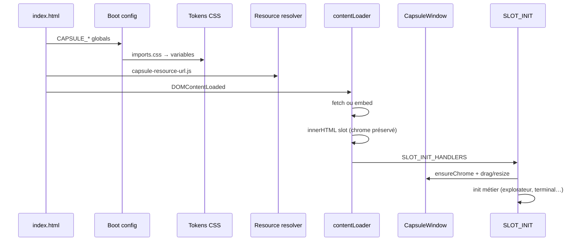

# Manifeste du noyau CapsuleOS

Document fondateur — vision, principes et trajectoire technique.  
Complète [fondements-philosophiques.md](fondements-philosophiques.md) (base académico-philosophique), [arborescence.md](arborescence.md), [roadmap.md](roadmap.md), [logique-formelle.md](logique-formelle.md) (paradigme agent : gates, prédicats, décision), [plan-maitre-reproduction-os.md](plan-maitre-reproduction-os.md) (roadmap validée) et [contrib.md § toolkits](../../contrib.md#bibliotheques-graphiques-linux-toolkits-gui).

---

## Logique formelle (agents)

Le noyau et les skins obéissent à une **logique de gates** partagée : vérité machine (`os-registry`, inventaires VM, matrices lab) → prédicats vérifiables (`validate-all`, **A** assets, **I** inventaire) → implémentation minimale → clôture **H₆**.

**Référence unique** : [logique-formelle.md](logique-formelle.md). Les procédures (clone, playbook Paramètres, audit profond) n’en sont que des spécialisations.

---

## Préambule

CapsuleOS n’est pas un framework SPA. C’est un **système d’exploitation simulé**, entièrement **statique**, pensé pour fonctionner en double-clic (`file://`), derrière un service worker, ou sur un serveur HTTP minimal — sans build obligatoire en développement, sans runtime Node en production.

Le noyau ne « possède » pas l’interface : il **distribue** des briques réutilisables que les skins assemblent :

| Nature | Emplacement canonique | Rôle |
|--------|----------------------|------|
| **Vanilla JS** | `usr/lib/capsuleos/` | Comportements (fenêtres, shell, explorateur, terminal…) |
| **Données JSON** | `home/public/*.json`, `etc/capsuleos/` | FS simulé, config, manifestes |
| **Composants CSS** | `usr/share/capsuleos/themes/` | Tokens, chrome, apps `.base.css` |
| **Gabarits HTML** | `usr/share/capsuleos/<os>/apps/` | Structure sémantique des applications |
| **Artefacts générés** | `var/lib/capsuleos/generated/` | Embeds offline (opt-in au build) |
| **Modules montés** | `mnt/` | Parcours pédagogiques (débutant → cybertech) — [convention-modules-mnt.md](convention-modules-mnt.md) |

La magie opère dans la **résolution logique → physique** : chemins stables dans le code, bases configurables par skin via `CAPSULE_*`.

---

## Ce que nous croyons

### 1. Statique d’abord, toujours

Tout ce qui peut être un fichier, doit rester un fichier.  
Pas de transpilation imposée, pas de dépendance npm pour consommer le bureau. Les outils de build (`build-linux-embed.mjs`, `build-capsule-window.mjs`, `generate-public-manifest.mjs`) sont des **accélérateurs offline**, pas des prérequis au hack d’un skin.

### 2. Un seul contrat, deux transports

Le couple **fetch HTTP** / **embed inline** est notre force. Le noyau décide :

```
file://          → embed (CAPSULE_APP_EMBED, CAPSULE_FORCE_APP_EMBED)
http:// dev      → fetch direct (itération rapide)
http:// prod+SW   → fetch + cache (même chemins)
```

**Règle d’or** : le HTML/CSS/JS source sous `usr/share/` reste la vérité ; l’embed est une **projection compilée**, jamais une fork.

### 3. CSS = API visuelle

Les composants CapsuleOS s’expriment par **variables CSS anticipées** :

- **Primitives globales** : `--head`, `--full`, `--fix`, `--f`, `--c`… (`themes/global/`)
- **Tokens OS** : `--win-*`, `--nemo-*`, `--dolphin-*` (`themes/linux/`)
- **Dérivées calculées** : hauteurs titlebar, gutters, rayons — définies une fois, consommées partout

Un skin ne réécrit pas un composant entier : il **réassigne des tokens** sous `body#<skin>` ou `html:has(#<skin>)`.  
Objectif : zéro `@import` dans le CSS injecté dynamiquement (leçon Dolphin/Nemo).

### 4. JS = comportements composables

Modules IIFE, API globales explicites (`CapsuleWindow`, `CapsuleUserHome`), shims de compatibilité temporaires.  
Pas de magie implicite : chaque skin déclare l’ordre de chargement dans son `index.html` (documenté, vérifiable).

### 5. Deux mondes d’assets, une résolution

**Distinction fondamentale** (à ne pas mélanger) :

| Monde | Chemin | Contenu | Visible par l’utilisateur simulé ? |
|-------|--------|---------|-----------------------------------|
| **Noyau / système** | `usr/share/capsuleos/assets/` | Icônes toolkit, chrome, branding distro | Non (ressources internes UI) |
| **Home simulé** | `home/public/` | Documents pédagogiques, photos « perso » | Oui (explorateur, Finder, Windows) |

`home/public/Images/` accueille les **images utilisateur** (wallpapers déposés, photos fictives).  
Les icônes KDE/GNOME/Cinnamon vivent sous **`usr/share/capsuleos/assets/images/`**, pas dans le home simulé.

---

## Hydratation CapsuleOS

Nous empruntons le terme *hydratation* au sens large : **enrichir progressivement le DOM statique** sans rechargement de page.

### Phases du cycle de vie d’un bureau



| Phase | Nom | Responsable | Livrable |
|-------|-----|-------------|----------|
| **H0** | Boot | `index.html` | `CAPSULE_EMBED_SKIN_KEY`, `CAPSULE_APPS_BASE`, `CAPSULE_CONTENT_ROOT`… |
| **H1** | Tokens | `style/imports.css` | Variables CSS actives sur `body#skin` |
| **H2** | Résolution | `capsule-resource-url.js` | `./media/` → base skin ; `./icons/kde/` → pack KDE |
| **H3** | Slots | `contentLoader.js` | HTML + CSS base + skin injectés par `data-link` |
| **H4** | Chrome | `CapsuleWindow` | Header, drag, resize, z-index |
| **H5** | Apps | `SLOT_INIT_HANDLERS.*` | État métier (manifeste explorateur, terminal…) |
| **H6** | Interact | Event listeners | DnD, menus, missions checklist |

**Hydratation idempotente** : chaque module vérifie `data-*-init` avant de binder (ex. `CapsuleWindow.init`, `fileExplorerDnD`).

**Hydratation différée** : les slots cachés (`display:none`) s’hydratent au premier affichage si nécessaire — optimisation future, compatible avec l’existant.

---

## Registre d’assets proposé

### Arborescence canonique (noyau)

```
usr/share/capsuleos/assets/
├── images/
│   ├── common/           # neutre, fallback
│   ├── toolkits/
│   │   ├── cinnamon/
│   │   ├── gnome/
│   │   ├── kde/
│   │   ├── cosmic/
│   │   └── android/
│   ├── vendors/          # identité distro (logo, accent wallpaper)
│   │   ├── debian/
│   │   ├── fedora/
│   │   ├── mint/
│   │   ├── opensuse/
│   │   ├── popos/
│   │   └── ubuntu/
│   └── platforms/        # familles OS CapsuleOS
│       ├── linux/
│       ├── windows/
│       ├── macos/
│       │   ├── sonoma/
│       │   └── monterey/
│       └── android/
├── icons/                # (existant étendu) packs complets
│   ├── kde/
│   ├── gnome/
│   └── ...
└── manifest.json         # registre machine-lisible (voir ci-dessous)
```

### Home simulé (inchangé dans l’esprit)

```
home/public/
├── Images/               # contenu « utilisateur » uniquement
│   ├── Vacances/
│   └── Bureau/
├── Documents/
└── .capsule-manifest.json
```

### URIs logiques (innovation)

Introduire des **préfixes logiques stables** dans HTML/CSS/JS, résolus à l’hydratation :

| Préfixe logique | Résolu via | Exemple |
|-----------------|------------|---------|
| `./media/` | `CAPSULE_MEDIA_BASE` | `./assets/images/toolkits/cinnamon/header/close.svg` |
| `./icons/kde/` | `CAPSULE_KDE_ICONS_BASE` | `./icons/kde/places32/folder.svg` |
| `./assets/toolkits/gnome/` | `CAPSULE_ASSETS_BASE` + segment | *(nouveau)* |
| `./public/` | `CapsuleUserHome` | chemin FS simulé explorateur |

Extension naturelle de `capsule-resource-url.js` → **`CapsuleResource.resolve(uri)`** unique, testable, documentée.

### `assets/manifest.json` (registre)

Fichier JSON décrivant packs, fallbacks et métadonnées :

```json
{
  "version": 1,
  "packs": {
    "kde-icons": {
      "path": "icons/kde",
      "global": "CAPSULE_KDE_ICONS_BASE",
      "fallback": "icons/common"
    },
    "gnome-symbolic": {
      "path": "icons/gnome",
      "global": "CAPSULE_GNOME_ICONS_BASE"
    }
  },
  "logicalPrefixes": [
    { "prefix": "./icons/kde/", "pack": "kde-icons" },
    { "prefix": "./assets/toolkits/gnome/", "pack": "gnome-symbolic" }
  ]
}
```

Le build embed peut **inliner** les petits SVG ; le runtime garde les fetch pour le dev HTTP.

---

## Profil de skin (idée : `skin.profile.json`)

Chaque skin déclare son identité en un seul fichier (à terme) :

```json
{
  "id": "mx-kde",
  "bodyId": "mx-kde",
  "embedKey": "mxkde",
  "toolkit": "kde",
  "vendor": "mx",
  "explorer": { "template": "dolphin", "displayName": "Dolphin" },
  "assets": {
    "mediaBase": "./media",
    "kdeIconsBase": "../../../usr/share/capsuleos/assets/icons/kde"
  },
  "css": {
    "imports": ["variables-linux.css", "window-chrome.base.css"],
    "tokens": "mx-kde-tokens.css"
  },
  "scripts": ["capsule-window.js", "windowContainer.js", "contentLoader.js"]
}
```

Aujourd’hui ces infos sont dispersées dans `index.html` — le profil permettrait génération partielle du boot, validation CI, et onboarding agent.

---

## Principes de routage des chemins

1. **Relatif au skin** pour ce qui est propre au bureau (`./media/`, `./style/`).
2. **Relatif au repo via profondeur documentée** pour le noyau (`../../../usr/lib/...`) — ou `CapsuleUserHome.fromRepoDepth(n)`.
3. **Jamais de chemins absolus** hôte (`/home/n0r3f/...`).
4. **Réécriture centralisée** : tout template injecté passe par `rewriteCapsuleResourceUrlsInText`.
5. **Symétrie home/OS** : `home/Debian/Mint/` et `OS/linux/families/debian/mint/` restent miroirs ; le noyau est identique.

---

## Innovations recommandées (priorisées)

### Court terme — consolider l’existant

| Initiative | Bénéfice |
|------------|----------|
| Étendre `capsule-resource-url.js` aux préfixes `./assets/toolkits/*` | Fin de la dispersion `CAPSULE_*_BASE` ad hoc |
| Créer `usr/share/capsuleos/assets/images/` avec sous-dossiers toolkit/vendor | Source unique icônes/illustrations système |
| Documenter les phases H0–H6 dans chaque skill agent | Onboarding cohérent |
| Script `validate-skin.mjs` (profil, scripts, variables) | CI légère sans bundler |

### Moyen terme — ergonomie

| Initiative | Bénéfice |
|------------|----------|
| `skin.profile.json` + générateur de bloc `<script>` boot | Moins d’erreurs d’ordre de chargement |
| `assets/manifest.json` consommé par embed + runtime | Une vérité pour file/http |
| Couche `--*-computed` CSS (variables dérivées nommées) | Moins de `calc()` dupliqués dans les skins |
| Hydratation lazy des slots non visibles | Perf accueil portail |

### Long terme — pédagogie & portabilité

| Initiative | Bénéfice |
|------------|----------|
| **CapsuleKit** : pack téléchargeable (JSON + assets + CSS) pour nouvelle distro | Contribution communautaire |
| Mode « mission » : JSON décrivant parcours + état checklist | Gamification data-driven |
| Export static zip « cours du jour » | Déploiement sans git |
| Pont WASM optionnel (ex. parser markdown avancé) | Toujours opt-in, jamais requis |

---

## Ce que nous refusons

- **Bundler obligatoire** pour développer un skin.
- **Framework UI** (React/Vue) dans le noyau — les apps peuvent l’être en iframe externe, pas le shell.
- **Assets système dans `home/public/`** — pollue le FS pédagogique et casse l’illusion utilisateur.
- **Fork par OS** de `contentLoader` / `CapsuleWindow` — un noyau, des adaptateurs minces.
- **CSS injecté avec `@import`** — concaténation au build ou inline embed uniquement.
- **Hydratation destructive du chrome** — le header fenêtre reste hors `innerHTML` des apps.

---

## Métriques de santé du noyau

Un noyau « sain » vérifie :

1. **Offline** : ouverture Mint + Dolphin + Nemo en `file://` sans erreur réseau.
2. **Parité HTTP** : même comportement via `python3 -m http.server`.
3. **Un seul rebuild** : modifier un `.base.css` → regénérer embed → SW invalide → OK.
4. **Zéro référence morte** : pas de script `site/window*.js` ou fork kernel obsolète.
5. **Résolution assets** : aucun chemin `./icons/kde/` non résolu sur un skin KDE.
6. **Tokens** : changer `--head` sur un skin recalcule titlebar, fenêtres, panel sans toucher au JS.

---

## Conclusion

Votre vision — **noyau distributeur de JS vanilla, JSON et CSS tokenisé** — est déjà le ADN de CapsuleOS. Le refactor `CapsuleWindow`, le pipeline embed, `capsule-resource-url.js` et les manifestes `home/public/` en sont les preuves.

La prochaine étape n’est pas de « moderniser » avec un stack lourd, mais de **formaliser l’hydratation**, **séparer assets système et home simulé**, et **centraliser le routage** dans un registre unique — tout en gardant la double voie file/http qui nous distingue.

> *Un OS simulé crédible n’est pas celui qui imite le plus de pixels, mais celui qui enseigne les gestes justes avec le minimum de magie.*

---

## Références

- [arborescence.md](arborescence.md)
- [repertoire-os.md](repertoire-os.md) — catalogue 52 OS (machine + humain)
- [scalabilite-noyau.md](scalabilite-noyau.md) — stratégie à grande échelle
- [equipe-agentique.md](equipe-agentique.md) — staffing agents
- [usr/lib/capsuleos/common/window/README.md](../../usr/lib/capsuleos/common/window/README.md)
- [usr/lib/capsuleos/common/README.md](../../usr/lib/capsuleos/common/README.md)
- [home/public/README.md](../../home/public/README.md)
- [etc/capsuleos/os-registry.json](../../etc/capsuleos/os-registry.json)
- [usr/share/capsuleos/assets/manifest.json](../../usr/share/capsuleos/assets/manifest.json)

*Document rédigé juin 2026 — révision après chaque jalon noyau majeur.*
