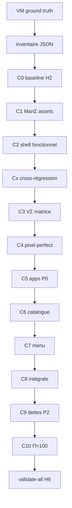

# Moteur de clonage — expérience acquise et cycles automatiques

> **Statut** : passe introspective **2026-06-08** — capitalise la campagne `linux-mint` v2 et les régressions cross-toolkit observées.  
> **Contrat machine** : [`etc/capsuleos/contracts/clone-cycle-engine.json`](../../etc/capsuleos/contracts/clone-cycle-engine.json)  
> **Orchestrateur** : `node usr/lib/capsuleos/tools/lab/run-clone-cycle.mjs`

Complète sans remplacer : [convention-reproduction-os.md](convention-reproduction-os.md) · [procedure-clonage-os-depuis-vm.md](procedure-clonage-os-depuis-vm.md) · [processus-branchement-noyau.md](processus-branchement-noyau.md) · [linux-mint-replication-cost-estimate.md](inventaires/linux-mint-replication-cost-estimate.md)

---

## 1. Synthèse exécutive

Le clonage CapsuleOS n’est pas un patch unique : c’est une **chaîne de cycles** qui élève l’indice **Π_global** vers **100** tout en **contenant les régressions** entre toolkits (Cinnamon ↔ GNOME). La campagne Mint v2 a démontré que :

| Constat | Impact | Réponse automatisée |
|---------|--------|---------------------|
| Touch noyau partagé sans test sibling | Régression Rocky **ou** Mint (menu ctx explorateur) | `run-cross-regression-gates.mjs` |
| Skin `home/` sans sync façades | Pick-os sert HTML obsolète | `sync-linux-skin-closure.mjs` (pre-push) |
| Check Playwright sans dimension `ctx` | Π_ctx=**50** par défaut — dette invisible | Checks explicites par surface dans `run-ui-state-effects-pass.mjs` |
| ManΣ pointant `gnome/apps` sur Cinnamon | 68 refs drift, icônes fausses | `validate-clone-assets.mjs` + manifest `cinnamon/apps` |
| Bind menu ctx avant injection gabarit | Clic droit Nemo silencieux | Dispatch fall-through + délégation slot (`74ba268`) |
| Slots pédagogie dans panel VM | CapsuleOnly non documenté | Gate checklist + retrait DOM |

**Nombre de cycles pour Π=100** (référence Mint, VM SSH stable) :

| Niveau | Cycles | Π attendu | Durée ordre de grandeur |
|--------|--------|-----------|-------------------------|
| **MVP surface** | **C0–C3** (4) | Π_shell ≥ 90 | 25–45 h |
| **Clone intégral** | **C0–C9** (10) | Π_global ≥ 98 | 80–120 h |
| **Clôture parfaite** | **+C10** (11 total) | **Π_global = 100** | +4–10 h |

Le moteur exécute ces cycles **automatiquement** via `run-clone-cycle.mjs --auto`, avec **1 commit + push par pallier** (convention campagne).

---

## 2. Typologie des conflits et régressions

### 2.1 Conflits cross-toolkit (priorité P0)

Un seul slot logique `data-link="nemo"` sert **Nemo** (Cinnamon) et **Nautilus** (GNOME). Toute modification de `fileExplorerContextMenu.js` doit respecter :

```text
isNemoCinnamonScope    →  bindNemoContextMenu            (priorité Mint — garde .dolphin-app)
isDolphinScope         →  bindNautilusGnomeContextMenu   (menu #nemo-context-menu Dolphin)
isNautilusGnomeScope   →  bindNautilusGnomeContextMenu   (early return si pas Nautilus)
```

**Symptôme** : clic droit absent (Mint) ou menu Nemo sur Rocky.  
**Gate** : `run-cross-regression-gates.mjs` — `smoke-mint-nemo` + `smoke-gnome-nautilus-interactions --profile=linux-rocky`.

Référence : [processus-branchement-noyau.md § clic droit](processus-branchement-noyau.md) · commits `00816fb`, `61ed7ae`, `74ba268`.

### 2.2 Conflits vue ↔ modèle (Rv)

| Pattern | Symptôme | Gate |
|---------|----------|------|
| Façade non regénérée | Menu/panel pick-os ≠ `home/` | `sync-linux-skin-closure.mjs` |
| Cache CSS `?v=` | Géométrie correcte en source, fausse en navigateur | Bump version skin + hard refresh |
| Embed stale | Gabarit noyau modifié, skin inchangé visuellement | `build-linux-embed.mjs` |

### 2.3 Dettes de mesure (Π artificiellement bas)

Si une surface n’a **aucun check** pour une dimension (ex. `ctx`), `run-ui-state-effects-pass.mjs` injecte **50** par défaut. Une surface peut paraître « ok » en π global tout en masquant un trou ctx.

**Règle** : chaque surface shell P0 doit avoir ≥ 1 check `ctx` et ≥ 1 check `kb` avant clôture pallier.

### 2.4 Dettes manifeste / assets (ManΣ)

Icônes référencées dans `index.html` (`mint-catalog-asset-refs`) ou playbook doivent pointer le **toolkit du skin**, pas le toolkit upstream GNOME.

**Gate** : `validate-clone-assets.mjs --id <registryId>` · drift=0 dans `replication-state.json`.

### 2.5 Course d’initialisation (bind race)

`contentLoader` injecte le gabarit explorateur **après** le boot slot. Un bind context menu qui exige `.nemoElement` au premier `initMainMenu` / `initExplorer` échoue silencieusement.

**Réponse** : délégation d’événements sur le slot + reset flags `nemoContextMenuBound` à réinjection.

---

## 3. Architecture du moteur



**Cx** (cross-régression) n’est pas numéroté comme pallier : il se déclenche **à chaque touch** des préfixes listés dans `clone-cycle-engine.json` → `crossRegression.triggerPathPrefixes`.

---

## 4. Les 11 cycles (C0–C10)

| Cycle | Pallier | Objectif | Gates principales |
|-------|---------|----------|-------------------|
| **C0** | 0 | Inventaire + H₂ | `validate-all` |
| **C1** | 1 | Assets VM, drift=0 | `validate-clone-assets` |
| **C2** | 2 | Panel/tray fonctionnels | `run-ui-state-effects-pass --shell panel` |
| **C3** | 3 | Matrice VΣ 8/8 | `run-ui-state-effects-pass --write` |
| **C4** | 4 | Géométrie ≤1 px | `measure-mint-shell-geometry` |
| **C5** | 5 | Apps prioritaires Π≥90 | `run-app-parity-pass --priority` |
| **C6** | 6 | Catalogue menu complet | `smoke-apps-catalog` |
| **C7** | 7 | Menu Π=100 | `run-ui-state-effects-pass --shell mainMenu` |
| **C8** | 8 | Recette intégrale | `validate-toolkit-paradigm` + cross-regression |
| **C9** | 9 | Dettes P2 / CapsuleOnly | `validate-all` + dettes vides |
| **C10** | 10 | **Π_global=100** | passes apps + shell complètes |

État courant Mint : pallier **9** clôturé, **Π_global=98** — cycle **C10** restant (`desktop` ctx, `text_editor`, `file_roller`).

---

## 5. Commandes agent (automatisation)

### État et plan

```bash
node usr/lib/capsuleos/tools/lab/run-clone-cycle.mjs --id linux-mint --status
node usr/lib/capsuleos/tools/lab/run-clone-cycle.mjs --id linux-mint --dry-run --run-next
```

### Exécuter le prochain cycle

```bash
python3 -m http.server 5501 --bind 127.0.0.1   # terminal séparé
CAPSULE_HTTP_BASE=http://127.0.0.1:5501 \
  node usr/lib/capsuleos/tools/lab/run-clone-cycle.mjs --id linux-mint --run-next
```

### Enchaînement auto (convention campagne)

```bash
CAPSULE_HTTP_BASE=http://127.0.0.1:5501 \
  node usr/lib/capsuleos/tools/lab/run-clone-cycle.mjs --id linux-mint --auto --max-cycles 3
```

Puis clôture manuelle agent : `sync-linux-skin-closure` (si `home/` touché) · `sync-all-views` · `validate-all` · **commit + push**.

### Cross-régression (après touch noyau)

```bash
CAPSULE_HTTP_BASE=http://127.0.0.1:5501 \
  node usr/lib/capsuleos/tools/lab/run-cross-regression-gates.mjs --kernel-touch
```

---

## 6. Critère Π_global = 100

Formule : [`parity-index-lib.mjs`](../../usr/lib/capsuleos/tools/lab/parity-index-lib.mjs) — moyenne pondérée shell (25 %) + apps (75 %), seuil ok = **90**.

Pour atteindre **100** :

1. Toutes les surfaces shell P0 à **Π=100** (ou minimum 90 sans trou dimensionnel).
2. Toutes les apps **prioritaires** (`weights.appsScope: "priority"`) à **Π=100** ; catalogue secondaire peut rester ≥ 90 sans bloquer C10.
3. `nonConformites: []` dans `*-replication-state.json`.
4. `validate-all` vert · `validate-toolkit-paradigm --id` vert · cross-régression verte.

Mint (2026-06-08) : 3 écarts résiduels → C10 :

| Zone | Π | Action C10 |
|------|---|------------|
| `desktop` ctx | 92 | menu bureau Cinnamon — checks ctx |
| `text_editor` | 92 | passe app dédiée |
| `file_roller` | 92 | passe app dédiée |

---

## 7. Intégration convention existante

| Document / outil | Rôle dans le moteur |
|------------------|---------------------|
| [convention-reproduction-os.md](convention-reproduction-os.md) §4 | Workflow H0–H6 = préambule C0 |
| [agent-validation-discipline.md](agent-validation-discipline.md) §4 | Checklist push = fin de chaque cycle |
| [recette-clone-rocky-regression.md](recette-clone-rocky-regression.md) | Recette Cx pour GNOME |
| [recette-clone-mint-integral.md](recette-clone-mint-integral.md) | Recette C8 pour Cinnamon |
| `replication-state.json` | Pallier courant, file `nextQueue`, snapshot Π |
| `parity-index.json` | Vérité Π par surface / app |

---

## 8. Leçons pour futurs clones (tous vendors)

1. **Séparer tôt** les slots homonymes (ex. `mintinstall` vs `update_manager`) — évite dette menu/favoris.
2. **Baseline H₂ transverse** dès C0 — ne pas ignorer les rouges hors zone Mint/Rocky.
3. **Drift refs statiques** — scanner `index.html` + playbook, pas seulement JS dynamique menu.
4. **Slots partagés noyau** (csPanel, alias desktop) — accélèrent C6 catalogue (30→87 entrées / pallier).
5. **Cx obligatoire** après tout patch `usr/lib/capsuleos/shells/linux/fileExplorer/` — coût marginal, évite P0 sibling.
6. **Documenter chaque régression résolue** dans `regressionCatalog` du contrat JSON — alimente les gates futures.

---

## 9. Mise à jour

Mettre à jour ce document et `clone-cycle-engine.json` à chaque :

- clôture pallier (`replication-state.json`) ;
- nouvelle régression cross-toolkit documentée ;
- ajustement du nombre de cycles observé sur un nouveau vendor (Rocky, Ubuntu, KDE Neon).

Dernière passe : **2026-06-08** — référence `linux-mint`, pallier 9, Π_global 98.
