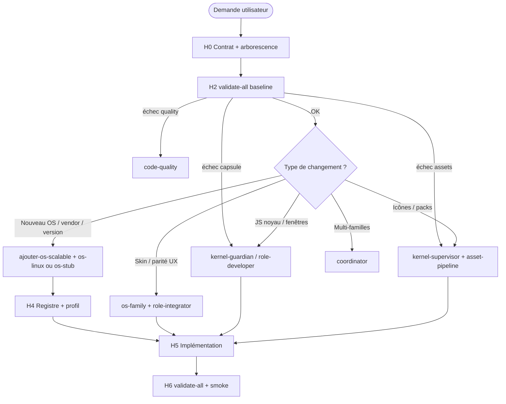

# Parcours agent — formation avant action

Chemin logique pour qu’un agent Cursor **comprenne CapsuleOS** avant de modifier le dépôt, puis **scale** le catalogue (distros, versions, bureaux, vendors) sans fork noyau.

**Guide racine** : [`contrib.md`](../../contrib.md)  
**Skill associé** : [`../skills/onboarding/SKILL.md`](../skills/onboarding/SKILL.md)  
**Gate unique** : `node usr/lib/capsuleos/tools/validate-all.mjs`

---

## Principe de scalabilité

```
Une vérité machine-lisible  →  N projections (façade, skin, pick-os, embed, docs)
         │                              │
         ▼                              ▼
  os-registry.json              skin.profile.json
  assets/manifest.json          toolkit + vendor packs
```

**Ajouter un OS** = enregistrer + réutiliser un **toolkit** existant + pack **vendor** — pas dupliquer `CapsuleWindow`, `contentLoader`, ni les assets sous `OS/*/media/`.

Référence détaillée : [ajouter-os-scalable.md](ajouter-os-scalable.md) · [repertoire-os.md](repertoire-os.md) · [scalabilite-noyau.md](scalabilite-noyau.md)

---

## Hydratation agent (H0 → H6)

| Phase | Objectif | Actions agent | Gate / livrable |
|-------|----------|---------------|-----------------|
| **H0** | Contexte & contrat | Lire [AGENTS.md](../AGENTS.md), [checklist contrat](../../contrib.md#checklist-contrat-avant-merge-ou-release), [arborescence.md](arborescence.md) | Compréhension chemins `CapsuleOS/` vs `root/` |
| **H1** | Vérité catalogue | Lire [manifeste-noyau.md](manifeste-noyau.md) § registres ; parcourir `etc/capsuleos/os-registry.json` ; [politique-assets.md](politique-assets.md) | Savoir où vivent façade / skin / assets |
| **H2** | Santé dépôt | Exécuter `validate-all.mjs` (baseline locale) | **exit 0** ou plan de correction avant tout patch |
| **H3** | Routage compétence | Choisir skill : [onboarding](../skills/onboarding/SKILL.md) → `kernel-supervisor` **ou** `os-<famille>` + `role-*` ; voir [equipe-agentique.md](equipe-agentique.md) | Brief avec `id` registre + `tier` |
| **H4** | Conception scalable | Toolkit existant ? Vendor pack ? Miroir `home/` ? Profil `skin.profile.json` | Fiche [ajouter-os-scalable.md](ajouter-os-scalable.md) remplie |
| **H5** | Implémentation | Patch minimal ; assets dans `usr/share/capsuleos/assets/` ; boot `capsule-resource.js` → `capsule-skin-boot.js` | Pas d’images sous `OS/*/media/` |
| **H6** | Clôture | `validate-all.mjs` ; regen embed si templates/strings ; smoke `file://` sur façade | PR / merge autorisé |

> **Règle** : ne pas commencer H5 si H2 échoue sur la zone touchée (sauf tâche dédiée « fix CI »).

---

## Arbre de décision (avant d’agir)



---

## Matrice « je veux… » → lecture → gate → skills

| Intention | Lire d’abord | Gate après patch | Skills |
|-----------|--------------|------------------|--------|
| Nouvelle **distro Linux** (ex. Zorin) | [ajouter-os-scalable.md](ajouter-os-scalable.md), [contrib.md § toolkits](../../contrib.md#bibliotheques-graphiques-linux-toolkits-gui) | `validate-all` + regen embed Linux | `os-linux`, `role-integrator`, `code-quality` |
| Nouvelle **version** Windows / macOS | [repertoire-os.md](repertoire-os.md), façade existante | `validate-all` | `os-windows` / `os-macos`, `role-integrator` |
| Nouveau **vendor** (thème icônes) | [politique-assets.md](politique-assets.md), `assets/manifest.json` | `validate-assets-all` | `kernel-supervisor`, `role-graphic-artist` |
| Nouveau **environnement de bureau** (toolkit) | [contrib.md § toolkits](../../contrib.md#bibliotheques-graphiques-linux-toolkits-gui), explorateurs README | `validate-all` + manifest | `os-linux`, `role-developer`, `role-graphic-artist` |
| Nouvelle **famille** OS (ChromeOS…) | [os-stub/SKILL.md](../skills/os-stub/SKILL.md) | `validate-all` | `os-stub` → skill dédié, `coordinator` |
| Correctif **JS** skin | [passe-vanilla-json.md](passe-vanilla-json.md) | `validate-quality-all` | `role-developer`, `code-quality` |
| Migration **assets** | [roadmap.md](roadmap.md) §0.5 | `validate-assets-all` | `kernel-supervisor`, `asset-pipeline` |

---

## Modèle vendor / toolkit / version (Linux)

| Concept | Fichier / zone | Agent doit |
|---------|----------------|------------|
| **Entrée catalogue** | `etc/capsuleos/os-registry.json` | `id`, `tier`, `status`, `facade`, `toolkit`, `embedKey`, `bodyId` |
| **Profil boot** | `skin.profile.json` + `etc/capsuleos/profiles/` | `assets.assetsBase`, `toolkitPack`, pas de `CAPSULE_MEDIA_BASE` dans profil |
| **Toolkit** | `assets/images/toolkits/<id>/` | Choisir cinnamon / kde / gnome / cosmic — pas de fork Dolphin |
| **Vendor** | `assets/images/vendors/<id>/` | Thème, fond d’écran, identité distro |
| **Façade URL** | `OS/linux/families/.../index.html` | Scripts noyau dans le bon ordre |
| **Miroir pédagogique** | `home/<Vendor>/` | Aligné sur la façade ; `content/strings.json` optionnel |
| **Version OS** | Nouvelle entrée registre | Souvent **nouvelle entrée** + même toolkit (ex. `linux-ubuntu-2510`) |

---

## Commandes gate (ordre release)

```bash
# Gate complet (recommandé avant merge)
node usr/lib/capsuleos/tools/validate-all.mjs

# Ciblés
node usr/lib/capsuleos/tools/validate-assets-all.mjs
node usr/lib/capsuleos/tools/validate-capsule.mjs
node usr/lib/capsuleos/tools/validate-quality-all.mjs
```

Brief agent pour une entrée catalogue (P2+ planifié) :

```bash
node usr/lib/capsuleos/tools/print-agent-brief.mjs <id> --write
```

Après changement templates Linux :

```bash
node usr/lib/capsuleos/tools/generate-public-manifest.mjs
node usr/lib/capsuleos/tools/linux/build-linux-embed.mjs
```

---

## Anti-patterns (bloquants culturellement)

1. Agent **sans** skill OS sur un skin multi-toolkit.
2. Nouvelles images hors `usr/share/capsuleos/assets/` et `home/public/Images/`.
3. Fork `contentLoader` / `CapsuleWindow` par distro.
4. `CAPSULE_*` non documentés dans le registre ou le profil.
5. Merge sans `validate-all` vert sur la zone modifiée.
6. Utiliser `rewrite-es6-strict.mjs` (codemod fragile) — ES6 strict manuel + `validate-vanilla-js`.

---

## Liens

- [equipe-agentique.md](equipe-agentique.md) — staffing
- [manifeste-noyau.md](manifeste-noyau.md) — hydratation technique H0–H6 noyau
- [kernel-supervisor/SKILL.md](../skills/kernel-supervisor/SKILL.md) — migration assets
- [code-quality/SKILL.md](../skills/code-quality/SKILL.md) — ES6 + JSON
