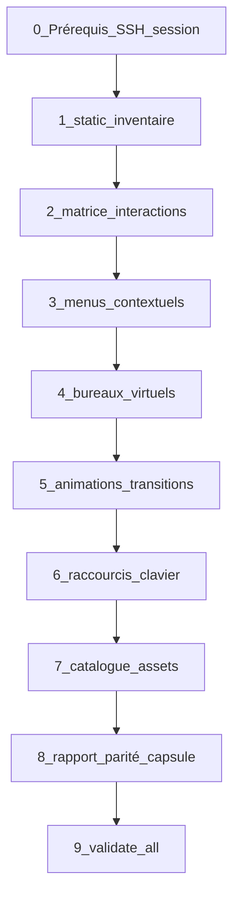

# Procédure — audit VM profond (agents)

> **Objectif** : permettre aux agents d’exécuter des **séries d’actions reproductibles** sur une VM ground truth afin de documenter **l’intégralité du contexte interactif** — zones cliquables, profondeur de clics, menus contextuels, bureaux virtuels, animations, raccourcis clavier, assets (icônes, images, polices) — pour une reproduction CapsuleOS **la plus fidèle possible**.

**Complète sans remplacer** :
- [logique-formelle.md](logique-formelle.md) (prédicats **I⁺**, **M**, règles **R-INV**)
- [procedure-clonage-os-depuis-vm.md](procedure-clonage-os-depuis-vm.md) (clone skin)
- [procedure-lab-linux-rocky-gnome.md](procedure-lab-linux-rocky-gnome.md) (passe lab Rocky)
- [procedure-creation-playbook-gnome-settings.md](procedure-creation-playbook-gnome-settings.md) (playbook Paramètres gcc ↔ gsettings ↔ CapsuleOS)
- [convention-assets-depuis-vm.md](convention-assets-depuis-vm.md) (pull icônes/fonds)

**Livrable principal** : `root/docs/inventaires/<registryId>-deep-audit.json` (+ `.md` résumé)  
**Modèle** : [`inventaires/_template-vm-deep-audit.json`](inventaires/_template-vm-deep-audit.json)

---

## 1. Principes pour agents

| Règle | Détail |
|-------|--------|
| **Inventaire avant code** | **R-INV1** ([logique-formelle.md](logique-formelle.md)) — ne pas patcher le skin sans phase `static` + au moins une surface `interaction-matrix` documentée |
| **Une action = une preuve** | Chaque interaction documentée avec capture PNG (ou séquence) + état JSON sonde si applicable |
| **Compter les clics** | Toujours noter `clicks` (nombre total) et `steps[]` (séquence explicite) |
| **Ne pas omettre** | Bureaux virtuels, déplacements, animations, raccourcis, clic droit |
| **Classer les écarts** | P0 / P1 / P2 / CapsuleOnly dans `paritySummary` |
| **SSH espacé** | 2–3 s entre commandes VM (évite `Connection reset`) — voir [procedure-lab-linux-rocky-gnome.md](procedure-lab-linux-rocky-gnome.md) §0.7 |

### Skills à charger

1. `onboarding`
2. `os-clone-from-vm`
3. Skill distro (`capsuleos-distro-<id>`) + vendor
4. **Cette procédure** avant toute campagne fidélité

Brief : `node usr/lib/capsuleos/tools/print-agent-brief.mjs <registryId>`

---

## 2. Vue d’ensemble des phases



| Phase | ID JSON | Automatisable | Agent humain / visuel |
|-------|---------|---------------|------------------------|
| 0 Prérequis | — | partiel | session GDM ouverte |
| 1 Static | `phases.static` | **oui** | — |
| 2 Matrice interactions | `phases.interactionMatrix` | partiel | captures obligatoires |
| 3 Menus contextuels | `phases.contextMenus` | non | clic droit + énumération items |
| 4 Bureaux virtuels | `phases.workspaces` | partiel | drag Aperçu + captures |
| 5 Animations | `phases.animations` | non | chronométrage / séquence PNG |
| 6 Clavier | `phases.keyboard` | partiel | test chaque binding |
| 7 Assets | `phases.assets` | **oui** (`pull-vm-assets.sh`) | vérif chemins VM |
| 8 Rapport | `paritySummary` | — | compare Capsule |
| 9 Gate | — | **oui** | `validate-all.mjs` |

---

## 3. Phase 0 — Prérequis

Identique aux procédures lab existantes :

```bash
# Inventaire lab local (gitignoré)
cp etc/capsuleos/lab-inventory.example.json etc/capsuleos/lab-inventory.json

# Test SSH + session graphique
node usr/lib/capsuleos/tools/lab/lab-ssh.mjs --id linux-rocky --cmd 'echo ok'

# Serveur Capsule (hôte)
cd /chemin/vers/CapsuleOS && python3 -m http.server 5500

# Baseline dépôt
node usr/lib/capsuleos/tools/validate-all.mjs
```

**Bloquant** : session **Wayland/X11 graphique** ouverte sur la VM (pas SSH seul). Rocky : [lab-vm-rhel-wayland.md](lab-vm-rhel-wayland.md).

Déployer la sonde :

```bash
bash root/tools/lab/bootstrap-vm.sh <registryId>
```

---

## 4. Phase 1 — Inventaire static (automatisé)

Collecte versions, thèmes, **raccourcis gsettings**, polices, extensions, favoris dash, config bureaux.

### GNOME (Rocky, Fedora, Alma, Ubuntu GNOME…)

```bash
node usr/lib/capsuleos/tools/lab/collect-vm-deep-audit.mjs --id linux-rocky --phase static --write-doc
```

Script VM : [`vm-gnome-deep-inventory.sh`](../tools/lab/vm-gnome-deep-inventory.sh)

**Sorties** :
- `root/docs/inventaires/linux-rocky-deep-audit.json` → `phases.static`
- `root/docs/inventaires/linux-rocky-deep-audit.md` (résumé)

### Cinnamon (Mint)

```bash
# En attendant collect-vm-deep-audit pour cinnamon :
ssh -i ~/.ssh/capsuleos-lab capsule@<IP> 'DISPLAY=:0 bash -s' \
  < root/tools/lab/vm-mint-inventory.sh > /tmp/mint-static.json
```

Scripts complémentaires Mint (apps) : `vm-mint-nemo-inventory.sh`, `vm-mint-firefox-inventory.sh`, `vm-mint-window-chrome-inventory.sh`.

### Contrôle agent

- [ ] `versions.gnomeShell` / `cinnamon` renseigné
- [ ] `keybindings` contient `org.gnome.shell.keybindings` (ou équivalent Cinnamon)
- [ ] `fonts.ui` liste Cantarell / police UI réelle
- [ ] `dashFavorites[].iconPaths` non vides
- [ ] `workspaces.dynamicWorkspaces` documenté

---

## 5. Phase 2 — Matrice des interactions

### 5.1 Surfaces obligatoires (checklist)

Cocher chaque surface dans l’audit avant de considérer la campagne complète.

#### Shell / chrome

| Surface | ID suggéré | Interactions minimales à documenter |
|---------|------------|-------------------------------------|
| Bureau (fond) | `desktop.background` | clic gauche (sélection), **clic droit** (menu), double-clic icône |
| Barre supérieure — Activités | `shell.topBar.activities` | 1 clic → Aperçu |
| Barre supérieure — horloge | `shell.topBar.clock` | 1 clic → calendrier |
| Barre supérieure — tray | `shell.topBar.tray` | réseau, volume, alimentation, utilisateur |
| Aperçu — recherche | `shell.overview.search` | saisie, résultats, Entrée |
| Aperçu — dash | `shell.overview.dash` | 1 clic lancer, 2e clic focus, indicateur running |
| Aperçu — grille apps | `shell.overview.appGrid` | pagination, dossiers, lancer app |
| Aperçu — vignettes fenêtres | `shell.overview.windows` | clic focus, clic réduire, **drag vers autre bureau** |
| Aperçu — bandeau bureaux | `shell.overview.workspaces` | sélection bureau, création dynamique |
| Quick Settings | `shell.quickSettings` | thème clair/sombre, volume, Wi-Fi |

#### Apps critiques (par distro)

| App VM | Slot Capsule | Interactions minimales |
|--------|--------------|------------------------|
| Nautilus | `nemo` | sidebar Places, pathbar, vue grille/liste, **clic droit fichier**, menu hamburger |
| Firefox | `firefox` | onglets, URL, menu, favoris |
| Ptyxis | `terminal` | invite, scroll, copier/coller |
| GNOME Software | `update_manager` | navigation catégories |
| Text Editor | `text_editor` | ouvrir, éditer, enregistrer (simulé) |

Référence slots GNOME : [linux-gnome-capsule-slots.md](inventaires/linux-gnome-capsule-slots.md).

### 5.2 Format d’une entrée interaction

```json
{
  "trigger": "click | contextmenu | doubleclick | drag | hover | keyboard",
  "clicks": 2,
  "button": "left | right | middle",
  "steps": ["Super", "Clic icône Fichiers"],
  "action": "Lancer Nautilus depuis le dash",
  "resultState": "nautilus-running",
  "keyboardAlt": "Super+E",
  "capture": "vendors/rocky/inventory/rocky-vm/audit/overview-dash-nautilus.png",
  "capsuleTarget": "data-overview-link=nemo",
  "parity": "P1"
}
```

### 5.3 Séquences agent (playbooks GNOME)

Exécuter **dans l’ordre**, `sleep 2` entre chaque commande SSH, capturer après chaque séquence.

| # | Séquence | Clics | Capture attendue |
|---|----------|-------|------------------|
| S1 | Bureau seul — état initial | 0 | `audit/00-desktop.png` |
| S2 | Clic droit bureau → menu ouvert | 1 | `audit/01-desktop-context.png` |
| S3 | Super → Aperçu ouvert | 1 | `audit/02-overview.png` |
| S4 | Aperçu → clic Nautilus dash | 2 | `audit/03-nautilus-open.png` |
| S5 | Aperçu → recherche « calc » → Entrée | 3+ | `audit/04-search-calculator.png` |
| S6 | Focus Firefox → fermer onglet | 2+ | `audit/05-firefox-tab-close.png` |
| S7 | Ptyxis ouvert → copier sélection | 2+ | `audit/06-ptyxis.png` |
| S8 | Quick Settings → bascule thème clair | 2+ | `audit/07-light-theme.png` |

Commandes sonde (état JSON) :

```bash
node usr/lib/capsuleos/tools/lab/lab-ssh.mjs --id linux-rocky \
  --cmd '$HOME/capsuleos-lab/os-probe-gnome.sh action open-launcher nemo'
node usr/lib/capsuleos/tools/lab/lab-ssh.mjs --id linux-rocky \
  --cmd '$HOME/capsuleos-lab/os-probe-gnome.sh state'
```

Captures VM :

```bash
bash root/tools/lab/vm-rocky-capture-host.sh
# ou captures ciblées dans usr/share/capsuleos/assets/images/vendors/<vendor>/inventory/rocky-vm/audit/
```

---

## 6. Phase 3 — Menus contextuels

**Méthode impérative** : ne jamais déduire les items depuis la doc ; toujours **ouvrir le menu sur la VM** et inventorier.

Pour chaque parent (`desktop`, `fichier Nautilus`, `onglet Firefox`, `dash`, `barre titre`) :

1. Ouvrir le menu (clic droit ou touche Menu).
2. Capture plein écran + crop menu si possible.
3. Lister chaque item : `label`, `icon` (nom symbolic), `shortcut`, `submenu`, `enabled`.
4. Noter la **profondeur** (sous-menus : `clicks` cumulés).
5. Mapper `capsuleStatus` : `ok` | `planned` | `omitted` + justification.

```json
{
  "parentSurface": "nautilus.fileList",
  "openMethod": "clic droit sur fichier",
  "items": [
    { "label": "Ouvrir", "icon": "document-open-symbolic", "shortcut": "Entrée", "submenu": false }
  ]
}
```

**CapsuleOS** : vérifier l’existence de handlers (`desktop-context-menu.js`, menus app embarqués) avant de marquer `ok`.

---

## 7. Phase 4 — Bureaux virtuels

### 7.1 Configuration (static)

Déjà dans `phases.static.workspaces` (GNOME) :

- `org.gnome.mutter dynamic-workspaces`
- `org.gnome.mutter workspaces-only-on-primary`
- `org.gnome.desktop.wm.preferences num-workspaces` (legacy)

### 7.2 Actions à exécuter et documenter

| Action | Méthode | Binding / geste | Preuves |
|--------|---------|-----------------|---------|
| Créer bureau | Ouvrir Aperçu, glisser fenêtre vers vide | drag | `workspace-before.png`, `workspace-after.png` |
| Supprimer bureau | Fermer toutes fenêtres d’un bureau dynamique | — | capture + nombre bureaux |
| Changer de bureau | Clavier | `Super+Page_Down` / `Super+Page_Up` | 2 captures |
| Déplacer fenêtre | Clavier | `Super+Shift+Page_Down` | fenêtre visible sur autre bureau |
| Sélection bureau | Aperçu | clic mini-vignette bureau | état focus |
| Position dans Aperçu | Visuel | bandeau horizontal, bureau actif centré | schéma positions |

Renseigner `phases.workspaces.positions[]` :

```json
{ "index": 0, "label": "Bureau 1", "windows": ["nautilus", "firefox"], "thumbnailCapture": "audit/ws-0.png" }
```

**Capsule** : `overview.js`, strip bureaux, `data-workspace-index` — noter l’écart de layout dans `paritySummary.P1`.

---

## 8. Phase 5 — Animations et transitions

GNOME Shell n’expose pas toujours la durée en gsettings. Méthode agent :

### 8.1 Inventaire des transitions obligatoires

| ID | Déclencheur | États | Priorité |
|----|-------------|-------|----------|
| `overview.open` | Super / Activités | bureau → aperçu | P0 visuel |
| `overview.close` | Échap / Super | aperçu → bureau | P0 |
| `overview.workspace-switch` | Ctrl+Alt+flèche / bandeau | cross-fade bureaux | P1 |
| `window.open` | Lancer app | scale/fade fenêtre | P1 |
| `window.minimize` | Réduire | shrink vers dash | P2 |
| `window.close` | Fermer | fade out | P2 |
| `quickSettings.open` | Tray | slide/fade popover | P2 |
| `appGrid.pagination` | Grille apps | slide horizontal | P2 |

### 8.2 Mesure

1. **Séquence PNG** : 5–10 captures espacées de 50–100 ms (script `ffmpeg` sur VM ou burst `gnome-screenshot`).
2. **Durée estimée** : compter les frames × intervalle.
3. **Easing** : comparer courbe (linéaire vs ease-out) à l’œil ou via diff PNG.
4. **Proposition CSS Capsule** :

```css
/* Exemple — à valider par capture */
.fedora-overview {
  transition: opacity 220ms cubic-bezier(0.25, 0.1, 0.25, 1),
              transform 280ms cubic-bezier(0.25, 0.1, 0.25, 1);
}
```

Documenter dans `phases.animations.transitions[]` : `durationMs`, `easing`, `properties[]`, `capsuleCss` (fichier réel du skin).

Référence Mint (effets existants) : [mint-fenetres-muffin.md](mint-fenetres-muffin.md) § `cinnamon-window-effects.js`.

---

## 9. Phase 6 — Raccourcis clavier

### 9.1 Source VM

Phase static : `phases.static.keybindings` (schémas complets).

Compléter `phases.keyboard` avec tests **réels** :

```bash
# Exemple : lire binding Aperçu
ssh … 'gsettings get org.gnome.shell.keybindings toggle-overview'
```

### 9.2 Tables obligatoires

#### Global shell

| Binding | Action | Capsule handler |
|---------|--------|-----------------|
| `Super` | Aperçu | `overview.js` |
| `Alt+F4` | Fermer fenêtre focus | `capsule-window-header-buttons.js` |
| `Super+L` | Verrouiller (optionnel) | — |
| `Print` | Capture (omis) | — |

#### Fenêtres / bureaux

| Binding | Action |
|---------|--------|
| `Super+Page_Up/Down` | Changer de bureau |
| `Super+Shift+Page_Up/Down` | Déplacer fenêtre |
| `Super+↑/↓/←/→` | Maximiser / tile (si configuré) |

#### Par app (extraire `gsettings` app ou `.desktop` `Actions`)

| App | Binding | Action |
|-----|---------|--------|
| Nautilus | `Ctrl+L` | Barre emplacement |
| Firefox | `Ctrl+T` | Nouvel onglet |
| Ptyxis | `Ctrl+Shift+C` | Copier |

Pour chaque entrée : `"tested": true` seulement si l’agent a validé sur la VM **et** noté le comportement Capsule cible.

---

## 10. Phase 7 — Catalogue assets

### 10.1 Pull automatisé

```bash
bash root/tools/lab/pull-vm-assets.sh --id linux-rocky
```

### 10.2 Inventaire manuel enrichi

Pour **chaque** icône/image observée dans les phases 2–3 :

| Champ | Exemple |
|-------|---------|
| `usage` | dash — Calculator |
| `vmPaths` | `/usr/share/icons/.../org.gnome.Calculator.svg` |
| `capsulePath` | `usr/share/capsuleos/assets/...` |
| `dimensions` | 48×48 / scalable |
| `theme` | Adwaita |
| `pulled` | true/false |

### 10.3 Polices

Depuis `phases.static.fonts` :

- Police UI (`font-name`) → CSS `font-family` skin + fichier à embarquer si licence OK
- Monospace terminal → `terminal.skin.css`
- **Ne pas** substituer par une police générique si la VM utilise Cantarell 11 / Adwaita Sans

### 10.4 Couleurs

Extraire depuis GTK (comme `vm-mint-nemo-inventory.sh`) ou pipette sur captures :

- Fond bureau, barre supérieure, sidebar Nautilus, accent, sélection

Renseigner `phases.assets.colors[]` : `{ "token": "--menu-accent", "hex": "#3584e4", "source": "gsettings accent-color blue" }`.

---

## 11. Phase 8 — Rapport parité Capsule

1. Captures Capsule : `node root/tools/lab/capture-capsule-rocky.mjs`
2. Panel logique : `node usr/lib/capsuleos/tools/lab/run-capsule-panel-browser.mjs`
3. Comparaison : `node root/tools/lab/compare-rocky-visual-pass.mjs`
4. Fusionner écarts dans `paritySummary` du deep-audit JSON **et** [`inventaire-parite-<vendor>.md`](inventaire-parite-rocky.md)

| Tag | Critère |
|-----|---------|
| **P0** | Interaction documentée absente ou gabarit incorrect (Nemo vs Nautilus) |
| **P1** | Présent mais nombre de clics, animation, ou asset différent |
| **P2** | Cosmétique / app non critique RL10 |
| **CapsuleOnly** | Missions pédagogiques |

---

## 12. Phase 9 — Gate

```bash
node usr/lib/capsuleos/tools/validate-all.mjs
node usr/lib/capsuleos/tools/lab/smoke-rocky-gnome-ref.mjs   # si GNOME
node usr/lib/capsuleos/tools/validate-asset-zones.mjs
```

Checklist agent finale :

- [ ] `<registryId>-deep-audit.json` — phases 1–7 renseignées (au moins surfaces P0)
- [ ] Captures dans `vendors/<vendor>/inventory/` (sous-dossier `audit/` recommandé)
- [ ] `paritySummary` à jour
- [ ] Liens croisés dans `inventaire-parite-*.md`
- [ ] Implémentation skin **uniquement** après étapes ci-dessus

---

## 13. Arborescence livrables

```text
root/docs/inventaires/
  <registryId>-deep-audit.json      # vérité machine-lisible
  <registryId>-deep-audit.md         # résumé humain
  _template-vm-deep-audit.json       # modèle

usr/share/capsuleos/assets/images/vendors/<vendor>/inventory/
  rocky-vm/audit/                    # captures campagne (VM)
  rocky-capsule/audit/               # captures campagne (Capsule)
```

---

## 14. Intégration workflow existant

| Workflow | Ajout |
|----------|-------|
| [convention-reproduction-os.md](convention-reproduction-os.md) §4 | Étape 3b : deep audit avant implémentation |
| [procedure-lab-linux-rocky-gnome.md](procedure-lab-linux-rocky-gnome.md) | Phase 1bis → cette procédure phases 1–7 |
| [templates/clone-os-checklist.md](templates/clone-os-checklist.md) | Section « Audit profond » |
| Skill `os-clone-from-vm` | Lien obligatoire |

---

## 15. Scripts et commandes — aide-mémoire

```bash
# Static GNOME
node usr/lib/capsuleos/tools/lab/collect-vm-deep-audit.mjs --id linux-rocky --phase static --write-doc

# Phases 2–5 (playbooks + captures audit/)
node usr/lib/capsuleos/tools/lab/run-vm-deep-audit-phases.mjs --id linux-rocky --phases 2,3,4,5

# Sonde + action
node usr/lib/capsuleos/tools/lab/lab-ssh.mjs --id linux-rocky \
  --cmd '$HOME/capsuleos-lab/os-probe-gnome.sh action focus-launcher firefox'

# Assets
bash root/tools/lab/pull-vm-assets.sh --id linux-rocky

# Captures
bash root/tools/lab/vm-rocky-capture-host.sh
node root/tools/lab/capture-capsule-rocky.mjs

# Capsule panel 6/6
CAPSULE_HTTP_BASE=http://127.0.0.1:5500 \
  node usr/lib/capsuleos/tools/lab/run-capsule-panel-browser.mjs
```

---

## 16. Historique

| Date | Évolution |
|------|-----------|
| 2026-06-06 | Création procédure + `vm-gnome-deep-inventory.sh` + `collect-vm-deep-audit.mjs` + template JSON |
| 2026-06-06 | `vm-gnome-deep-playbooks.sh` + `run-vm-deep-audit-phases.mjs` — Rocky phases 2–5 OK (11 surfaces, 14 PNG) |
