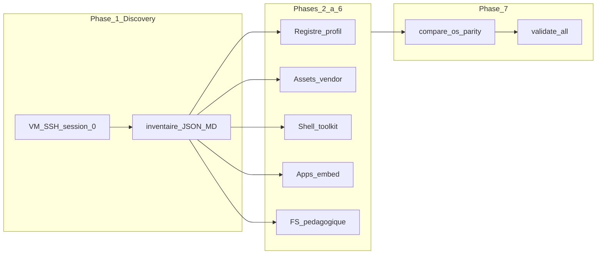

# Procédure — clonage d’un OS réel (VM) vers CapsuleOS

Objectif : reproduire de façon **fidèle et documentée** un environnement de bureau réel (assets, comportements, applications, système de fichiers simulé) dans la façade CapsuleOS correspondante, en s’appuyant sur une **VM comme ground truth** — **Linux Mint Cinnamon** sert de modèle de référence pour les clones suivants.

**Ce document = construction (clone).** Pour la **mesure** automatisée VM ↔ CapsuleOS, voir [`procedure-controle-distributions-reelles.md`](procedure-controle-distributions-reelles.md). Pour le **catalogue** sans VM, voir [`ajouter-os-scalable.md`](ajouter-os-scalable.md).

Références : [`contrib.md`](../../contrib.md) · [`etc/capsuleos/os-registry.json`](../../etc/capsuleos/os-registry.json) · [`mint-fenetres-muffin.md`](mint-fenetres-muffin.md) · [`apps-linux-par-distro.md`](apps-linux-par-distro.md) · [`politique-assets.md`](politique-assets.md)

---

## 1. Les trois couches (ne pas confondre)

| Couche | Document | Quand l’utiliser |
|--------|----------|------------------|
| **Catalogue** | [`ajouter-os-scalable.md`](ajouter-os-scalable.md) | Entrée registre, façade `<base href>`, profil, vendor pack minimal |
| **Clonage** | **ce fichier** | Parité VM : inventaire → implémentation → rapport d’écarts |
| **Contrôle** | [`procedure-controle-distributions-reelles.md`](procedure-controle-distributions-reelles.md) | Sonde JSON, `compare-os-parity.mjs`, checklist panel P0 |



---

## 2. Classification des écarts (P0 / P1 / P2 / CapsuleOnly)

Chaque différence VM ↔ CapsuleOS doit être **explicitement classée** dans le rapport de parité (`root/docs/inventaire-parite-<vendor>.md`).

| Niveau | Définition | Exemple Mint |
|--------|------------|--------------|
| **P0** | Comportement ou identité visible **bloquant** la fidélité pédagogique | `running-link` / minimize panel ; focus lanceur ; sidebar Nemo Documents |
| **P1** | Écart **documenté et assumé** (choix pédagogique ou limite technique) | Lanceurs fixes vs `grouped-window-list` ; calculatrice → terminal |
| **P2** | **Extension** souhaitée mais non bloquante | Icônes Mint-Y 48px ; noms thèmes GTK dans Paramètres |
| **CapsuleOnly** | Présent uniquement dans CapsuleOS | Checklist missions, lien retour accueil |

**Règle** : ne pas cloner « à l’aveugle » — l’inventaire VM précède tout patch massif du skin.

---

## 3. Phase 0 — Prérequis

### 3.1 Infrastructure VM

| Élément | Action |
|---------|--------|
| VM | 1 VM = 1 `registryId` stable (`linux-mint`, `linux-fedora-kde`, …) |
| Session | Bureau graphique actif (`DISPLAY=:0`) |
| SSH | Clé hôte → VM ; test : `ssh -i ~/.ssh/capsuleos-lab user@IP 'echo ok'` |
| Paquets sonde | `openssh-server`, `wmctrl`, `xdotool`, `python3` (+ bindings toolkit si besoin) |
| Snapshot | Proxmox « clean boot » avant chaque campagne de clonage |

Détail SSH et paquets : §3 de [`procedure-controle-distributions-reelles.md`](procedure-controle-distributions-reelles.md).

### 3.2 Inventaire lab (local)

Copier [`etc/capsuleos/lab-inventory.example.json`](../../etc/capsuleos/lab-inventory.example.json) vers `etc/capsuleos/lab-inventory.json` (gitignoré) et renseigner :

- `registryId`, `ssh`, `sshIdentity`, `probe`, `display`, `toolkit`, `capsuleUrl`

### 3.3 CapsuleOS sur la machine agent

```bash
cd /chemin/vers/CapsuleOS
node usr/lib/capsuleos/tools/validate-all.mjs    # baseline exit 0
python3 -m http.server 5500 --bind 127.0.0.1
```

Brief registre :

```bash
node usr/lib/capsuleos/tools/print-agent-brief.mjs <registryId>
```

### 3.4 Livrables de fin de phase 0

- [ ] `lab-inventory.json` à jour pour l’`registryId`
- [ ] `validate-all.mjs` vert
- [ ] Entrée `os-registry.json` existante ou plan de création documenté

---

## 4. Phase 1 — Discovery (inventaire ground truth)

### 4.1 But

Figer en JSON + Markdown ce que la VM expose : versions OS, panel, tray, thèmes, applications `.desktop`, favoris bureau, branding.

### 4.2 Sorties versionnées (convention de nommage)

| Fichier | Rôle |
|---------|------|
| `root/docs/inventaires/<registryId>-vm.json` | Snapshot machine-readable |
| `root/docs/inventaire-parite-<vendor>.md` | Tableau VM ↔ CapsuleOS + backlog P0/P1/P2 |

Modèle de rapport : [`templates/inventaire-parite-os.md.template`](templates/inventaire-parite-os.md.template).

### 4.3 Cinnamon (référence Mint)

| Élément | Chemin dépôt |
|---------|--------------|
| Script VM | [`root/tools/lab/vm-mint-inventory.sh`](../../root/tools/lab/vm-mint-inventory.sh) |
| Collecte hôte | `node usr/lib/capsuleos/tools/lab/collect-mint-inventory.mjs --write-doc` |

Exécution manuelle sur la VM :

```bash
ssh -i ~/.ssh/capsuleos-lab capsule@<IP> 'DISPLAY=:0 bash -s' < root/tools/lab/vm-mint-inventory.sh | python3 -m json.tool
```

### 4.4 Autres toolkits (méthode manuelle)

En attendant un script `vm-*-inventory.sh` par toolkit, remplir le JSON à la main selon l’annexe [§ B — Inventaire par toolkit](#b--inventaire-manuel-par-toolkit).

### 4.5 Contrat JSON inventaire (cible commune)

```json
{
  "toolkit": "cinnamon",
  "collectedAt": "ISO-8601",
  "os": { "release": "", "codename": "", "edition": "", "description": "" },
  "versions": { "shell": "", "explorer": "", "browser": "" },
  "panel": { "height": "", "applets": "", "launchers": [] },
  "themes": { "shell": "", "gtk": "", "icons": "", "wallpaper": "" },
  "tray": [],
  "apps": { "panelCore": [], "favorites": "", "desktopCount": 0 },
  "branding": { "logoCandidates": [] }
}
```

### 4.6 Livrables fin phase 1

- [ ] `<registryId>-vm.json` commité ou prêt à commit
- [ ] `inventaire-parite-<vendor>.md` initialisé depuis le template
- [ ] Chaque écart prévu classé P0/P1/P2

---

## 5. Phase 2 — Catalogue CapsuleOS (squelette)

Suivre [`ajouter-os-scalable.md`](ajouter-os-scalable.md) §2–4 en **alignant** l’inventaire VM.

| Étape | Fichiers |
|-------|----------|
| Registre | `etc/capsuleos/os-registry.json` |
| Profil | `etc/capsuleos/profiles/<id>.json` + `skin.profile.json` (façade + `home/`) |
| Version affichée | `home/.../content/profile-data.js` ← `os.release` / codename VM |
| Façade URL stable | `OS/linux/families/.../index.html` avec **`<base href>` vers le skin** |
| Miroir pédagogique | `home/<Vendor>/` |

**Leçon Mint** : ne **pas** éditer à la main le HTML dupliqué sous `OS/linux/...` — régénérer depuis le skin avec `node usr/lib/capsuleos/tools/linux/build-linux-facades.mjs` (injecte `<base href>` vers `home/`). Sinon l’accueil pick-os sert une version périmée.

Exemple façade :

```html
<base href="../../../../../home/Debian/Mint/">
```

Champs à caler sur l’inventaire : `bodyId`, `embedKey`, `toolkit`, `explorerTemplate` (ex. `nemo`).

### Livrables fin phase 2

- [ ] Entrée registre + profil + skin squelette ouvert en HTTP sans 404 critiques
- [ ] `profile-data.js` version = VM

---

## 6. Phase 3 — Clonage assets

Politique : **uniquement** `usr/share/capsuleos/assets/` et `home/public/Images/` — voir [`politique-assets.md`](politique-assets.md) et `.cursor/rules/capsuleos-assets.mdc`.

| Catégorie VM | Zone CapsuleOS | Action type |
|--------------|----------------|-------------|
| Fond d’écran | `assets/images/vendors/<vendor>/` | SCP depuis VM ; lier via variable CSS (`--mint`, etc.) |
| Icônes panel / bureau | `vendors/<vendor>/panel/` (ex. 48×48) | SCP thème icônes VM (`Mint-Y`, `breeze`, …) |
| Logo / favicon | `vendors/<vendor>/` | `logo.svg`, `.webp` |
| Chrome toolkit | `assets/images/toolkits/<toolkit>/` | **Réutiliser** le pack existant — pas de copie intégrale du thème OS |

### SCP type (Mint)

```bash
VENDOR=mint
DEST=usr/share/capsuleos/assets/images/vendors/$VENDOR/panel
mkdir -p "$DEST"
scp -i ~/.ssh/capsuleos-lab capsule@<IP>:/usr/share/icons/Mint-Y/apps/48/firefox.png "$DEST/"
scp -i ~/.ssh/capsuleos-lab capsule@<IP>:/usr/share/backgrounds/linuxmint/sele_ring.jpg \
  usr/share/capsuleos/assets/images/vendors/$VENDOR/default_background.jpg
```

Gate :

```bash
node usr/lib/capsuleos/tools/validate-asset-zones.mjs
```

### Livrables fin phase 3

- [ ] Assets référencés dans `index.html` / CSS du skin
- [ ] `validate-asset-zones` OK

---

## 7. Phase 4 — Shell, panel, effets (toolkit partagé)

**Interdit** : forker `contentLoader`, `CapsuleWindow`, ou dupliquer la logique panel dans chaque skin.

**Noyau partagé** (à étendre une seule fois par toolkit) :

| Comportement | Fichier noyau |
|--------------|---------------|
| Lanceurs running / active | `usr/lib/capsuleos/shells/linux/taskbar-launcher-state.js` |
| Liste fenêtres panel | `usr/lib/capsuleos/shells/linux/taskbar-window-list.js` |
| Minimize / close | `usr/lib/capsuleos/shells/common/capsule-window-shell.js`, `capsule-window-header-buttons.js` |
| Cinnamon : Alt+Tab, tiling, double-clic titre | `cinnamon-alt-tab.js`, `cinnamon-window-behaviors.js`, `edge-tiling.js` |

**Surcouches skin** (si parité locale uniquement) :

- CSS tray / panel : `home/.../style/footer.css`
- JS local : ex. `content/mint-menu-parity.js`, `content/mint-desktop-favorites.js`

Référence comportements Mint : [`mint-fenetres-muffin.md`](mint-fenetres-muffin.md), [`convention-contexte-fenetres.md`](convention-contexte-fenetres.md).

### Vérification comportement P0

```bash
PLAYWRIGHT_SKIP_BROWSER_DOWNLOAD=1 node usr/lib/capsuleos/tools/lab/run-capsule-panel-browser.mjs
node usr/lib/capsuleos/tools/lab/compare-os-parity.mjs --id <registryId> --scenario panel-checklist
```

### Livrables fin phase 4

- [ ] Checklist panel CapsuleOS 6/6 (ou écarts P1 documentés)
- [ ] Tray / panel alignés sur inventaire (au moins visuellement P1)

---

## 8. Phase 5 — Applications et fonctionnalités

Cartographier `apps.panelCore`, `apps.favorites` et le menu vers les slots `data-link` CapsuleOS — voir [`apps-linux-par-distro.md`](apps-linux-par-distro.md).

| Signal VM | Slot / gabarit CapsuleOS |
|-----------|--------------------------|
| `nemo.desktop` / `dolphin.desktop` / `org.gnome.Nautilus.desktop` | `nemo` (+ `CAPSULE_EXPLORER_TEMPLATE`) |
| `firefox.desktop` | `firefox` → `firefox.html` |
| Terminal `.desktop` | `terminal` |
| Logithèque / Software / Discover | `update_manager` (+ variante HTML si besoin) |
| Paramètres thème | `themes` → `themes.html` |
| Favoris bureau | raccourcis `#desktop` + `data-link` ou script skin |

Après modification des gabarits :

```bash
node usr/lib/capsuleos/tools/linux/build-linux-embed.mjs
```

Smoke : ouvrir chaque slot P0 depuis le panel et le menu.

### Livrables fin phase 5

- [ ] Mapping `.desktop` → `data-link` dans le rapport parité
- [ ] Embed régénéré si templates touchés

---

## 9. Phase 6 — Système de fichiers pédagogique

| Élément | Outil / convention |
|---------|-------------------|
| Racine utilisateur simulée | `CAPSULE_CONTENT_ROOT` via `CapsuleUserHome` |
| Manifeste explorateur | `node usr/lib/capsuleos/tools/generate-public-manifest.mjs` |
| Sidebar Nemo | Liens `Documents`, `Téléchargements`, etc. alignés sur la VM si pertinent |
| Médias communs | `home/public/Images/` uniquement |

**Critère P0** (comparateur) : action sidebar Nemo → `Documents` reflétée dans l’état explorateur (`compare-os-parity` étape 5).

### Livrables fin phase 6

- [ ] Navigation Nemo cohérente avec l’arborescence documentée
- [ ] Pas de chemins médias hors zones autorisées

---

## 10. Phase 7 — Vérification et clôture (H6)

Ordre recommandé :

```bash
# 1 — Rafraîchir inventaire / rapport (Mint : script dédié)
node usr/lib/capsuleos/tools/lab/collect-mint-inventory.mjs --write-doc

# 2 — Parité comportement panel
node usr/lib/capsuleos/tools/lab/compare-os-parity.mjs --id <registryId> --scenario panel-checklist

# 3 — Gate dépôt
node usr/lib/capsuleos/tools/validate-all.mjs

# 4 — Brief agent
node usr/lib/capsuleos/tools/print-agent-brief.mjs <registryId> --write
```

Mettre à jour `inventaire-parite-<vendor>.md` : écarts **résolus**, P1 **assumés**, P2 **livré** ou backlog.

Checklist globale : [`templates/clone-os-checklist.md`](templates/clone-os-checklist.md).

### Livrables fin phase 7

- [ ] `validate-all.mjs` exit 0
- [ ] Rapport parité à jour
- [ ] Brief agent mentionnant l’inventaire VM (`root/docs/inventaires/<registryId>-vm.json`)

---

## 11. Réplication sur un autre OS Linux

Procédure sans script d’inventaire dédié (hors Mint) :

1. Choisir un **skin proche** (même `toolkit` dans le registre).
2. Phases 0–1 : VM + inventaire manuel (annexe § B).
3. Phase 2 : [`ajouter-os-scalable.md`](ajouter-os-scalable.md).
4. Phases 3–6 : adapter vendor pack et surcouches ; **ne pas** recréer le noyau panel.
5. Brancher [`root/tools/lab/os-probe.sh`](../../root/tools/lab/os-probe.sh) pour le toolkit cible.
6. Définir le mapping **lanceurs VM ↔ slots `data-link`** avant `compare-os-parity.mjs`.
7. Documenter tous les écarts dans `inventaire-parite-<vendor>.md`.

---

## Annexe A — Référence `linux-mint` (modèle)

Source de vérité pour les clones Cinnamon / dérivés Mint.

### A.1 Artefacts livrés

| Domaine | Fichiers / zones | Priorité |
|---------|------------------|----------|
| Inventaire | `root/docs/inventaires/linux-mint-vm.json`, `root/docs/inventaire-parite-mint-vm.md` | Phase 1 |
| Assets | `usr/share/capsuleos/assets/images/vendors/mint/panel/*.png`, `default_background.jpg` | P2 |
| Fond CSS | `usr/share/capsuleos/themes/global/variables-portal.css` (`--mint`) | P2 |
| Skin | `home/Debian/Mint/index.html`, `style/footer.css`, `style/style.css` | P1 |
| Parité menu | `home/Debian/Mint/content/mint-menu-parity.js` | P1 |
| Favoris bureau | `home/Debian/Mint/content/mint-desktop-favorites.js` | P1 |
| Comportements WM | `taskbar-launcher-state.js`, `cinnamon-*.js`, `edge-tiling.js` | P0 |
| Façade | `OS/linux/families/debian/mint/index.html` (`<base href>` uniquement) | Phase 2 |
| Profil | `home/Debian/Mint/skin.profile.json`, `content/profile-data.js` (22.3 Zena) | Phase 2 |

### A.2 Commandes opérationnelles

```bash
node usr/lib/capsuleos/tools/lab/collect-mint-inventory.mjs --write-doc
PLAYWRIGHT_SKIP_BROWSER_DOWNLOAD=1 node usr/lib/capsuleos/tools/lab/run-capsule-panel-browser.mjs
node usr/lib/capsuleos/tools/lab/compare-os-parity.mjs --id linux-mint --scenario panel-checklist
node usr/lib/capsuleos/tools/validate-all.mjs
```

URL locale : `http://127.0.0.1:5500/home/Debian/Mint/index.html`

### A.3 Écarts assumés (à recopier comme modèle P1)

| Écart VM | CapsuleOS | Classification |
|----------|-----------|----------------|
| Panel : `grouped-window-list` | Lanceurs fixes + `#taskbar-window-list` | P1 pédagogie |
| Calculatrice GNOME | Ouvre menu → raccourci → terminal | P1 simulation |
| Applet `themes` absent du panel VM | Slot `themes` + checklist | P2 / CapsuleOnly |
| `xed` dans favoris VM | Non cloné en raccourci bureau | P2 backlog |
| Sonde VM étape Firefox focus | Fragile multi-fenêtres | P1 lab |

### A.4 Docs complémentaires Mint

- [`mint-fenetres-muffin.md`](mint-fenetres-muffin.md) — comportements fenêtres
- [`inventaire-parite-mint-vm.md`](inventaire-parite-mint-vm.md) — rapport courant

---

## Annexe B — Inventaire manuel par toolkit

Checklist à cocher lors de la phase 1 si aucun script `vm-*-inventory.sh` n’existe.

### B.1 Cinnamon (Mint, LMDE, …)

| Donnée | Commande / source VM |
|--------|----------------------|
| Version OS | `/etc/linuxmint/info` ou `/etc/os-release` |
| Thème Cinnamon | `gsettings get org.cinnamon.theme name` |
| GTK / icônes | `gsettings get org.cinnamon.desktop.interface gtk-theme` · `icon-theme` |
| Fond | `gsettings get org.cinnamon.desktop.background picture-uri` |
| Applets panel | `gsettings get org.cinnamon enabled-applets` |
| Favoris | `gsettings get org.cinnamon favorite-apps` |
| Versions | `cinnamon --version`, `nemo --version`, `firefox --version` |
| Icônes 48px | `/usr/share/icons/Mint-Y*/apps/48/` |

### B.2 KDE Plasma

| Donnée | Commande / source VM |
|--------|----------------------|
| Version Plasma | `plasmashell --version` |
| Thème global | `lookandfeel` / `kreadconfig6` |
| Favoris panel | configuration Plasma / fichiers `~/.config/plasma*` |
| Explorateur | `dolphin --version` |
| Icônes | `/usr/share/icons/breeze/` |

### B.3 GNOME

| Donnée | Commande / source VM |
|--------|----------------------|
| Version GNOME | `gnome-shell --version` |
| Thème | `gsettings get org.gnome.desktop.interface gtk-theme` |
| Fond | `gsettings get org.gnome.desktop.background picture-uri` |
| Apps favoris | dossier `~/.local/share/gnome-shell/` ou extensions |
| Fichiers | `nautilus --version` |

---

## Annexe C — Hors périmètre (sprints suivants)

| Sujet | Renvoi |
|-------|--------|
| `collect-os-inventory.mjs` générique | Dupliquer le modèle Mint par toolkit |
| CI `lab-parity.yml` | [`procedure-controle`](procedure-controle-distributions-reelles.md) §11 |
| Windows / macOS / mobile | §8 de [`procedure-controle-distributions-reelles.md`](procedure-controle-distributions-reelles.md) |
| noVNC comme canal P0 | Secours visuel uniquement |

---

## Résumé une phrase

**Inventorier la VM en JSON**, **implémenter le skin en réutilisant le toolkit noyau**, **classer chaque écart**, **valider avec `compare-os-parity` + `validate-all`**, **documenter dans `inventaire-parite-*` et l’annexe Mint** pour cloner le prochain OS sans repartir de zéro.
