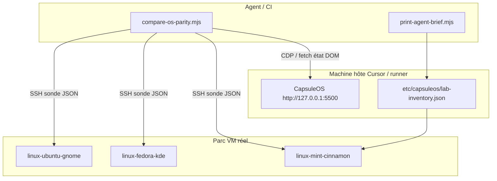

# Procédure — contrôle des distributions réelles pour nourrir CapsuleOS

Objectif : permettre à un **agent IA** (ou à la CI) de **lire l’état** et **enchaîner des scénarios** sur des OS réels (Mint, Fedora KDE, Ubuntu GNOME, etc.), puis de **comparer** avec la façade CapsuleOS correspondante — sans dépendre des clics noVNC / DistroSea.

**Principe** : la vérité machine-readable (JSON) remplace la vérité visuelle (canvas VNC).

**Construction (clone)** : pour nourrir CapsuleOS depuis une VM (assets, apps, FS, comportements), suivre d’abord [`procedure-clonage-os-depuis-vm.md`](procedure-clonage-os-depuis-vm.md), puis utiliser **ce document** pour mesurer la parité.

Références : [`contrib.md`](../../contrib.md) · [`etc/capsuleos/os-registry.json`](../../etc/capsuleos/os-registry.json) · [`ajouter-os-scalable.md`](ajouter-os-scalable.md) · [`procedure-clonage-os-depuis-vm.md`](procedure-clonage-os-depuis-vm.md) · [`mint-fenetres-muffin.md`](mint-fenetres-muffin.md)

---

## 1. Ce qui ne suffit pas (à connaître)

| Canal | Limite pour l’agent |
|-------|---------------------|
| noVNC / Proxmox | Pas de DOM Cinnamon/KDE/GNOME ; clics pixel fragiles |
| DistroSea | Même stack noVNC ; pratique pour humain, pas pour automatisation fiable |
| Vidéo seule | Audit visuel ; pas de diff structuré |
| CapsuleOS seul | Parité interne, pas de ground truth OS réel |

**Conclusion** : il faut une **sonde** sur chaque VM réelle + **CapsuleOS en HTTP local** sur la machine qui exécute l’agent.

---

## 2. Architecture cible



| Couche | Rôle |
|--------|------|
| **Inventaire lab** | Lie `os-registry.id` → IP SSH, utilisateur, toolkit, checklist |
| **Sonde réelle** | Script sur la VM : fenêtres, focus, lanceurs, chemins Nemo/Dolphin |
| **CapsuleOS** | Même schéma JSON via CDP (`Runtime.evaluate`) |
| **Comparateur** | Diff étape par étape ; rapport OK / écart P1 / blocage |

---

## 3. Prérequis infrastructure (vous, une fois)

### 3.1 Parc de VMs

| VM minimale | Toolkit | Usage |
|-------------|---------|--------|
| Mint 22.x Cinnamon | `cinnamon` | Référence P0 panel / Nemo / Muffin |
| Une distro KDE (Fedora / openSUSE / MX) | `kde` | Dolphin, panel Plasma |
| Une distro GNOME (Ubuntu / Fedora Workstation) | `gnome` | Nautilus, barre activités |
| Optionnel Cosmic / Pantheon | `cosmic` / `pantheon` | Quand entrée registre P1+ |

**Règles** :

- 1 VM = 1 entrée `os-registry.json` (`id` stable, ex. `linux-mint`).
- Réseau : IP fixe ou DHCP réservé ; **ping + SSH** depuis la machine Cursor.
- Snapshot Proxmox « clean boot » avant chaque campagne de parité.

### 3.2 Accès SSH (obligatoire pour contrôle total)

Sur **chaque** VM Linux :

```bash
sudo apt install openssh-server wmctrl xdotool python3 python3-gi gir1.2-meta-3.0
# KDE : sudo apt install wmctrl qdbus-qt6 (ou équivalent Plasma)
```

**RHEL / Rocky / Alma (dnf, GNOME Wayland)** : voir [lab-vm-rhel-wayland.md](lab-vm-rhel-wayland.md) — `crb` + EPEL + `wmctrl` ; `DISPLAY=:0` **et** `XAUTHORITY` (cookie `.mutter-Xwaylandauth.*`) ; `xdotool` souvent absent sur el10.

Sur la **machine hôte** (où tourne Cursor) :

```bash
ssh-keygen -t ed25519 -f ~/.ssh/capsuleos-lab -N ""
ssh-copy-id -i ~/.ssh/capsuleos-lab.pub mint@<IP_VM_MINT>
# Répéter pour chaque VM
```

Tester :

```bash
ssh -i ~/.ssh/capsuleos-lab mint@<IP> 'echo ok && wmctrl -l'
```

### 3.3 CapsuleOS local

Depuis la racine du dépôt :

```bash
python3 -m http.server 5500 --bind 127.0.0.1
# Façade : http://127.0.0.1:5500/home/Debian/Mint/index.html
# ou skin indiqué par print-agent-brief.mjs <id>
```

Gate avant toute campagne :

```bash
node usr/lib/capsuleos/tools/validate-all.mjs
```

### 3.4 Fichier inventaire lab (à créer)

Chemin proposé : `etc/capsuleos/lab-inventory.json` (non versionné secrets si besoin — voir variante `.local.json` gitignorée).

Exemple :

```json
{
  "version": 1,
  "hosts": [
    {
      "registryId": "linux-mint",
      "ssh": "capsule@192.168.1.146",
      "sshIdentity": "~/.ssh/capsuleos-lab",
      "probe": "/opt/capsuleos-lab/os-probe.sh",
      "display": ":0",
      "toolkit": "cinnamon"
    },
    {
      "registryId": "linux-rocky",
      "ssh": "capsule@192.168.122.234",
      "sshIdentity": "~/.ssh/capsuleos-lab",
      "display": ":0",
      "sessionType": "wayland-xwayland",
      "xauthorityDiscovery": "mutter-xwayland",
      "toolkit": "gnome"
    },
    {
      "registryId": "linux-fedora-kde",
      "ssh": "user@192.168.1.103",
      "sshIdentity": "~/.ssh/capsuleos-lab",
      "probe": "/opt/capsuleos-lab/os-probe.sh",
      "display": ":0",
      "toolkit": "kde"
    }
  ]
}
```

L’agent lit ce fichier pour savoir **où** envoyer les commandes.

### 3.5 Inventaire Mint (assets, panel, thèmes)

Phase 1 du [clonage depuis VM](procedure-clonage-os-depuis-vm.md#4-phase-1--discovery-inventaire-ground-truth). Pour **linux-mint** :

```bash
node usr/lib/capsuleos/tools/lab/collect-mint-inventory.mjs --write-doc
```

Sorties : `root/docs/inventaires/linux-mint-vm.json`, `root/docs/inventaire-parite-mint-vm.md`. Script VM : `root/tools/lab/vm-mint-inventory.sh`.

---

## 3bis. Mesure après clonage

Une fois les phases 2–6 du clonage terminées ([`procedure-clonage-os-depuis-vm.md`](procedure-clonage-os-depuis-vm.md)) :

1. Rafraîchir l’inventaire / rapport parité (`collect-mint-inventory.mjs --write-doc` ou équivalent).
2. Exécuter `compare-os-parity.mjs --id <registryId> --scenario panel-checklist`.
3. Clôturer avec `validate-all.mjs` (phase 7 du clonage).

Checklist copiable : [`templates/clone-os-checklist.md`](templates/clone-os-checklist.md).

---

## 4. Sonde OS réelle (à déployer sur chaque VM)

### 4.1 Installation

Sur la VM (une fois) :

```bash
sudo mkdir -p /opt/capsuleos-lab
sudo curl -o /opt/capsuleos-lab/os-probe.sh \
  https://raw.githubusercontent.com/N0r3f/CapsuleOS/main/root/tools/lab/os-probe.sh
sudo chmod +x /opt/capsuleos-lab/os-probe.sh
```

*(Le script sera ajouté au dépôt ; en attendant, copier depuis `root/tools/lab/os-probe.sh` après `git pull`.)*

### 4.2 Contrat JSON (sortie sonde)

Schéma commun **toutes distros Linux** :

```json
{
  "toolkit": "cinnamon",
  "timestamp": "2026-06-03T12:00:00Z",
  "focused": { "wmClass": "nemo", "title": "Home" },
  "windows": [
    { "id": "0x…", "title": "Home", "wmClass": "nemo", "state": "focused" },
    { "id": "0x…", "title": "Firefox", "wmClass": "Firefox", "state": "hidden" }
  ],
  "launchers": {
    "nemo": { "running": true, "active": true },
    "firefox": { "running": true, "active": false }
  },
  "actions": { "last": "focus-launcher", "slot": "nemo" }
}
```

| Champ | Source typique |
|-------|----------------|
| `windows` | `wmctrl -l` + parsing |
| `focused` | `xdotool getactivewindow` + `xprop` |
| `launchers` (Cinnamon) | D-Bus Cinnamon ou heuristique barre + classes WM |
| `launchers` (KDE) | `qdbus` Plasma task manager |
| `launchers` (GNOME) | `gdbus` Shell ou classes WM |

### 4.3 Actions pilotées par l’agent

La sonde accepte des **sous-commandes** (à implémenter progressivement) :

```bash
/opt/capsuleos-lab/os-probe.sh state
/opt/capsuleos-lab/os-probe.sh action open-launcher nemo
/opt/capsuleos-lab/os-probe.sh action open-launcher firefox
/opt/capsuleos-lab/os-probe.sh action focus-launcher nemo
/opt/capsuleos-lab/os-probe.sh action minimize-launcher nemo
/opt/capsuleos-lab/os-probe.sh action nemo-sidebar Documents
```

L’agent n’utilise **plus** le canvas VNC pour ces étapes.

---

## 5. Côté CapsuleOS (miroir du contrat)

Fonction d’état (déjà utilisable en CDP navigateur) — à centraliser dans `usr/lib/capsuleos/tools/lab/capsule-probe.mjs` :

| Champ | Sélecteur / API |
|-------|-----------------|
| `launchers` | `footer nav a[target="windowElement"]` + `running-link` / `active-link` |
| `windows` | `#taskbar-window-list`, `.windowElement[data-link]` |
| `focused` | `.windowElementActive` |
| Actions | `openWindowByDataLink('<slot>')`, clic sidebar Nemo `a[data-link="Documents"]` |

Brief par OS :

```bash
node usr/lib/capsuleos/tools/print-agent-brief.mjs linux-mint
```

---

## 6. Comparateur (agent / CI)

Script cible : `node usr/lib/capsuleos/tools/lab/compare-os-parity.mjs --id linux-mint --scenario panel-checklist`

| Étape | Scénario | Attendu |
|-------|----------|---------|
| 0 | Nemo seul, focus Nemo | `launchers.nemo.active` |
| 1 | + Firefox, focus FF | FF active, Nemo running |
| 2 | + Terminal, focus Term | Term active, 3 running |
| 3 | Clic lanceur Nemo | Nemo active |
| 4 | Re-clic Nemo (minimize) | Nemo hidden ; **P1** : running peut rester true sur Cinnamon |
| 5 | Sidebar Documents | `currentPath` → Documents, 1 fenêtre Nemo |

Sortie : rapport Markdown + exit code ≠ 0 si régression P0.

---

## 7. Procédure par nouvelle distribution

Pour chaque entrée `os-registry.json` : **clone** [`procedure-clonage-os-depuis-vm.md`](procedure-clonage-os-depuis-vm.md) puis **mesure** (ce document). Catalogue minimal : [`ajouter-os-scalable.md`](ajouter-os-scalable.md).

| # | Action | Responsable |
|---|--------|-------------|
| 1 | Créer / allouer VM avec le bon DE (live ou installé) | Humain |
| 2 | SSH + paquets sonde (§ 3.2) | Humain |
| 3 | Ajouter ligne dans `lab-inventory.json` | Humain |
| 4 | `print-agent-brief.mjs <id> --write` | Agent |
| 5 | Implémenter façade + skin CapsuleOS | Agent |
| 6 | Adapter branche `os-probe.sh` si toolkit ≠ cinnamon | Agent |
| 7 | Exécuter `compare-os-parity.mjs --id <id>` | Agent |
| 8 | Corriger écarts P0 ; documenter P1 dans brief | Agent |
| 9 | `validate-all.mjs` vert | Agent |

**Ne pas** dupliquer la logique panel dans le skin : toolkit partagé sous `usr/lib/capsuleos/shells/linux/`.

---

## 8. Familles hors Linux (Windows, macOS, Android, iOS)

| Famille | Contrôle « total » réaliste |
|---------|----------------------------|
| **Linux** | SSH + sonde X11/Wayland (priorité) |
| **Windows** | VM + WinRM/PowerShell + UI Automation, ou session RDP instrumentée |
| **macOS** | VM Apple + `osascript` / Accessibilité (réseau local) |
| **Android / iOS** | Émulateur (AVD / Simulator) + `adb` / `simctl` ; pas Proxmox noVNC |

Même inventaire `lab-inventory.json` avec champ `family` et `probeType` : `ssh-x11` | `winrm` | `adb` | `manual`.

---

## 9. Session agent type (checklist)

**Avant** de demander à l’agent une comparaison :

- [ ] `validate-all.mjs` vert sur le dépôt
- [ ] Serveur HTTP CapsuleOS sur 5500
- [ ] VM allumée, SSH OK
- [ ] `lab-inventory.json` à jour pour l’`registryId`
- [ ] Snapshot VM « clean » ou état documenté
- [ ] Embed régénéré si gabarits `usr/share/capsuleos/linux/apps/*.html` modifiés

**Pendant** :

- [ ] Agent utilise `compare-os-parity.mjs` ou sonde + CDP (pas noVNC seul pour P0)
- [ ] Signaler **OK** / **BLOCAGE** / **ATTENTE MANUELLE** par étape

**Après** :

- [ ] Écarts P1 notés dans `root/docs/briefs/<id>.md`
- [ ] Commit seulement si gate vert

---

## 10. noVNC / DistroSea (rôle réduit)

Conserver pour :

- capture visuelle ponctuelle ;
- démo pédagogique ;
- calibrage coords si la sonde SSH est indisponible.

**Ne plus** l’utiliser comme canal principal de parité P0.

Voir coords de secours : section « Comparaison VM » dans [`contrib.md`](../../contrib.md).

---

## 11. Roadmap outillage dépôt

| Priorité | Fichier | Statut |
|----------|---------|--------|
| P0 | `etc/capsuleos/lab-inventory.json` (exemple) | À ajouter |
| P0 | `root/tools/lab/os-probe.sh` | À ajouter |
| P0 | `usr/lib/capsuleos/tools/lab/compare-os-parity.mjs` | À ajouter |
| P1 | `usr/lib/capsuleos/tools/lab/capsule-probe.mjs` | À ajouter |
| P1 | Branches KDE/GNOME dans `os-probe.sh` | À ajouter |
| P2 | Job CI `.github/workflows/lab-parity.yml` | Optionnel |

---

## 12. Résumé une phrase

**Vous** fournissez un parc VM accessible en SSH et un inventaire ; **le dépôt** fournit une sonde JSON + un comparateur ; **l’agent** pilote les deux mondes avec le même schéma et nourrit CapsuleOS sans cliquer dans noVNC.

Pour démarrer Mint immédiatement : une VM `linux-mint`, clé SSH sur la machine Cursor, puis demander à l’agent d’implémenter les fichiers § 11 à partir de cette procédure.
