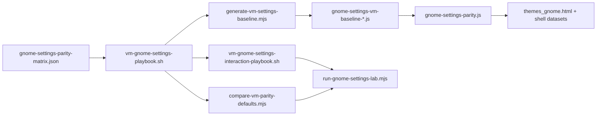

# Procédure — création d’un playbook Paramètres GNOME

> **Objectif** : documenter la chaîne reproductible pour créer, étendre et valider un **playbook lab** aligné sur `gnome-control-center` et `gsettings`, puis l’injecter dans CapsuleOS (`gnome-settings-parity.js` + UI Paramètres).

**Contexte** : référence implémentée pour **Rocky Linux 10 GNOME** (`linux-rocky`). Réutilisable pour Fedora, Alma, Ubuntu GNOME avec adaptation de la matrice et du `registryId`.

**Documents liés** :

| Document | Rôle |
|----------|------|
| [procedure-lab-linux-rocky-gnome.md](procedure-lab-linux-rocky-gnome.md) | Passe lab VM → skin (prérequis SSH, HTTP) |
| [procedure-audit-vm-profonde.md](procedure-audit-vm-profonde.md) | Audit interactif global (phases JSON) |
| [lab-vm-rhel-wayland.md](lab-vm-rhel-wayland.md) | Infra Wayland / `XAUTHORITY` |
| [inventaires/linux-rocky-gnome-settings-playbook.md](inventaires/linux-rocky-gnome-settings-playbook.md) | Dernier rapport lecture seule |
| [inventaires/linux-rocky-gnome-settings-interaction.md](inventaires/linux-rocky-gnome-settings-interaction.md) | Dernier rapport interactions |

---

## 1. Les trois niveaux de playbook

| Niveau | Script VM | Rôle | Livrable |
|--------|-----------|------|----------|
| **Inventaire statique** | `root/tools/lab/vm-gnome-settings-inventory.sh` | Snapshot `gsettings` global (sans ouvrir l’UI) | `linux-rocky-gnome-settings-parity.json` |
| **Tour des panneaux** | `root/tools/lab/vm-gnome-settings-playbook.sh` | Ouvre chaque panneau `gnome-control-center`, lit `gsettings`, mappe → CapsuleOS | `*-gnome-settings-playbook.json` + `.md` |
| **Interactions** | `root/tools/lab/vm-gnome-settings-interaction-playbook.sh` | Ouvre panneau, bascule valeur, `gsettings monitor`, restaure | `*-gnome-settings-interaction.json` + `.md` |



---

## 2. Prérequis

Identiques à [procedure-lab-linux-rocky-gnome.md](procedure-lab-linux-rocky-gnome.md) §0 :

- VM avec session **GDM ouverte** (utilisateur `capsule` ou équivalent)
- `etc/capsuleos/lab-inventory.json` renseigné (`registryId`, `ssh`, `display: ":0"`)
- `gnome-control-center` installé (`/usr/bin/gnome-control-center`)
- Clé SSH `~/.ssh/capsuleos-lab`

**Variables d’environnement obligatoires en SSH** (injectées par les collecteurs) :

```bash
export DISPLAY=:0
export XDG_CURRENT_DESKTOP=GNOME
export GNOME_SHELL_SESSION_MODE=default
export DESKTOP_SESSION=gnome
export DBUS_SESSION_BUS_ADDRESS=unix:path=/run/user/$(id -u)/bus
export XAUTHORITY=$(ls /run/user/$(id -u)/.mutter-Xwaylandauth.* 2>/dev/null | head -1)
```

Sans `XDG_CURRENT_DESKTOP=GNOME`, `gnome-control-center` quitte avec *« only supported under GNOME »*.

**Limites EL10** : pas de `xdotool` → les interactions passent par `gsettings set` / `nmcli` / `rfkill` (même persistance que l’UI). Le panneau gcc est ouvert pour le contexte session.

---

## 3. Fichiers du dépôt (référence)

| Fichier | Rôle |
|---------|------|
| `root/tools/lab/gnome-settings-parity-matrix.json` | **Source de vérité** : 18 panneaux, contrôles, clés `gsettings`, mappeurs |
| `root/tools/lab/vm-gnome-settings-inventory.sh` | Inventaire statique |
| `root/tools/lab/vm-gnome-settings-playbook.sh` | Tour panneaux + lecture |
| `root/tools/lab/vm-gnome-settings-interaction-playbook.sh` | Bascule + monitor + restauration |
| `usr/lib/capsuleos/shells/linux/gnome-settings-parity.js` | Moteur CapsuleOS (handlers, persistance, datasets) |
| `usr/lib/capsuleos/tools/lab/collect-vm-gnome-settings-playbook.mjs` | Collecte SSH → inventaire |
| `usr/lib/capsuleos/tools/lab/collect-vm-gnome-settings-interaction.mjs` | Collecte interactions SSH |
| `usr/lib/capsuleos/tools/lab/generate-vm-settings-baseline.mjs` | Génère baseline JS/JSON depuis playbook |
| `usr/lib/capsuleos/tools/lab/compare-vm-parity-defaults.mjs` | Dérive défauts parity ↔ VM |
| `usr/lib/capsuleos/tools/lab/verify-gnome-settings-parity-chain.mjs` | Chaîne matrice ↔ HTML ↔ baseline ↔ VM |
| `usr/lib/capsuleos/tools/lab/run-gnome-settings-lab.mjs` | Suite lab complète |

Intégration audit profond : `node usr/lib/capsuleos/tools/lab/collect-vm-deep-audit.mjs --id linux-rocky --phase settings-playbook` (ou `settings-interaction`).

Playbooks deep audit : `bash root/tools/lab/vm-gnome-deep-playbooks.sh list` → `settings-panels-tour`, `settings-interactions`.

---

## 4. Créer ou étendre un playbook — pas à pas

### Étape 1 — Inventorier le panneau VM

Sur la VM (ou via SSH) :

```bash
# Lister les sous-commandes gcc (GNOME 47)
gnome-control-center --version
gnome-control-center wifi &   # valider que le panneau s’ouvre

# Lire les clés gsettings du panneau
gsettings list-recursively org.gnome.mutter | head
gsettings get org.gnome.mutter dynamic-workspaces
```

Collecte statique depuis l’hôte :

```bash
ssh -i ~/.ssh/capsuleos-lab capsule@<IP> 'bash -s' \
  < root/tools/lab/vm-gnome-settings-inventory.sh \
  > root/docs/inventaires/linux-rocky-gnome-settings-parity.json
```

### Étape 2 — Ajouter l’entrée dans la matrice

Éditer `root/tools/lab/gnome-settings-parity-matrix.json` :

```json
{
  "id": "multitasking",
  "capsulePanel": "multitasking",
  "label": "Multitâche",
  "gccArgv": ["multitasking"],
  "titleHints": ["Multitâche", "Multitasking"],
  "controls": [
    {
      "id": "dynamic-workspaces",
      "type": "select",
      "capsuleKey": "gnome-dynamic-workspaces",
      "schema": "org.gnome.mutter",
      "key": "dynamic-workspaces",
      "map": "enabledLabelFr"
    }
  ],
  "gsettings": [
    ["org.gnome.mutter", "dynamic-workspaces"]
  ]
}
```

**Champs obligatoires** :

| Champ | Description |
|-------|-------------|
| `id` / `capsulePanel` | Identifiant panneau (`data-gnome-settings-panel` dans `themes_gnome.html`) |
| `gccArgv` | Arguments `gnome-control-center` (premier qui lance le processus gagne) |
| `controls[].capsuleKey` | Clé `localStorage` CapsuleOS |
| `controls[].schema` + `key` | Paire `gsettings` (si mappable) |
| `controls[].map` | Nom du mappeur Python dans le playbook (`boolOnOff`, `enabledLabelFr`, …) |
| `controls[].source` | Si pas de gsettings : `nmcli-wifi`, `nmcli-bluetooth`, `powerprofilesctl`, `simulated` |

**Mappeurs disponibles** (dans `vm-gnome-settings-playbook.sh`) : `boolOnOff`, `enabledLabelFr`, `workspaceOnlyInverted`, `mouseHandedness`, `scrollDirection`, `touchpadEnabled`, `privacyInverted`, `gtkHighContrast`, `colorScheme`, `accentColor`, `soundTheme`, `textScalingPercent`, `pointerSpeedPercent`, `keyboardDelayMs`, `lockDelayFr`, `powerDimTimeout`, `powerSleepType`, `keyboardLayoutFr`, `searchProvidersInverted`.

### Étape 3 — Câbler CapsuleOS

1. **HTML** — `usr/share/capsuleos/linux/apps/themes_gnome.html`  
   - Switch : `data-settings-switch="<id>"`  
   - Select : `data-settings-apply="<id>"` + `data-settings-select="opt1|opt2"`  
   - Slider : `data-settings-slider="<id>"`  
   - Cas spéciaux : `data-theme-option`, `data-accent-chip`, `data-contrast-option`, etc.

2. **Handler** — `usr/lib/capsuleos/shells/linux/gnome-settings-parity.js`  
   - Entrée dans `SWITCH_HANDLERS`, `SELECT_HANDLERS` ou `SLIDER_HANDLERS`  
   - Effet shell via `document.documentElement.dataset.*` ou délégation `CapsuleThemeStorage`

3. **Smoke statique** :

```bash
node usr/lib/capsuleos/tools/lab/smoke-gnome-settings-playbook.mjs
```

### Étape 4 — Exécuter le tour des panneaux (playbook lecture)

```bash
# Un panneau (debug)
node usr/lib/capsuleos/tools/lab/collect-vm-gnome-settings-playbook.mjs \
  --id linux-rocky --panel multitasking

# Complet
node usr/lib/capsuleos/tools/lab/collect-vm-gnome-settings-playbook.mjs --id linux-rocky
```

**Critères de succès** :

- `summary.panelsOpened` = nombre de panneaux dans la matrice (ex. 18/18)
- Chaque contrôle `mapped` a `capsuleExpected` cohérent avec l’UI CapsuleOS
- `compare-vm-parity-defaults.mjs --strict` → 0 dérive

### Étape 5 — Playbook interactions (bascule + monitor)

```bash
node usr/lib/capsuleos/tools/lab/collect-vm-gnome-settings-interaction.mjs --id linux-rocky
```

Pour chaque contrôle avec `schema`/`key` :

1. Ouvre le panneau gcc  
2. Lance `gsettings monitor schema key`  
3. `gsettings set` vers valeur alternative  
4. Vérifie le changement  
5. Restaure la valeur initiale  

Contrôles **ignorés** volontairement : fond d’écran, volume (%), DND shell pur, `powerprofilesctl` absent, Wi-Fi sans carte HW.

**Critère** : `summary.failed` = 0.

### Étape 6 — Générer la baseline VM → CapsuleOS

```bash
node usr/lib/capsuleos/tools/lab/generate-vm-settings-baseline.mjs --registry linux-rocky
```

Produit :

- `usr/share/capsuleos/linux/gnome-settings-vm-baseline-linux-rocky.json`
- `usr/lib/capsuleos/shells/linux/gnome-settings-vm-baseline-linux-rocky.js`

Charger le script **avant** `gnome-settings-parity.js` dans `home/RedHat/Rocky/index.html` :

```html
<script src="../../../usr/lib/capsuleos/shells/linux/gnome-settings-vm-baseline-linux-rocky.js"></script>
<script src="../../../usr/lib/capsuleos/shells/linux/gnome-settings-parity.js"></script>
```

`mergeVmSettingsBaseline()` applique les défauts VM aux handlers au boot.

### Étape 7 — Suite lab + embed

```bash
node usr/lib/capsuleos/tools/lab/run-gnome-settings-lab.mjs

# Avec Playwright (serveur HTTP requis)
CAPSULE_HTTP_BASE=http://127.0.0.1:8765 \
  node usr/lib/capsuleos/tools/lab/run-gnome-settings-lab.mjs --playwright

# Régénérer l’embed apps
node usr/lib/capsuleos/tools/linux/build-linux-embed.mjs
```

---

## 5. Checklist agent (nouveau panneau ou contrôle)

- [ ] Panneau identifié dans la VM (`gccArgv` testé manuellement)
- [ ] Entrée ajoutée dans `gnome-settings-parity-matrix.json`
- [ ] Contrôle câblé dans `themes_gnome.html` (attributs `data-settings-*`)
- [ ] Handler dans `gnome-settings-parity.js` avec effet shell vérifiable
- [ ] `smoke-gnome-settings-playbook.mjs` vert
- [ ] Collecte playbook VM : panneau `gccRunning: true`
- [ ] Collecte interaction : statut `ok`, `restoredOk: true`
- [ ] `generate-vm-settings-baseline.mjs` exécuté
- [ ] `verify-gnome-settings-parity-chain.mjs --strict` vert
- [ ] `build-linux-embed.mjs` si HTML modifié

---

## 6. Dépannage

| Symptôme | Cause | Action |
|----------|-------|--------|
| `panelsOpened: 0` | gcc refuse la session SSH | Exporter `XDG_CURRENT_DESKTOP=GNOME` (voir §2) |
| `gccRunning: false` mais process visible | Mauvais `pgrep` | Utiliser `pgrep -af gnome-control-center` (pas le chemin absolu seul) |
| `uint32 500` → `32 ms` | Regex naïve | Utiliser `parse_uint32()` / mappeur `keyboardDelayMs` corrigé |
| Wi-Fi interaction `failed` | Pas de carte Wi-Fi VM | Statut `skipped` — note « HW absent » |
| `powerprofilesctl` absent | Paquet non installé sur VM | `partial` + défaut Capsule « Équilibré » |
| Fenêtre `windowDetected: false` | `wmctrl` limité en Wayland | Non bloquant si `gccRunning: true` |
| Dérive parity ↔ VM | Défaut handler ≠ VM | Aligner `default` dans parity ou régénérer baseline |

---

## 7. Adapter à une autre distro GNOME

1. Dupliquer la matrice ou ajouter une section `registryId` (évolution future).
2. Créer `gnome-settings-vm-baseline-<registry>.js` via collecte playbook sur la VM cible.
3. Référencer la baseline dans le `index.html` du skin correspondant.
4. Ajuster `gccArgv` si la distro renomme des panneaux (ex. `color` vs `appearance`).
5. Mettre à jour `etc/capsuleos/lab-inventory.json` avec le bon `registryId` et IP SSH.

---

## 8. Commandes rapides (aide-mémoire)

```bash
# Suite lab locale
node usr/lib/capsuleos/tools/lab/run-gnome-settings-lab.mjs

# VM complète (playbook + interaction + baseline)
node usr/lib/capsuleos/tools/lab/run-gnome-settings-lab.mjs --vm --id linux-rocky

# Dérive défauts
node usr/lib/capsuleos/tools/lab/compare-vm-parity-defaults.mjs --registry linux-rocky --strict

# Chaîne complète
node usr/lib/capsuleos/tools/lab/verify-gnome-settings-parity-chain.mjs --strict

# Audit profond (phase dédiée)
node usr/lib/capsuleos/tools/lab/collect-vm-deep-audit.mjs \
  --id linux-rocky --phase settings-playbook
```

---

## 9. Suite recommandée après création du playbook

Une fois la procédure validée sur `linux-rocky` :

1. **Propagation** — baseline + parity sur Fedora / Alma (même toolkit GNOME).
2. **Playwright** — étendre `smoke-gnome-settings-interactions.mjs` pour chaque nouveau contrôle (dataset + `localStorage` après reload).
3. **UI gcc réelle** — si `ydotool` ou AT-SPI devient disponible, remplacer `gsettings set` par clic UI dans le playbook interaction (même matrice, autre driver).
4. **CI** — intégrer `run-gnome-settings-lab.mjs` dans la pipeline de validation du skin Rocky.
