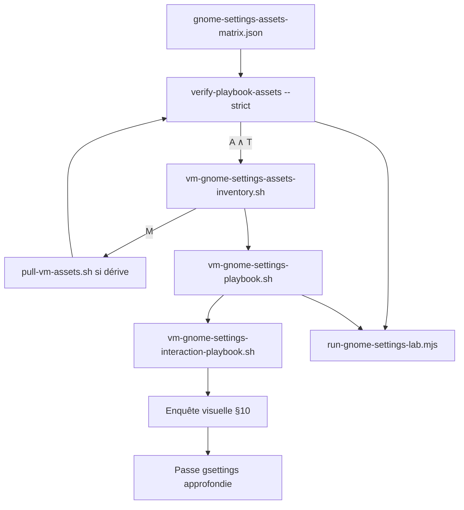
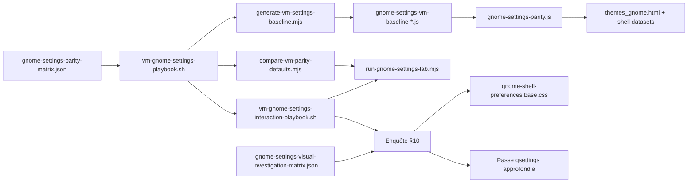

# Procédure — création d’un playbook Paramètres GNOME

> **Objectif** : documenter la chaîne reproductible pour créer, étendre et valider un **playbook lab** aligné sur `gnome-control-center` et `gsettings`, puis l’injecter dans CapsuleOS (`gnome-settings-parity.js` + UI Paramètres).

**Contexte** : **playbook spécifique toolkit** GNOME — enfant du [playbook général multiplateforme](procedure-playbook-general.md) (couche K). Référence Rocky (`linux-rocky`) ; réutilisable Fedora, Alma, Ubuntu GNOME via `registryId` + matrice.

**Documents liés** :

| Document | Rôle |
|----------|------|
| [procedure-lab-linux-rocky-gnome.md](procedure-lab-linux-rocky-gnome.md) | Passe lab VM → skin (prérequis SSH, HTTP) |
| [procedure-audit-vm-profonde.md](procedure-audit-vm-profonde.md) | Audit interactif global (phases JSON) |
| [lab-vm-rhel-wayland.md](lab-vm-rhel-wayland.md) | Infra Wayland / `XAUTHORITY` |
| [inventaires/linux-rocky-gnome-settings-playbook.md](inventaires/linux-rocky-gnome-settings-playbook.md) | Dernier rapport lecture seule |
| [inventaires/linux-rocky-gnome-settings-interaction.md](inventaires/linux-rocky-gnome-settings-interaction.md) | Dernier rapport interactions |
| [reference-gnome-expert.md](reference-gnome-expert.md) | Documentation officielle GNOME (croisement enquête) |
| `root/tools/lab/gnome-settings-visual-investigation-matrix.json` | Grille enquête effets visuels / transitions |
| [convention-assets-depuis-vm.md](convention-assets-depuis-vm.md) | Assets ground truth VM → dépôt |
| `root/tools/lab/gnome-settings-assets-matrix.json` | Matrice assets Paramètres (chemins VM + CapsuleOS) |
| [logique-formelle.md](logique-formelle.md) | **Paradigme agent** — prédicats & règles (référence canonique) |

---

## 0. Annexe — logique formelle playbook Paramètres

> Spécialisation de [logique-formelle.md](logique-formelle.md) §5. Prédicats socle : **H₂**, **A**, **S**, **T**, **M**, **I** ; spécifiques domaine : **L** (`run-gnome-settings-lab`), **V** (enquête visuelle), **G** (passe gsettings), **D** (dérive playbook↔capsule).

**Priorité courante** (juin 2026, Rocky) : **R-PRI1** — `L ∧ S ∧ ¬V` → enquête visuelle VM lot P0.

### 0.1 Chaîne playbook avec gates



### 0.2 Obligations par niveau de playbook

| Niveau | Gate entrée | Obligation assets | Gate sortie |
|--------|-------------|-------------------|-------------|
| **Inventaire statique** | **A** | Lire `picture-uri` / fonds VM ; noter chemins sources | — |
| **Tour panneaux** | **A ∧ T** | Bloc `assetSources` dans le JSON (auto) | **S** si `--vm` |
| **Interactions** | **A ∧ S** | Re-vérifier sources si panneau `background` / `appearance` | `restoredOk` |
| **Enquête visuelle** | **A ∧ S** | Captures comparables (même fichiers fond que catalogue) | **V** |
| **Lab / embed** | **A ∧ L** | `verify-playbook-assets --strict` vert | CI |

### 0.3 Commandes gates assets

```bash
# Gate A — présence absolue dans le dépôt (obligatoire avant lab)
node usr/lib/capsuleos/tools/lab/verify-playbook-assets.mjs --registry linux-rocky --strict

# Gate S — sources VM + comparaison binaire
node usr/lib/capsuleos/tools/lab/collect-vm-gnome-settings-assets.mjs --id linux-rocky
node usr/lib/capsuleos/tools/lab/compare-vm-settings-assets-capsule.mjs --registry linux-rocky --strict

# Correction dérive
bash root/tools/lab/pull-vm-assets.sh --id linux-rocky
node usr/lib/capsuleos/tools/lab/verify-playbook-assets.mjs --registry linux-rocky --strict
```

---

## 1. Les quatre niveaux de playbook

| Niveau | Script / artefact | Rôle | Livrable |
|--------|-------------------|------|----------|
| **Inventaire statique** | `root/tools/lab/vm-gnome-settings-inventory.sh` | Snapshot `gsettings` global (sans ouvrir l’UI) | `linux-rocky-gnome-settings-parity.json` |
| **Tour des panneaux** | `root/tools/lab/vm-gnome-settings-playbook.sh` | Ouvre chaque panneau `gnome-control-center`, lit `gsettings`, mappe → CapsuleOS | `*-gnome-settings-playbook.json` + `.md` |
| **Interactions** | `root/tools/lab/vm-gnome-settings-interaction-playbook.sh` | Ouvre panneau, bascule valeur, `gsettings monitor`, restaure | `*-gnome-settings-interaction.json` + `.md` |
| **Enquête visuelle** | Matrice + procédure §10 (captures VM + Capsule) | Effets visuels, transitions, croisement doc officielle | `*-gnome-settings-visual-investigation.json` + `.md` |



---

## 2. Prérequis

Identiques à [procedure-lab-linux-rocky-gnome.md](procedure-lab-linux-rocky-gnome.md) §0 :

- VM avec session **GDM ouverte** (utilisateur `capsule` ou équivalent)
- `etc/capsuleos/lab-inventory.json` renseigné (`registryId`, `ssh`, `display: ":0"`)
- `gnome-control-center` installé (`/usr/bin/gnome-control-center`)
- Clé SSH `~/.ssh/capsuleos-lab`

**Variables d’environnement obligatoires en SSH** (injectées par les collecteurs) :

```bash
export DISPLAY=:0
export XDG_CURRENT_DESKTOP=GNOME
export GNOME_SHELL_SESSION_MODE=default
export DESKTOP_SESSION=gnome
export DBUS_SESSION_BUS_ADDRESS=unix:path=/run/user/$(id -u)/bus
export XAUTHORITY=$(ls /run/user/$(id -u)/.mutter-Xwaylandauth.* 2>/dev/null | head -1)
```

Sans `XDG_CURRENT_DESKTOP=GNOME`, `gnome-control-center` quitte avec *« only supported under GNOME »*.

**Limites EL10** : pas de `xdotool` → les interactions passent par `gsettings set` / `nmcli` / `rfkill` (même persistance que l’UI). Le panneau gcc est ouvert pour le contexte session.

---

## 3. Fichiers du dépôt (référence)

| Fichier | Rôle |
|---------|------|
| `root/tools/lab/gnome-settings-parity-matrix.json` | **Source de vérité** : 18 panneaux, contrôles, clés `gsettings`, mappeurs |
| `root/tools/lab/vm-gnome-settings-inventory.sh` | Inventaire statique |
| `root/tools/lab/vm-gnome-settings-playbook.sh` | Tour panneaux + lecture |
| `root/tools/lab/vm-gnome-settings-interaction-playbook.sh` | Bascule + monitor + restauration |
| `usr/lib/capsuleos/shells/linux/gnome-settings-parity.js` | Moteur CapsuleOS (handlers, persistance, datasets) |
| `usr/lib/capsuleos/tools/lab/collect-vm-gnome-settings-playbook.mjs` | Collecte SSH → inventaire |
| `usr/lib/capsuleos/tools/lab/collect-vm-gnome-settings-interaction.mjs` | Collecte interactions SSH |
| `usr/lib/capsuleos/tools/lab/generate-vm-settings-baseline.mjs` | Génère baseline JS/JSON depuis playbook |
| `usr/lib/capsuleos/tools/lab/compare-vm-parity-defaults.mjs` | Dérive défauts parity ↔ VM |
| `usr/lib/capsuleos/tools/lab/verify-gnome-settings-parity-chain.mjs` | Chaîne matrice ↔ HTML ↔ baseline ↔ VM |
| `usr/lib/capsuleos/tools/lab/run-gnome-settings-lab.mjs` | Suite lab complète |
| `root/tools/lab/gnome-settings-visual-investigation-matrix.json` | Grille enquête visuelle / transitions |
| `root/docs/inventaires/_template-gnome-settings-visual-investigation.json` | Modèle livrable enquête |
| `usr/lib/capsuleos/tools/lab/smoke-gnome-settings-visual-matrix.mjs` | Smoke matrice ↔ handlers ↔ CSS |
| `usr/share/capsuleos/themes/linux/gnome-shell-preferences.base.css` | Effets shell `html[data-*]` |
| `root/tools/lab/gnome-settings-assets-matrix.json` | Matrice assets (VM path → capsulePath) |
| `root/tools/lab/vm-gnome-settings-assets-inventory.sh` | Inventaire sources sur VM |
| `usr/lib/capsuleos/tools/lab/verify-playbook-assets.mjs` | Gate **A** — présence assets dépôt |
| `usr/lib/capsuleos/tools/lab/collect-vm-gnome-settings-assets.mjs` | Collecte SSH inventaire assets |
| `usr/lib/capsuleos/tools/lab/compare-vm-settings-assets-capsule.mjs` | Gate **S** — dérive VM ↔ dépôt |

Intégration audit profond : `node usr/lib/capsuleos/tools/lab/collect-vm-deep-audit.mjs --id linux-rocky --phase settings-playbook` (ou `settings-interaction`).

Playbooks deep audit : `bash root/tools/lab/vm-gnome-deep-playbooks.sh list` → `settings-panels-tour`, `settings-interactions`.

---

## 4. Créer ou étendre un playbook — pas à pas

### Étape 0 — Gate assets (obligatoire)

Avant tout tour VM ou patch UI Paramètres :

```bash
node usr/lib/capsuleos/tools/lab/verify-playbook-assets.mjs --registry linux-rocky --strict
```

Si échec : identifier la source VM dans `gnome-settings-assets-matrix.json`, copier via :

```bash
bash root/tools/lab/pull-vm-assets.sh --id linux-rocky
```

Étendre la matrice assets pour tout **nouveau** fond, vignette ou icône affiché dans `themes_gnome.html` (panneaux Apparence / Fond d’écran).

Avec VM :

```bash
node usr/lib/capsuleos/tools/lab/collect-vm-gnome-settings-assets.mjs --id linux-rocky
```

Le JSON produit alimente la comparaison SHA256 et le bloc `assetSources` des playbooks.

### Étape 1 — Inventorier le panneau VM

Sur la VM (ou via SSH) :

```bash
# Lister les sous-commandes gcc (GNOME 47)
gnome-control-center --version
gnome-control-center wifi &   # valider que le panneau s’ouvre

# Lire les clés gsettings du panneau
gsettings list-recursively org.gnome.mutter | head
gsettings get org.gnome.mutter dynamic-workspaces
```

Collecte statique depuis l’hôte :

```bash
ssh -i ~/.ssh/capsuleos-lab capsule@<IP> 'bash -s' \
  < root/tools/lab/vm-gnome-settings-inventory.sh \
  > root/docs/inventaires/linux-rocky-gnome-settings-parity.json
```

### Étape 2 — Ajouter l’entrée dans la matrice

Éditer `root/tools/lab/gnome-settings-parity-matrix.json` :

```json
{
  "id": "multitasking",
  "capsulePanel": "multitasking",
  "label": "Multitâche",
  "gccArgv": ["multitasking"],
  "titleHints": ["Multitâche", "Multitasking"],
  "controls": [
    {
      "id": "dynamic-workspaces",
      "type": "select",
      "capsuleKey": "gnome-dynamic-workspaces",
      "schema": "org.gnome.mutter",
      "key": "dynamic-workspaces",
      "map": "enabledLabelFr"
    }
  ],
  "gsettings": [
    ["org.gnome.mutter", "dynamic-workspaces"]
  ]
}
```

**Champs obligatoires** :

| Champ | Description |
|-------|-------------|
| `id` / `capsulePanel` | Identifiant panneau (`data-gnome-settings-panel` dans `themes_gnome.html`) |
| `gccArgv` | Arguments `gnome-control-center` (premier qui lance le processus gagne) |
| `controls[].capsuleKey` | Clé `localStorage` CapsuleOS |
| `controls[].schema` + `key` | Paire `gsettings` (si mappable) |
| `controls[].map` | Nom du mappeur Python dans le playbook (`boolOnOff`, `enabledLabelFr`, …) |
| `controls[].source` | Si pas de gsettings : `nmcli-wifi`, `nmcli-bluetooth`, `powerprofilesctl`, `simulated` |

**Mappeurs disponibles** (dans `vm-gnome-settings-playbook.sh`) : `boolOnOff`, `enabledLabelFr`, `workspaceOnlyInverted`, `mouseHandedness`, `scrollDirection`, `touchpadEnabled`, `privacyInverted`, `gtkHighContrast`, `colorScheme`, `accentColor`, `soundTheme`, `textScalingPercent`, `pointerSpeedPercent`, `keyboardDelayMs`, `lockDelayFr`, `powerDimTimeout`, `powerSleepType`, `keyboardLayoutFr`, `searchProvidersInverted`.

### Étape 3 — Câbler CapsuleOS

1. **HTML** — `usr/share/capsuleos/linux/apps/themes_gnome.html`  
   - Switch : `data-settings-switch="<id>"`  
   - Select : `data-settings-apply="<id>"` + `data-settings-select="opt1|opt2"`  
   - Slider : `data-settings-slider="<id>"`  
   - Cas spéciaux : `data-theme-option`, `data-accent-chip`, `data-contrast-option`, etc.

2. **Handler** — `usr/lib/capsuleos/shells/linux/gnome-settings-parity.js`  
   - Entrée dans `SWITCH_HANDLERS`, `SELECT_HANDLERS` ou `SLIDER_HANDLERS`  
   - Effet shell via `document.documentElement.dataset.*` ou délégation `CapsuleThemeStorage`

3. **Smoke statique** :

```bash
node usr/lib/capsuleos/tools/lab/smoke-gnome-settings-playbook.mjs
```

### Étape 4 — Exécuter le tour des panneaux (playbook lecture)

```bash
# Un panneau (debug)
node usr/lib/capsuleos/tools/lab/collect-vm-gnome-settings-playbook.mjs \
  --id linux-rocky --panel multitasking

# Complet
node usr/lib/capsuleos/tools/lab/collect-vm-gnome-settings-playbook.mjs --id linux-rocky
```

**Critères de succès** :

- `summary.panelsOpened` = nombre de panneaux dans la matrice (ex. 18/18)
- Chaque contrôle `mapped` a `capsuleExpected` cohérent avec l’UI CapsuleOS
- `compare-vm-parity-defaults.mjs --strict` → 0 dérive

### Étape 5 — Playbook interactions (bascule + monitor)

```bash
node usr/lib/capsuleos/tools/lab/collect-vm-gnome-settings-interaction.mjs --id linux-rocky
```

Pour chaque contrôle avec `schema`/`key` :

1. Ouvre le panneau gcc  
2. Lance `gsettings monitor schema key`  
3. `gsettings set` vers valeur alternative  
4. Vérifie le changement  
5. Restaure la valeur initiale  

Contrôles **ignorés** volontairement : fond d’écran, volume (%), DND shell pur, `powerprofilesctl` absent, Wi-Fi sans carte HW.

**Critère** : `summary.failed` = 0.

### Étape 6 — Générer la baseline VM → CapsuleOS

```bash
node usr/lib/capsuleos/tools/lab/generate-vm-settings-baseline.mjs --registry linux-rocky
```

Produit :

- `usr/share/capsuleos/linux/gnome-settings-vm-baseline-linux-rocky.json`
- `usr/lib/capsuleos/shells/linux/gnome-settings-vm-baseline-linux-rocky.js`

Charger le script **avant** `gnome-settings-parity.js` dans `home/RedHat/Rocky/index.html` :

```html
<script src="../../../usr/lib/capsuleos/shells/linux/gnome-settings-vm-baseline-linux-rocky.js"></script>
<script src="../../../usr/lib/capsuleos/shells/linux/gnome-settings-parity.js"></script>
```

`mergeVmSettingsBaseline()` applique les défauts VM aux handlers au boot.

### Étape 7 — Suite lab + embed

```bash
node usr/lib/capsuleos/tools/lab/run-gnome-settings-lab.mjs

# Avec Playwright (serveur HTTP requis)
CAPSULE_HTTP_BASE=http://127.0.0.1:8765 \
  node usr/lib/capsuleos/tools/lab/run-gnome-settings-lab.mjs --playwright

# Régénérer l’embed apps
node usr/lib/capsuleos/tools/linux/build-linux-embed.mjs
```

### Étape 8 — Enquête visuelle & transitions (§10)

À exécuter **après** les playbooks gsettings (étapes 4–5), **avant** la passe gsettings approfondie :

```bash
node usr/lib/capsuleos/tools/lab/smoke-gnome-settings-visual-matrix.mjs

# Lot P0 VM (gsettings + captures via org.gnome.Shell.Screenshot D-Bus — Rocky 10)
node usr/lib/capsuleos/tools/lab/collect-vm-gnome-settings-visual-investigation.mjs --id linux-rocky --filter P0
# → root/docs/inventaires/<registry>-gnome-settings-visual-investigation.json
# → root/docs/inventaires/captures/linux-rocky/gnome-settings-visual/ (PNG)
```

---

## 5. Checklist agent (nouveau panneau ou contrôle)

- [ ] Entrée asset dans `gnome-settings-assets-matrix.json` si contenu visuel (fond, filigrane, icône)
- [ ] `verify-playbook-assets.mjs --strict` vert (**gate A**)
- [ ] `collect-vm-gnome-settings-assets.mjs` exécuté si VM dispo (**gate S**)
- [ ] `SOURCE-VM.txt` à jour après pull
- [ ] Panneau identifié dans la VM (`gccArgv` testé manuellement)
- [ ] Entrée ajoutée dans `gnome-settings-parity-matrix.json`
- [ ] Contrôle câblé dans `themes_gnome.html` (attributs `data-settings-*`)
- [ ] Handler dans `gnome-settings-parity.js` avec effet shell vérifiable
- [ ] `smoke-gnome-settings-playbook.mjs` vert
- [ ] Collecte playbook VM : panneau `gccRunning: true`
- [ ] Collecte interaction : statut `ok`, `restoredOk: true`
- [ ] `generate-vm-settings-baseline.mjs` exécuté
- [ ] `verify-gnome-settings-parity-chain.mjs --strict` vert
- [ ] `build-linux-embed.mjs` si HTML modifié
- [ ] Entrée enquête visuelle dans `gnome-settings-visual-investigation-matrix.json` (si effet shell)
- [ ] Captures VM before/during/after + croisement doc officielle (§10)
- [ ] Hook CSS `gnome-shell-preferences.base.css` ou dataset vérifié
- [ ] `smoke-gnome-settings-visual-matrix.mjs` vert

---

## 6. Dépannage

| Symptôme | Cause | Action |
|----------|-------|--------|
| `panelsOpened: 0` | gcc refuse la session SSH | Exporter `XDG_CURRENT_DESKTOP=GNOME` (voir §2) |
| `gccRunning: false` mais process visible | Mauvais `pgrep` | Utiliser `pgrep -af gnome-control-center` (pas le chemin absolu seul) |
| `uint32 500` → `32 ms` | Regex naïve | Utiliser `parse_uint32()` / mappeur `keyboardDelayMs` corrigé |
| Wi-Fi interaction `failed` | Pas de carte Wi-Fi VM | Statut `skipped` — note « HW absent » |
| `powerprofilesctl` absent | Paquet non installé sur VM | `partial` + défaut Capsule « Équilibré » |
| Fenêtre `windowDetected: false` | `wmctrl` limité en Wayland | Non bloquant si `gccRunning: true` |
| Dérive parity ↔ VM | Défaut handler ≠ VM | Aligner `default` dans parity ou régénérer baseline |

---

## 7. Adapter à une autre distro GNOME

1. Dupliquer la matrice ou ajouter une section `registryId` (évolution future).
2. Créer `gnome-settings-vm-baseline-<registry>.js` via collecte playbook sur la VM cible.
3. Référencer la baseline dans le `index.html` du skin correspondant.
4. Ajuster `gccArgv` si la distro renomme des panneaux (ex. `color` vs `appearance`).
5. Mettre à jour `etc/capsuleos/lab-inventory.json` avec le bon `registryId` et IP SSH.

---

## 8. Commandes rapides (lab)

```bash
# Gate assets dépôt (bloquant)
node usr/lib/capsuleos/tools/lab/verify-playbook-assets.mjs --registry linux-rocky --strict

# Suite lab locale (inclut gate A + smoke matrice visuelle)
node usr/lib/capsuleos/tools/lab/run-gnome-settings-lab.mjs

# VM complète (playbook + interaction + baseline)
node usr/lib/capsuleos/tools/lab/run-gnome-settings-lab.mjs --vm --id linux-rocky

# Dérive défauts
node usr/lib/capsuleos/tools/lab/compare-vm-parity-defaults.mjs --registry linux-rocky --strict

# Chaîne complète
node usr/lib/capsuleos/tools/lab/verify-gnome-settings-parity-chain.mjs --strict

# Smoke enquête visuelle (matrice ↔ handlers ↔ CSS)
node usr/lib/capsuleos/tools/lab/smoke-gnome-settings-visual-matrix.mjs

# Audit profond (phase dédiée)
node usr/lib/capsuleos/tools/lab/collect-vm-deep-audit.mjs \
  --id linux-rocky --phase settings-playbook
```

---

## 9. Suite recommandée après création du playbook

Une fois la procédure validée sur `linux-rocky` :

1. **Gates assets** — `verify-playbook-assets --strict` + inventaire VM si dérive (§0).
2. **Enquête visuelle** — compléter l’inventaire §10 pour chaque contrôle P0/P1 de la matrice visuelle.
3. **Passe gsettings approfondie** — reprendre les écarts `gsettingsDeferred` de l’enquête (schémas secondaires, clés liées, synchronisation QS ↔ Paramètres).
4. **Propagation** — baseline + parity sur Fedora / Alma (même toolkit GNOME).
5. **Playwright** — étendre `smoke-gsettings-snapshot.mjs` / interactions pour datasets visuels après reload.
6. **UI gcc réelle** — si `ydotool` ou AT-SPI devient disponible, remplacer `gsettings set` par clic UI dans le playbook interaction.
7. **CI** — intégrer `run-gnome-settings-lab.mjs` dans la pipeline de validation du skin Rocky.

---

## 10. Enquête visuelle, transitions et documentation officielle

> **Objectif** : au-delà de la valeur `gsettings`, documenter **ce que l’utilisateur voit** (surfaces touchées, animations, délais) et **comment CapsuleOS doit le reproduire**, en croisant les constats VM avec la documentation GNOME officielle. Cette phase alimente la **passe gsettings approfondie** (clés secondaires, effets différés, schémas simulés).

### 10.1 Quand l’exécuter

| Moment | Action |
|--------|--------|
| Après gates **A ∧ S** (§0) | Les fichiers fond / filigrane comparés VM ↔ dépôt |
| Après playbook **interactions** (§ étape 5) | Les bascules sont connues ; on observe l’effet visuel |
| Avant patch CSS/dataset CapsuleOS | Éviter d’implémenter « au feeling » |
| Avant passe gsettings **approfondie** | L’enquête liste les clés à re-vérifier (`gsettingsDeferred`) |

### 10.2 Grille d’enquête (matrice)

Fichier : `root/tools/lab/gnome-settings-visual-investigation-matrix.json`

Chaque entrée `investigations[]` décrit :

| Champ | Rôle |
|-------|------|
| `controlId` | Aligné sur `gnome-settings-parity-matrix.json` |
| `surfaces` | Zones UI impactées (bureau, QS, Aperçu, panneau gcc, …) |
| `vmObservation` | Description factuelle sur la VM |
| `transition` | Type, `durationMs`, easing, propriété animée |
| `capsuleHook` | `dataset`, CSS, JS, événement custom |
| `officialDocs[]` | URLs doc GNOME / freedesktop à confronter |
| `investigationSteps[]` | Protocole de capture reproductible |
| `parityPriority` | P0 / P1 / P2 |

Étendre la matrice pour tout **nouveau contrôle** dont le handler parity modifie le shell au-delà du panneau Paramètres.

### 10.3 Protocole de capture VM

**Prérequis** : session graphique ouverte, gcc accessible. **Rocky Linux 10** :

| Outil | Rôle |
|-------|------|
| **Snapshot** (`/usr/bin/snapshot`, `org.gnome.Snapshot`) | App graphique GNOME — pas de CLI capture |
| **Shell.Screenshot** (D-Bus) | Session locale VM ; **refusé en SSH** (GNOME 47+) |
| **virsh screenshot** (hôte libvirt) | Repli lab automatisé — `collect-vm-gnome-settings-visual-investigation.mjs` + `vm-rocky-capture-host.sh` |

`gnome-screenshot` n’est pas dans les dépôts EL10 par défaut.

Pour chaque contrôle de la matrice visuelle :

1. **État initial** — capture `before.png` (bureau + surface cible si pertinent).
2. **Bascule** — via gcc (ou `gsettings set` si EL10 sans clic UI) ; noter l’heure T0.
3. **Transition** — captures `during-500ms.png`, `during-1500ms.png` si effet progressif (éclairage nocturne, Aperçu).
4. **État stable** — capture `after.png` ; décrire delta vs `before`.
5. **Surfaces multiples** — répéter pour QS, calendrier, Aperçu si `surfaces[]` le demande.
6. **Restauration** — revenir à la valeur initiale (comme playbook interaction).

**Chronométrage** : noter `durationMs` observé ; comparer à `transition.durationMs` de la matrice et à la doc (ex. gsd-color ~1000 ms pour Night Light).

**Commandes utiles VM** :

```bash
# Capture plein écran (Rocky 10 / GNOME 47+)
gdbus call --session --dest org.gnome.Shell.Screenshot \
  --object-path /org/gnome/Shell/Screenshot \
  --method org.gnome.Shell.Screenshot.Screenshot false false /tmp/settings-inv-night-before.png

# Notification test (panneau notifications)
notify-send "CapsuleOS lab" "Test bannière"

# Lister clés liées pendant l'observation
gsettings monitor org.gnome.settings-daemon.plugins.color night-light-enabled
```

### 10.4 Protocole capture CapsuleOS (miroir)

Sur l’hôte, serveur HTTP à la racine du dépôt :

```bash
python3 -m http.server 8765 --bind 127.0.0.1
node root/tools/lab/capture-capsule-rocky.mjs   # si scène Paramètres déjà définie
```

Comparer avec [linux-rocky-comparaison-visuelle.md](inventaires/linux-rocky-comparaison-visuelle.md) et `compare-rocky-visual-pass.mjs`.

**Playwright** (datasets après toggle) :

```bash
CAPSULE_HTTP_BASE=http://127.0.0.1:8765 \
  node usr/lib/capsuleos/tools/lab/smoke-gsettings-snapshot.mjs
```

### 10.5 Croisement documentation officielle

Pour chaque enquête, remplir `officialDocCrossCheck[]` dans le livrable :

| Source | Usage |
|--------|--------|
| [GNOME Help](https://help.gnome.org/users/gnome-help/stable/) | Comportement utilisateur attendu |
| [HIG](https://developer.gnome.org/hig/) | Patterns libadwaita, transitions UI apps |
| [mutter.gnome.org](https://mutter.gnome.org/) | Workspaces, échelle, orientation |
| [gnome-settings-daemon](https://gitlab.gnome.org/GNOME/gnome-settings-daemon) | Night Light, power, color plugins |
| [gsettings-desktop-schemas](https://gitlab.gnome.org/GNOME/gsettings-desktop-schemas) | Sémantique des clés |
| [gnome-shell](https://gitlab.gnome.org/GNOME/gnome-shell) | DND, Aperçu, QS, search |
| [reference-gnome-expert.md](reference-gnome-expert.md) | Synthèse CapsuleOS |

**Règle** : si la doc contredit l’observation VM, **la VM prime** (ground truth) ; noter l’écart dans `delta` et la version GNOME.

### 10.6 Implémentation CapsuleOS

Chaîne cible :

```
toggle Paramètres → gnome-settings-parity.js → dataset documentElement
  → gnome-shell-preferences.base.css (effet visuel)
  → événements (capsule:dnd-changed, capsule:workspaces-config-changed, …)
```

| Type d’effet | Fichier prioritaire |
|--------------|---------------------|
| Filtre global bureau | `gnome-shell-preferences.base.css` |
| Accent / thème | `capsule-theme-storage.js`, tokens Rocky |
| Aperçu / recherche | `overview.js`, `gnome-workspaces.js` |
| Tuiles QS | `volume.js`, datasets + CSS QS |

**Transitions CSS** : privilégier les variables existantes (`--eas2`, `--ease`) ; documenter si la VM utilise une courbe non reproduite (ex. spring Shell → approximer `cubic-bezier`).

### 10.7 Livrable inventaire

Copier le modèle :

`root/docs/inventaires/_template-gnome-settings-visual-investigation.json`

Vers :

`root/docs/inventaires/<registry>-gnome-settings-visual-investigation.json`

Et résumé Markdown optionnel `*-gnome-settings-visual-investigation.md` (tableau contrôle / match visuel / écart / priorité).

Champs clés par investigation :

- `vmCaptures[]` — chemins PNG horodatés
- `transitionObserved` — mesures réelles
- `officialDocCrossCheck[]` — `matchesObservation`, `delta`
- `capsuleParity.visualMatch` — `match` | `partial` | `gap`
- `gsettingsDeferred` — notes pour la **passe gsettings approfondie** (clés à revisiter)

### 10.8 Checklist enquête (par contrôle)

- [ ] `investigationSteps` de la matrice exécutés sur VM
- [ ] Captures before / during / after archivées
- [ ] `transitionObserved.durationMs` renseigné (ou `instant` / `delayed` confirmé)
- [ ] Au moins une URL doc officielle lue et citée
- [ ] `capsuleHook` vérifié dans le dépôt (smoke matrice visuelle vert)
- [ ] Écart classé P0/P1/P2 dans `capsuleParity`
- [ ] Entrée `gsettingsDeferred` si la clé gsettings actuelle ne suffit pas

### 10.9 Vers la passe gsettings approfondie

L’enquête visuelle **ne remplace pas** gsettings ; elle **priorise** la prochaine itération :

| Signal enquête | Action gsettings suivante |
|----------------|---------------------------|
| Effet différé (extinction écran) | Valider timeout + type `sleep-inactive-ac-type` |
| DND + QS + calendrier | Consolider schéma simulé / session shell |
| Night Light exclut top bar | Vérifier si une clé gsettings existe ; sinon CSS ciblé |
| Thème + fond jour/nuit liés | Lier `picture-uri` / `picture-uri-dark` / `color-scheme` |
| Recherche overview | Parser fin `disabled[]` providers |

Commandes passe approfondie (après enquête) :

```bash
node usr/lib/capsuleos/tools/lab/compare-playbook-gsettings-capsule.mjs --registry linux-rocky --strict
node usr/lib/capsuleos/tools/lab/run-gnome-settings-lab.mjs --vm --id linux-rocky
```

---

## 11. Commandes rapides (aide-mémoire)

```bash
# Gates assets (bloquant)
node usr/lib/capsuleos/tools/lab/verify-playbook-assets.mjs --registry linux-rocky --strict
node usr/lib/capsuleos/tools/lab/collect-vm-gnome-settings-assets.mjs --id linux-rocky
bash root/tools/lab/pull-vm-assets.sh --id linux-rocky

# Lab complet
node usr/lib/capsuleos/tools/lab/run-gnome-settings-lab.mjs
CAPSULE_HTTP_BASE=http://127.0.0.1:8765 \
  node usr/lib/capsuleos/tools/lab/run-gnome-settings-lab.mjs --playwright

# Playbooks VM
node usr/lib/capsuleos/tools/lab/collect-vm-gnome-settings-playbook.mjs --id linux-rocky
node usr/lib/capsuleos/tools/lab/collect-vm-gnome-settings-interaction.mjs --id linux-rocky

# Enquête visuelle
node usr/lib/capsuleos/tools/lab/smoke-gnome-settings-visual-matrix.mjs
# Inventaire : root/docs/inventaires/<registry>-gnome-settings-visual-investigation.json

# Passe gsettings approfondie + clôture visuelle (chaîne formelle)
node usr/lib/capsuleos/tools/lab/compare-playbook-gsettings-capsule.mjs --registry linux-rocky --strict
node usr/lib/capsuleos/tools/lab/enrich-visual-investigation-gsettings-pass.mjs --id linux-rocky
node usr/lib/capsuleos/tools/lab/collect-capsule-visual-investigation.mjs --id linux-rocky
node usr/lib/capsuleos/tools/lab/enrich-visual-investigation-capsule-parity.mjs --id linux-rocky
node usr/lib/capsuleos/tools/lab/run-replication-chain.mjs --id linux-rocky --dry-run
node usr/lib/capsuleos/tools/lab/generate-gsettings-bindings.mjs
node usr/lib/capsuleos/tools/lab/smoke-gsettings-snapshot.mjs

# Baseline + embed
node usr/lib/capsuleos/tools/lab/generate-vm-settings-baseline.mjs --registry linux-rocky
node usr/lib/capsuleos/tools/linux/build-linux-embed.mjs
```
