# Procédure lab — AlmaLinux GNOME (VM → CapsuleOS)

> **Objectif** : reproduire le bureau **AlmaLinux 10 Workstation GNOME** dans `home/RedHat/Alma/`, en dérivant `linux-rocky` avec personnalisation vendor (fonds `almalinux-day/night`, accent blue, assets `vendors/alma/`).

**Lire d'abord** : [branche-redhat-gnome.md](branche-redhat-gnome.md) · modèle Rocky : [procedure-lab-linux-rocky-gnome.md](procedure-lab-linux-rocky-gnome.md).

**Couches complémentaires** :

| Couche | Document |
|--------|----------|
| Infra VM SSH/Wayland | [lab-vm-rhel-wayland.md](lab-vm-rhel-wayland.md) |
| Scénarios pédagogiques GNOME | [procedure-scenarios-pedagogiques-gnome.md](procedure-scenarios-pedagogiques-gnome.md) |
| Parité JSON | [inventaire-parite-alma.md](inventaire-parite-alma.md) · [`linux-alma-parity-index.json`](inventaires/linux-alma-parity-index.json) |
| Playbook Paramètres GNOME | [procedure-creation-playbook-gnome-settings.md](procedure-creation-playbook-gnome-settings.md) (hérité Rocky, non dupliqué) |

---

## Vue d'ensemble — cycles Alma (C0–C18)

```mermaid
flowchart LR
  C0[C0_Inventaire_VM] --> C1[C1_ManΣ_assets]
  C1 --> C2[C2_Shell_panel]
  C2 --> C3[C3-C4_VΣ_captures]
  C3 --> C5[C5-C10_apps_P0]
  C5 --> H6[PbΣ_fonds_vendor]
  H6 --> C11[C11-C12_AppΣ_Π90]
  C11 --> C13[C13_Software_96]
  C13 --> C14[C14_Software_100]
  C14 --> C15[C15_S1-S4]
  C15 --> C16[C16_T1-T4]
  C16 --> C17[C17_C1-C4]
  C17 --> C18[C18_Th1-Th4_themes]
```



| Cycle | Commit / passe | Prédicats atteints | Π global |
|-------|----------------|-------------------|----------|
| **C0** | `61e8036a` | **I**, inventaire VM 10.2 | — |
| **C1** | `8afa870f` | **ManΣ**, **A∧S** assets Alma | — |
| **C2** | `02608f4d` | Shell panel / top-bar | — |
| **C3–C4** | `fc5b7802` | **VΣ** matrice surfaces | — |
| **C5–C10** | `6938ab0e` | Apps P0, recette intégrale | ~86 |
| **PbΣ H6** | `0fc3992e` | Fonds vendor, playbook GNOME | — |
| **C11–C12** | `8c064e79`, `3ba91ec1` | **AppΣ**, captures Capsule P1 | **90** |
| **C13** | `08f15ea2` | GNOME Software explore grid | **96** |
| **C14** | `b6f99faf` | Logiciels clôturé | **100** (slot) |
| **C15** | `2c98dc36` | **ScΣ** Software S1–S4 | — |
| **C16** | `2417c650` | **ScΣ** Éditeur T1–T4 | — |
| **C17** | `8f947d14` | **ScΣ** Calculatrice C1–C4 | **94** |
| **C18** | en cours | **ScΣ** Paramètres Th1–Th4 | cible **96+** |

---

## Phase 0 — Prérequis (bloquants)

### 0.1 VM AlmaLinux 10

| Critère | Vérification |
|---------|--------------|
| AlmaLinux **10.2** Workstation | `cat /etc/os-release` |
| Session **graphique** (GDM Wayland) | pas SSH seul |
| Utilisateur lab `capsule` | IP NAT typique `192.168.122.199` |
| Domaine libvirt | `virshName: almalinux10` (peut être absent sur hôte agent — VM joignable par IP) |

### 0.2 Paquets sonde (VM)

Identique Rocky — voir [procedure-lab-linux-rocky-gnome.md §0.2](procedure-lab-linux-rocky-gnome.md#02-paquets-sonde-sur-la-vm).

### 0.3 Clé SSH (hôte)

```bash
ssh-keygen -t ed25519 -f ~/.ssh/capsuleos-lab -N ""
ssh-copy-id -i ~/.ssh/capsuleos-lab.pub capsule@192.168.122.199
```

### 0.4 Test Wayland

```bash
ssh -i ~/.ssh/capsuleos-lab capsule@192.168.122.199 \
  'export DISPLAY=:0 XAUTHORITY=$(ls /run/user/$(id -u)/.mutter-Xwaylandauth.* 2>/dev/null | head -1); wmctrl -l; echo exit:$?'
```

Attendu : **`exit:0`**.

### 0.5 Inventaire lab local

Copier l'entrée `linux-alma` depuis [`etc/capsuleos/lab-inventory.example.json`](../../etc/capsuleos/lab-inventory.example.json) vers `etc/capsuleos/lab-inventory.json` (gitignoré).

Champs clés : `registryId: linux-alma`, `virshName: almalinux10`, `capsuleUrl: http://127.0.0.1:5501/home/RedHat/Alma/index.html`.

### 0.6 Serveur HTTP CapsuleOS

```bash
cd /chemin/vers/CapsuleOS
python3 -m http.server 5501
```

### 0.7 Playbook captures VM

Documenté dans [`linux-alma-vm.json`](inventaires/linux-alma-vm.json) → `lab.screenshotCapture` :

| Backend | Statut Alma (juin 2026) |
|---------|-------------------------|
| `org.gnome.Shell.Screenshot` (D-Bus SSH) | **AccessDenied** — session distante |
| `gnome-screenshot -w` | Absent CRB el10 par défaut |
| `virsh screenshot almalinux10` | Domaine absent hôte agent courant |
| **Compensation** | Captures Capsule Playwright (`capture-capsule-*-views.mjs`) |

Collecteur : `node usr/lib/capsuleos/tools/lab/collect-vm-apps-visual-investigation.mjs --id linux-alma --filter P0 --ssh`

---

## Phase 1 — Inventaire ground truth

```bash
bash root/tools/lab/bootstrap-vm.sh linux-alma
node usr/lib/capsuleos/tools/lab/lab-ssh.mjs --id linux-alma --cmd '$HOME/capsuleos-lab/os-probe-gnome.sh state'
bash root/tools/lab/pull-vm-assets.sh --id linux-alma
```

Mettre à jour [`linux-alma-vm.json`](inventaires/linux-alma-vm.json) et [`linux-alma-vm.md`](inventaires/linux-alma-vm.md).

Checklist Alma spécifique :

- [ ] Fonds `/usr/share/backgrounds/almalinux-day.jpg` + `almalinux-night.jpg`
- [ ] `gsettings get org.gnome.desktop.interface accent-color` → `blue`
- [ ] `gsettings get org.gnome.desktop.background picture-uri-dark` → `almalinux-night.jpg`
- [ ] 7 favoris dash (pas Music)

---

## Phase 2 — Bootstrap skin depuis Rocky

```bash
node usr/lib/capsuleos/tools/linux/bootstrap-alma-from-rocky.mjs
```

Puis personnaliser :

```
home/RedHat/Alma/
├── alma-overrides.css          # wallpaper Alma, accent #3584e4
├── content/profile-data.js     # url almalinux.org
└── style/apps/*.skin.css       # overrides vendor si besoin
```

Assets : `usr/share/capsuleos/assets/images/vendors/alma/` · `SOURCE-VM.txt` obligatoire.

---

## Phase 3 — Apps P0 et parité

Brief agent :

```bash
node usr/lib/capsuleos/tools/print-agent-brief.mjs linux-alma
node usr/lib/capsuleos/tools/lab/compare-os-parity.mjs --id linux-alma
```

Slots **priority** (poids apps 0,75) : `nemo`, `firefox`, `terminal`, `themes`, `update_manager`, `text_editor`, `calculator`.

Smokes shell :

```bash
CAPSULE_HTTP_BASE=http://127.0.0.1:5501 node usr/lib/capsuleos/tools/lab/smoke-rocky-shell-polish.mjs --playwright
```

---

## Phase 4 — Scénarios pédagogiques (pattern réutilisable)

Ordre logique par slot (après Π structurel ≥ 90 sur le slot) :

```text
contrat JSON → validateur → smoke Playwright → captures Capsule → parity-index
```

| Slot | Contrat | Scénarios P0 | Smoke | Capture |
|------|---------|--------------|-------|---------|
| Logiciels | `software-user-scenarios.json` | S1–S4 | `smoke-gnome-software-scenarios.mjs` | `capture-capsule-software-views.mjs` |
| Éditeur | `text-editor-user-scenarios.json` | T1–T4 | `smoke-gnome-text-editor-scenarios.mjs` | `capture-capsule-text-editor-views.mjs` |
| Calculatrice | `calculator-user-scenarios.json` | C1–C4 | `smoke-gnome-calculator-scenarios.mjs` | `capture-capsule-calculator-views.mjs` |
| Paramètres | `themes-user-scenarios.json` | Th1–Th4 | `smoke-gnome-themes-scenarios.mjs` | `capture-capsule-themes-views.mjs` |

Exemple copy-paste (Calculatrice, Alma) :

```bash
CAPSULE_HTTP_BASE=http://127.0.0.1:5501 \
  node usr/lib/capsuleos/tools/lab/smoke-gnome-calculator-scenarios.mjs --id linux-alma

node usr/lib/capsuleos/tools/validate-calculator-user-scenarios.mjs

CAPSULE_HTTP_BASE=http://127.0.0.1:5501 \
  node usr/lib/capsuleos/tools/lab/capture-capsule-calculator-views.mjs --id linux-alma
```

Détail du pattern : [procedure-scenarios-pedagogiques-gnome.md](procedure-scenarios-pedagogiques-gnome.md).

---

## Phase 5 — Clôture technique

```bash
node usr/lib/capsuleos/tools/linux/sync-linux-skin-closure.mjs
node usr/lib/capsuleos/tools/linux/build-linux-embed.mjs
node usr/lib/capsuleos/tools/validate-all.mjs
```

Checklist humaine :

- [ ] `home/RedHat/Alma/index.html` ≡ façade générée
- [ ] Fonds Alma day/night basculent via Paramètres → Apparence
- [ ] Accent blue par défaut (VM ground truth)
- [ ] [`linux-alma-parity-index.json`](inventaires/linux-alma-parity-index.json) à jour

---

## Gaps restants (juin 2026)

| Gap | Priorité | Action |
|-----|----------|--------|
| **Vc VM** pixel-perfect apps | P1 | D-Bus screenshot ou console GDM locale |
| `virsh almalinux10` absent hôte | P1 | Enregistrer domaine libvirt ou documenter IP seule |
| Watermark Alma (`fedora_logo_*`) | P2 | Inventaire VM ou gradient CSS fallback |
| `clocks`, `calendar` | P2 | Π ~63 — campagne P2 post-thèmes |
| Playbook GNOME Settings Alma dédié | P2 | Hérité Rocky — matrice non dupliquée |

---

## Skills agent

1. `onboarding`
2. `os-linux` + `capsuleos-distro-linux-alma` + `capsuleos-vendor-alma`
3. `gnome-hig-replication` + `design-shell-layout`
4. [branche-redhat-gnome.md](branche-redhat-gnome.md)

Brief : `node usr/lib/capsuleos/tools/print-agent-brief.mjs linux-alma`

---

## Historique des passes

| Date | Passe | Résultat |
|------|-------|----------|
| 2026-06-09 | C0 inventaire VM | Alma 10.2 · Shell 49.4 · SSH OK |
| 2026-06-09 | C1 assets | ManΣ · pull-vm-assets Alma |
| 2026-06-10 | C11–C12 AppΣ | Captures Capsule · Π **90** |
| 2026-06-10 | C13–C14 Software | Explore grid · Π slot **100** |
| 2026-06-10 | C15–C17 scénarios | S/T/C P0 · Π global **94** |
| 2026-06-10 | C18 themes | Th1–Th4 · cible Π **96+** |
