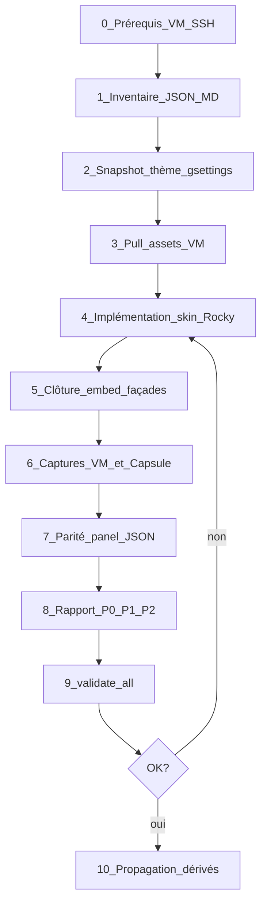

# Procédure lab — Rocky Linux GNOME (VM → CapsuleOS)

> **Objectif** : reproduire **l’intégralité** du bureau Rocky Linux 10 GNOME dans `home/RedHat/Rocky/`, avec une chaîne reproductible, des contrôles automatisés et une classification d’écarts — pour **endiguer les échecs** et accélérer Fedora, Alma et les futurs clones RHEL.

**Lire d’abord** : [branche-redhat-gnome.md](branche-redhat-gnome.md) (cartographie + doc officielle).

**Couches complémentaires** (ne pas dupliquer ici) :

| Couche | Document |
|--------|----------|
| Infra VM SSH/Wayland | [lab-vm-rhel-wayland.md](lab-vm-rhel-wayland.md) |
| Construction générique clone | [procedure-clonage-os-depuis-vm.md](procedure-clonage-os-depuis-vm.md) |
| Mesure parité JSON | [procedure-controle-distributions-reelles.md](procedure-controle-distributions-reelles.md) |
| Assets VM obligatoires | [convention-assets-depuis-vm.md](convention-assets-depuis-vm.md) |

---

## Vue d’ensemble



**Durée indicative** : 2–4 h pour une passe complète (première fois) ; 30–45 min pour une itération CSS/apps.

---

## Phase 0 — Prérequis (bloquants)

### 0.1 VM

| Critère | Vérification |
|---------|--------------|
| Rocky Linux **10** Workstation installé | `cat /etc/os-release` |
| Session **graphique ouverte** (GDM) | pas SSH seul |
| Utilisateur lab (ex. `capsule`) | mot de passe connu |
| Réseau NAT libvirt | IP stable ou `virsh net-dhcp-leases default` |

### 0.2 Paquets sonde (sur la VM)

```bash
sudo dnf install -y openssh-server
sudo systemctl enable --now sshd
sudo /usr/bin/crb enable
sudo dnf install -y epel-release
sudo dnf install -y wmctrl
```

`xdotool` : **absent** des dépôts el10 → `bash root/tools/lab/install-xdotool-el.sh` (VM) ou `deploy-xdotool-via-host.sh` (hôte).

### 0.3 Clé SSH (hôte Cursor)

```bash
ssh-keygen -t ed25519 -f ~/.ssh/capsuleos-lab -N ""
ssh-copy-id -i ~/.ssh/capsuleos-lab.pub capsule@<IP_VM>
```

### 0.4 Test Wayland (obligatoire)

```bash
ssh -i ~/.ssh/capsuleos-lab capsule@<IP> \
  'export DISPLAY=:0 XAUTHORITY=$(ls /run/user/$(id -u)/.mutter-Xwaylandauth.* 2>/dev/null | head -1); wmctrl -l; echo exit:$?'
```

Attendu : **`exit:0`**. Si échec → [lab-vm-rhel-wayland.md](lab-vm-rhel-wayland.md).

### 0.5 Inventaire lab local

```bash
cp etc/capsuleos/lab-inventory.example.json etc/capsuleos/lab-inventory.json
```

Renseigner `registryId: linux-rocky`, `ssh`, `sshIdentity`, `display: ":0"`, `sessionType: wayland-xwayland`, `capsuleUrl: http://127.0.0.1:5500/home/RedHat/Rocky/index.html`.

### 0.6 Serveur HTTP CapsuleOS (hôte)

```bash
cd /chemin/vers/CapsuleOS
python3 -m http.server 5500
```

Vérifier : `curl -s -o /dev/null -w '%{http_code}' http://127.0.0.1:5500/home/RedHat/Rocky/index.html` → **200**.

### 0.7 Échecs fréquents phase 0

| Symptôme | Cause | Action |
|----------|-------|--------|
| `Permission denied (publickey)` | Clé non copiée | `ssh-copy-id` |
| `Cannot open display` | Pas de session graphique | Se connecter au bureau GDM |
| `Authorization required` | `XAUTHORITY` manquant | Export Mutter (§0.4) |
| `exit:127` wmctrl | Paquet absent | `sudo dnf install wmctrl` |
| HTTP 404 Capsule | Mauvais port/cwd serveur | Servir à la **racine du dépôt** |
| `Connection reset` / `Permission denied` SSH en rafale | `sshd` VM saturé (MaxStartups) | Espacer les `scp`/`lab-ssh` (2–3 s) ; préférer `ssh -i …` direct si `lab-ssh` échoue |

---

## Phase 1 — Inventaire ground truth

> **Audit interactif complet** (clics, menus contextuels, bureaux virtuels, animations, raccourcis) : [procedure-audit-vm-profonde.md](procedure-audit-vm-profonde.md).  
> Static automatisé : `node usr/lib/capsuleos/tools/lab/collect-vm-deep-audit.mjs --id linux-rocky --phase static --write-doc`

### 1.1 Bootstrap sonde GNOME

```bash
bash root/tools/lab/bootstrap-vm.sh linux-rocky
```

Déploie `~/capsuleos-lab/os-probe-gnome.sh` sur la VM.

### 1.2 État JSON (hôte)

```bash
node usr/lib/capsuleos/tools/lab/lab-ssh.mjs --id linux-rocky --cmd '$HOME/capsuleos-lab/os-probe-gnome.sh state'
```

Ouvrir **Firefox, Nautilus, Ptyxis** sur la VM avant la sonde pour `running: true`.

### 1.3 Inventaire structuré

Mettre à jour [`inventaires/linux-rocky-vm.json`](inventaires/linux-rocky-vm.json) et le résumé [`inventaires/linux-rocky-vm.md`](inventaires/linux-rocky-vm.md).

Checklist minimale à documenter :

- [ ] Version GNOME Shell (`gnome-shell --version`)
- [ ] Liste favoris dash (`gsettings get org.gnome.shell favorite-apps`)
- [ ] `color-scheme`, `accent-color`
- [ ] URI fond d’écran
- [ ] Apps `.desktop` critiques (Nautilus, Ptyxis, Firefox, …)

### 1.4 Rapport de parité initial

Copier le template vers [`inventaire-parite-rocky.md`](inventaire-parite-rocky.md) si nouvelle campagne.

---

## Phase 2 — Snapshot thème VM

```bash
bash root/tools/lab/vm-rocky-theme-snapshot.sh
```

Produit [`linux-rocky-vm-theme.json`](inventaires/linux-rocky-vm-theme.json).

**Confrontation doc officielle** : vérifier que les remplacements RL10 (Ptyxis, GNOME Text Editor) sont cohérents avec [Rocky 10 Release Notes](https://docs.rockylinux.org/release_notes/10_0/) — voir [branche-redhat-gnome.md](branche-redhat-gnome.md) §3.

---

## Phase 3 — Assets depuis la VM

```bash
bash root/tools/lab/pull-vm-assets.sh --id linux-rocky
```

| Asset | Destination |
|-------|-------------|
| Icônes panel (Nautilus, Ptyxis, Firefox) | `usr/share/capsuleos/assets/images/vendors/rocky/panel/` |
| Fonds gemstone-skies | `vendors/rocky/wallpaper/` |
| Symboles Adwaita (si script couvre) | `icons/gnome/adwaita/` |

Mettre à jour `vendors/rocky/SOURCE-VM.txt` (date, commande).

**Ne pas** : copier des icônes depuis Fedora ou Mint.

---

## Phase 4 — Implémentation skin Rocky

### 4.1 Fichiers à éditer (seulement)

```
home/RedHat/Rocky/
├── index.html              # slots, scripts, overview HTML
├── rocky-overrides.css     # wallpaper, accent
├── js/overview.js          # catalogue recherche
├── style/
│   ├── gnome-workstation.css
│   ├── gnome-shell/*.css
│   └── apps/*.skin.css     # nautilus, terminal, firefox, …
```

**Interdit** : modifier `OS/linux/families/redhat/rocky/index.html` à la main.

### 4.2 Ordre d’implémentation recommandé

| Ordre | Couche | Fichiers | Critère visuel |
|-------|--------|----------|----------------|
| 1 | Fond + top bar | `rocky-overrides.css`, `tokens.css` | Capture bureau sombre |
| 2 | Dock / Aperçu | `gnome-workstation.css`, `overview.css` | Dash visible dans Aperçu |
| 3 | Nautilus | `nautilus.skin.css`, gabarit embed | Sidebar + headerbar claire |
| 4 | Terminal Ptyxis | `terminal.skin.css` | Prompt `capsule@rocky` |
| 5 | Firefox | `firefox.skin.css` | Barre onglets |
| 6 | Apps utilitaires | `text_editor`, `calculator`, `clocks`, `calendar` skins | Fenêtres secondaires |
| 7 | Overview liens | `index.html` `data-overview-link` | Grille + dash cliquables |

### 4.3 Contrôles intermédiaires

```bash
node usr/lib/capsuleos/tools/lab/smoke-rocky-gnome-ref.mjs
CAPSULE_HTTP_BASE=http://127.0.0.1:5500 node usr/lib/capsuleos/tools/lab/smoke-gnome-nautilus-routing.mjs
node root/tools/lab/audit-nautilus-rocky.mjs
```

### 4.4 Échecs fréquents phase 4

| Symptôme | Cause | Action |
|----------|-------|--------|
| Fond blanc | URL wallpaper relative incorrecte | `../../../../usr/share/...` depuis `style/` |
| Gabarit Nemo Cinnamon | Profil non appliqué | `CAPSULE_SKIN_PROFILE_ID` avant boot |
| 404 `nemo-gnome` | Embed non régénéré | Phase 5 |
| Dock visible à tort | `display:flex` sur `#tableau` | `display:none` Rocky (RHEL GNOME) |
| Icônes cassées | Assets non pullés | Phase 3 |

---

## Phase 5 — Clôture technique (obligatoire)

```bash
./root/tools/lab/update-rocky-nautilus.sh
```

Équivalent détaillé :

```bash
node usr/lib/capsuleos/tools/linux/sync-linux-skin-closure.mjs
node usr/lib/capsuleos/tools/linux/build-linux-embed.mjs
node root/tools/lab/audit-nautilus-rocky.mjs
```

Vérifie : façades pick-os = copie canonique + `<base href>` ; embed contient `nemo-gnome` / `nautilus-app`.

---

## Phase 6 — Captures visuelles

### 6.1 VM

```bash
bash root/tools/lab/vm-rocky-capture-host.sh
```

Sortie : `usr/share/capsuleos/assets/images/vendors/rocky/inventory/rocky-vm/`

Scènes minimales : bureau sombre/clair, Nautilus, Firefox, Ptyxis.

### 6.2 CapsuleOS

```bash
node root/tools/lab/capture-capsule-rocky.mjs
```

Sortie : `.../rocky-capsule/`

### 6.3 Rapport comparatif

```bash
node root/tools/lab/compare-rocky-visual-pass.mjs
```

Met à jour [`linux-rocky-comparaison-visuelle.md`](inventaires/linux-rocky-comparaison-visuelle.md).

---

## Phase 7 — Parité panel (JSON)

```bash
node usr/lib/capsuleos/tools/lab/run-panel-checklist.mjs --id linux-rocky
node usr/lib/capsuleos/tools/lab/compare-os-parity.mjs --id linux-rocky
```

**Interprétation Rocky (juin 2026)** :

- **Capsule 6/6** = référence pour la pédagogie sandbox.  
- **VM `active:false`** sous Wayland = **P1** (limitation `wmctrl`, pas régression Capsule).  
- Labels checklist : « Fichiers (Nautilus · slot nemo) » — voir `panel-checklist-labels.mjs`.

---

## Phase 8 — Classification des écarts

Renseigner [`inventaire-parite-rocky.md`](inventaire-parite-rocky.md) :

| Tag | Exemple Rocky |
|-----|---------------|
| **P0** | Gabarit Nemo au lieu de Nautilus ; profil skin absent |
| **P1** | Dash 6 vs 8 favoris VM ; `active` Wayland ; lien accueil CapsuleOS |
| **P2** | Apps décoratives overview ; Loupe/Snapshot non émulés |
| **CapsuleOnly** | Missions `checklist` |

Ne pas masquer un P0 en P1.

---

## Phase 9 — Validation finale

```bash
node usr/lib/capsuleos/tools/validate-all.mjs
```

Checklist humaine :

- [ ] `home/RedHat/Rocky/index.html` ≡ façade générée (hors `<base>`)
- [ ] Ctrl+F5 sur pick-os et skin canonique
- [ ] Nautilus : titre « Fichiers », classe `nautilus-app`
- [ ] Thème clair/sombre bascule via Quick Settings
- [ ] Rapport parité à jour

---

## Phase 10 — Propagation dérivés (si changement noyau/coque)

```bash
node usr/lib/capsuleos/tools/linux/sync-gnome-nautilus-skin.mjs
node usr/lib/capsuleos/tools/linux/sync-gnome-workstation-skin.mjs
node usr/lib/capsuleos/tools/linux/sync-gnome-utility-app-skins.mjs
node usr/lib/capsuleos/tools/linux/sync-linux-skin-closure.mjs
node usr/lib/capsuleos/tools/validate-all.mjs
```

Alma nouveau : `node usr/lib/capsuleos/tools/linux/bootstrap-alma-from-rocky.mjs` puis personnalisation vendor.

---

## Checklist express (itération rapide)

Pour une modification CSS/apps **sans** nouvelle campagne VM :

1. Éditer `home/RedHat/Rocky/`  
2. `./root/tools/lab/update-rocky-nautilus.sh`  
3. `node usr/lib/capsuleos/tools/validate-all.mjs`  
4. Ctrl+F5 navigateur  
5. Si changement structurel → sync scripts dérivés  

---

## Skills agent à charger

1. `onboarding`  
2. `os-clone-from-vm`  
3. `os-linux` + `capsuleos-distro-linux-rocky` + `capsuleos-vendor-rocky`  
4. Lire [branche-redhat-gnome.md](branche-redhat-gnome.md) avant toute passe fidélité  

Brief : `node usr/lib/capsuleos/tools/print-agent-brief.mjs linux-rocky`

---

## Historique des passes

| Date | Passe | Résultat |
|------|-------|----------|
| 2026-06-04 | Bootstrap VM + sonde GNOME | SSH OK, probe running OK |
| 2026-06-04 | Captures VM/Capsule | 7 PNG par campagne |
| 2026-06-05 | Fidélité Nautilus + dock | Tokens Adwaita, dock affiché dans Aperçu |
| 2026-06 | Doc branche RHEL + procédure lab | Ce document |
| 2026-06-06 | **Passe lab complète** | VM 10.2 / Shell 49.4 · assets pull OK · Capsule 6/6 · captures 8 VM + 7 Capsule · `validate-all` OK |
