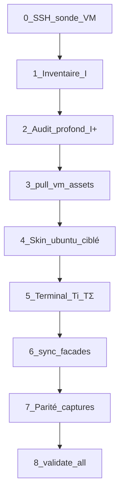

# Procédure lab — Ubuntu GNOME (VM → CapsuleOS)

> **Objectif** : **refabriquer** le skin `linux-ubuntu` depuis une VM ground truth (pas un fork aveugle de Rocky), en réutilisant le **noyau GNOME** validé sur Rocky tout en préservant les **singularités Ubuntu** : dock latéral, thème Yaru, `apt`, centre de logiciels.

**Lire d’abord** : [convention-reproduction-os.md](convention-reproduction-os.md) · [linux-gnome-capsule-slots.md](inventaires/linux-gnome-capsule-slots.md) · [inventaire-parite-fedora.md](inventaire-parite-fedora.md) (cloisonnement dock).

| Couche | Document |
|--------|----------|
| Construction générique | [procedure-clonage-os-depuis-vm.md](procedure-clonage-os-depuis-vm.md) |
| Coque GNOME partagée | [branche-redhat-gnome.md](branche-redhat-gnome.md) (noyau Rocky → dérivés) |
| Wayland / Xwayland | [lab-vm-rhel-wayland.md](lab-vm-rhel-wayland.md) (Mutter — même mécanisme) |
| Terminal | [convention-shell-global.md](convention-shell-global.md) · profil `debian` (`apt`) |
| Assets VM | [convention-assets-depuis-vm.md](convention-assets-depuis-vm.md) |

---

## Différences Rocky ↔ Ubuntu (à inventorier, pas supposer)

| Aspect | Rocky / RHEL GNOME | Ubuntu 25.10 GNOME |
|--------|-------------------|---------------------|
| Dock permanent | **Absent** (dash Aperçu) | **Présent** (gauche) |
| Inset fenêtres | `--fedora-dock-width: 0` | `--ubuntu-dock-width` mesuré |
| Icônes | Adwaita (VM) | **Yaru** (VM) |
| Paquets sonde | `dnf` + EPEL | `apt` |
| Terminal VM | Ptyxis | Ptyxis ou GNOME Terminal — **à noter dans Ti** |
| Mises à jour | `dnf` / Logiciels | `apt` / **Centre de logiciels** (`update_manager_ubuntu`) |
| Skin Capsule | `home/RedHat/Rocky/` | `home/Debian/Ubuntu/` · `body#ubuntu` |

**Règle anti-porosité** : toute règle dock / fond / token Ubuntu sous `body#ubuntu` ; gate `validate-skin-vendor-isolation.mjs`.

---

## Vue d’ensemble



---

## Phase 0 — Prérequis (bloquants)

### 0.1 VM détectée (virt-manager)

```bash
virsh -c qemu:///system list --all
virsh -c qemu:///system domifaddr ubuntu25.10
virsh -c qemu:///system net-dhcp-leases default
```

Exemple juin 2026 : VM **`ubuntu25.10`** → `192.168.122.141` (hôte `capsule-KVM`).

### 0.2 Bootstrap SSH (dans la VM — console virt-manager si port 22 fermé)

```bash
# Copier-coller dans un terminal de la VM Ubuntu :
sudo apt-get update
sudo apt-get install -y openssh-server wmctrl xdotool python3
sudo systemctl enable --now ssh
```

Ou depuis le dépôt (après premier SSH) :

```bash
ssh capsule@192.168.122.141 'bash -s' < root/tools/lab/vm-ubuntu-lab-bootstrap.sh
```

### 0.3 Clé SSH (hôte)

```bash
ssh-copy-id -i ~/.ssh/capsuleos-lab.pub capsule@192.168.122.141
node usr/lib/capsuleos/tools/lab/lab-ssh.mjs --id linux-ubuntu
```

### 0.4 Test Wayland

```bash
ssh -i ~/.ssh/capsuleos-lab capsule@192.168.122.141 \
  'export DISPLAY=:0 XAUTHORITY=$(ls /run/user/$(id -u)/.mutter-Xwaylandauth.* 2>/dev/null | head -1); wmctrl -l; echo exit:$?'
```

Attendu : **`exit:0`**.

### 0.5 Inventaire lab local

Entrée `linux-ubuntu` dans `etc/capsuleos/lab-inventory.json` (gitignoré) — voir [lab-inventory.example.json](../../etc/capsuleos/lab-inventory.example.json).

### 0.6 HTTP CapsuleOS

```bash
python3 -m http.server 8765 --bind 127.0.0.1
curl -s -o /dev/null -w '%{http_code}\n' http://127.0.0.1:8765/OS/linux/families/debian/ubuntu/index.html
```

### 0.7 Baseline gates

```bash
node usr/lib/capsuleos/tools/validate-all.mjs
node usr/lib/capsuleos/tools/print-agent-brief.mjs linux-ubuntu
```

---

## Phase 1 — Inventaire ground truth (**I**)

```bash
node usr/lib/capsuleos/tools/lab/collect-gnome-vm-inventory.mjs \
  --id linux-ubuntu --write --write-doc

node usr/lib/capsuleos/tools/lab/collect-vm-deep-audit.mjs \
  --id linux-ubuntu --phase static --write-doc
```

Sorties :

- `root/docs/inventaires/linux-ubuntu-vm.json`
- `root/docs/inventaires/linux-ubuntu-vm.md`
- `root/docs/inventaires/linux-ubuntu-deep-audit.json`

Inventaire terminal (**Ti**) :

```bash
# Après collecte SSH interactive — voir procedure-terminal-commandes.md
# Sortie : root/docs/inventaires/linux-ubuntu-terminal-vm.json
```

---

## Phase 2 — Assets VM (**A** / **S**)

```bash
bash root/tools/lab/pull-vm-assets.sh --id linux-ubuntu
# Optionnel WebP :
PREPARE_WEB_MEDIA=1 bash root/tools/lab/pull-vm-assets.sh --id linux-ubuntu
```

Cibles : `usr/share/capsuleos/assets/images/vendors/ubuntu/`, icônes Yaru panel, fonds `/usr/share/backgrounds/`.

---

## Phase 3 — Implémentation skin (`home/Debian/Ubuntu/`)

Ordre recommandé (P0) :

| # | Zone | Fichiers | Gate |
|---|------|----------|------|
| 1 | Dock + inset | `style/gnome-shell/ubuntu-dock.css`, `ubuntu-tokens.css`, `gnome-workstation.css` | `validate-skin-vendor-isolation` |
| 2 | Top bar + Aperçu | `style/gnome-shell/overview.css`, `js/overview.js` | smoke visuel |
| 3 | Nautilus | `style/apps/nautilus.skin.css` | `sync-gnome-nautilus-skin.mjs` si partagé |
| 4 | Terminal Ptyxis | `style/apps/terminal.skin.css` + tokens | `validate-terminal-skin-lock` (après migration tokens) |
| 5 | Profil | `skin.profile.json`, `etc/capsuleos/profiles/linux-ubuntu.json` | `CAPSULE_LOCALE`, `CAPSULE_TERMINAL_PROFILE: debian` |

**Interdit** : copier les fonds Rocky/Fedora ; réactiver `display:flex` sur `#tableau.fedora-dock` hors `body#ubuntu`.

---

## Phase 4 — Clôture

```bash
node usr/lib/capsuleos/tools/linux/sync-linux-skin-closure.mjs
node usr/lib/capsuleos/tools/validate-all.mjs
CAPSULE_HTTP_BASE=http://127.0.0.1:8765 node usr/lib/capsuleos/tools/lab/smoke-terminal-ptyxis-chrome.mjs --profile=linux-ubuntu
```

Rapport d’écarts : `root/docs/inventaire-parite-ubuntu.md` (à créer en fin de passe).

---

## Échecs fréquents

| Symptôme | Action |
|----------|--------|
| `Connection refused` SSH | Phase 0.2 dans la VM |
| Dock Unity sur Fedora/Rocky | `validate-skin-vendor-isolation.mjs` |
| Fenêtres sous le dock | `windowContainer.js` lit inset par `body.id` |
| Terminal profil `dnf` sur Ubuntu | `CAPSULE_TERMINAL_PROFILE: debian` |
