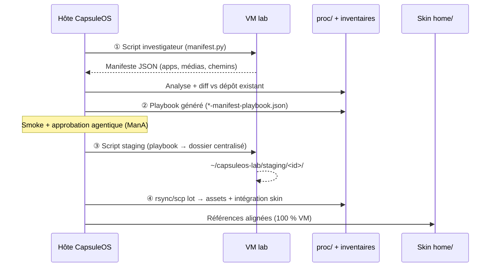

# Procédure — playbook de réplication généré depuis le manifeste

> **Principe** : le manifeste VM est la **source de vérité** ; le playbook est un **plan d'exécution dérivé** qui ne décrit que les **écarts** entre la VM et le clone CapsuleOS.

Complète [convention-manifest-vm.md](convention-manifest-vm.md) et s'intègre dans la couche **PbU** du [playbook général](procedure-playbook-general.md).

---

## 1. Boucle en quatre temps



| Phase | Symbole | Livrable |
|-------|---------|----------|
| **Découverte** | **ManV** | `proc/<id>/distribution-manifest.json` |
| **Diff + plan** | **PbM** | `proc/<id>/<vendor>-manifest-playbook.json` |
| **Staging VM** | **ManSt** | `~/capsuleos-lab/staging/<id>/` + `staging-manifest.json` |
| **Import + intégration** | **ManI** | Assets dans `usr/share/capsuleos/assets/` + refs skin |

---

## 2. Discrimination des écarts (fidélité 100 %)

Le générateur de playbook classe chaque entrée du manifeste :

| Statut | Signification | Action playbook |
|--------|---------------|-----------------|
| `skip` | Fichier CapsuleOS déjà présent et référencé skin | Aucun pull |
| `pull` | Absent du dépôt ou non référencé | Copier VM → staging → import |
| `drift` | Présent mais chemin skin ≠ cible manifeste | `rewrite-ref` dans `index.html` / CSS |
| `capsule-only` | Entrée Missions / À propos | Ignorer côté VM |
| `on-vm-false` | Simulé (contrat `onVm: false`) | Ignorer pull, garder slot |

**Règle** : on ne pull que ce que le diff marque `pull` ou `drift` — pas de thème icône entier, pas de pack générique d'un autre vendor.

---

## 3. Scripts VM (deux rôles distincts)

### 3.1 Investigateur (déjà en place)

- `root/tools/lab/vm-distribution-manifest.py`
- Sortie : manifeste complet (lecture seule, pas de copie massive)

### 3.2 Staging (généré depuis le playbook)

- `root/tools/lab/vm-manifest-staging-collect.sh` (gabarit)
- Entrée : playbook approuvé (JSON minimal envoyé via SSH stdin)
- Sortie : arborescence plate sur la VM :

```
~/capsuleos-lab/staging/<registryId>/
  apps/<normalizedId>.<ext>
  wallpaper/<basename>
  panel/<basename>
  staging-manifest.json   # fichiers réellement copiés + checksums
```

---

## 4. Chaîne hôte (ordre recommandé)

```bash
# ① Découverte
node usr/lib/capsuleos/tools/lab/collect-vm-distribution-manifest.mjs --id linux-ubuntu --write --ssh

# ② Playbook personnalisé (diff)
node usr/lib/capsuleos/tools/lab/generate-manifest-replication-playbook.mjs --id linux-ubuntu --write
node usr/lib/capsuleos/tools/lab/smoke-manifest-replication-playbook.mjs --id linux-ubuntu

# Gate agentique (comme ManA)
node usr/lib/capsuleos/tools/lab/approve-vm-distribution-manifest.mjs --id linux-ubuntu --write

# ③ Staging sur VM
node usr/lib/capsuleos/tools/lab/run-manifest-staging-on-vm.mjs --id linux-ubuntu --write

# ④ Import lot
node usr/lib/capsuleos/tools/lab/import-manifest-staging.mjs --id linux-ubuntu --write
node usr/lib/capsuleos/tools/prepare-web-media.mjs --vendor ubuntu --rewrite-refs
```

---

## 5. Relation avec le playbook général (G-PB)

| Couche G-PB | Lien manifest-playbook |
|-------------|------------------------|
| **PbU** (universel) | ManV + PbM + ManSt + ManI remplacent le pull SCP ad hoc |
| **PbT** (toolkit) | Inchangé — Paramètres GNOME, parité Vp, etc. |
| **Pbτ** (bout de chaîne) | Le playbook manifest **est** la partie τ matérialisée pour assets/apps |

Le playbook manifest ne remplace pas `gnome-settings-playbook` : il couvre **apps + médias statiques** ; le toolkit couvre **comportement UI runtime**.

---

## 6. Prédicats étendus

Voir `etc/capsuleos/contracts/vm-distribution-manifest.json` :

- **PbM** — playbook généré et smoke OK
- **ManSt** — staging VM terminé (`staging-manifest.json` présent)
- **ManΣ′** — ManV ∧ PbM ∧ ManA ∧ ManSt ∧ ManI
