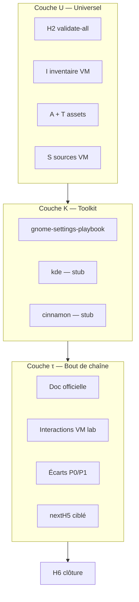

# Procédure — playbook général multiplateforme (G-PB)

> **Statut** : contrat validé (`etc/capsuleos/contracts/playbook-general.json`).  
> **Objectif** : une **procédure unique** pour tous vendors, branches, versions et distributions, enchaînant des **playbooks universels**, des **playbooks toolkit** réutilisables, puis un **playbook de bout de chaîne (τ)** pour les spécificités d’un environnement.

**Références** : [logique-formelle.md](logique-formelle.md) · [procedure-replication-formelle.md](procedure-replication-formelle.md) · [convention-reproduction-os.md](convention-reproduction-os.md)

---

## 1. Architecture en trois couches



| Couche | Symbole | Périmètre | Exemple |
|--------|---------|-----------|---------|
| **Universel** | **PbU** | Tout `registryId` | Inventaire VM, assets, traçabilité |
| **Toolkit** | **PbT** | `os-registry.toolkit.id` | GNOME Paramètres (Fedora, Rocky, Alma, Ubuntu…) |
| **Bout de chaîne** | **Pbτ** | Un `registryId` | RL10 + Nautilus 47 + doc Rocky + gaps VM |
| **Sigma** | **PbΣ** | PbU ∧ PbT ∧ Pbτ | Prêt patch skin ciblé (**H5**) |

---

## 2. Playbooks spécifiques inclus

### 2.1 Universels (couche U)

| ID | Script / action | Prédicat |
|----|-----------------|----------|
| `u-validate-all` | `validate-all.mjs` | **H₂** |
| `u-vm-inventory` | `inventaires/<id>-vm.json` | **I** |
| `u-verify-assets` | `verify-playbook-assets --strict` | **A** |
| `u-collect-assets` | `collect-vm-gnome-settings-assets.mjs` | **S** |
| Traçabilité | `pull-vm-assets.sh` → `SOURCE-VM.txt` | **T** |

Procédure clone : [procedure-clonage-os-depuis-vm.md](procedure-clonage-os-depuis-vm.md).

### 2.2 Toolkit GNOME (couche K — réutilisable)

Spécialisation complète : [procedure-creation-playbook-gnome-settings.md](procedure-creation-playbook-gnome-settings.md).

Orchestrateur : `run-replication-chain.mjs --auto` — prédicats **V → G → Vc → Vp**.

| Niveau | Playbook | Livrable |
|--------|----------|----------|
| 1 | Tour panneaux | `*-gnome-settings-playbook.json` |
| 2 | Interactions | `*-gnome-settings-interaction.json` |
| 3 | Enquête visuelle | `*-visual-investigation.json` |
| 4 | Gsettings profond | `gsettingsDeepPass` |
| 5 | Parité Capsule | `visualMatch` classé |

**PbT** = domaine `gnome-settings-playbook` complet (Vp ∧ V ∧ G ∧ Vc).

### 2.3 Autres toolkits (stubs)

| Toolkit | Statut | Extension future |
|---------|--------|------------------|
| `kde` | stub | Plasma System Settings + Dolphin |
| `cinnamon` | stub | Nemo + ccsm |
| `cosmic` | stub | COSMIC settings |

Règle **R-PB2** : si stub → documenter dans `playbook-general-state.json` ; ne pas inventer baseline.

### 2.4 Bout de chaîne τ (spécificités environnement)

Après **PbT**, collecter :

```bash
node usr/lib/capsuleos/tools/lab/collect-playbook-tail.mjs --id <registryId>
```

Livrables :

- `root/docs/inventaires/<id>-playbook-tail.json`
- `root/docs/inventaires/<id>-playbook-tail.md`

Contenu τ :

1. **Documentation officielle** — vendor (Rocky release notes), toolkit (GNOME Help, HIG), à confronter (`matchesObservation`, `delta`).
2. **VM lab** — sonde SSH, écarts issus inventaire / enquête visuelle.
3. **Interactions agents** — notes pour la passe **H5** minimale (`nextH5[]`) ; vérifier **Rv** (rafraîchissement vues) sur chaque action documentée — [convention-rafraichissement-vues.md](convention-rafraichissement-vues.md).
4. **Règle** : VM prime sur doc ; écarts P0 bloquants avant merge skin.

Modèle : [`_template-playbook-tail.json`](inventaires/_template-playbook-tail.json).

---

## 3. Orchestration et mode auto

Contrat : `etc/capsuleos/contracts/playbook-general.json`

```bash
# État et prochaine couche
node usr/lib/capsuleos/tools/lab/run-playbook-general.mjs --id linux-rocky --dry-run

# Mode auto (R-PB-AUTO) — une étape par invocation ; enchaîner avec --auto
node usr/lib/capsuleos/tools/lab/run-playbook-general.mjs --id linux-rocky --auto

# Résolution action unique (agent)
node usr/lib/capsuleos/tools/lab/resolve-agent-action.mjs --id linux-rocky --scope general
```

**Activation auto** : `autoExecution.enabled: true` dans le contrat **après** :

```bash
node usr/lib/capsuleos/tools/lab/smoke-playbook-general.mjs
```

Hooks Cursor + [capsuleos-autonomous-execution.mdc](../.cursor/rules/capsuleos-autonomous-execution.mdc) : les commandes `run-playbook-general` et sous-orchestrateurs sont **auto-allow**.

---

## 4. Règles d’inférence (ajout logique formelle)

```
R-PB1   ¬PbU           →  couche universal
R-PB2   PbU ∧ ¬PbT      →  run-replication-chain --auto (si toolkit actif)
R-PB3   PbT ∧ ¬Pbτ      →  collect-playbook-tail
R-PB4   PbΣ             →  H5 patch minimal (nextH5) puis H6
R-PB-AUTO validated ∧ ∃! step → run-playbook-general --auto
```

---

## 5. Ajouter une nouvelle distribution

1. Entrée `os-registry.json` (`vendor`, `branchId`, `toolkit`, `referencePaths`).
2. VM lab + `lab-inventory.json`.
3. `run-playbook-general.mjs --id <nouveau> --auto` jusqu’à blocage (stub toolkit ou inventaire).
4. Si toolkit = `gnome` : hériter **toute** la chaîne Paramètres sans duplication.
5. τ spécifique : enrichir `playbook-tail` (doc vendor + gaps VM).

---

## 6. Rocky Linux — référence

| Couche | État attendu juin 2026 |
|--------|------------------------|
| PbU | I + T + S (VM inventoriée, assets alignés) |
| PbT | V, G, Vc, Vp (P0 Paramètres) |
| Pbτ | `linux-rocky-playbook-tail.json` après collect |
| Suite | P1 enquête visuelle · polish skin backlog |

---

## 7. Liens

| Document | Rôle |
|----------|------|
| [procedure-replication-formelle.md](procedure-replication-formelle.md) | Chaîne V…Vp (sous-ensemble K/gnome) |
| [procedure-creation-playbook-gnome-settings.md](procedure-creation-playbook-gnome-settings.md) | Détail 4 niveaux GNOME |
| [agent-action-aliases.json](../../etc/capsuleos/contracts/agent-action-aliases.json) | Alias R-AUTO |
