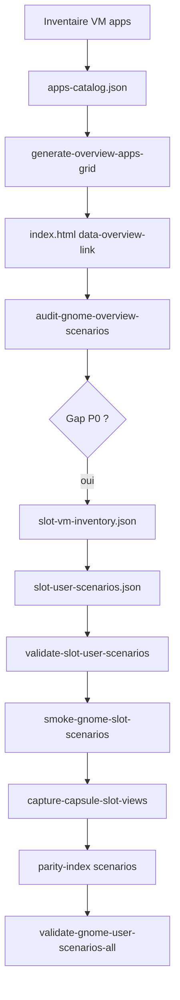

# Playbook — overview GNOME → slot → scénarios

> **Objectif** : chaîne reproductible pour tout skin **toolkit GNOME** (Rocky, Fedora, Alma, Ubuntu) : inventaire overview → slot CapsuleOS → contrat scénarios → gates.

**Documents liés** :

| Document | Rôle |
|----------|------|
| [procedure-scenarios-pedagogiques-gnome.md](procedure-scenarios-pedagogiques-gnome.md) | Pattern contrat → validateur → smoke → capture |
| [procedure-lab-linux-gnome-scenarios.md](procedure-lab-linux-gnome-scenarios.md) | Procédure lab générique (tous vendors GNOME) |
| [procedure-apps-catalog.md](procedure-apps-catalog.md) | Catalogue VM → slots |
| [procedure-creation-playbook-gnome-settings.md](procedure-creation-playbook-gnome-settings.md) | Playbook Paramètres (domaine séparé) |
| `etc/capsuleos/contracts/gnome-user-scenarios-index.json` | **Manifeste** des contrats scénarios |

---

## 1. Prédicats overview

| Symbole | Signification |
|---------|---------------|
| **Ov** | Grille overview + dash + dock alignés sur `apps-catalog.json` |
| **OvΣ** | `generate-overview-apps-grid.mjs` + smoke routing overview |
| **ScΣ** | Contrat scénarios slot valide (≥ 4 P0) |
| **ScAll** | Tous contrats index manifeste verts |

**Priorité** : P0 visible sans scroll (dock + dash) → P1 reste overview → P2 apps secondaires / décoratives.

---

## 2. Chaîne overview → scénarios



---

## 3. Sources de vérité overview

| Couche | Fichier / zone | Agent doit |
|--------|----------------|------------|
| Catalogue apps | `etc/capsuleos/contracts/apps-catalog.json` | `placement.overview`, `priorite`, `slot` |
| Grille générée | `home/<Vendor>/<Distro>/index.html` | Marqueurs `CAPSULE-OVERVIEW-APPS-GRID` |
| Liens cliquables | `data-overview-link="<slot>"` | Slot = `windowElement[data-link]` |
| Dash overview | `fedora-overview__dash-item` | Favoris gsettings VM |
| Dock | `fedora-dock` `data-link` | Lanceurs panel |
| Recherche | `overview.js` `searchCatalog` | Apps hors grille visible |
| Parité JSON | `linux-<distro>-parity-index.json` | Champ `scenarios` par slot |

Génération grille depuis manifeste VM :

```bash
node usr/lib/capsuleos/tools/lab/generate-overview-apps-grid.mjs --id linux-alma --write
node usr/lib/capsuleos/tools/linux/sync-linux-skin-closure.mjs
```

---

## 4. Audit gaps overview

```bash
node usr/lib/capsuleos/tools/lab/audit-gnome-overview-scenarios.mjs --id linux-alma
node usr/lib/capsuleos/tools/lab/audit-gnome-overview-scenarios.mjs --id linux-rocky --json
```

Sortie : tableau zone × slot × priorité × scénarios (oui/non) + liste **gaps P0**.

---

## 5. Manifeste contrats scénarios

Index machine : `etc/capsuleos/contracts/gnome-user-scenarios-index.json`

| Champ | Usage |
|-------|-------|
| `contracts[]` | Contrats livrés (16 slots juin 2026, dont LibreOffice Writer C29) |
| `backlog[]` | Slots P0 sans scénarios (C30+) |
| `predicateChecks.ScAll` | Gate agrégée |

Gate agrégée :

```bash
node usr/lib/capsuleos/tools/validate-gnome-user-scenarios-all.mjs
```

Intégrée dans `validate-quality-all.mjs` et donc `validate-all.mjs`.

---

## 6. Alma — tableau overview (juin 2026)

État **après C25** — audit `audit-gnome-overview-scenarios.mjs --id linux-alma` :

### Slots câblés avec scénarios P0 (12)

| Zone | Slot | Label | Contrat | Cycle |
|------|------|-------|---------|-------|
| dash | `update_manager` | Logiciels | `software-user-scenarios.json` | C15 |
| dash | `text_editor` | Éditeur | `text-editor-user-scenarios.json` | C16 |
| dash | `calendar` | Calendrier | `calendar-user-scenarios.json` | C20 |
| overviewGrid | `themes` | Paramètres | `themes-user-scenarios.json` | C18 |
| overviewGrid | `clocks` | Horloges | `clocks-user-scenarios.json` | C19 |
| overviewGrid | `baobab` | Disques | `baobab-user-scenarios.json` | C24 |
| overviewGrid | `tour` | Visite guidée | `tour-user-scenarios.json` | C24 |
| overviewGrid | `snapshot` | Caméra | `snapshot-user-scenarios.json` | C25 |
| overviewGrid | `characters` | Caractères | `characters-user-scenarios.json` | C25 |
| overviewGrid | `system_monitor` | Moniteur | `system-monitor-user-scenarios.json` | C25 |

*(+ `calculator` via recherche overview ; `screenshot` via quick settings)*

### Slots câblés C26 (Nautilus)

| Zone | Slot | Label | Contrat | Cycle |
|------|------|-------|---------|-------|
| dash | `nemo` | Fichiers (Nautilus) | `nautilus-user-scenarios.json` | **C26** |

> Slot technique `nemo` ; application VM **Nautilus** (`org.gnome.Nautilus`) ; gabarit **`nemo-gnome`**. Ne pas confondre avec **Nemo Cinnamon** (`linux-mint`).

### Slots câblés C27 (Firefox)

| Zone | Slot | Label | Contrat | Cycle |
|------|------|-------|---------|-------|
| dash | `firefox` | Firefox | `firefox-user-scenarios.json` | **C27** |

> Firefox 140 ESR Alma · chrome Proton GNOME · scénarios F1–F4 (accueil, barre adresse, onglets, favori La Capsule).

### Slots câblés C28 (Terminal Ptyxis)

| Zone | Slot | Label | Contrat | Cycle |
|------|------|-------|---------|-------|
| dash | `terminal` | Terminal | `terminal-user-scenarios.json` | **C28** |

> Ptyxis 47.13 Alma · chrome header onglets · scénarios Te1–Te4 (invite, pwd/ls, onglet, whoami/help).

### Slots câblés C29 (LibreOffice Writer)

| Zone | Slot | Label | Contrat | Cycle |
|------|------|-------|---------|-------|
| grid + dock | `librewriter` | LibreOffice Writer | `librewriter-user-scenarios.json` | **C29** |

> LibreOffice 24.x FR simulé (absent VM el10) · scénarios Lw1–Lw4 (document vide, saisie, gras, enregistrer/nouveau) · cohérent Software S1 (`libreoffice-writer` → `librewriter`) · ≠ slot `text_editor`.

### Gaps P0 — backlog C30+

| Slot | Label | Zone | Smoke structurel existant | Cycle prévu |
|------|-------|------|---------------------------|-------------|
| `checklist` | Missions | dock | capsuleOnly | **C30** |

### Apps overview décoratives (sans slot — P2/P3)

Contacts, Météo, Cartes, LibreOffice Calc/Impress, Numériseur, Machines, Lecteur vidéos, Fedora Media Writer, Aide — icônes grille VM sans `data-overview-link` ; statut `decorative` dans `apps-catalog.json`.

---

## 7. Réplication vers autres skins GNOME

| Étape | Rocky / Fedora / Ubuntu |
|-------|-------------------------|
| 1 | Vérifier `registryOverrides` dans `apps-catalog.json` |
| 2 | `audit-gnome-overview-scenarios.mjs --id <registryId>` |
| 3 | Réutiliser **contrats toolkit** (`registryIds` dans chaque JSON) |
| 4 | Smokes `--id linux-rocky` (paramétrable) |
| 5 | Captures vendor `images/vendors/<vendor>/inventory/` |
| 6 | `parity-index` du distro — champ `scenarios` |

**Ne pas forker** les contrats par vendor : un contrat = un slot toolkit ; overrides skin via CSS vendor uniquement.

---

## 8. Gates clôture

```bash
node usr/lib/capsuleos/tools/lab/audit-gnome-overview-scenarios.mjs --id <registryId>
node usr/lib/capsuleos/tools/validate-gnome-user-scenarios-all.mjs
node usr/lib/capsuleos/tools/validate-all.mjs
node usr/lib/capsuleos/tools/linux/sync-linux-skin-closure.mjs   # si skin touché
```

Smoke scénarios (exemple) :

```bash
CAPSULE_HTTP_BASE=http://127.0.0.1:5501 \
  node usr/lib/capsuleos/tools/lab/smoke-gnome-software-scenarios.mjs --id linux-alma
```

---

## 9. Anti-patterns

1. Bouton overview sans `data-overview-link` alors que le slot existe (**Ov** cassé).
2. Contrat scénarios vendor-specific (fork Alma-only) au lieu du toolkit partagé.
3. Grille overview éditée à la main sans `generate-overview-apps-grid.mjs`.
4. Oublier d'enregistrer le contrat dans `gnome-user-scenarios-index.json`.
