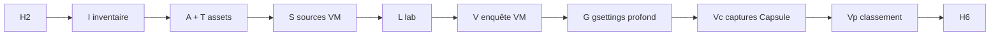

# Procédure — réplication formelle VM → CapsuleOS (tous vendors)

> **Statut** : spécialisation opérationnelle de [logique-formelle.md](logique-formelle.md).  
> **Référence Rocky** : [procedure-lab-linux-rocky-gnome.md](procedure-lab-linux-rocky-gnome.md) · [procedure-creation-playbook-gnome-settings.md](procedure-creation-playbook-gnome-settings.md)

**Objectif** : permettre à **n’importe quelle entrée** `etc/capsuleos/os-registry.json` (vendor, toolkit, tier) d’être répliquée selon la **même chaîne de prédicats**, sans réinventer la méthode distro par distro.

---

## 1. Chaîne universelle

Notation alignée sur la logique formelle (§2.7).

| Étape | Prédicat | Signification | Gate / livrable |
|-------|----------|---------------|-----------------|
| 0 | **H₂** | Dépôt sain | `validate-all.mjs` |
| 1 | **M** | VM lab joignable | `etc/capsuleos/lab-inventory.json` |
| 2 | **I** | Inventaire VM | `inventaires/<id>-vm.json` |
| 3 | **A ∧ T** | Assets présents + traçabilité | `verify-playbook-assets --strict`, `SOURCE-VM.txt` |
| 4 | **S** | Sources VM alignées | `*-gnome-settings-assets.json`, SHA256 |
| 5 | **L** | Lab domaine vert | `run-gnome-settings-lab.mjs` |
| 6 | **V** | Enquête visuelle VM (lot P0) | `*-gnome-settings-visual-investigation.json` |
| 7 | **G** | Passe gsettings approfondie | `gsettingsDeepPass` dans inventaire |
| 8 | **Vc** | Captures Capsule miroir | `capsuleCaptures[]` P0 |
| 9 | **Vp** | Parité visuelle classée | `capsuleParity.visualMatch` ≠ `unknown` |
| 9b | **Φ** | Fidélité visuelle mesurée (diff pixel VM ↔ clone + computed vs inventaire) | `<id>-visual-fidelity.json` · scènes P0 `match` |
| 10 | **H₆** | Clôture release Paramètres | `*-gnome-settings-h6-closure.json` — exige **Φ** sur les slots à scènes P0 déclarées |
| 11 | **AppV** | Inventaire apps VM | `*-vm-apps-installed.json` |
| 12 | **AppC** | Catalogue strict apps | `*-apps-catalog.json` |
| 13 | **AppΣ** | Apps P0 OK | `smoke-apps-catalog.mjs` |
| 14 | **H₆′** | Clôture globale (shell + apps) | `validate-all.mjs` |



**Règles d’inférence** (ajout au document canonique) :

```
R-PRI2   V ∧ ¬G   →  enrich-visual-investigation-gsettings-pass.mjs
R-PRI2b  G ∧ ¬Vc  →  collect-capsule-visual-investigation.mjs
R-PRI2c  Vc ∧ ¬Vp  →  enrich-visual-investigation-capsule-parity.mjs
R-PHI1   scènes P0 déclarées ∧ ¬ΦC  →  capture-scene-pair.mjs --id <id> --slot <slot>
R-PHI2   ΦC ∧ ¬ΦM  →  compare-visual-fidelity.mjs --id <id>
R-PHI3   computedChecks ∧ ¬ΦI  →  assert-computed-vs-inventory.mjs --id <id> --slot <slot>
R-PRI3   Vp ∧ lot P1 ouvert  →  collect enquête --filter P1
```

**Φ vs Vp** : Vp (classement déclaratif) ne suffit plus pour la clôture visuelle — voir `logique-formelle.md` §2.4b. Contrat scènes : `etc/capsuleos/contracts/visual-scenes.json`.

---

## 2. Paramétrage par registryId

Tout outil lab accepte **`--id <registryId>`** ou **`--registry <registryId>`** (ex. `linux-rocky`, `linux-fedora`, `linux-mint`).

| Fichier contrat | Rôle |
|-----------------|------|
| `etc/capsuleos/contracts/replication-chain.json` | Ordre des étapes, scènes Capsule par `controlId` |
| `etc/capsuleos/os-registry.json` | `vendor`, `referencePaths.skin`, `toolkit` |
| `root/docs/inventaires/<id>-replication-state.json` | État des prédicats (généré) |

**Chemins inventaire** (vendor-agnostiques) :

```
root/docs/inventaires/<registryId>-gnome-settings-visual-investigation.json
root/docs/inventaires/captures/<registryId>/gnome-settings-visual/          # VM
root/docs/inventaires/captures/<registryId>/gnome-settings-visual-capsule/  # Capsule
usr/share/capsuleos/assets/images/vendors/<vendor>/inventory/<prefix>-capsule/
```

---

## 3. Orchestrateur

```bash
# État + prochaine étape (sans exécuter)
node usr/lib/capsuleos/tools/lab/run-replication-chain.mjs --id linux-rocky --dry-run

# Exécuter la prochaine étape admissible (R-AUTO)
node usr/lib/capsuleos/tools/lab/run-replication-chain.mjs --id linux-rocky
```

Domaine par défaut : `gnome-settings-playbook` (Paramètres GNOME). Le clone bureau complet reste sous [convention-reproduction-os.md](convention-reproduction-os.md).

---

## 4. Séquence manuelle (référence)

Remplacer `<id>` par le `registryId` (ex. `linux-rocky`).

```bash
node usr/lib/capsuleos/tools/validate-all.mjs

node usr/lib/capsuleos/tools/lab/verify-playbook-assets.mjs --registry <id> --strict
node usr/lib/capsuleos/tools/lab/collect-vm-gnome-settings-assets.mjs --id <id>

node usr/lib/capsuleos/tools/lab/run-gnome-settings-lab.mjs

node usr/lib/capsuleos/tools/lab/collect-vm-gnome-settings-visual-investigation.mjs --id <id> --filter P0
node usr/lib/capsuleos/tools/lab/enrich-visual-investigation-gsettings-pass.mjs --id <id>

node usr/lib/capsuleos/tools/lab/collect-capsule-visual-investigation.mjs --id <id>
node usr/lib/capsuleos/tools/lab/enrich-visual-investigation-capsule-parity.mjs --id <id>

node usr/lib/capsuleos/tools/validate-all.mjs
```

**Captures Capsule** : si l’inventaire vendor existe déjà (`capture-capsule-<vendor>.mjs`), `collect-capsule-visual-investigation` **réutilise** les PNG ; sinon serveur HTTP + `CAPSULE_HTTP_BASE`.

---

## 5. Ajouter une nouvelle distribution

1. Entrée **R** dans `os-registry.json` + profil skin (`ajouter-os-scalable.md`).
2. VM **M** + inventaire **I** (`procedure-clonage-os-depuis-vm.md`).
3. Hôte lab : `etc/capsuleos/lab-inventory.example.json` → `lab-inventory.json` (gitignoré).
4. Matrice visuelle : étendre `gnome-settings-visual-investigation-matrix.json` si toolkit GNOME.
5. Lancer `run-replication-chain.mjs --id <nouveau-id>` jusqu’à **Vp** ; documenter écarts P0/P1 dans l’inventaire.
6. Spécialisation vendor optionnelle : `root/skills/distributions/<id>/SKILL.md` — **renvoie** toujours à ce document.

**Interdit** : logique de réplication parallèle dans un skill distro sans prédicats §2.7.

---

## 6. Modèle d’état

Copier [`_template-replication-state.json`](inventaires/_template-replication-state.json) vers `inventaires/<id>-replication-state.json` (généré automatiquement par `run-replication-chain.mjs`).

---

## 6. Exécution autonome Cursor (alias)

Objectif : **décision logique par passage** sans validation humaine pour les gates admissibles ; **regrouper** les invites mot de passe.

| Composant | Rôle |
|-----------|------|
| `etc/capsuleos/contracts/agent-action-aliases.json` | Alias prédicat → commande, `autoAllow`, `passwordBundles` |
| `resolve-agent-action.mjs` | Prochaine action JSON (R-AUTO) |
| `run-replication-chain.mjs --auto` | Enchaîne les étapes admissibles |
| `.cursor/rules/capsuleos-autonomous-execution.mdc` | Consigne agent |
| `.cursor/hooks/approve-formal-lab.sh` | Auto-allow shell aligné ; R-ASK1 pour commit/sudo ad hoc |

```bash
# Prochaine action (raisonnement logique)
node usr/lib/capsuleos/tools/lab/resolve-agent-action.mjs --id linux-rocky

# Enchaînement auto jusqu'à blocage
node usr/lib/capsuleos/tools/lab/run-replication-chain.mjs --id linux-rocky --auto
```

**R-PWD1** — bundles :

- `bash root/tools/lab/vm-rocky-lab-bootstrap.sh` — paquets VM (un sudo)
- `bash root/tools/lab/setup-lab-ssh-key.sh user@ip` — clé SSH lab (une invite)

Activer les hooks : Cursor → Settings → Hooks (recharger après modif `hooks.json`).

---

## 7. Liens

| Document | Rôle |
|----------|------|
| [logique-formelle.md](logique-formelle.md) | Prédicats et règles canoniques |
| [convention-reproduction-os.md](convention-reproduction-os.md) | Clone skin complet |
| [procedure-creation-playbook-gnome-settings.md](procedure-creation-playbook-gnome-settings.md) | Détail enquête §10 |
| [convention-assets-depuis-vm.md](convention-assets-depuis-vm.md) | Gates **A**, **S**, **T** |
