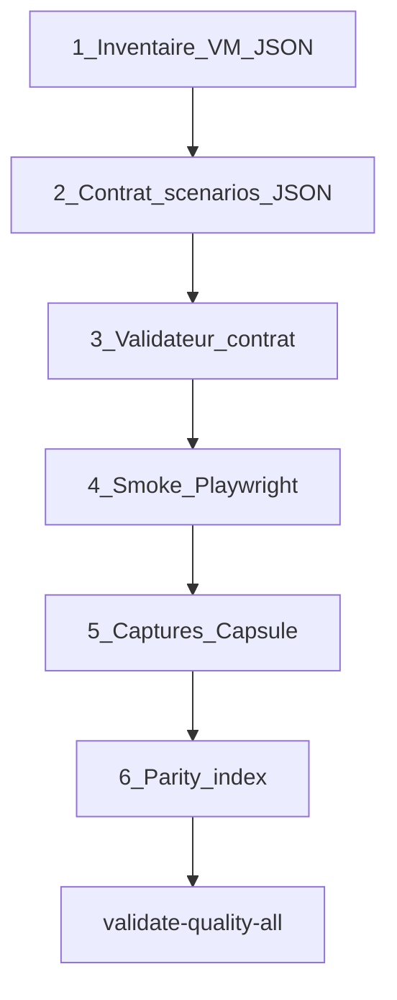

# Playbook scénarios pédagogiques GNOME

> **Objectif** : documenter le pattern **contrat → validateur → smoke → capture** applicable à tout slot GNOME (Rocky, Fedora, Alma, Ubuntu).

**Documents liés** :

| Document | Rôle |
|----------|------|
| [procedure-playbook-gnome-apps-overview.md](procedure-playbook-gnome-apps-overview.md) | Overview → slot → contrat → gates |
| [procedure-lab-linux-gnome-scenarios.md](procedure-lab-linux-gnome-scenarios.md) | Procédure lab générique (tous vendors) |
| [procedure-lab-linux-alma-gnome.md](procedure-lab-linux-alma-gnome.md) | Campagne référence Alma C15–C25 |
| `etc/capsuleos/contracts/gnome-user-scenarios-index.json` | Manifeste des 12 contrats + backlog C26+ |
| [campagne-credibilite-pedagogique.md](campagne-credibilite-pedagogique.md) | Campagne crédibilité post-Π |

---

## 1. Prédicats

| Symbole | Signification |
|---------|---------------|
| **ScΣ** | Contrat JSON valide + kernel implémente les sélecteurs `data-*` |
| **Sc1…ScN** | Scénario utilisateur P0 exécutable (smoke vert) |
| **Vc** | Captures Capsule par scénario |
| **AppΣ** | Slot apps catalogué avec smoke structurel |

**Règle** : ne pas ouvrir la campagne scénarios avant **AppΣ** et Π slot ≥ 85 (structurel).

---

## 2. Chaîne en 5 étapes



### Étape 1 — Inventaire VM

Fichier : `root/docs/inventaires/linux-<distro>-<slot>-vm-inventory.json`

Contenu minimal : `gsettings`, labels `fr_FR`, version RPM, blockers capture, alignement capsule (`template`, `kernel`, `scenariosContract`).

Sonde SSH (ex. Alma) :

```bash
ssh -i ~/.ssh/capsuleos-lab capsule@192.168.122.199 \
  'gsettings get org.gnome.desktop.interface accent-color'
```

### Étape 2 — Contrat scénarios

Emplacement : `etc/capsuleos/contracts/<slot>-user-scenarios.json`

Schéma :

```json
{
  "version": 1,
  "slot": "update_manager",
  "template": "update_manager_gnome.html",
  "kernel": "usr/lib/capsuleos/shells/linux/update-manager.js",
  "registryIds": ["linux-alma", "linux-rocky", "linux-fedora", "linux-ubuntu"],
  "predicates": { "ScΣ": "…", "Sc1": "…" },
  "scenarios": [
    {
      "id": "S1",
      "priority": "P0",
      "title": "…",
      "steps": [
        { "id": "open", "action": "openWindowByDataLink", "target": "update_manager" },
        { "id": "click", "selector": "[data-um-gnome-action=\"install\"]" }
      ],
      "proofs": {
        "smoke": "smoke-gnome-software-scenarios.mjs --scenario S1",
        "capture": "rocky-capsule-dark-software-install-open.png"
      }
    }
  ],
  "predicateChecks": {
    "ScΣ": { "script": "usr/lib/capsuleos/tools/validate-software-user-scenarios.mjs" }
  }
}
```

**Conventions sélecteurs** :

| Slot | Préfixe `data-*` | Exemple |
|------|------------------|---------|
| Logiciels | `data-um-gnome-*` | `[data-um-gnome-nav="updates"]` |
| Éditeur | `data-te-gnome-*` | `[data-te-gnome-action="save-as"]` |
| Calculatrice | `data-calc-*`, `data-calc-gnome-*` | `[data-calc="equals"]` |
| Paramètres | `data-theme-option`, `data-accent-chip`, `data-gnome-settings-panel` | `[data-accent-chip="blue"]` |
| Horloges | `data-clocks-*`, `data-clocks-gnome-*` | `[data-clocks-view="stopwatch"]` |
| Agenda | `data-cal-gnome-*` | `[data-cal-gnome-view="week"]` |
| Baobab | `data-baobab-gnome-*` | `[data-baobab-gnome-volume="home"]` |
| Visite guidée | `data-tour-gnome-*` | `[data-tour-gnome-action="next"]` |

### Étape 3 — Validateur contrat

Fichier : `usr/lib/capsuleos/tools/validate-<slot>-user-scenarios.mjs`

Vérifie :

- JSON contrat (≥ 4 scénarios P0, proofs.smoke)
- Présence handlers dans le **kernel** JS (pas le skin vendor)
- Attributs `data-*` dans le **gabarit** HTML partagé
- Existence du script smoke

Enregistrer dans `validate-quality-all.mjs`.

### Étape 4 — Smoke Playwright

Fichier : `usr/lib/capsuleos/tools/lab/smoke-gnome-<slot>-scenarios.mjs`

Pattern :

```bash
CAPSULE_HTTP_BASE=http://127.0.0.1:5501 \
  node usr/lib/capsuleos/tools/lab/smoke-gnome-<slot>-scenarios.mjs --id linux-alma

# Un scénario :
... --scenario S1
```

Structure smoke :

1. `resolveCapsuleHttpBase(id)` + `resolveCapsuleOsUrl(id, base)`
2. Ouvrir skin via `openWindowByDataLink(slot)`
3. Attendre init kernel (`dataset.*Init === 'true'` si applicable)
4. Exécuter steps ; accumuler `errors[]`
5. Exit 1 si erreurs

Lib partagée : `apps-replication-lib.mjs`, `lab-recipe-resolver.mjs`.

### Étape 5 — Captures Capsule

Fichier : `usr/lib/capsuleos/tools/lab/capture-capsule-<slot>-views.mjs`

Sortie : `usr/share/capsuleos/assets/images/vendors/<vendor>/inventory/<vendor>-capsule/`

Nommage : `rocky-capsule-dark-<slot>-<scenario>.png` (répertoire vendor partagé toolkit gnome).

### Étape 6 — Parity index

Mettre à jour `root/docs/inventaires/linux-<distro>-parity-index.json` :

```json
"scenarios": {
  "contract": "etc/capsuleos/contracts/<slot>-user-scenarios.json",
  "p0": ["S1", "S2", "S3", "S4"],
  "smoke": "smoke-gnome-<slot>-scenarios.mjs"
}
```

---

## 3. Manifeste & réplication multi-vendor

Index machine : `etc/capsuleos/contracts/gnome-user-scenarios-index.json`

Chaque contrat déclare `registryIds: ["linux-alma", "linux-rocky", "linux-fedora", "linux-ubuntu"]` — le **kernel toolkit** est partagé ; seuls CSS vendor et captures diffèrent.

Audit overview (gaps P0) :

```bash
node usr/lib/capsuleos/tools/lab/audit-gnome-overview-scenarios.mjs --id linux-alma
node usr/lib/capsuleos/tools/lab/audit-gnome-overview-scenarios.mjs --id linux-rocky
```

Pour Rocky/Fedora/Ubuntu : réutiliser les mêmes smokes avec `--id <registryId>` après vérification `parity-index`.

---

## 4. Slots livrés — état juin 2026 (12 contrats)

| Slot | IDs P0 | Cycle | Gate |
|------|--------|-------|------|
| `update_manager` | S1–S4 | C15 | `validate-software-user-scenarios.mjs` |
| `text_editor` | T1–T4 | C16 | `validate-text-editor-user-scenarios.mjs` |
| `calculator` | C1–C4 | C17 | `validate-calculator-user-scenarios.mjs` |
| `themes` | Th1–Th4 | C18 | `validate-themes-user-scenarios.mjs` |
| `clocks` | H1–H4 | C19 | `validate-clocks-user-scenarios.mjs` |
| `calendar` | Cal1–Cal4 | C20 | `validate-calendar-user-scenarios.mjs` |
| `baobab` | B1–B4 | C24 | `validate-baobab-user-scenarios.mjs` |
| `tour` | T1–T4 | C24 | `validate-tour-user-scenarios.mjs` |
| `snapshot` | Sn1–Sn4 | C25 | `validate-snapshot-user-scenarios.mjs` |
| `characters` | Ch1–Ch4 | C25 | `validate-characters-user-scenarios.mjs` |
| `system_monitor` | Sm1–Sm4 | C25 | `validate-system-monitor-user-scenarios.mjs` |
| `screenshot` | Sc1–Sc4 | C25 | `validate-screenshot-user-scenarios.mjs` |

**Backlog P0 overview** (C26+) : `nemo`, `firefox`, `terminal`, `librewriter`, `checklist` — voir [procedure-playbook-gnome-apps-overview.md §6](procedure-playbook-gnome-apps-overview.md#6-alma--tableau-overview-juin-2026).

---

## 5. Gates

```bash
# Un slot
node usr/lib/capsuleos/tools/validate-<slot>-user-scenarios.mjs

# Agrégée (12 contrats — validate-quality-all)
node usr/lib/capsuleos/tools/validate-gnome-user-scenarios-all.mjs

node usr/lib/capsuleos/tools/validate-quality-all.mjs
node usr/lib/capsuleos/tools/validate-all.mjs
```

Skin Linux touché → `sync-linux-skin-closure.mjs` avant push.

---

## 6. Anti-patterns

1. Scénario sans ground truth VM inventorié (**R-INV1**).
2. Sélecteurs inventés non présents dans le gabarit HTML.
3. Smoke qui ne passe que sur un vendor (toujours `--id` paramétrable).
4. Captures VM obligatoires quand D-Bus bloqué — préférer captures Capsule documentées.
