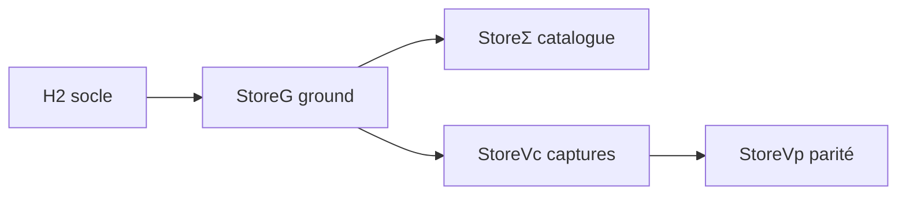

# Procédure — réplication formelle magasin GNOME Software

> **Contrat** : `etc/capsuleos/contracts/store-replication-chain.json`  
> **Cohérence** : `etc/capsuleos/contracts/os-reproduction-coherence.json`  
> **Convention** : [convention-reproduction-parfaite.md](convention-reproduction-parfaite.md)

**Principe** : le ground truth **Fedora** (GS50) sert de référence slot `update_manager` pour tout le triplet GNOME ; les autres registres héritent via `byRegistry` et overlays pack — sans fallback silencieux (P11).

---

## 1. Prédicats store

| Symbole | Signification | Vérification |
|---------|---------------|--------------|
| **StoreG** | Ground magasin branché | `gnome-software-ground.js` + `gnome-software-store-content.json` + slots-manifest |
| **StoreΣ** | Catalogue structurel | `validate-store-installable-apps.mjs` |
| **StoreVc** | Captures Capsule multi-vues | `summary.softwareViewsCapsule ≥ 4` |
| **StoreVp** | Parité store classée | `capsuleParity.visualMatch` slot update_manager |

**StoreΣ** (structure) ≠ **StoreVp** (parité parfaite). La poursuite du travail store n'est admissible que si **StoreG** ∧ grille argumentation documentée (C6).



---

## 2. Grille d'argumentation (slot update_manager)

Appliquer les cinq dimensions du contrat cohérence sur chaque écart P0 :

```bash
node usr/lib/capsuleos/tools/lab/enrich-apps-visual-investigation-parity.mjs --id linux-fedora
```

Renseigner `contentGaps[]` avec `dimension` ∈ {chrome, content, catalog, interaction, detail}.

---

## 3. Chaîne opérationnelle

### Orchestrateur (R-AUTO)

```bash
node usr/lib/capsuleos/tools/lab/run-store-replication-chain.mjs --id linux-fedora --auto
# ou via pipeline unifié :
node usr/lib/capsuleos/tools/lab/run-capsule-pipeline.mjs --id linux-fedora --auto
```

Phases filtrées par `storeCampaign.campaignPhases` dans `lab-recipe-profiles.json`.

### Ground Fedora (référence)

```bash
node usr/lib/capsuleos/tools/validate-all.mjs
node usr/lib/capsuleos/tools/lab/collect-vm-apps-visual-investigation.mjs --id linux-fedora --filter P0 --write --ssh
node usr/lib/capsuleos/tools/generate-store-catalog.mjs
node usr/lib/capsuleos/tools/linux/sync-gnome-toolkit-pack.mjs
```

### Captures Capsule

```bash
CAPSULE_HTTP_BASE=http://127.0.0.1:8765 \
  node usr/lib/capsuleos/tools/lab/capture-capsule-software-views.mjs --id linux-fedora
```

### Clôture parité

```bash
node usr/lib/capsuleos/tools/lab/enrich-apps-visual-investigation-parity.mjs --id linux-fedora
```

### Triplet (Alma / Rocky / AnduinOS)

- Contenu : `gnome-software-store-content.json` → `byRegistry[registryId]`  
- Chrome : `pack.json` slotOverlays + profil `gs47-sidebar` ou `gs50-tabs`  
- **Rocky** : gel ManA — ne pas régresser sans instruction explicite  

---

## 4. Règles formelles (extrait)

| Règle | Antécédents | Action |
|-------|-------------|--------|
| **R-STORE-G** | H₂ ∧ ¬StoreG | Brancher ground + sync pack |
| **R-STORE-VC** | StoreG ∧ ¬StoreVc | `capture-capsule-software-views` |
| **R-STORE-VP** | StoreVc ∧ ¬StoreVp | Enrichir parité + fermer gaps P0 |
| **R-STORE-CONTINUE** | StoreG ∧ StoreΣ ∧ grille documentée | Poursuite implémentation store |

---

## 5. Gates

```bash
node usr/lib/capsuleos/tools/validate-os-reproduction-coherence.mjs
node usr/lib/capsuleos/tools/validate-store-installable-apps.mjs
node usr/lib/capsuleos/tools/validate-software-user-scenarios.mjs
node usr/lib/capsuleos/tools/validate-all.mjs
```

---

## 6. État actuel (juin 2026)

| Élément | Fedora | Rocky |
|---------|--------|-------|
| StoreG | ✅ branché | ✅ branché (profil gs47) |
| StoreΣ | ✅ 11 apps | ✅ structure |
| StoreVc | ✅ captures | partiel |
| StoreVp | partial | gel ManA |
| Inventaire VM store dédié | à compléter | — |

**Prochaine étape store** (après ce cadre) : inventaire VM Fedora store dédié, fermeture gaps chrome/content, assets icônes manquantes, `visual-parity-close`.
