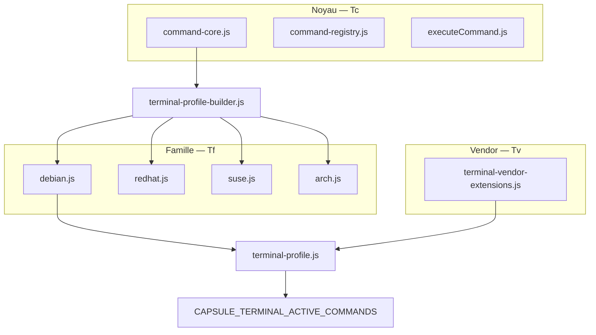

# Procédure — construction des commandes terminal

> **Socle** : [convention-shell-global.md](convention-shell-global.md) (processus **I → C → R**, prédicats **Ti–TΣ**)  
> **Contrats** : `etc/capsuleos/contracts/terminal-commands.json`, `terminal-replication-chain.json`  
> **Gate** : `node usr/lib/capsuleos/tools/validate-terminal-commands.mjs`

Objectif : expérience shell au plus près du réel — **noyau agnostique** dans `usr/lib/capsuleos/`, **extensions par famille de paquets**, **singularités par vendor**. Cette procédure couvre la phase **Conversion** ; l’**Investigation** et la **Réplication** sont dans la convention shell global.

---

## 1. Architecture en trois couches



| Couche | Fichier | Rôle |
|--------|---------|------|
| **Noyau** | `config/command-core.js` | Commandes exécutables sur la majorité des OS (POSIX, FS, réseau simulé, éditeurs) |
| **Famille** | `config/profiles/linux/{debian,redhat,suse,arch}.js` | Gestionnaires de paquets et outils propres à la famille |
| **Vendor** | `config/terminal-vendor-extensions.js` | Exceptions (ex. `cinnamon` sur Mint uniquement) |
| **Résolution** | `terminal-profile.js` | `CAPSULE_TERMINAL_PROFILE` (vendor) → famille + extensions vendor |

Prédicats formels (couche conversion) : **Tc** (noyau), **Tf** (famille), **Tv** (vendor), **Te** (registre ↔ exécuteur). Clôture : **TΣ** = **Ti ∧ Tc ∧ Tf ∧ Te ∧ Ts ∧ Tr** — voir [convention-shell-global.md](convention-shell-global.md).

---

## 2. Noyau (68 commandes curriculum)

Défini dans le contrat `layers.core.commands` et `command-core.js` — voir aussi la matrice [`inventaires/terminal-command-coverage-matrix.json`](inventaires/terminal-command-coverage-matrix.json).

**Règle** : toute commande ajoutée au noyau doit être pertinente sur **≥ 2 familles** Linux actives. Sinon → couche famille ou vendor.

### Modules spécialisés (délégation depuis `executeCommand.js`)

| Module | Rôle |
|--------|------|
| `terminal-listing.js` | Format/rendu `ls` multi-colonnes |
| `terminal-fs-ops.js` | `cp -r`, `rm -r`/`rm -rf` récursifs |
| `terminal-links.js` | `ln` / `ln -s` |
| `terminal-text-compare.js` | `diff`, `cmp` |
| `terminal-archives.js` | `zip`, `unzip`, `tar` |
| `terminal-processes.js` | `ps`, `top`, `kill`, `pgrep`, `killall`, `nice` (+ Moniteur système) |
| `terminal-network.js` | `wget`, `ip`, `netstat`, `ping`, `ssh`, `dig`, etc. (CapsuleOnly) |
| `terminal-users.js` | `chmod`, `chown`, `chgrp`, `adduser`, `passwd`, `chattr`, `lsattr` |
| `terminal-system-info.js` | `mount`, `umount`, `lscpu`, `lshw`, `shutdown`, `reboot` |
| `terminal-package-managers.js` | `apt`, `dnf`, `yum`, `zypper`, `pacman`, `rpm`, `dpkg` |

---

## 3. Extensions famille

| Famille | Profil résolu | Commandes spécifiques |
|---------|---------------|------------------------|
| `debian` | Ubuntu, Mint, Pop!_OS… | `apt`, `apt-get`, `aptitude`, `apturl`, `dpkg` |
| `redhat` | Rocky, Alma, Fedora | `dnf`, `yum`, `rpm` |
| `suse` | openSUSE | `zypper`, `rpm` |
| `arch` | (futur skin Arch) | `pacman` |

Normalisation vendor → famille : `terminal-profile.js` (`rocky`/`alma`/`fedora` → `redhat`, etc.).

---

## 4. Singularités vendor

Déclarées dans `terminal-vendor-extensions.js` et le contrat `layers.vendorExtensions` :

| Vendor | Commandes |
|--------|-----------|
| `mint` | `cinnamon` |

Résolues à l'exécution via `CAPSULE_TERMINAL_PROFILE` (hint skin), **sans** étendre toute la famille Debian.

---

## 5. Gestionnaires de paquets (profondeur pédagogique)

Module : `terminal-package-managers.js` (chargé avant `executeCommand.js`).

État session : `state.packageState.installed` (Set) — **non persisté** à la fermeture fenêtre.

| Famille | Commandes | Sous-commandes simulées |
|---------|-----------|-------------------------|
| Debian | `apt`, `apt-get`, `aptitude`, `apturl`, `dpkg` | `update`, `upgrade`, `install`, `remove`, `search`, `show` ; `dpkg -l`, `dpkg -i` |
| Red Hat | `dnf`, `rpm` | `check-update`, `install`, `remove`, `search`, `info` ; `rpm -qa`, `rpm -qi` |
| SUSE | `zypper`, `rpm` | `refresh`, `update`, `install`, `remove`, `search` |
| Arch | `pacman` | `-Syu`, `-S`, `-Ss`, `-Q` |

Exemples Rocky : `dnf check-update` · `dnf install vim-enhanced` · `rpm -qa`

---

## 6. Redirections et pipelines

Module : `terminal-shell-parse.js` (avant `executeCommand.js`).

| Syntaxe | Comportement |
|---------|--------------|
| `cmd > fichier` | Écrit la sortie dans le fichier (écrase) + sync Nautilus (`touch`) |
| `cmd >> fichier` | Ajoute la sortie au fichier |
| `cmd1 \| cmd2` | Transmet les lignes de sortie en entrée (`stdin`) à `grep`, `cat`, `head`, `tail`, `sort`, `wc` |

Exemples : `echo Bonjour > notes.txt` · `ls \| grep txt` · `cat log.txt \| sort`

---

## 7. Ajouter une commande

| Étape | Action |
|-------|--------|
| 1 | Choisir la couche : **core** / **family** / **vendor** |
| 2 | `command-registry.js` — `{ help, examples }` |
| 3 | `executeCommand.js` — `case 'cmd':` (+ `CapsuleUserFs.syncFromTerminal` si mutation FS) |
| 4 | Mettre à jour le contrat JSON (`terminal-commands.json`) |
| 5 | Mettre à jour la couche JS (`command-core.js`, profil famille, ou `terminal-vendor-extensions.js`) |
| 6 | `node usr/lib/capsuleos/tools/validate-terminal-commands.mjs` |
| 7 | Si mutation FS : scénario dans `fs-sync-playbook.json` |

---

## 8. Ordre de chargement (index.html)

```html
<script src=".../config/command-registry.js"></script>
<script src=".../config/command-core.js"></script>
<script src=".../config/terminal-profile-builder.js"></script>
<script src=".../config/profiles/linux/debian.js"></script><!-- ou redhat / suse -->
<script src=".../config/terminal-vendor-extensions.js"></script>
<script src=".../terminal-profile.js"></script>
<script src=".../terminal-bashrc.js"></script>
<!-- … terminal-core, completion, editors, tabs, terminal.js … -->
<script src=".../terminal-shell-parse.js"></script>
<script src=".../terminal-package-managers.js"></script>
<script src=".../terminal-fs-ops.js"></script>
<script src=".../terminal-links.js"></script>
<script src=".../terminal-text-compare.js"></script>
<script src=".../terminal-archives.js"></script>
<script src=".../terminal-processes.js"></script>
<script src=".../terminal-network.js"></script>
<script src=".../terminal-users.js"></script>
<script src=".../terminal-system-info.js"></script>
<script src=".../executeCommand.js"></script>
```

---

## 9. Références

- [convention-shell-global.md](convention-shell-global.md) — socle I → C → R, agnosticité noyau, checklist nouvel OS
- [convention-terminal-rendu-sortie.md](convention-terminal-rendu-sortie.md) — **To**, **Tb**, indentation / couleurs / bashrc
- [convention-rafraichissement-vues.md](convention-rafraichissement-vues.md) — sync FS terminal ↔ Nautilus
- [inventaires/terminal-command-coverage-matrix.json](inventaires/terminal-command-coverage-matrix.json) — matrice curriculum ↔ statut implémentation
- [fs-sync-playbook.json](inventaires/fs-sync-playbook.json)
- `usr/lib/capsuleos/shells/shared/terminal/README.md`
