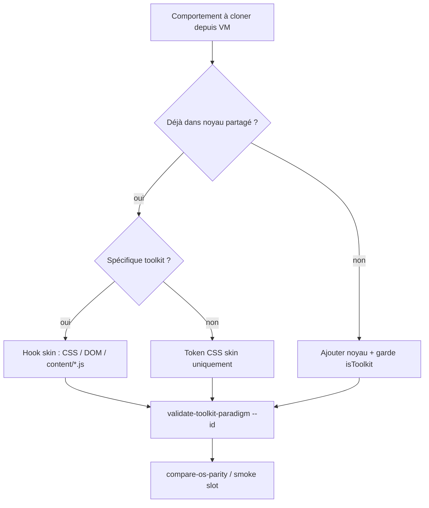

# Processus de branchement noyau ↔ skin

> **Date** : 2026-06-08 · **Contexte** : passe intégrale clone Mint + validation moteur de clonage  
> Complète [raccordement-noyau-os.md](raccordement-noyau-os.md) · [paradigme-toolkit-de.md](paradigme-toolkit-de.md) · [window-chrome-contexts.md](window-chrome-contexts.md)

Le noyau CapsuleOS (`usr/lib/capsuleos/`) expose des **comportements partagés** ; chaque skin **branche** via profil (`skin.profile.json`), hooks DOM (`body#mint`), et modules skin (`content/mint-tray.js`).

**Règle** : un comportement ne doit être forké dans `home/` que pour le **token visuel** ou la **structure chrome** propre au vendor. La logique WM, panel, menus contextuels explorateur reste dans le noyau avec garde toolkit.

---

## Table principale — comportement → noyau → hook skin

| Comportement | Module noyau | Hook skin / profil | Exemple Mint | Anti-pattern |
|--------------|--------------|-------------------|--------------|--------------|
| **Chargement apps (embed)** | `contentLoader.js` | `CAPSULE_FORCE_APP_EMBED`, `CAPSULE_EMBED_SKIN_KEY`, `CAPSULE_STATIC_SKIN_SLOTS` | `mint` : skip `mainMenu.base.css`, embed forcé | Fork `contentLoader` par distro |
| **Menu principal** | `mainMenu.js` + données toolkit | `mainMenu-data-cinnamon.js` (Cinnamon) · `overview.js` (GNOME) | Grille 600×480 · `mainMenu.skin.css` | `mainMenu-data.js` GNOME sur Mint |
| **Panel / lanceurs** | `taskbar-launcher-state.js`, `taskbar-window-list.js` | CSS `mint-panel.css` · HTML `mint-panel__*` | Menu + grouped-window-list + tray | Dupliquer logique running-link dans `home/` |
| **Zone tray** | `volume.js`, `calendar-popover.js` (partagés) | `content/mint-tray.js`, `mint-tray-popovers.css` | 10 applets VM ordonnés | Importer `mint-tray.js` dans Rocky |
| **WM — drag / resize** | `common/capsule-window.js`, `window-drag.js` | `CAPSULE_WINDOW_CONTEXT` dans profil | `requireHeader: true`, `edgeTiling: true` | Copier `resizeWindow.js` dans skin |
| **WM — Muffin** | `cinnamon-window-behaviors.js` | Chargé si `body#mint` | Super+↑/↓, dblclick maximise | `gnome-window-behaviors.js` sur `#mint` |
| **WM — GNOME** | `gnome-window-behaviors.js` | Chargé Rocky/Ubuntu uniquement | — | Charger sur Mint |
| **Alt+Tab** | `cinnamon-alt-tab.js` (Cinnamon) · overview GNOME (autre chemin) | `alt-tab.css` skin | Vignettes + icônes lanceurs Mint | Alt+Tab GNOME sur Cinnamon |
| **Chrome fenêtre** | `contracts/window-chrome-contexts.json` | `cinnamon-window-chrome.css` · `data-window-chrome-toolkit` | Muffin 3 boutons droite | Cluster `toolkit-gnome` sur apps Mint |
| **Explorateur — gabarit** | `contentLoader` → `CAPSULE_EXPLORER_TEMPLATE` | `nemo` (Mint) · `nemo-gnome` (Rocky) · `dolphin` (KDE) | Slot `data-link="nemo"` | `nautilus` slot séparé |
| **Explorateur — icônes** | `explorer-icon-base.js` | Remap par `isNautilusGnomeTemplate()` / toolkit | `cinnamon/elements/nemo` | `gnome/elements/nemo` sur Mint |
| **Clic droit explorateur** | `fileExplorerContextMenu.js` | Dispatch runtime | Nemo dynamique (Mint) | Menu Nemo unique sans garde Nautilus |
| **Clic droit bureau** | `desktop-context-menu.js` | DOM `#desktop-context-menu` dans skin | `isMintDesktop()` → menu Cinnamon | Menu bureau GNOME sur Mint |
| **Terminal CLI** | `shells/linux/terminal/` (agnostique) | `CAPSULE_TERMINAL_PROFILE: debian` | gnome-terminal chrome CSS | Fork moteur Ptyxis dans skin |
| **Assets** | `capsule-resource.js`, manifest | `assetsBase`, `toolkitPack`, `vendorPack` | `./assets/images/toolkits/cinnamon/` | Chemins `../../../usr/` en runtime JS |
| **Paramètres** | `cinnamon-settings.js` (Cinnamon) · `themes_gnome` (GNOME) | Slot `themes` | 30 panneaux cinnamon-settings 6.6 | `themes_gnome.html` sur Mint |

---

## Branchement détaillé — clic droit explorateur

### Nemo (Mint / Cinnamon)

| Étape | Détail |
|-------|--------|
| Profil | `CAPSULE_EXPLORER_TEMPLATE: "nemo"` |
| Gabarit | `usr/share/capsuleos/linux/explorers/nemo.html` |
| Détection | `!isNautilusGnomeTemplate()` |
| Menu | `bindNemoContextMenu` — menu **dynamique** `.nemo-app__context-menu` (7 entrées VM) |
| Skin | `style/apps/nemo.skin.css` — tokens `--nemo-*` |

### Nautilus (Rocky / Ubuntu / Fedora — GNOME)

| Étape | Détail |
|-------|--------|
| Profil | `CAPSULE_EXPLORER_TEMPLATE: "nemo-gnome"` |
| Gabarit | `shell-gnome.html` + `#nemo-context-menu` statique |
| Détection | `isNautilusGnomeTemplate()` — classe `.nautilus-app` |
| Menu | `bindNautilusGnomeContextMenu` — profils `item` / `background` / `trash` |
| Skin | `style/apps/nautilus.skin.css` — tokens Nautilus VM |
| Extensions | `fileExplorerNautilus*.js` chargés si GNOME |

**Anti-pattern** : remplacer `bindNautilusGnomeContextMenu` par le menu Nemo Mint sans test Rocky — régression P0 observée (commit `00816fb`).

---

## Branchement — menu, panel, tray

### Menu Démarrer

```text
Cinnamon (Mint)
  mainMenu-data-cinnamon.js  →  données 97 apps
  mainMenu.js (noyau)        →  logique ouverture / recherche
  mainMenu.skin.css (skin)   →  layout 20/25/55 %, tokens Mint-Y

GNOME (Rocky/Ubuntu)
  overview.js + dash         →  pas de popup menu Cinnamon
  gnome-shell/*.css          →  dock / overview
```

Hook Mint : `CAPSULE_STATIC_SKIN_SLOTS: ["mainMenu"]` — CSS injecté statiquement, pas de `mainMenu.base.css`.

### Panel

```text
Noyau partagé
  taskbar-launcher-state.js  →  running-link / active-link / minimize
  taskbar-window-list.js     →  grouped-window-list DOM

Hook Mint
  mint-panel.css             →  hauteur 40px, régions sémantiques
  index.html                 →  structure mint-panel__menu-btn | __window-list | __tray
```

### Tray

```text
Noyau partagé
  volume.js, calendar-popover.js  →  logique volume / horloge

Hook Mint
  content/mint-tray.js       →  popovers XApp, notifications, réseau…
  mint-tray-popovers.css     →  position bottom: calc(var(--taskbar-height) + offset)
```

Token : `--taskbar-height` réassigné à `--mint-panel-height` dans `mint-y-dark-aqua-tokens.css` (évite bleed portal 1.25×head).

### Carte panel Mint — applet → noyau → skin (Cinnamon)

| Applet panel | Module noyau | Hook skin Mint | Test smoke |
|--------------|--------------|----------------|------------|
| Menu principal | `mainMenu.js` · `openWindowByDataLink('mainMenu')` | `a.mint-panel__menu-btn[data-link="mainMenu"]` · `mainMenu.skin.css` | `run-ui-state-effects-pass --shell mainMenu` |
| Lanceurs épinglés (nemo, mintinstall, terminal) | `capsule-window-shell.js` · `taskbar-launcher-state.js` | `content/mint-panel-pinned.js` (fallback) · `mint-panel.css` | `run-capsule-panel-browser` 6/6 |
| grouped-window-list | `taskbar-window-list.js` (slots ≠ épinglés) | CSS `mint-panel.css` uniquement | `run-ui-state-effects-pass --shell panel` (firefox) |
| Bouclier mises à jour | `update-manager.js` · `[data-update-manager-tray]` | `mint-tray.js` ferme popovers tray | `smoke-mint-tray` · `smoke-mint-update-manager` |
| Clavier (fr/en) | — (stub Cinnamon) | `mint-tray.js` · `#mint-tray-popover-keyboard` | `smoke-mint-tray` |
| Réseau | pattern `volume.js` (popover) | `mint-tray.js` · `#mint-tray-popover-network` | `smoke-mint-tray` · `run-ui-state-effects-pass --shell tray` |
| Volume | `volume.js` · `#tray-sound-btn` | `volume-popover.css` | `smoke-mint-tray` |
| Horloge / calendrier | `calendar-popover.js` · `date.js` | `calendar-popover.css` | `run-ui-state-effects-pass --shell clock` |
| Verrou / déconnexion / arrêt (menu) | `mainMenu.js` · `#menu-btn-lock/logout/power` | gabarit `mainMenu.html` footer | menu footer clic → `CapsulePickReturn` |

Applets VM masquées sur clone (`mint-tray--vm-collapsed` + `hidden`) : XApp, notifications, imprimantes, amovibles, alimentation tray, cornerbar — popovers présents mais non testés tant que masqués.

---

## Branchement — WM et Alt+Tab

| Toolkit | Module WM | Garde | Raccourcis |
|---------|-----------|-------|------------|
| Cinnamon | `cinnamon-window-behaviors.js` | `body#mint` \|\| `CAPSULE_EMBED_SKIN_KEY==='mint'` | Super+↑↓, dblclick titre |
| Cinnamon | `cinnamon-window-effects.js` | idem | Fade open/close |
| Cinnamon | `cinnamon-alt-tab.js` | idem | Alt+Tab vignettes |
| GNOME | `gnome-window-behaviors.js` | pas sur Mint | Mutter / overview |
| Tous SSD | `edge-tiling.js` | profil `edgeTiling: true` | Snap bords |

Provider chrome : `etc/capsuleos/contracts/window-chrome-contexts.json` → `cinnamon` : `cinnamon-window-behaviors.js`, drag `unified-titlebar`.

---

## Flux de décision agent



---

## Gates branchement

```bash
node usr/lib/capsuleos/tools/validate-toolkit-paradigm.mjs --all
node usr/lib/capsuleos/tools/validate-window-chrome-contexts.mjs
node usr/lib/capsuleos/tools/validate-interactions-contract.mjs
node usr/lib/capsuleos/tools/lab/compare-os-parity.mjs --id linux-mint --scenario panel-checklist
```

Voir aussi : [recette-clone-mint-integral.md](recette-clone-mint-integral.md) · [toolkit-cloisonnement-audit.md](toolkit-cloisonnement-audit.md).
