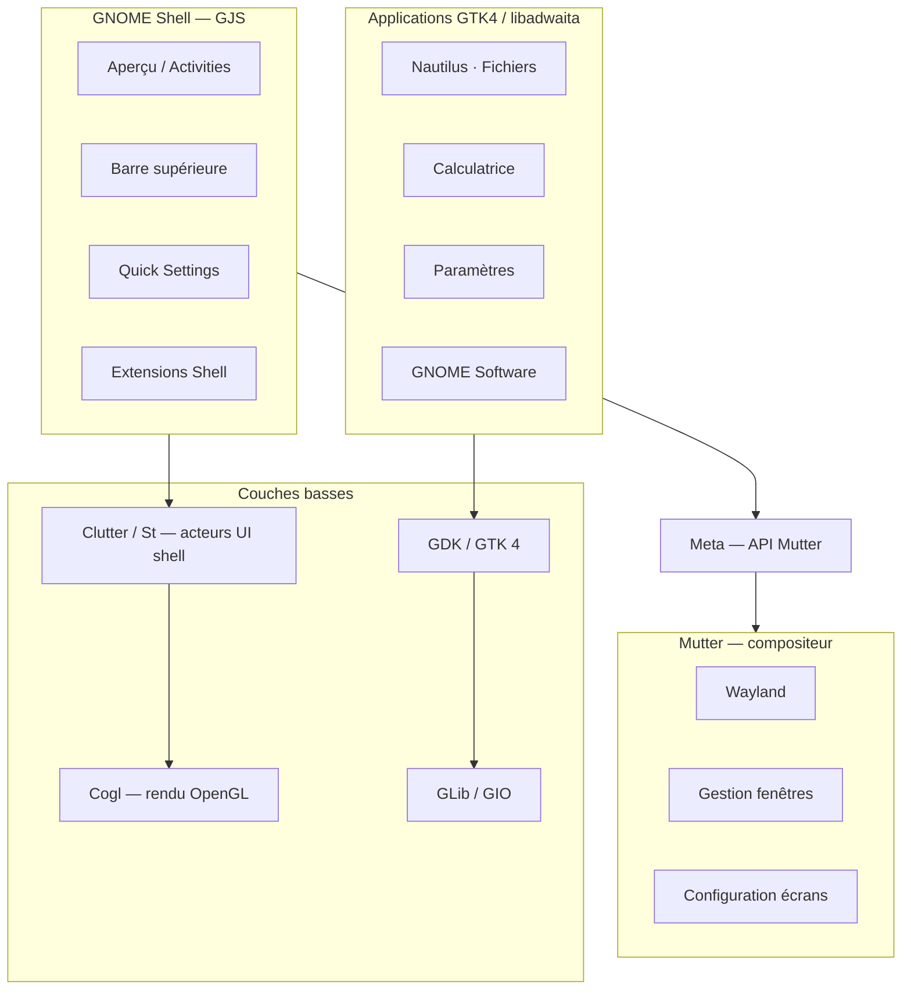

# Référence GNOME — expertise CapsuleOS

> Document de synthèse pour maîtriser l’écosystème GNOME tel qu’il apparaît sur **Rocky Linux 10** et le reproduire fidèlement dans CapsuleOS.  
> Complète [branche-redhat-gnome.md](branche-redhat-gnome.md), [inventaire-chromes-par-toolkit.md](inventaire-chromes-par-toolkit.md) et [window-chrome-contexts.md](window-chrome-contexts.md).

**Dernière mise à jour** : juin 2026  
**Effort lecture** : ~90 min (synthèse) + sources détaillées en annexe

---

## 1. Objectif

Ce document regroupe les sources officielles GNOME, SUSE et Rocky pour :

1. Comprendre la **pile technique** (Mutter → GNOME Shell → apps GTK4/libadwaita).
2. Maîtriser l’**UX utilisateur** (Aperçu, dash, recherche, Paramètres, sessions).
3. Savoir **personnaliser** le bureau (Tweaks, Extensions, dconf).
4. Cartographier l’**écosystème applicatif** (apps Core, Circle, outils dev).
5. Relier chaque concept aux **slots et chromes CapsuleOS** (`linux-rocky`, toolkit `gnome`).

---

## 2. Pile technique GNOME

### 2.1 Vue d’ensemble



### 2.2 Mutter — compositeur et gestionnaire de fenêtres

Source : [mutter.gnome.org](https://mutter.gnome.org/)

| Rôle | Détail |
|------|--------|
| **Nature** | Bibliothèque compositeur Wayland ; implémente le côté serveur du protocole Wayland |
| **Fonctions** | Gestion fenêtres, composition, focus, workspaces, raccourcis clavier, configuration moniteurs |
| **Xwayland** | Exécution des applications X11 héritées |
| **Utilisateurs** | GNOME Shell (interface principale), Gala (elementary), debug standalone via `mutter` |
| **API Meta** | Displays, workspaces, fenêtres, presse-papiers — exposée aux extensions via import `Meta` |

**CapsuleOS** : le runtime simule Mutter via `CapsuleWindowBounds`, `CapsuleWindowPositioning`, providers chrome (`nemo-gnome`, `libadwaita-gnome`) et ancrage `object#desktop`. Le cluster `toolkit-gnome/chrome.css` ne doit pas hériter du pilote Cinnamon/Muffin.

### 2.3 Clutter, St et GNOME Shell

Source : [Architecture extensions GJS](https://gjs.guide/extensions/overview/architecture.html)

| Couche | Description |
|--------|-------------|
| **Clutter** | Toolkit bas niveau du shell — widgets = **Actors**, scène graphique, animations |
| **St** | Widgets riches (boutons, icônes, champs texte) + **CSS** pour le style shell |
| **Mutter (`Meta`)** | Affichages, workspaces, fenêtres, clipboard |
| **Shell** | Utilitaires GNOME Shell (`global`, PopupMenu, Dialog, PanelMenu, Quick Settings, Search Provider) |
| **GJS** | Bindings JavaScript via GObject-Introspection — le shell et les extensions sont en JS |

Les **extensions Shell** modifient le comportement du shell (ex. Dash to Dock) ; elles ne font pas partie du processus de design GNOME officiel mais peuvent inspirer des features futures.

### 2.4 GTK 4 et libadwaita

| Composant | Rôle | Doc |
|-----------|------|-----|
| **GTK 4** | Toolkit multi-plateforme — widgets, rendu, événements | [developer.gnome.org/components](https://developer.gnome.org/components/) |
| **libadwaita** | Blocs adaptatifs GNOME : `HeaderBar`, `ApplicationWindow`, `ActionRow`, `StyleManager`, thèmes | [docs.rs/libadwaita](https://docs.rs/libadwaita/latest/libadwaita/) |
| **Adwaita** | Thème + polices + icônes standard | `adwaita-icon-theme`, Adwaita Fonts |

**HIG** impose GTK 4 + libadwaita pour les apps GNOME modernes : [developer.gnome.org/hig](https://developer.gnome.org/hig/).

**CapsuleOS** : provider `libadwaita-gnome` + `gnome-app-csd.base.css` pour les apps CSD (Calculatrice, Text Editor, Paramètres, Software, etc.).

---

## 3. UX bureau — modèle utilisateur

### 3.1 Guide SUSE « Getting Started »

Source : [GNOME Getting Started (PDF SUSE)](https://documentation.suse.com/smart/desktop/pdf/GNOME-getting-started_en.pdf) · [HTML](https://documentation.suse.com/smart/desktop/html/GNOME-getting-started/index.html)

#### Sessions SUSE (4 variantes)

| Session | Description |
|---------|-------------|
| **GNOME** (défaut) | GNOME 4 upstream, Wayland, barre unique en haut |
| **GNOME Classic** / **Classic on Xorg** | Expérience plus traditionnelle, technologie GNOME 4 |
| **IceWM** | Fallback léger, peu de ressources |

**Wayland vs Xorg** : Wayland = architecture plus simple ; Xorg = compatibilité plus large. Rocky 10 utilise Wayland par défaut.

#### Aperçu des activités

| Élément | Comportement officiel |
|---------|----------------------|
| **Ouverture** | Bouton Activités, hot corner haut-gauche, touche **Meta** (Super) |
| **Recherche** | Frappe immédiate sans cliquer ; apps, paramètres, fichiers `~/` |
| **Dash** | Favoris + apps en cours ; point sous l’icône = running ; clic droit → favoris |
| **Fenêtres** | Prévisualisation des fenêtres ouvertes |

#### Barre supérieure

- **Gauche** : Activités
- **Centre** : horloge + calendrier (rendez-vous Evolution/Calendar)
- **Droite** : menu système (verrouillage, extinction, quick settings)

#### Fichiers et médias

- Explorateur : **Fichiers** (`org.gnome.Nautilus`) — lancement via recherche « files »
- Médias amovibles : icône bureau + sidebar ; **éjecter** avant retrait physique

### 3.2 Human Interface Guidelines (HIG)

Source : [developer.gnome.org/hig](https://developer.gnome.org/hig/)

| Section | Contenu clé pour CapsuleOS |
|---------|---------------------------|
| **Design Principles** | Simplicité, focus utilisateur, cohérence |
| **Guidelines** | Nommage apps, icônes, pointeur/touch, clavier, style UI, typo, accessibilité |
| **Patterns → Containers** | **Windows**, **Header Bars**, Popovers, Utility Panes |
| **Patterns → Navigation** | Browsing, View Switchers, **Tabs**, Sidebars, **Search** |
| **Patterns → Controls** | Buttons, Menus, Switches, Text Fields… |
| **Patterns → Feedback** | Notifications, Toasts, Dialogs, Progress Bars |

Règles chrome CSD GNOME (HIG Windows / Header Bars) :

- Les apps GTK4 utilisent une **headerbar** intégrée (pas de barre titre SSD séparée du WM).
- Les contrôles fenêtre (min/max/close) sont à droite de la headerbar.
- Le **cadre** fenêtre (bordure, ombre, resize) reste géré par le compositeur.

### 3.3 Rocky vs Ubuntu vs SUSE

| Aspect | Rocky / RHEL / SUSE GNOME | Ubuntu |
|--------|---------------------------|--------|
| Dock permanent | **Absent** (dash dans Aperçu) | Souvent présent (dock Ubuntu) |
| Modèle lancement | Aperçu + dash | Aperçu + dock latéral |
| Terminal EL10 | **Ptyxis** | gnome-terminal / Ptyxis selon version |

CapsuleOS Rocky masque `#tableau` (dock latéral) — conforme RHEL, pas Ubuntu.

---

## 4. Personnalisation Rocky

### 4.1 GNOME Tweaks

Source : [docs.rockylinux.org — GNOME Tweaks](https://docs.rockylinux.org/10/desktop/gnome/gnome-tweaks/)

```bash
sudo dnf install gnome-tweaks
```

Lancement : Aperçu → rechercher « tweaks ».

| Section Tweaks | Usage |
|----------------|-------|
| **General** | Animations, suspension, sur-amplification |
| **Appearance** | Thèmes, fond d’écran, écran verrouillé |
| **Fonts** | Polices et tailles par défaut |
| **Keyboard & Mouse** | Comportement clavier/souris |
| **Startup Applications** | Apps au démarrage du shell |
| **Top Bar** | Horloge, calendrier, batterie |
| **Window Titlebars** | Comportement barres de titre |
| **Windows** | Comportement fenêtres |
| **Workspaces** | Dynamiques vs statiques, affichage |

Réinitialisation : menu trois barres → reset defaults.

**CapsuleOS** : le slot `themes` simule **Paramètres → Apparence** (schéma couleurs, accent Adwaita) — pas l’intégralité de Tweaks.

### 4.2 GNOME Shell Extensions

Source : [docs.rockylinux.org — GNOME Extensions](https://docs.rockylinux.org/10/desktop/gnome/gnome-extensions/)

```bash
sudo dnf install gnome-shell
sudo dnf install chrome-gnome-shell   # intégration navigateur
gnome-shell --version                 # version shell pour compatibilité extensions
```

| Concept | Détail |
|---------|--------|
| **Site** | [extensions.gnome.org](https://extensions.gnome.org) |
| **Gestion locale** | [extensions.gnome.org/local](https://extensions.gnome.org/local/) |
| **Exemple** | Dash to Dock — extension tierce, **non** le modèle RHEL natif |
| **Support** | Extensions maintenues par leurs auteurs, pas la communauté GNOME core |

**CapsuleOS** : ne pas confondre extensions tierces (dock permanent) avec le dash Aperçu RHEL. Le modèle Rocky est **sans** Dash to Dock.

### 4.3 dconf et schémas GSettings

Composants liés (voir §5) :

- **dconf** — base de configuration clé/valeur
- **GSettings Desktop Schemas** — schémas partagés desktop
- **gnome-settings-daemon** — applique les réglages (thème, clavier, alimentation…)

Outils : Paramètres (utilisateur), `dconf-editor` (avancé), YaST/dconf (admin SUSE/RHEL).

---

## 5. Écosystème applications

### 5.1 Catalogue officiel

Source : [apps.gnome.org/fr](https://apps.gnome.org/fr/)

#### Applications de base (préinstallées typiques)

| App GNOME | Slot CapsuleOS Rocky | Chrome provider |
|-----------|---------------------|-----------------|
| Fichiers (Nautilus) | `nemo` | `nemo-gnome` |
| Firefox / Web | `firefox` | `firefox-gnome` |
| Console (Ptyxis) | `terminal` | `terminal-gnome` |
| Logiciels | `update_manager` | `libadwaita-gnome` |
| Éditeur de texte | `text_editor` | `libadwaita-gnome` |
| Calculatrice | `calculator` | `libadwaita-gnome` |
| Calendrier | `calendar` | `libadwaita-gnome` |
| Horloges | `clocks` | `libadwaita-gnome` |
| Paramètres | `themes` | `libadwaita-gnome` |
| Visionneurs / lecteur | `visionneur_*`, `lecteur_multimedia` | `libadwaita-gnome` |
| LibreOffice Writer | `librewriter` | `libadwaita-gnome` |
| Profile / checklist | `profile`, `checklist` | `libadwaita-gnome` |

#### Critères apps.gnome.org

- Simples, cohérentes, soignées (philosophie GNOME)
- Libre logiciel, communauté accueillante
- Intégration native au bureau GNOME
- Icône 📱 = version mobile supportée

### 5.2 Composants plateforme (Core)

Source : [developer.gnome.org/components](https://developer.gnome.org/components/)

Composants **essentiels** pour comprendre CapsuleOS :

| Composant | Rôle |
|-----------|------|
| **mutter** | Compositeur — parent de GNOME Shell |
| **GNOME Shell** | Shell utilisateur (Aperçu, panel, extensions) |
| **gjs** | Bindings JS — code du shell |
| **gtk** | Toolkit applications |
| **libadwaita** | Widgets et fenêtres adaptatifs GNOME |
| **adwaita-icon-theme** | Icônes standard (dépendance de toutes les apps Core) |
| **dconf** + **GSettings Desktop Schemas** | Configuration |
| **gnome-settings-daemon** | Daemon réglages système |
| **gdm** | Écran de connexion |
| **gvfs** + **LocalSearch** | Fichiers virtuels + indexation recherche Aperçu |
| **libsoup** | HTTP (Software, météo, etc.) |
| **librsvg** | Rendu SVG (icônes, symboles panel) |
| **Terminal widget (VTE)** | Moteur terminal Ptyxis/Console |
| **at-spi2-core** + **orca** | Accessibilité |
| **xdg-desktop-portal-gnome** | Portails desktop (fichiers, screenshots) |

---

## 6. libadwaita — API applications modernes

Source : [docs.rs/libadwaita](https://docs.rs/libadwaita/latest/libadwaita/)

### Types clés pour le chrome CSD CapsuleOS

| Type libadwaita | Usage CapsuleOS |
|-----------------|-----------------|
| `ApplicationWindow` | Fenêtre racine app |
| `HeaderBar` | Barre titre + contrôles CSD |
| `ToolbarView` | Layout header + contenu |
| `StyleManager` | Schéma clair/sombre, accent |
| `Window` / `WindowTitle` | Variantes dialog |

### Initialisation

```c
adw_init();  // ou adw::Application sous Rust
```

### Widgets récurrents dans nos templates

| App | Ancre HTML CapsuleOS |
|-----|---------------------|
| Calculatrice | `.gnome-calc__header` |
| Text Editor | `.xed-app__menubar` |
| Calendar | `.gnome-calendar-app__header` |
| Clocks | `.gnome-clocks__header` |
| GNOME Software | `.gnome-software__headerbar` |
| Paramètres | `.gnome-settings__headerbar` |
| Visionneurs | `.viewer-app__toolbar` |

Provider runtime : `libadwaita-gnome` dans `chrome.js` + `gnome-app-csd.base.css`.

---

## 7. Extensions GNOME Shell — architecture développeur

Source : [gjs.guide — Architecture](https://gjs.guide/extensions/overview/architecture.html)

### Modules Shell réutilisables

| Module | Usage |
|--------|-------|
| `PopupMenu` | Menus contextuels shell |
| `Dialog` / `ModalDialog` | Boîtes de dialogue système |
| `PanelMenu` | Indicateurs barre (Wi-Fi, Bluetooth, alimentation) |
| Search Provider | Intégration recherche Aperçu |

### Ce qu’une extension peut faire

- Contrôler displays/workspaces/fenêtres via `Meta`
- Créer des UI avec Clutter/St
- Accéder et modifier du code interne GNOME Shell

**CapsuleOS** : la recherche Aperçu (`overview.js` + `CapsuleAppSearch`) simule le Search Provider sans extension Shell réelle.

---

## 8. Accessibilité (a11y)

Sources : SUSE Getting Started §3.9, HIG Accessibility, `at-spi2-core`, `orca`.

| Domaine | Options GNOME |
|---------|---------------|
| **Vue** | Contraste élevé, grand texte, zoom, taille curseur, lecteur d’écran |
| **Ouïe** | Alertes visuelles |
| **Saisie** | Clavier à l’écran, Sticky/Slow/Bounce keys, Mouse Keys |
| **Pointeur** | Clic secondaire simulé, clic par survol |

CapsuleOS : `a11y-fedora.css`, tokens contrastes — couverture partielle (P2).

---

## 9. Cartographie CapsuleOS Rocky

### 9.1 Fichiers projet par couche

| Couche GNOME | Fichiers CapsuleOS |
|--------------|-------------------|
| Shell / Aperçu | `home/RedHat/Rocky/js/overview.js`, `gnome-workstation.css`, `fedora-overview*` |
| Top bar | `fedora-top-bar`, `taskbar-tray`, `calendar-popover`, `volume-popover` |
| Chrome WM | `clusters/toolkit-gnome/chrome.css`, `chrome.js`, `header-context.js` |
| Apps CSD | `gnome-app-csd.base.css`, `style/apps/*.skin.css` |
| Contrat | `window-chrome-contexts.json`, profil `linux-rocky.json` |
| Boot | `toolkit-boot.json`, `capsule-skin-boot.js` |

### 9.2 Validateurs liés

```bash
node usr/lib/capsuleos/tools/validate-toolkit-chrome-isolation.mjs
node usr/lib/capsuleos/tools/validate-gnome-chrome-apps.mjs
node usr/lib/capsuleos/tools/validate-gnome-overview-search-icons.mjs
node usr/lib/capsuleos/tools/validate-window-chrome-contexts.mjs
node usr/lib/capsuleos/tools/lab/smoke-rocky-gnome-ref.mjs
```

### 9.3 Écarts parité connus (P1/P2)

Voir [inventaire-parite-rocky.md](inventaire-parite-rocky.md) :

- Quick Settings incomplets
- Multi-écrans Join/Mirror
- Bluetooth UI
- Accessibilité complète
- Extensions Shell tierces (hors scope RHEL)

---

## 10. Bibliographie

### Guides utilisateur et distro

| Source | URL |
|--------|-----|
| SUSE — Getting Started GNOME (PDF) | https://documentation.suse.com/smart/desktop/pdf/GNOME-getting-started_en.pdf |
| SUSE — Getting Started GNOME (HTML) | https://documentation.suse.com/smart/desktop/html/GNOME-getting-started/index.html |
| Rocky — GNOME Tweaks | https://docs.rockylinux.org/10/desktop/gnome/gnome-tweaks/ |
| Rocky — GNOME Shell Extensions | https://docs.rockylinux.org/10/desktop/gnome/gnome-extensions/ |
| GNOME Help (utilisateur) | https://help.gnome.org/users/gnome-help/stable/ |

### Architecture et développement

| Source | URL |
|--------|-----|
| Mutter | https://mutter.gnome.org/ |
| GJS — Architecture extensions | https://gjs.guide/extensions/overview/architecture.html |
| GNOME Components | https://developer.gnome.org/components/ |
| GNOME HIG | https://developer.gnome.org/hig/ |
| libadwaita (Rust docs) | https://docs.rs/libadwaita/latest/libadwaita/ |

### Applications et communauté

| Source | URL |
|--------|-----|
| Applications pour GNOME (FR) | https://apps.gnome.org/fr/ |
| Extensions GNOME | https://extensions.gnome.org |
| GNOME Circle | https://circle.gnome.org |

### CapsuleOS (interne)

| Document | Rôle |
|----------|------|
| [branche-redhat-gnome.md](branche-redhat-gnome.md) | Branche RHEL, dérivation Fedora/Alma/Ubuntu |
| [inventaire-chromes-par-toolkit.md](inventaire-chromes-par-toolkit.md) | Providers chrome par app |
| [window-chrome-contexts.md](window-chrome-contexts.md) | Contrat runtime chrome |
| [procedure-lab-linux-rocky-gnome.md](procedure-lab-linux-rocky-gnome.md) | Procédure lab VM |

---

## 11. Principes directeurs pour CapsuleOS

1. **Le shell n’est pas une app** — Aperçu, barre, quick settings = GNOME Shell (GJS/Mutter), pas des fenêtres `windowElement` classiques.
2. **Les apps sont CSD libadwaita** — headerbar intégrée, provider `libadwaita-gnome`, pas de rail Mint `#windowHeader` visible.
3. **Pas de dock permanent sur Rocky** — dash dans Aperçu uniquement ; pas Dash to Dock / dock Ubuntu.
4. **Recherche = frappe immédiate** — icônes via `CapsuleResource.resolve()`, catalogue `overview.js`.
5. **Wayland first** — positionnement `object#desktop`, bornes `main.fedora-desktop-area`.
6. **Isolation toolkit** — `clusters/toolkit-gnome/chrome.css` obligatoire ; jamais `window-chrome.base.css` (Cinnamon).

---

*Synthèse produite pour le projet CapsuleOS — référence vivante à enrichir au fil des passes lab Rocky.*
