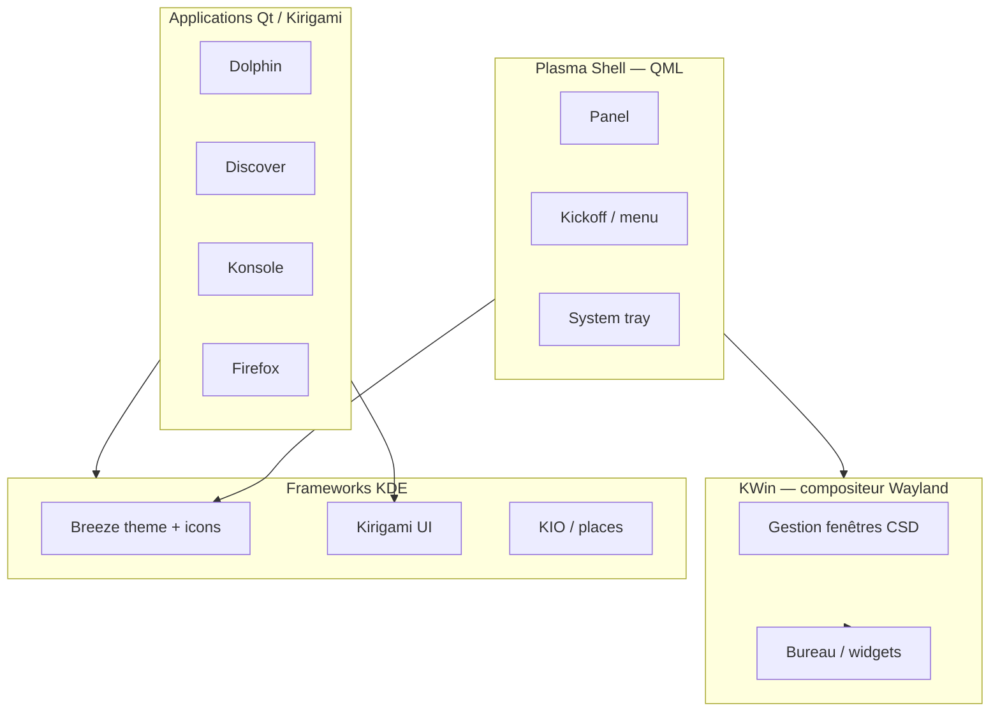

# Référence KDE / Plasma — expertise CapsuleOS

> Synthèse pour maîtriser l’écosystème KDE tel qu’il apparaît sur **KDE neon User Edition** et le reproduire dans CapsuleOS.  
> Complète [branche-plasma-kde.md](branche-plasma-kde.md), [kde-hig-ressources.md](kde-hig-ressources.md) et [inventaire-chromes-par-toolkit.md](inventaire-chromes-par-toolkit.md).

**Dernière mise à jour** : juin 2026  
**Effort lecture** : ~45 min (synthèse) + HIG détaillé en annexe

---

## 1. Objectif

Ce document regroupe les sources officielles KDE pour :

1. Comprendre la **pile Plasma** (KWin → Plasma Shell → apps Qt/Kirigami).
2. Maîtriser **Breeze** (icônes symbolic vs color, thème clair/sombre).
3. Cartographier les **slots CapsuleOS** toolkit `kde` (`linux-kde-neon`, `linux-opensuse`, …).
4. Relier concepts HIG aux fichiers skin et noyau existants.

---

## 2. Pile technique Plasma



| Couche | Rôle | CapsuleOS |
|--------|------|-----------|
| **KWin** | Compositeur Wayland, CSD, tiling | Simulé via chrome fenêtre + `CapsuleWindowBounds` |
| **Plasma Shell** | Panel, Kickoff, widgets, horloge | `plasma-panel-dock.css`, `mainMenu-plasma.js`, `tray-popover-kde.js` |
| **Breeze** | Widget style + icon theme | Tokens CSS `--opensuse-*` / `--kde-neon-*`, assets `toolkits/kde/` |
| **Kirigami** | Framework apps adaptatives (Discover 6) | Gabarit `update_manager_kde_neon.html`, sidebar onglets |
| **Dolphin** | Explorateur fichiers KDE | Slot `nemo`, template `dolphin` |

---

## 3. Human Interface Guidelines (HIG)

Source : [develop.kde.org/hig](https://develop.kde.org/hig/)

| Aspect | Détail |
|--------|--------|
| **Portée** | Philosophie design, patterns UX, conventions icônes — surtout **apps KDE** |
| **Limites** | Peu de détails d’implémentation composant ; compléter par docs Kirigami/Qt et code apps existantes |
| **Catalogue CapsuleOS** | [kde-hig-ressources.md](kde-hig-ressources.md) — 22 pages crawlées |
| **Skill agent** | [kde-hig-replication](../skills/kde-hig-replication/SKILL.md) |

**Règle de priorité** : VM prime pour le **shell** (panel, Kickoff, tray) ; HIG prime pour les **apps** (Discover, Dolphin).

---

## 4. Breeze et icônes

| Taille | Style | Usage CapsuleOS |
|--------|-------|-----------------|
| 16 px (`small`) | Symbolic monochrome | Tray panel, actions toolbar |
| 22 px (`smallMedium`) | Symbolic (listes denses) | Kickoff catégories actions/22 |
| 32 px+ (`medium`) | Full-color | Apps Kickoff, Discover, pins panel |

Assets versionnés :

- Panel / tray : `usr/share/capsuleos/assets/images/toolkits/kde/panel/`
- Vendor Neon : `usr/share/capsuleos/assets/images/vendors/neon/`

Pull depuis VM lab : `<lab-inventory:linux-lab>`, chemins Breeze `/usr/share/icons/breeze/`.

---

## 5. Slots CapsuleOS — toolkit KDE

| Slot | App VM | Template / skin | Registre type |
|------|--------|-----------------|---------------|
| `nemo` | Dolphin | `dolphin` | Toutes distros KDE |
| `update_manager` | Discover | `update_manager_kde_neon.html` (Neon) | `linux-kde-neon` |
| `firefox` | Firefox | gabarit partagé | — |
| `terminal` | Konsole | profil Debian/SUSE selon skin | — |

Noyau partagé Plasma :

- `usr/lib/capsuleos/shells/linux/plasma-panel-mode.js`
- `home/Debian/KDE-Neon/js/calendar-popover-kde.js`
- `home/Debian/KDE-Neon/js/tray-popover-kde.js`

Doc explorateur : `usr/share/capsuleos/linux/explorers/README.md`.

---

## 6. Ground truth — KDE neon (juin 2026)

| Composant | VM | CapsuleOS |
|-----------|-----|-----------|
| Distribution | KDE neon User Edition 24.04 noble | `linux-kde-neon` |
| Session | Plasma **Wayland** | `body#kde-neon` |
| Discover | plasma-discover 6.6.5 | Clôturé — voir [`linux-kde-neon-discover-closure.md`](inventaires/linux-kde-neon-discover-closure.md) |
| Panel + tray | Ordre VM observé | Clôturé — voir [`linux-kde-neon-panel-tray-closure.md`](inventaires/linux-kde-neon-panel-tray-closure.md) |
| Kickoff | Breeze + apps XDG | Clôturé — voir [`linux-kde-neon-kickoff-closure.md`](inventaires/linux-kde-neon-kickoff-closure.md) |
| Dolphin | P0 backlog | Slot `nemo` — parité vues en cours |

Inventaire machine : [`linux-kde-neon-vm.json`](inventaires/linux-kde-neon-vm.json).

---

## 7. Distros toolkit KDE actives

| registryId | Skin | Tier | Notes |
|------------|------|------|-------|
| `linux-kde-neon` | `home/Debian/KDE-Neon/` | P2 | **Référence opérationnelle** — skin le plus avancé |
| `linux-opensuse` | `home/SUSE/openSUSE/` | P1 | Plasma mature, smoke `smoke-plasma-opensuse.mjs` |
| `linux-mx-kde` | `home/Debian/MX-KDE/` | P1 | Dérivé debian-kde |
| `linux-debian-kde` | `home/Debian/Debian-KDE/` | P2 | `upstreamId: null` registre |

---

## 8. Sources officielles (table rapide)

| Source | URL |
|--------|-----|
| KDE HIG | https://develop.kde.org/hig/ |
| Kirigami | https://develop.kde.org/docs/plasma/kirigami/ |
| Plasma docs | https://develop.kde.org/docs/plasma/ |
| HIG sources GitLab | https://invent.kde.org/documentation/develop-kde-org |
| API KDE Frameworks | https://api.kde.org/ |
| FreeDesktop icon naming | https://specifications.freedesktop.org/icon-naming-spec/icon-naming-spec-latest.html |

---

## 9. Gates CapsuleOS

```bash
node usr/lib/capsuleos/tools/linux/sync-linux-skin-closure.mjs
node usr/lib/capsuleos/tools/validate-all.mjs
node root/tools/lab/capture-capsule-kde-neon.mjs   # si CAPSULE_HTTP_BASE actif
```
