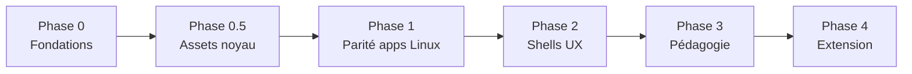

# Roadmap CapsuleOS

Plan de livraison pour aboutir les bureaux simulés déjà amorcés, prioriser la pédagogie terrain et consolider le socle technique.  
Document vivant — à mettre à jour à chaque jalon ou retour utilisateur.

**Références :**

- [Applications Linux par distro](apps-linux-par-distro.md) — inventaire apps + mappings `data-link`
- [Familles d’OS](familles-os.md) — cartographie dépôt
- [Arborescence](arborescence.md) — flux noyau / skins / embeds
- [Manifeste noyau](manifeste-noyau.md) — hydratation, routage assets
- [Scalabilité noyau](scalabilite-noyau.md) — jalons S2–S6
- [Politique assets](politique-assets.md) — zones autorisées, scripts migration
- [contrib.md § Checklist contrat](../../contrib.md#checklist-contrat-avant-merge-ou-release) — critères release
- Skill agents : [kernel-supervisor](../skills/kernel-supervisor/SKILL.md), [asset-pipeline](../skills/asset-pipeline/SKILL.md)

---

## Vision et critères de succès

CapsuleOS est une **sandbox web** (HTML/CSS/JS, hors ligne) pour s’approprier les interfaces de bureau, s’entraîner aux usages courants et gagner en autonomie face aux démarches en ligne — par l’expérimentation et la gamification.

Un jalon est **réussi** lorsque :

1. Un conseiller numérique peut guider un public illectronique sur **au moins un bureau complet** sans serveur HTTP (double-clic / offline SW).
2. Les **applications par défaut** du système cible sont reconnaissables (noms, icônes, emplacement shell).
3. Le parcours **checklist / missions** est adapté au vocabulaire local (Nemo vs Dolphin vs Fichiers).
4. La [checklist contrat](../../contrib.md#checklist-contrat-avant-merge-ou-release) est validée pour les skins livrés.

---

## État des lieux (juin 2026)

### Socle technique — solide

| Composant | État |
|---|---|
| Portail `index.html` + `pick-os.js` | ✅ 8 Linux + Windows + macOS + Android listés |
| Noyau Linux `usr/lib/capsuleos/shells/linux/` | ✅ fenêtres, explorateurs, embed offline |
| FS simulé `home/public/` + manifestes | ✅ partagé inter-OS |
| Pipeline embed | ✅ `build-linux-embed.mjs` — 30 templates, 11 skins |
| Validateurs UI | ✅ `validate-all` — chrome toolkits, GNOME apps, overview icons, resize bounds |
| Doc agents `root/` | ✅ skills, AGENTS.md |
| Mappings apps erronés (Fedora, Pop!_OS, Debian-KDE) | ✅ corrigés juin 2026 |
| App `text_editor` | ✅ créée ; skins et épinglages partiels |
| Branche GNOME RHEL | ✅ `linux-rocky` référence — propagation Fedora / Alma / Ubuntu / AnduinOS |

### Linux — maturité par skin

| Distribution | Bureau | Maturité estimée | Priorité roadmap |
|---|---|---|---|
| **Linux Mint** | Cinnamon | ~95 % — référence P0 | P0 — figer |
| **Rocky Linux 10** | GNOME | ~85 % — référence GNOME RHEL | P1 — polish + pédagogie |
| **MX Linux KDE** | Plasma | ~85 % | P1 |
| **openSUSE** | Plasma | ~85 % | P1 |
| **Ubuntu 25.10** | GNOME | ~75 % | P1 |
| **Fedora** | GNOME | ~70 % (hérite Rocky) | P1 |
| **Debian KDE** | Plasma | ~70 % | P2 |
| **Pop!_OS** | COSMIC | ~55 % | P2 |
| **AnduinOS** | GNOME Win11-like | ~50 % | P3 |

Détail Rocky : [inventaire-parite-rocky.md](inventaire-parite-rocky.md) · référence branche : [branche-redhat-gnome.md](branche-redhat-gnome.md).

### Autres familles — amorcées

| Famille | Entrées | État indicatif |
|---|---|---|
| Windows | 11 versions sous `OS/windows/versions/` | Coquilles / styles variés — noyau `kernel/` |
| macOS | Sonoma | Façade + Finder |
| Android | Vanilla Ice Cream | Apps messages, contacts, appels |
| iOS | 15 | Entrée minimale |
| Arch / Slackware Linux | — | Prévus, non démarrés |

### Dépôt

- Historique Git actif (`main` sur GitHub).
- `.gitignore` `.cursor/` en place.
- **Juin 2026** : répertoire OS scalable — `etc/capsuleos/os-registry.json` (52 entrées), docs [manifeste-noyau](docs/manifeste-noyau.md), [repertoire-os](docs/repertoire-os.md), [scalabilite-noyau](docs/scalabilite-noyau.md), [equipe-agentique](docs/equipe-agentique.md), arborescence `usr/share/capsuleos/assets/`.

---

## Définition du « skin abouti » (DoD)

Checklist applicable à **chaque** bureau Linux avant badge « complet » sur le hub :

- [ ] Façade `OS/linux/families/...` et skin `home/...` synchronisées (ou `<base href>` documenté)
- [ ] Variables `CAPSULE_*` conformes ([contrib.md § Linux](../../contrib.md#linux-capsuleos--oslinux))
- [ ] Shell navigable : menu / dock / panel, horloge, tray, retour accueil
- [ ] Explorateur branché sur `home/public/` avec le bon template (`nemo`, `dolphin`, `nemo-gnome`, `nemo-cosmic`)
- [ ] Apps par défaut épinglées selon [apps-linux-par-distro.md](apps-linux-par-distro.md)
- [ ] `*.skin.css` pour chaque app ouverte depuis le shell (14 cibles max.)
- [ ] `content/strings.json` — titres fenêtre et textes checklist spécifiques
- [ ] Embed régénéré ; test `file://` + coupure réseau (SW)
- [ ] Revue manuelle checklist contrat cochée

---

## Phases

---

### Phase 0 — Fondations (priorité immédiate)

**Objectif :** base de travail reproductible et testable.

| # | Livrable | Détail |
|---|---|---|
| 0.1 | **Premier commit Git** | Code applicatif + `.gitignore` + doc `root/` |
| 0.2 | **Matrice de smoke tests** | 22 OS actifs + hubs (`index.html`, `home/Debian/`, `OS/windows/`) : logo, navigation, 1 app ; gate `validate-link-integrity.mjs` |
| 0.3 | **Script ou checklist release** | `validate-assets-all.mjs` + `validate-capsule.mjs` + `audit-data-links.mjs` ; `build-linux-embed.mjs` si skins touchés |
| 0.4 | **Hub Linux** | Badges « complet / beta » sur `home/Debian/index.html` selon DoD |

**Critère de sortie :** un contributeur peut cloner, servir en local, ouvrir Mint + un skin beta sans blocage.

---

### Phase 0.5 — Consolidation assets noyau (bloquante)

**Objectif :** terminer la migration des images vers `usr/share/capsuleos/assets/`, centraliser le routage (`CapsuleResource`, `assets/manifest.json`) et garantir une hydratation cohérente file/http.

**Supervision agents :** skill [`kernel-supervisor`](../skills/kernel-supervisor/SKILL.md) — délègue à [`asset-pipeline`](../skills/asset-pipeline/SKILL.md) (fichiers) et [`kernel-guardian`](../skills/kernel-guardian/SKILL.md) (JS noyau + embeds).

**État actuel (juin 2026) :** Phase 0.5 **complète** — assets centralisés, profils sans `CAPSULE_*_BASE` redondants, boot `resource` → `skin-boot`, `CapsuleResource.resolve()` comme voie unique.

| # | Livrable | Détail |
|---|---|---|
| 0.5.1 | **Gate CI locale** | `node usr/lib/capsuleos/tools/validate-asset-zones.mjs` → exit 0 |
| 0.5.2 | **Vague Linux** | `OS/linux/families/*/assets/`, `home/*/assets/`, `./assets/images/toolkits/gnome/apps/` → `./assets/images/vendors/` et `toolkits/` |
| 0.5.3 | **Vague mobile** | `OS/android/assets/`, `OS/ios/15/assets/` → packs `android-material`, `ios` |
| 0.5.4 | **Réécriture sources** | `rewrite-asset-paths.mjs` ; plus de références `OS/*/assets/` dans HTML/CSS/JS |
| 0.5.5 | **Manifest + pick-os** | `build-assets-manifest.mjs`, `build-pick-os.mjs` |
| 0.5.6 | **Profils skin** | `skin.profile.json` : `CAPSULE_MEDIA_BASE` → chemins logiques `./assets/...` où pertinent |
| 0.5.7 | **Jalon S5 (partiel)** | Réduire les `CAPSULE_*_BASE` ad hoc ; privilégier `CapsuleResource.resolve()` |
| 0.5.8 | **Embed + smoke** | `build-linux-embed.mjs` ; Mint P0 HTTP + `file://` |
| 0.5.9 | **Intégrité liens** | `validate-link-integrity.mjs` ; façades Linux + chemins physiques Windows/mobile/macOS |

**Ordre recommandé :** 0.5.2 → 0.5.4 → 0.5.5 → 0.5.6 → 0.5.8 → 0.5.3 (Android/iOS) → 0.5.1 final.

**Critère de sortie :** validateur vert ; jalons [scalabilite-noyau](scalabilite-noyau.md) S2 confirmé, S5 amorcé ; aucun agent skin ne crée d’images sous `OS/` ou `home/*/assets/`.

**Blocage :** la Phase 1 ne démarre pas sur une famille tant que ses chemins legacy figurent encore dans le rapport `validate-asset-zones`.

---

### Phase 1 — Parité applications Linux

**Objectif :** chaque skin atteint le catalogue apps de son OS réel (voir [apps-linux-par-distro.md](apps-linux-par-distro.md)).

#### 1.A — Compléter les gabarits manquants

| App CapsuleOS | Skins à couvrir | Notes |
|---|---|---|
| `text_editor` | Mint, Ubuntu, Fedora, Pop!_OS, KDE, AnduinOS | Skins GNOME / KDE / COSMIC / xed |
| `update_manager` | Fedora (GNOME Software), MX-KDE | Overrides `_ubuntu` / `_kde` |
| Skins CSS manquants | Fedora, Pop!_OS, AnduinOS | 14 × `*.skin.css` cible |

#### 1.B — Épingler et brancher le shell

| Skin | Actions |
|---|---|
| **Mint** | Panel : Celluloid, visionneurs ; menu : Logithèque → `update_manager`, xed → `text_editor` |
| **Ubuntu** | Overview : lier apps GNOME ; dock : missions optionnelles |
| **Fedora** | Dock : `update_manager` ; overview : Showtime → `lecteur_multimedia` |
| **Pop!_OS** | Skin Nautilus Cosmic ; compléter 9 skins restants |
| **MX-KDE** | Discover panel + menu → `update_manager_kde` |
| **openSUSE** | Kate → `text_editor` ; Discover panel cliquable |
| **AnduinOS** | 12 favoris menu restants (coquilles GNOME) ; raccourci bureau « À propos » |

#### 1.C — Ordre de traitement recommandé

1. **Mint** — figer la référence (polish uniquement)
2. **Ubuntu + Fedora** — duo GNOME présentable
3. **MX-KDE + openSUSE** — duo KDE (assets déjà riches)
4. **Debian-KDE** — alignement sur MX/openSUSE
5. **Pop!_OS** — COSMIC (dépend du socle GNOME stable)
6. **AnduinOS** — différenciateur Win11-like

**Critère de sortie :** les 8 Linux passent le DoD apps (colonnes ✅ sur au moins panel + menu dans apps-linux-par-distro).

---

### Phase 2 — Fidélité UX des shells

**Objectif :** l’enveloppe du bureau (pas seulement les apps) ressemble à l’original.

Regroupement par **famille de bureau** pour mutualiser le JS :

| Famille | Skins | Travaux |
|---|---|---|
| **Cinnamon** | Mint | Menu contextuel bureau ; liste fenêtres panel |
| **GNOME** | **Rocky** (réf.), Ubuntu, Fedora, Alma, AnduinOS | ✅ Rocky : Aperçu, QS, menu bureau, **Paramètres** (13 panneaux SUSE), chrome CSD adaptatif · reste : polish visuel P1, recherche Aperçu, Bluetooth QS |
| **COSMIC** | Pop!_OS | Workspaces, catalogue Applications, menu alimentation |
| **KDE Plasma** | MX-KDE, Debian-KDE, openSUSE | Discover, popovers volume/calendrier, icônes panel |

#### Chantier Rocky GNOME (juin 2026)

| Jalon | État | Notes |
|---|---|---|
| Chrome fenêtre adaptatif clair/sombre | ✅ | `window-chrome.gnome.base.css`, tokens `--capsule-chrome-*` |
| Isolation chrome par toolkit | ✅ | `toolkit-*/chrome.css` + validateurs dédiés |
| Slot `themes` (Paramètres) | ✅ | Sidebar GCC, panneaux doc [SUSE SLED 15 SP7](https://documentation.suse.com/sled/15-SP7/html/SLED-all/cha-gnome-settings.html), Apparence fonctionnelle |
| Ouverture contextuelle Paramètres | ✅ | Aperçu → Wi-Fi · QS → Apparence · bureau → Écrans |
| Captures lab 12 scènes | ✅ | Aperçu, QS, Loupe, Papers… — Paramètres à ajouter |
| Polish P1 (Nautilus, Firefox, top bar) | 🟡 | Tokens vs captures VM |
| Apps P2 (Baobab, System Monitor) | ⬜ | Grille Aperçu OK, slots CSD manquants |

#### Coquilles utilitaires (P1 → P2)

| App | Usage |
|---|---|
| `calculator` | GNOME, Mint, AnduinOS |
| `clocks` / `calendar` | Fedora dash, Ubuntu overview, AnduinOS menu |
| `photos` | AnduinOS — variante enrichie de `visionneur_images` |

**Critère de sortie :** retours terrain « je reconnais mon bureau » sur 4 distros minimum (Mint, **Rocky**, Ubuntu, une KDE).

---

### Phase 3 — Pédagogie et contenu

**Objectif :** la gamification sert les démarches en ligne, pas seulement la découverte UI.

| # | Livrable | Détail |
|---|---|---|
| 3.1 | **Checklist par distro** | Missions et libellés dans `content/strings.json` (ex. « Lance Dolphin ») |
| 3.2 | **Scénarios `home/public/`** | Documents, Téléchargements, démarches simulées |
| 3.3 | **Parcours multi-OS** | Comparer Cinnamon vs GNOME vs KDE en 3 sessions |
| 3.4 | **Tests terrain** | Conseillers numériques ; itérations ciblées |
| 3.5 | **Accessibilité** | Contraste, clavier, lecteurs d’écran sur portail + 2 skins |

**Critère de sortie :** au moins un parcours complet validé en situation réelle (MFN / France Services).

---

### Phase 4 — Extension et consolidation

**Objectif :** élargir le catalogue et industrialiser la maintenance.

| # | Livrable | Détail |
|---|---|---|
| 4.1 | **Linux Arch + Slackware** | Pattern `os-stub`, façades `OS/linux/families/` |
| 4.2 | **Windows** | Prioriser 95, XP, 7, 10, 11 ; DoD adapté explorateur |
| 4.3 | **macOS / Android** | Aligner sur DoD Linux simplifié |
| 4.4 | **CI légère** | Régénération embed + smoke HTTP sur entrées `pick-os.js` |
| 4.5 | **Perf offline** | Poids embed, lazy load gabarits lourds (LibreWriter) |
| 4.6 | **iOS / BSD / ChromeOS** | Stubs ou report explicite |

---

## Calendrier indicatif

Estimation **effort relatif**, pas des dates figées — ajuster selon disponibilité équipe.

| Phase | Durée indicative | Dépendances |
|---|---|---|
| Phase 0 | 1 semaine | — |
| Phase 0.5 | 1–2 semaines | Phase 0 (bloquante avant Phase 1 Linux) |
| Phase 1 | 3–4 semaines | Phase 0 + 0.5 (validateur assets vert) |
| Phase 2 | 3–4 semaines | Phase 1 (partiel OK par famille) |
| Phase 3 | 2 semaines | Phase 1 sur Mint + 1 GNOME + 1 KDE |
| Phase 4 | continu | Phases 1–3 |

---

## Risques et mitigations

| Risque | Mitigation |
|---|---|
| Duplication home / façades `OS/` | DoD : toute mod shell → vérifier les deux entrées (`pick-os.js` vs hub `home/`) |
| Embed stale après merge | Hook ou checklist release obligatoire |
| Scope creep (trop d’apps) | Coquilles UI statiques OK ; pas de logique métier complète |
| Poids repo (assets KDE) | Mutualiser icônes ; pas de duplication inutile |
| Migration assets interrompue | Phase 0.5 + `kernel-supervisor` ; gate `validate-asset-zones` avant merge |
| Confusion checklist / apps OS | `checklist` = pédagogie CapsuleOS uniquement ; jamais mapper sur Calendrier / Discover |

---

## Suivi des jalons

Cocher ici ou dans les PR associées :

- [x] Phase 0 — fondations (gel + réactivation wave 1, juin 2026)
- [x] Phase 0.5 — consolidation assets noyau (juin 2026)
- [ ] Phase 1 — parité apps (3/8 Linux DoD complet — Mint, Ubuntu, openSUSE ; Rocky ~85 % apps cœur)
- [~] Phase 2 — shells UX (**Rocky GNOME** ~85 % ; Mint ~95 % ; 2/4 bureaux « reconnus »)
- [ ] Phase 3 — pédagogie validée terrain (checklist Rocky à rédiger)
- [ ] Phase 4 — Arch + CI + 1 jalon Windows

**Dernière mise à jour :** 4 juin 2026 — refonte **Paramètres GNOME** (doc SUSE, 13 panneaux) · chromes adaptatifs · validateurs GNOME · commit `bba875a` sur `main`.
