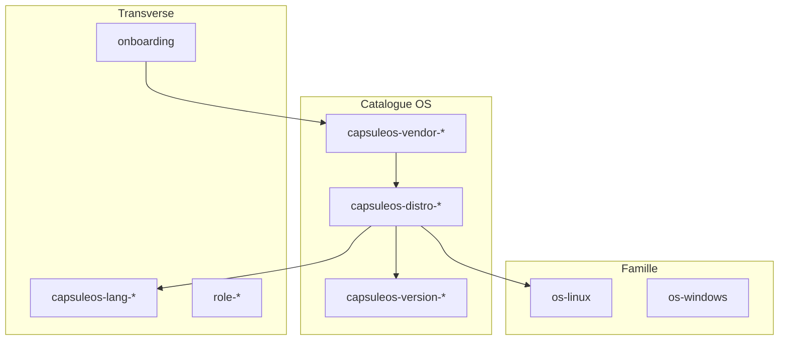

# Hiérarchie des skills agent

Quatre niveaux **génératifs** (source : `etc/capsuleos/os-registry.json`) + les skills **famille** existants (`os-linux`, `os-windows`, …).

**Paradigme** : [logique-formelle.md](logique-formelle.md) — le chargement des skills suit les prédicats (**¬A** → `kernel-supervisor`, clone → `os-clone-from-vm`, etc.).

## Niveaux



| Niveau | Dossier | Nom skill | Exemple |
|--------|---------|-----------|---------|
| **Vendor** | `root/skills/vendors/<vendor>/` | `capsuleos-vendor-mint` | Toutes les entrées `vendor: mint` |
| **Distribution** | `root/skills/distributions/<registry-id>/` | `capsuleos-distro-linux-mint` | Une entrée `os-registry` |
| **Version** | `root/skills/versions/<slug>/` | `capsuleos-version-windows-11` | Si id ou libellé encode une version |
| **Langage** | `root/skills/languages/<id>/` | `capsuleos-lang-javascript` | Périmètre technique transverse |

## Chaîne de chargement recommandée

1. `logique-formelle.md` + `onboarding` — H0–H6, `validate-all.mjs`
2. `os-orchestrator` — si famille OS incertaine
3. `os-<famille>` — linux, windows, macos, …
4. `capsuleos-vendor-<vendor>` — branding, packs assets vendor
5. `capsuleos-distro-<id>` — façade, skin, embedKey, toolkit
6. `capsuleos-version-<slug>` — si tâche limitée à une release
7. `capsuleos-lang-<lang>` — selon fichiers modifiés (JS, CSS, JSON, HTML)
8. `role-*` — integrator, developer, web-designer, …

## Contrats UI (transverse bureau)

Skills famille **fenêtrage / DOM / CSS / JS** — indépendants du vendor :

| Skill | Gate |
|-------|------|
| `capsuleos-window-side-effects` | `validate-window-side-effects.mjs` |
| `capsuleos-css-selectors-contract` | `validate-css-selectors-contract.mjs` |
| `capsuleos-css-variables-contract` | `validate-css-variables-contract.mjs` |
| `capsuleos-vanilla-js-interactivity` | `validate-vanilla-interactivity.mjs` |

Orchestrateur : `validate-ui-contracts-all.mjs` (phase **quality** de `validate-all.mjs`). Doc : [contrats-ui-bureau.md](contrats-ui-bureau.md).

## Langages couverts

| ID | Gate principale |
|----|-----------------|
| `javascript` | `validate-vanilla-js.mjs` + contrats interactivité |
| `json` | `validate-json.mjs` |
| `css` | `validate-css-asset-urls.mjs` |
| `html` | `validate-static-html-assets.mjs` |
| `markdown` | — |
| `node-mjs` | outils `usr/lib/capsuleos/tools/*.mjs` |

## Génération & validation

```bash
# Après modification de os-registry.json
node usr/lib/capsuleos/tools/seed-agent-skills.mjs --write
node usr/lib/capsuleos/tools/validate-agent-skills.mjs
```

Index généré : [`root/skills/_index/SKILL.md`](../skills/_index/SKILL.md).

## Ajouter une entrée catalogue

1. Entrée dans `os-registry.json`
2. `seed-agent-skills.mjs --write`
3. Brief : `print-agent-brief.mjs <id> --write`
4. `validate-agent-skills.mjs` + `validate-all.mjs`

Les skills **ne remplacent pas** `os-linux` / `os-windows` : ils précisent le périmètre vendor/distribution/version ; la logique shell reste dans les skills famille.

## Références

- [equipe-agentique.md](equipe-agentique.md)
- [parcours-agent.md](parcours-agent.md)
- [contrib.md](../../contrib.md)
